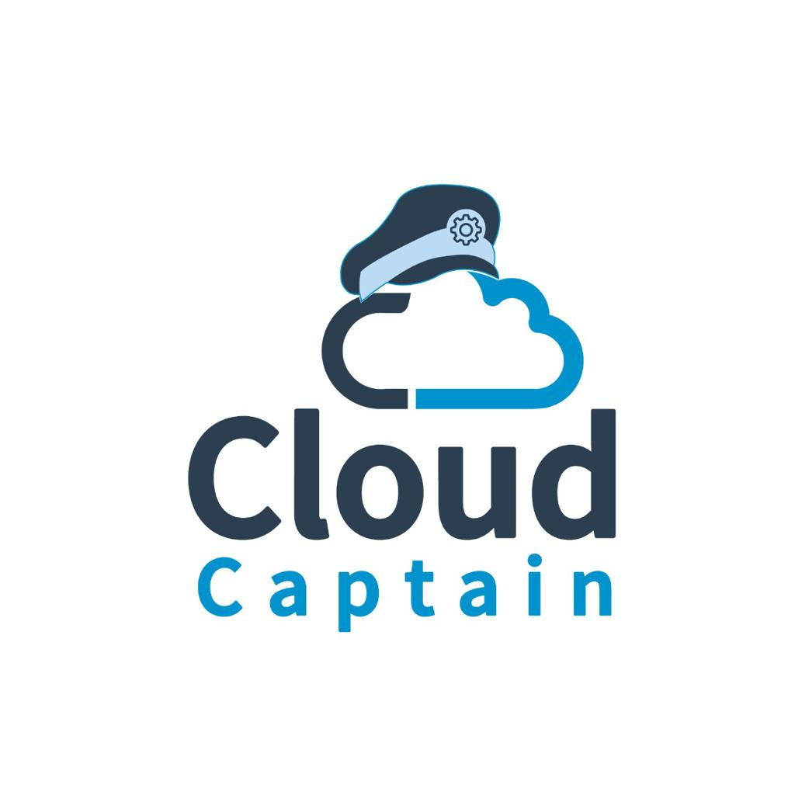

## Welcome to CloudCaptain!

<h1 align="center">
   
  
   
</h1>

CloudCaptain is a dynamic community initiative dedicated to deepening your understanding of cloud technology and its applications. Our mission is to equip individuals with the knowledge and skills they need to become cloud computing experts, fostering a collaborative environment for learning and networking.

At CloudCaptain, we believe in empowering individuals with accessible tools for success in the cloud industry. Our community comprises passionate professionals from diverse backgrounds, eager to share expertise and engage in mutual learning.

Through this project, you'll gain access to valuable resources that enhance your learning journey. Whether you're a beginner entering the cloud industry or an experienced professional seeking to expand your knowledge, CloudCaptain offers something for everyone.

Join us today and embark on a transformative journey to become a CloudCaptain!

<h1 align="center">
  
  
  
  
</h1>

<table>
  <tr>
    <td align="center"><a href="./AWS" target="_blank" rel="noreferrer">   <b> AWS</b></a></td>
    <td align="center"><a href="./Jenkins" target="_blank" rel="noreferrer">  <b>Jenkins</b></a></td>
    <td align="center"><a href="./Git" target="_blank" rel="noreferrer">  <b>Git</b></a></td>
    <td align="center"><a href="./Ansible" target="_blank" rel="noreferrer">   <b>Ansible</b></a></td>
    <td align="center"><a href="./Linux" target="_blank" rel="noreferrer">  <b>Linux</b></a></td>
    <td align="center"><a href="./TERRAFORM" target="_blank" rel="noreferrer">  <b>Terraform</b></a></td>
    <td align="center"><a href="./Docker" target="_blank" rel="noreferrer">  <b>Docker</b></a></td>
    <td align="center"><a href="./Kubernetes" target="_blank" rel="noreferrer">  <b>Kubernetes</b></a></td>
  </tr>
</table>

<table>
  <tr>
    <td align="center"><a href="./Azure" target="_blank" rel="noreferrer">   <b> Azure</b></a></td>
    <td align="center"><a href="./Bash" target="_blank" rel="noreferrer">  <b>Bash</b></a></td>
    <td align="center"><a href="./Google Cloud Provider" target="_blank" rel="noreferrer">  <b>Google Cloud Provider</b></a></td>
    <td align="center"><a href="./Gradle" target="_blank" rel="noreferrer">   <b>Gradle</b></a></td>
    <td align="center"><a href="./Nginx" target="_blank" rel="noreferrer">  <b>Nginx</b></a></td>
    <td align="center"><a href="./Python" target="_blank" rel="noreferrer">  <b>Python</b></a></td>
    <td align="center"><a href="./DigitalOcean" target="_blank" rel="noreferrer">  <b>DigitalOcean</b></a></td>
  </tr>
</table>

### DevOps Roadmap

  * The following path is opinionated. You can find alternative paths in [ Coming soon....]
  * Do NOT attempt to learn everything, especially if you are a complete beginner (the burnout will make you regret you ever heard the word DevOps)
  * Learn enough to say "Hey, I know what is DevOps and I can build anything out of it 😎". You can learn everything else by demand or when you feel ready

#### The must list

Topic | What to learn | Alternatives | Description
:------|:------|:------|:------:
Version Control | [Git](./Git/) | - | Version Control is used everywhere and Git is the leading version control technology
Programming | At least one programming language | None. Don't settle for learning only shell scripting  | Anyone who practice DevOps should know programming to some extent
Operating System | [Linux](./Linux/) | Other distribution of Linux :D | Operating Systems is another must when it comes to DevOps
Protocols | DHCP, UDP, TCP, HTTP, SSH | Not as an alternative, you can simply learn later: NFS, NTP, FTP | Learn how these protocols work and what they are used for
Applications | Web Server, Load Balancer, Cache, Database | | Learn how they work and try out some implementations (e.g. MySQL for databases and httpd for web servers)
[System Design](https://github.com/bregman-arie/system-design-notebook) | Availability, Reliability, Scalability, Performance | Learn how to design infrastructure and systems

The second must list :)
Seriously though, don't try to master everything in this list and start with something that you are interested in. The order has no meaning in this case.

## Interactive practice and learning sites

Learning by doing proved to be a very effective way to learn new things. If you are at a point where you don't feel comfortable enough to do it by yourself and you look for some guidance, the following sites might assist you

Name | Description
:------|:------:
[Kodekloud Engineer](https://www.kodekloud-engineer.com/) | Perform real tasks by working in a fictional organization | 
[QWIKLBAS](https://www.qwiklabs.com) | AWS, GCP, ect | 
[Play with Docker](https://labs.play-with-docker.com/) | Docker Lab | 
[Play with Kubernetes](https://labs.play-with-k8s.com/) | Kubernetes Lab |

## Community

Another great way to learn is to learn from the experience of others. For that, the are some excellent DevOps communities.

Name | Comments
:------|:------:
[Reddit DevOps](https://www.reddit.com/r/devops) | Reddit DevOps Community 
[Linkedin DevOps](https://www.linkedin.com/groups/2825397) | Linkedin DevOps Community

## DevOps Tooling

- [ ] CI/CD
  - [ ] [Jenkins](https://www.jenkins.io/) (Managed & on-premise, Containers supported, Plugins)
  - [ ] [GitHub Actions](https://docs.github.com/en/actions) (Hosted service)
  - [ ] [Travis](https://travis-ci.org/) (Hosted service)
  - [ ] [CircleCI](https://circleci.com/) (Hosted service)
  - [ ] [GitLab CI](https://docs.gitlab.com/ee/ci/) (Hosted service and on-premise)
  - [ ] [Bamboo](https://www.atlassian.com/software/bamboo) (Managed service and on-premise)
  - [ ] [BuildKite](https://buildkite.com) (Hosted)
  - [ ] [Zuul](https://zuul-ci.org/docs/zuul) (Hosted and on-premise)
  - [ ] [Drone](https://www.drone.io)
  - [ ] [Tekton](https://cloud.google.com/tekton)
  - [ ] [Argo CD](https://argoproj.github.io/argo-cd)
  - [ ] [werf](https://werf.io/)

Note: "Provisioning" tools can be used to perform configuration management to some extent. The same applies for configuration management tools, which can be used for provisioning.

- [ ] Provisioning
  - [ ] Terraform (Open Source)
  - [ ] CloudFormation (Available only on AWS)
  - [ ] Pulumi (Open Source)

- [ ] Configuration Management (all Open Source)
  - [ ] Ansible (Agentless, Mutable Infrastructure, Procedural)
  - [ ] Puppet (Agent, Mutable Infrastructure, Procedural)
  - [ ] Chef (Mutable Infrastructure)
  - [ ] Saltstack (Mutable Infrastructure)
  - [ ] [Spacelift](https://spacelift.io/)

- [ ] Images
  - [ ] [diskimage-builder](https://github.com/openstack/diskimage-builder)
  - [ ] [Packer](https://www.packer.io)

- [ ] Cloud
  - [ ] AWS
  - [ ] Azure
  - [ ] GCP
  - [ ] OpenStack
 
- [ ] Monitoring
  - [ ] [AppDynamics](https://www.appdynamics.com/product/infrastructure-monitoring)
  - [ ] [Datadog](https://www.datadoghq.com/)
  - [ ] [Dynatrace](https://www.dynatrace.com/platform/infrastructure-monitoring/)
  - [ ] [Monit](https://mmonit.com/monit/)
  - [ ] [Nagios](https://www.nagios.org/)
  - [ ] [Centreon](https://www.centreon.com/centreon-editions/centreon-open-source/)
  - [ ] [New Relic](https://newrelic.com/)
  - [ ] [Prometheus](https://prometheus.io)
  - [ ] [Sensu](https://sensu.io/)
  - [ ] [SolarWinds](https://www.solarwinds.com/server-application-monitor)
  - [ ] [Statuscake](https://www.statuscake.com) - Website Uptime & Performance
  - [ ] [VictoriaMetrics](https://victoriametrics.com/) - a fast, cost-effective and scalable monitoring solution and time series database.
  - [ ] [Zabbix](https://www.zabbix.com/)

- [ ] Collector of Metrics by agent
  - [ ] [Telegraf](https://www.influxdata.com/time-series-platform/telegraf/)

 Monitoring

- [ ] Log Management
  - [ ] Logstash
  - [ ] Graylog
  - [ ] Papertrail
  - [ ] Fluentd
  - [ ] [Splunk](https://www.splunk.com)
  - [ ] [SumoLogic](https://www.sumologic.com)

- [ ] Log aggregation system
  - [ ] [Loki](https://grafana.com/oss/loki/)

- [ ] Dashboards
  - [ ] Grafana
  - [ ] Kibana (Elastic)
  - [ ] Report Portal (Mostly for Test Automation)

- [ ] Security
  - [ ] [Vault](https://www.vaultproject.io) - "Secure, store and tightly control access to tokens, passwords, certificates, encryption keys for protecting secrets..."
  - [ ] [Open Policy Agent](https://www.openpolicyagent.org) - "Flexible, fine-grained control for administrators across the stack"

- [ ] Code review 
  - [ ] Gerrit - Code Review system
  - [ ] PullPanda - A collection of Tools such as reminder & analytics
  - [ ] Review Board

- [ ] Issue Tracking
  - [ ] Jira
  - [ ] Bugzilla

- [ ] Code coverage
  - [ ] Cobertura
  - [ ] Clover
  - [ ] JaCoCo

- [ ] Data Processors
  - [ ] Spark
  - [ ] Apache Hadoop
  - [ ] Apache Airflow
  - [ ] Presto

- [ ] Analytics Engines
  - [ ] Druid
  - [ ] Dremio
  - [ ] Snowflake

- [ ] Operations Data
  - [ ] Salesforce
  - [ ] Zuora

- [ ] Containers Orchestration
  - [ ] Kubernetes
  - [ ] OpenShift
  - [ ] Nomad

- [ ] Alerting
  - [ ] PagerDuty
  - [ ] ServiceNow
  - [ ] Slack (Mostly used for IM)

- [ ] Metric Storage
  - [ ] InfluxDB
  - [ ] Splunk
  - [ ] Cloud Storage services and Databases

### To get started Contributing:

- Fork this repository to your GitHub account.
- Clone the repository to your local machine using Git.
- Join our vibrant community on Telegram (https://t.me/CloudCaptains) for questions, idea sharing, and collaboration with fellow contributors.
- Contribute to the project by submitting pull requests, adding resources, or sharing learning materials.
- You can also [fork this project](https://help.github.com/articles/fork-a-repo/) and send a [pull request](https://help.github.com/articles/using-pull-requests/) to add a resources here. 

We hope you find this project both informative and engaging.

Don't forget to star this project to show your support for our initiatives. Share your love on social media and proudly proclaim, *"Hey, I am a Cloud Captain! #BeaCloudCaptain!"*

Let's set sail and explore the boundless possibilities of the cloud together!

## 🤝 Contributors && 🙌 [Credits](credits.md) 

## 🛡️ License

This project is licensed under the **MIT License** - see the [LICENSE](LICENSE) file for details.
