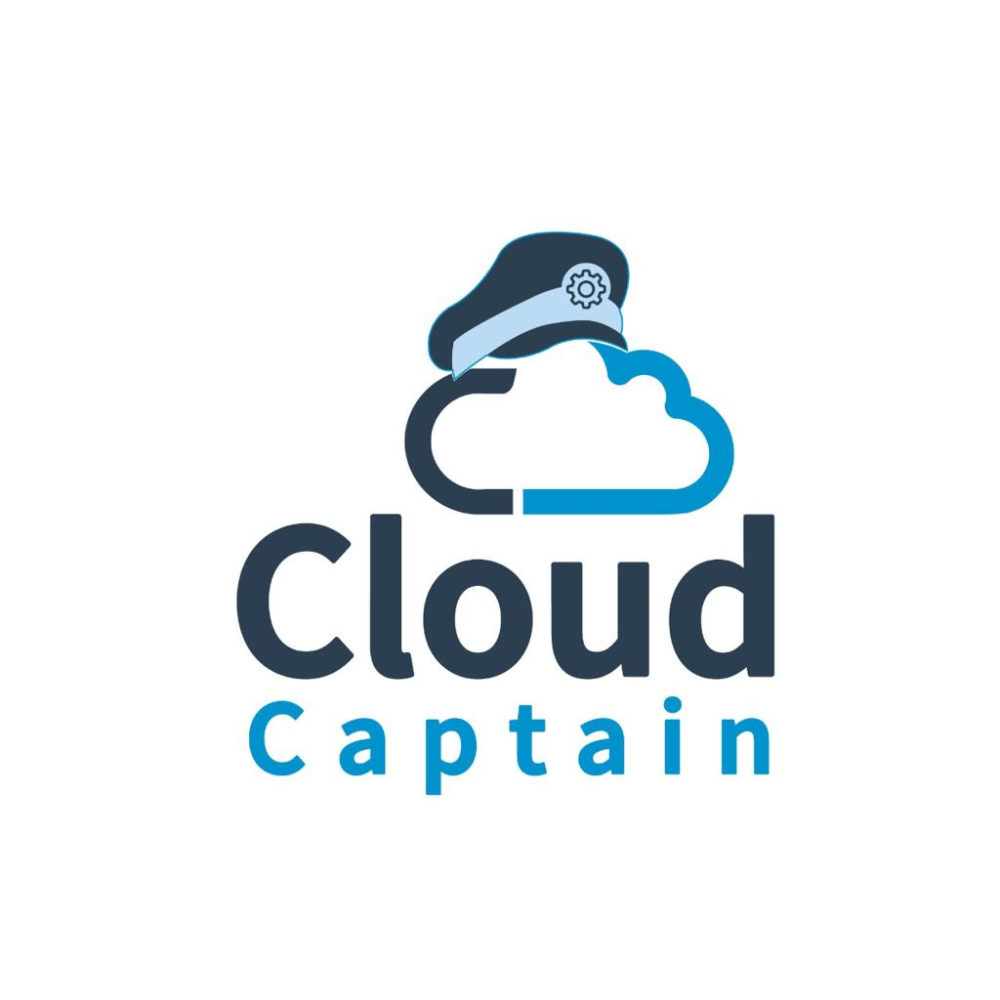

<div align="center">
  
  <h1>CloudCaptain</h1>
  <p><strong>The Open-Source Learning Hub for Cloud, DevOps, AI & Operations</strong></p>
  <p>
    
    
    <a href="https://twitter.com/intent/follow?screen_name=nomadicmehul"></a>
    <a href="https://github.com/nomadicmehul"></a>
  </p>
</div>

---

## What is CloudCaptain?

CloudCaptain is a community-driven, open-source learning platform with **476+ PDFs/books**, **50+ documentation pages**, **8 career paths**, and **7 structured learning roadmaps** — all free, forever.

Whether you're a complete beginner or a seasoned professional, CloudCaptain has something for you.

## Website

The CloudCaptain learning platform is built with Docusaurus and deployed to GitHub Pages.

```bash
cd website
npm install
npm start         # Dev server at localhost:3000
npm run build     # Production build
```

## What's Inside

| Category | Content |
|:---------|:--------|
| **Learning Paths** | DevOps, Cloud, Containers, AI/ML Ops, SRE, Platform Engineering, Linux Systems Master |
| **Career Paths** | 8 high-demand roles in the AI era with salary ranges and skills roadmaps |
| **Tools & Tech** | Docker, Kubernetes, Terraform, Ansible, Jenkins, GitHub Actions, and 15+ more |
| **Cloud Providers** | AWS, Azure, GCP, DigitalOcean |
| **Interview Prep** | DevOps, Docker, Kubernetes, Terraform, AWS, Linux |
| **Books & PDFs** | 476+ curated PDFs across all categories |
| **Hands-on Exercises** | Docker exercises, lab environments, project ideas |

## Career Paths (AI Era)

1. **DevOps Engineer** — Automate software delivery
2. **Cloud Engineer / Architect** — Design cloud infrastructure at scale
3. **Platform Engineer** — Build internal developer platforms
4. **AI/ML Infrastructure Engineer** — Run AI workloads at scale
5. **Site Reliability Engineer** — Keep the internet running
6. **Linux Systems Master** — Deep systems expertise
7. **Cloud Security / DevSecOps Engineer** — Secure everything
8. **FinOps Practitioner** — Optimize cloud costs

## Contributing

We welcome contributions! See [CONTRIBUTING.md](./CONTRIBUTING.md) for guidelines.

1. Fork the repository
2. Create a branch: `git checkout -b add/my-resource`
3. Make your changes in the `website/docs/` directory
4. Submit a Pull Request

## License

This project is licensed under the MIT License — see [LICENSE](./LICENSE) for details.

---

<div align="center">
  <p>Built with ❤️ by the open-source community</p>
  <p>Founded by <a href="https://github.com/nomadicmehul">@nomadicmehul</a></p>
</div>
