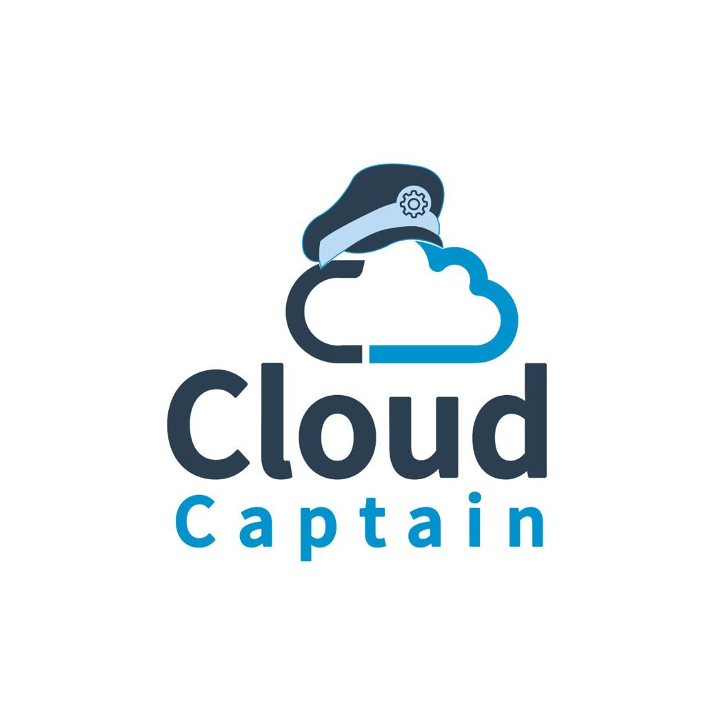
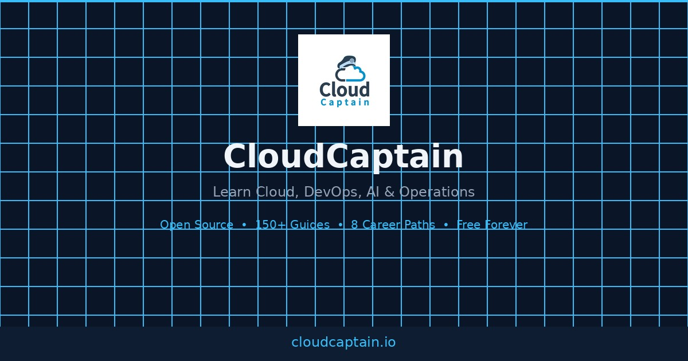

<div align="center">
  
  <h1>CloudCaptain</h1>
  <p><strong>Full tutorials + cheat sheets + interview Q&A + exam prep for Cloud, DevOps & AI — with built-in reading progress. Free, forever.</strong></p>
  <p>
    <a href="https://cloudcaptain.io"></a>
    
    
    <a href="https://twitter.com/intent/follow?screen_name=nomadicmehul"></a>
    <a href="https://github.com/nomadicmehul/CloudCaptain/stargazers"></a>
  </p>
  <p>
    <a href="https://cloudcaptain.io"><strong>Start Learning →</strong></a> ·
    <a href="#-why-cloudcaptain">Why CloudCaptain</a> ·
    <a href="#-whats-inside">What's Inside</a> ·
    <a href="#-contributing">Contribute</a>
  </p>
  
</div>

---

## ⚓ What is CloudCaptain?

Most learning repos give you a **list of links**. CloudCaptain gives you the **actual content**: 150+ documentation pages and **330,000+ words** of original long-form tutorials, 6,000+ runnable code blocks, 50+ architecture diagrams, 21 command cheat sheets, 19 interview question sets, and 5 certification exam-prep guides — organized into structured learning paths and readable on a site that **remembers where you left off**.

Built and curated over 3+ years. Open source (MIT). No paywall, no email gate, no "premium tier". 

**[Visit cloudcaptain.io →](https://cloudcaptain.io)**

## 🧭 Why CloudCaptain?

| | CloudCaptain | roadmap.sh | devops-exercises | awesome-* lists |
|:--|:--|:--|:--|:--|
| Full written tutorials | ✅ 330K+ words, in-repo | ❌ roadmap nodes link out | ❌ Q&A only | ❌ links only |
| Interview Q&A per topic | ✅ 19 topic sets | ❌ | ✅ | ❌ |
| Command cheat sheets | ✅ 21 sheets | ❌ | ❌ | ❌ |
| Certification exam prep | ✅ CKA/CKAD/CKS, AWS | ❌ | ❌ | ❌ |
| Reading progress tracking | ✅ built-in, per page | ✅ | ❌ | ❌ |
| Architecture diagrams | ✅ 50+ Mermaid | ✅ | ❌ | ❌ |

Every major topic follows the same triad: **Fundamentals guide → Cheat sheet → Interview questions** (plus exam prep where a certification exists). Learn it, reference it, get hired with it — in one place.

### 🚢 The Captain's Bridge reading experience

CloudCaptain isn't a wall of markdown. The site ships a custom reading layout with:

- **Scroll progress + completion tracking** on every doc page
- **[/progress](https://cloudcaptain.io/progress)** — a personal dashboard showing what you've read across every topic, with a "resume reading" widget
- **Chapter rail navigation** and completion toasts as you finish pages
- All client-side (localStorage) — no account, no tracking, no sign-up

## 📚 What's Inside

### Deep-dive topics (the heavyweights)

| Topic | What you get |
|:------|:-------------|
| **Kubernetes** | 10 guides, ~45K words — fundamentals, workloads, networking, CKA/CKAD/CKS exam prep, cheat sheet, 60+ interview questions |
| **AWS** | 10 guides, ~40K words — core services, architecture, CloudFormation examples guide, cert prep, interview Q&A |
| **Docker** | 12 guides, ~30K words — fundamentals, Dockerfile deep-dive, Compose, security, cheat sheet, interview Q&A |
| **Linux** | 7 guides, ~24K words — fundamentals through advanced administration |
| **Bash** | 6 guides, ~14K words — with 40+ inline script examples |
| **Git, Terraform, Networking, Azure** | 5–7 guides each with the full triad |

Plus: Ansible, GCP, Jenkins, CI/CD pipelines, GitHub Actions, GitOps, Python, YAML, DevSecOps, Helm, Nginx, Chef, Gradle, Podman, and cloud concepts (Multi-Cloud, Cloud Security, FinOps).

### Learning & Career Paths

- **7 structured learning paths** — DevOps, Cloud, Containers, AI/ML Ops, SRE, Platform Engineering, Linux Master
- **8 career paths for the AI era** with salary ranges, skills roadmaps, and certification recommendations — **[explore →](https://cloudcaptain.io/career-paths)**

### Interview Preparation

19 topic-specific question sets (40–60+ questions each): DevOps, Docker, Kubernetes, Terraform, AWS, Azure, GCP, Linux, Git, Python, Bash, Networking, CI/CD, Cloud Computing, Multi-Cloud, Cloud Security, FinOps, and more.

## 🚀 Getting Started

**Browse online:** [cloudcaptain.io](https://cloudcaptain.io) — start immediately, nothing to install.

**Run locally:**

```bash
git clone https://github.com/nomadicmehul/CloudCaptain.git
cd CloudCaptain/website
npm install
npm start         # Dev server at localhost:3000
```

## 🤝 Contributing

We welcome contributions of every size — see [CONTRIBUTING.md](./CONTRIBUTING.md) for full guidelines.

### Contribute in 5 minutes (no code required)

Homepage sections are powered by JSON files in `website/src/data/` — you can improve content by editing them directly on GitHub:

| File | What it controls |
|:-----|:-----------------|
| `categories.json` | Technology cards (Docker, K8s, Terraform, etc.) |
| `learningPaths.json` | Learning path cards on homepage |
| `careerPaths.json` | Career paths page (8 roles) |
| `howItWorks.json` | "How It Works" 4-step process |
| `techBadges.json` | Tech badge pills in the hero section |

### Contribute content

1. Fork the repository and create a branch: `git checkout -b add/my-resource`
2. Add or improve docs in `website/docs/` (Markdown with `title`, `description`, `sidebar_position` front matter)
3. Run `npm run build` locally to verify — every PR also gets an automatic preview deployment
4. Submit a Pull Request

Looking for a place to start? Several topics (Puppet, Vagrant, Packer, CloudFormation, DigitalOcean) are stubs waiting for an author — check the [open issues](https://github.com/nomadicmehul/CloudCaptain/issues).

## 🛠 Tech Stack

Docusaurus 3 (TypeScript) · GitHub Pages + custom domain · GitHub Actions CI/CD with per-PR preview deploys · Mermaid diagrams · local search · JSON-driven homepage content.

```
CloudCaptain/
  website/
    docs/
      learning-paths/         # Structured learning roadmaps
      interview-prep/         # Interview preparation guides
      tools/                  # Tool-specific documentation (25+ categories)
      cloud/                  # AWS, Azure, GCP + cloud concepts
    src/
      data/                   # JSON data files (edit to update homepage content)
      pages/                  # Custom pages (homepage, career paths, /progress)
    static/img/               # Logo, favicon, social card
  .github/workflows/          # Deploy, PR checks, PR preview deploys
```

## ⭐ Support the Project

If CloudCaptain helped you learn something, prepare for an interview, or pass a certification — **[star the repo](https://github.com/nomadicmehul/CloudCaptain)**. It takes 2 seconds and genuinely helps other engineers discover a free alternative to paid courses.

## 📄 License

MIT — see [LICENSE](./LICENSE). Use it, fork it, learn from it.

---

<div align="center">
  <p>Built with love by <a href="https://nomadicmehul.dev/">Mehul Patel</a> and the open-source community</p>
  <p><a href="https://cloudcaptain.io">cloudcaptain.io</a></p>
</div>
