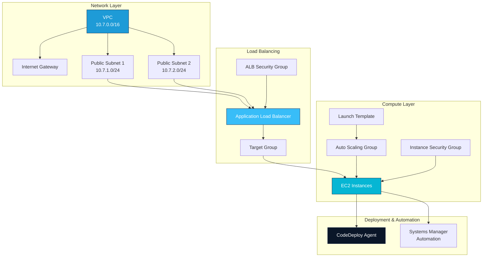

# AWS CloudFormation & DevTools Examples

This page contains real-world CloudFormation templates, infrastructure automation examples, and AWS Developer Tools (CodeDeploy, CodeCommit, CodePipeline) configurations extracted from hands-on labs and architectural patterns.

**Related:** For AWS interview preparation covering CloudFormation concepts and architecture, see the [AWS Interview Questions](/docs/interview-prep/aws) page which includes Top 100 and Top 250 questions.

## Architecture Overview

The templates and examples on this page build a complete three-tier architecture:



---

## 1. VPC Infrastructure

### VPC CloudFormation Template

Creates a VPC with two public subnets across availability zones, with DNS enabled and Internet Gateway.

**File:** `Automating Infrastructure Builds Using CloudFormation/vpc.yaml`

```yaml
Description: >
  AWS CloudFormation Template that creates a VPC with DNS and public IPs
  enabled and two public subnets. Exports VPC and public subnet IDs.

Parameters:
  VpcCIDR:
    Description: Please enter the CIDR for this VPC
    Type: String
    Default: 10.7.0.0/16

  PublicSubnet1CIDR:
    Description: Please enter the CIDR for the public subnet in the first Availability Zone
    Type: String
    Default: 10.7.1.0/24

  PublicSubnet2CIDR:
    Description: Please enter the CIDR for the public subnet in the second Availability Zone
    Type: String
    Default: 10.7.2.0/24

Resources:
  VPC:
    Type: AWS::EC2::VPC
    Properties:
      CidrBlock: !Ref VpcCIDR
      EnableDnsHostnames: true
      EnableDnsSupport: true
      Tags:
        -
          Key: Name
          Value: !Ref AWS::StackName

  InternetGateway:
    Type: AWS::EC2::InternetGateway
    Properties:
      Tags:
        -
          Key: Name
          Value: !Ref AWS::StackName

  InternetGatewayAttachment:
    Type: AWS::EC2::VPCGatewayAttachment
    Properties:
      InternetGatewayId: !Ref InternetGateway
      VpcId: !Ref VPC

  PublicSubnet1:
    Type: AWS::EC2::Subnet
    Properties:
      VpcId: !Ref VPC
      AvailabilityZone: !Select [0, !GetAZs ""]
      CidrBlock: !Ref PublicSubnet1CIDR
      MapPublicIpOnLaunch: true
      Tags:
        -
          Key: Name
          Value: !Sub AWS::StackName Public Subnet (AZ1)

  PublicSubnet2:
    Type: AWS::EC2::Subnet
    Properties:
      VpcId: !Ref VPC
      AvailabilityZone: !Select [1, !GetAZs ""]
      CidrBlock: !Ref PublicSubnet2CIDR
      MapPublicIpOnLaunch: true
      Tags:
        -
          Key: Name
          Value: !Sub AWS::StackName Public Subnet (AZ2)

  PublicRouteTable:
    Type: AWS::EC2::RouteTable
    Properties:
      VpcId: !Ref VPC
      Tags:
        -
          Key: Name
          Value: !Sub AWS::StackName Public Route Table

  DefaultPublicRoute:
    Type: AWS::EC2::Route
    DependsOn: InternetGatewayAttachment
    Properties:
      RouteTableId: !Ref PublicRouteTable
      DestinationCidrBlock: 0.0.0.0/0
      GatewayId: !Ref InternetGateway

  PublicSubnet1RouteTableAssociation:
    Type: AWS::EC2::SubnetRouteTableAssociation
    Properties:
      RouteTableId: !Ref PublicRouteTable
      SubnetId: !Ref PublicSubnet1

  PublicSubnet2RouteTableAssociation:
    Type: AWS::EC2::SubnetRouteTableAssociation
    Properties:
      RouteTableId: !Ref PublicRouteTable
      SubnetId: !Ref PublicSubnet2

Outputs:
  VPC:
    Description: VPC ID
    Value: !Ref VPC
    Export:
      Name:
        !Sub "${AWS::StackName}-VPC"

  PublicSubnets:
    Description: A list of the public subnets
    Value: !Join [",", [!Ref PublicSubnet1, !Ref PublicSubnet2]]

  PublicSubnet1:
    Description: Public subnet 1 ID
    Value: !Ref PublicSubnet1
    Export:
      Name:
        !Sub "${AWS::StackName}-PublicSubnet1"

  PublicSubnet2:
    Description: Public subnet 2 ID
    Value: !Ref PublicSubnet2
    Export:
      Name:
        !Sub "${AWS::StackName}-PublicSubnet2"
```

**Key Features:**
- Two availability zones for high availability
- Public subnets with automatic public IP assignment
- Internet Gateway for outbound connectivity
- CloudFormation Exports for cross-stack references
- Customizable CIDR blocks via parameters

**Usage:**
```bash
aws cloudformation create-stack \
  --stack-name my-vpc \
  --template-body file://vpc.yaml \
  --parameters \
    ParameterKey=VpcCIDR,ParameterValue=10.7.0.0/16 \
    ParameterKey=PublicSubnet1CIDR,ParameterValue=10.7.1.0/24 \
    ParameterKey=PublicSubnet2CIDR,ParameterValue=10.7.2.0/24
```

---

### VPC IAM Policy

This policy demonstrates CloudFormation stack update controls using resource-level permissions.

**File:** `Advanced CloudFormation Concepts/vpc-policy.json`

```json
{
  "Statement" : [
    {
      "Effect" : "Allow",
      "Action" : "Update:*",
      "Principal": "*",
      "Resource" : "*"
    },
    {
      "Effect" : "Deny",
      "Action" : "Update:Replace",
      "Principal": "*",
      "Resource" : "LogicalResourceId/VPC",
      "Condition" : {
        "StringLike" : {
            "ResourceType" : ["AWS::EC2::VPC"]
        }
      }
    }
  ]
}
```

**Key Concepts:**
- Allows all update operations except replacement of the VPC resource
- Prevents accidental deletion and recreation of the VPC
- Uses resource-level permissions to enforce governance
- Applied via `StackPolicy` in CloudFormation

---

## 2. Load Balancing & Auto Scaling

### Application Load Balancer Template

Creates an ALB with listener, target group, and health checks configured.

**File:** `Advanced CloudFormation Concepts/load-balancer.yaml`

```yaml
Description: >
  AWS CloudFormation Template that creates an application load balancer,
  listener, and target group. Requires network stack name as a parameter.

Parameters:
  VPCStackName:
    Description: >
      Name of an active CloudFormation stack that contains the VPC
      resources to be used by this stack.
    Type: String
    MinLength: 1
    MaxLength: 255
    AllowedPattern: "^[a-zA-Z][-a-zA-Z0-9]*$"

Resources:
  ALBSecurityGroup:
    Type: AWS::EC2::SecurityGroup
    Properties:
      GroupDescription: "Allow inbound HTTP from the load balancer"
      SecurityGroupIngress:
        -
          IpProtocol: tcp
          FromPort: '80'
          ToPort: '80'
          CidrIp: "0.0.0.0/0"
      VpcId:
        Fn::ImportValue:
          Fn::Sub: "${VPCStackName}-VPC"

  ApplicationLoadBalancer:
    Type: AWS::ElasticLoadBalancingV2::LoadBalancer
    Properties:
      Subnets:
      - Fn::ImportValue:
          !Sub "${VPCStackName}-PublicSubnet1"
      - Fn::ImportValue:
          !Sub "${VPCStackName}-PublicSubnet2"
      SecurityGroups:
      - Ref: ALBSecurityGroup

  ALBListener:
    Type: AWS::ElasticLoadBalancingV2::Listener
    Properties:
      LoadBalancerArn:
        Ref: ApplicationLoadBalancer
      DefaultActions:
      - Type: forward
        TargetGroupArn:
          !Ref ALBTargetGroup
      Port: '80'
      Protocol: HTTP

  ALBTargetGroup:
    Type: AWS::ElasticLoadBalancingV2::TargetGroup
    Properties:
      VpcId:
        Fn::ImportValue:
          !Sub "${VPCStackName}-VPC"
      HealthCheckIntervalSeconds: 30
      HealthCheckTimeoutSeconds: 5
      HealthyThresholdCount: 2
      Port: 80
      Protocol: HTTP
      UnhealthyThresholdCount: 5
      TargetGroupAttributes:
      - Key: deregistration_delay.timeout_seconds
        Value: '20'
      - Key: stickiness.enabled
        Value: 'true'
      - Key: stickiness.type
        Value: lb_cookie
      - Key: stickiness.lb_cookie.duration_seconds
        Value: '30'

Outputs:
  ALBTargetGroup:
    Description: Target group ARN
    Value: !Ref ALBTargetGroup
    Export:
      Name:
        !Sub "${AWS::StackName}-TargetGroup"

  WebsiteURL:
    Description: URL for ALB
    Value:
      Fn::Join:
      - ''
      - - http://
        - Fn::GetAtt:
          - ApplicationLoadBalancer
          - DNSName
```

**Key Features:**
- Cross-stack references using `Fn::ImportValue`
- Session stickiness (duration 30 seconds)
- Graceful deregistration (20 second timeout)
- Health checks every 30 seconds with 2 healthy/5 unhealthy thresholds
- Exports ALB URL and target group ARN for use in other stacks

---

### Auto Scaling Template

Creates a launch template and Auto Scaling Group with proper IAM roles for CloudWatch and SSM.

**File:** `Advanced CloudFormation Concepts/auto-scaling.yaml`

```yaml
---
Description: >
  AWS CloudFormation Template that creates a launch template and an Auto
  Scaling Group. Requires network stack name as a parameter.

Parameters:
  VPCStackName:
    Description: >
      Name of an active CloudFormation stack that contains the VPC
      resources to be used by this stack.
    Type: String
    MinLength: 1
    MaxLength: 255
    AllowedPattern: "^[a-zA-Z][-a-zA-Z0-9]*$"

  KeyName:
    Description: Name of an existing EC2 key pair
    Type: AWS::EC2::KeyPair::KeyName
    ConstraintDescription: Must be the name of an existing EC2 key pair

  GroupSize:
    Default: '2'
    Description: The initial nuber of Webserver instances
    Type: Number

  InstanceType:
    Description: Webserver EC2 instance type
    Type: String
    Default: t2.micro
    AllowedValues:
    - t2.nano
    - t2.micro
    - t2.small
    - t2.medium
    - t2.large
    ConstraintDescription: Must be a valid T2 EC2 instance type.

  SSHLocation:
    Description: "IP address range that can SSH to the EC2 instances"
    Type: String
    MinLength: '9'
    MaxLength: '18'
    Default: 0.0.0.0/0
    AllowedPattern: "(\\d{1,3})\\.(\\d{1,3})\\.(\\d{1,3})\\.(\\d{1,3})/(\\d{1,2})"
    ConstraintDescription: must be a valid IP CIDR range of the form x.x.x.x/x.

Mappings:
  AWSRegion2AMI:
    us-east-1:
      HVM64: ami-97785bed
    us-west-2:
      HVM64: ami-f2d3638a
    us-west-1:
      HVM64: ami-824c4ee2
    eu-west-1:
      HVM64: ami-d834aba1
    eu-west-2:
      HVM64: ami-403e2524
    eu-west-3:
      HVM64: ami-8ee056f3
    eu-central-1:
      HVM64: ami-5652ce39
    ap-northeast-1:
      HVM64: ami-ceafcba8
    ap-northeast-2:
      HVM64: ami-863090e8
    ap-northeast-3:
      HVM64: ami-83444afe
    ap-southeast-1:
      HVM64: ami-68097514
    ap-southeast-2:
      HVM64: ami-942dd1f6
    ap-south-1:
      HVM64: ami-531a4c3c
    us-east-2:
      HVM64: ami-f63b1193
    ca-central-1:
      HVM64: ami-a954d1cd
    sa-east-1:
      HVM64: ami-84175ae8
    cn-north-1:
      HVM64: ami-cb19c4a6
    cn-northwest-1:
      HVM64: ami-3e60745c

Resources:
  ALBStack:
    Description: The nested stack containing the application load balancer.
    Type: AWS::CloudFormation::Stack
    Properties:
      TemplateURL: https://s3.amazonaws.com/architecting-operational-excellence-aws/load-balancer.yaml
      Parameters:
        VPCStackName: !Ref VPCStackName

  InstanceSecurityGroup:
    Type: AWS::EC2::SecurityGroup
    Properties:
      GroupDescription: "Allow inbound HTTP and SSH"
      SecurityGroupIngress:
        -
          IpProtocol: tcp
          FromPort: '80'
          ToPort: '80'
          CidrIp: "0.0.0.0/0"
        -
          IpProtocol: tcp
          FromPort: '22'
          ToPort: '22'
          CidrIp:
            Ref: SSHLocation
      VpcId:
        Fn::ImportValue:
          Fn::Sub: "${VPCStackName}-VPC"

  InstanceRole:
    Type: AWS::IAM::Role
    Properties:
      RoleName: InstanceRole
      AssumeRolePolicyDocument:
        Statement:
        - Effect: Allow
          Principal:
            Service:
            - ec2.amazonaws.com
          Action:
          - sts:AssumeRole
      Path: "/"
      ManagedPolicyArns:
      - arn:aws:iam::aws:policy/service-role/AmazonEC2RoleforSSM
      - arn:aws:iam::aws:policy/CloudWatchAgentServerPolicy

  InstanceProfile:
    Type: AWS::IAM::InstanceProfile
    Properties:
      InstanceProfileName: InstanceProfile
      Path: "/"
      Roles:
      - Ref: InstanceRole

  WebserverLaunchTemplate:
    Type: AWS::EC2::LaunchTemplate
    Properties:
      LaunchTemplateData:
        ImageId:
          Fn::FindInMap:
            - AWSRegion2AMI
            - !Ref AWS::Region
            - HVM64
        IamInstanceProfile:
          Arn:
            Fn::GetAtt:
            - InstanceProfile
            - Arn
        InstanceType:
          Ref: InstanceType
        SecurityGroupIds:
        - Ref: InstanceSecurityGroup
        KeyName:
          Ref: KeyName
        UserData:
          Fn::Base64:
            Fn::Sub: |
              #!/bin/bash -xe
              sudo yum -y update
              sudo yum -y install aws-cfn-bootstrap
              /opt/aws/bin/cfn-signal -e 0 --region ${AWS::Region} --stack ${AWS::StackName} --resource AutoScalingGroup

  AutoScalingGroup:
    Type: AWS::AutoScaling::AutoScalingGroup
    Properties:
      VPCZoneIdentifier:
      - Fn::ImportValue:
          Fn::Sub: "${VPCStackName}-PublicSubnet1"
      - Fn::ImportValue:
          Fn::Sub: "${VPCStackName}-PublicSubnet2"
      LaunchTemplate:
        LaunchTemplateId:
          Ref: WebserverLaunchTemplate
        Version: '1'
      MinSize: '1'
      MaxSize: '6'
      DesiredCapacity:
        Ref: GroupSize
      TargetGroupARNs:
      -  Fn::GetAtt: [ ALBStack, Outputs.ALBTargetGroup ]
    CreationPolicy:
      ResourceSignal:
        Timeout: PT10M
        Count:
          Ref: GroupSize
```

**Key Features:**
- Regional AMI mappings for multi-region deployments
- IAM instance profile with SSM and CloudWatch permissions
- CloudFormation signal to wait for proper instance initialization
- Nested stack integration with ALB
- Min/Max/Desired capacity for scaling control

---

### Load Balancer Update Template

Demonstrates updating ALB configuration without replacing resources.

**File:** `CloudFormation/load-balancer-update.yaml`

```yaml
Description: >
  AWS CloudFormation Template that creates an application load balancer,
  listener, and target group. Requires network stack name as a parameter.

Parameters:
  VPCStackName:
    Description: >
      Name of an active CloudFormation stack that contains the VPC
      resources to be used by this stack.
    Type: String
    MinLength: 1
    MaxLength: 255
    AllowedPattern: "^[a-zA-Z][-a-zA-Z0-9]*$"

Resources:
  ALBSecurityGroup:
    Type: AWS::EC2::SecurityGroup
    Properties:
      GroupDescription: "Allow inbound HTTP from the load balancer"
      SecurityGroupIngress:
      - IpProtocol: tcp
        FromPort: '80'
        ToPort: '80'
        CidrIp: "0.0.0.0/0"
      VpcId:
        Fn::ImportValue:
          Fn::Sub: "${VPCStackName}-VPC"

  ApplicationLoadBalancer:
    Type: AWS::ElasticLoadBalancingV2::LoadBalancer
    Properties:
      Subnets:
      - Fn::ImportValue:
          !Sub "${VPCStackName}-PublicSubnet1"
      - Fn::ImportValue:
          !Sub "${VPCStackName}-PublicSubnet2"

  ALBListener:
    Type: AWS::ElasticLoadBalancingV2::Listener
    Properties:
      LoadBalancerArn:
        Ref: ApplicationLoadBalancer
      DefaultActions:
      - Type: forward
        TargetGroupArn:
          !Ref ALBTargetGroup
      Port: '80'
      Protocol: HTTP

  ALBTargetGroup:
    Type: AWS::ElasticLoadBalancingV2::TargetGroup
    Properties:
      VpcId:
        Fn::ImportValue:
          !Sub "${VPCStackName}-VPC"
      HealthCheckIntervalSeconds: 30
      HealthCheckTimeoutSeconds: 5
      HealthyThresholdCount: 2
      Port: 80
      Protocol: HTTP
      UnhealthyThresholdCount: 5
      TargetGroupAttributes:
      - Key: deregistration_delay.timeout_seconds
        Value: '20'
      - Key: stickiness.enabled
        Value: 'true'
      - Key: stickiness.type
        Value: lb_cookie
      - Key: stickiness.lb_cookie.duration_seconds
        Value: '300'

Outputs:
  ALBTargetGroup:
    Description: Target group ARN
    Value: !Ref ALBTargetGroup
    Export:
      Name:
        !Sub "${AWS::StackName}-TargetGroup"

  WebsiteURL:
    Description: URL for ALB
    Value:
      Fn::Join:
      - ''
      - - http://
        - Fn::GetAtt:
          - ApplicationLoadBalancer
          - DNSName
```

**Changes from original:**
- Increased stickiness duration from 30 to 300 seconds
- Removed security group from ALB properties (uses defaults)
- Simplified configuration for update-only scenarios

---

## 3. CloudWatch & AWS Config

### Systems Manager Automation for Patching

Executes patch baselines on new EC2 instances triggered by EventBridge.

**File:** `CloudWatch Events and AWS Config/PatchNewInstances.yml`

```yaml
---
schemaVersion: '0.3'
description: Executes the AWS-RunPatchBaseline command document against an instance.
assumeRole: "arn:aws:iam::xxxxxxxxxxxx:role/SSM-PatchNewInstanceRole"
parameters:
  InstanceId:
    type: String
    description: "(Required) ID of EC2 instance to patch"
mainSteps:
- name: sleep
  action: aws:sleep
  inputs:
    Duration: PT4M
- name: scan
  action: aws:runCommand
  maxAttempts: 1
  onFailure: Continue
  inputs:
    DocumentName: AWS-RunPatchBaseline
    InstanceIds:
    - "{{InstanceId}}"
    Parameters:
      Operation: Install
```

**Key Features:**
- 4-minute delay before patching (allows SSM agent to start)
- Calls AWS-managed patch baseline document
- Install operation applies all available patches
- Continues on failure to prevent stack rollback

**Usage Scenario:** When EventBridge detects an EC2 instance launch, this automation document is invoked to automatically patch the instance.

---

### IAM Policy for SSM Operations

Grants permissions for Systems Manager to execute patch operations.

**File:** `CloudWatch Events and AWS Config/InlinePolicyForSSM-PatchNewInstanceRole.txt`

```json
{
    "Version": "2012-10-17",
    "Statement": [
        {
            "Sid": "VisualEditor0",
            "Effect": "Allow",
            "Action": [
                "ssm:SendCommand",
                "ssm:ListCommands",
                "ssm:DescribeInstanceInformation",
                "ssm:ListCommandInvocations"
            ],
            "Resource": "*"
        }
    ]
}
```

**Permissions:**
- `ssm:SendCommand` - Execute commands on instances
- `ssm:ListCommands` - View command history
- `ssm:DescribeInstanceInformation` - Query instance inventory
- `ssm:ListCommandInvocations` - Check command results

---

### IAM Policy for EventBridge

Allows EventBridge to invoke Systems Manager automation.

**File:** `CloudWatch Events and AWS Config/InlinePolicyForEvents-PatchNewInstanceRole.txt`

```json
{
    "Version": "2012-10-17",
    "Statement": [
        {
            "Sid": "VisualEditor0",
            "Effect": "Allow",
            "Action": "ssm:StartAutomationExecution",
            "Resource": "*"
        }
    ]
}
```

**Purpose:** EventBridge rule needs permission to execute the SSM automation document when new instances are detected.

---

### EventBridge Input Transformer

Transforms EC2 instance launch events into automation document parameters.

**File:** `CloudWatch Events and AWS Config/InputTransformer.txt`

```
InputTemplate
"{"InstanceId":[<instance>]}"

InputPathsMap
"instance": "$.detail.EC2InstanceId"
```

**How it works:**
1. EventBridge captures EC2 instance launch event
2. Extracts `EC2InstanceId` from event detail
3. Passes as parameter to SSM automation document
4. Automation receives `<`instance`>` variable in JSON

---

## 4. AWS Developer Tools (CI/CD)

### CodeDeploy Agent Installation

SSM document for installing CodeDeploy agent on Linux systems.

**File:** `AWS Developer Tools - CodeCommit, CodeDeploy, and CodePipeline/installCodeDeployAgent.yaml`

```yaml
---
schemaVersion: '2.2'
description: cross-platform sample
mainSteps:
- action: aws:runShellScript
  name: InstallCodeDeployAgent
  precondition:
    StringEquals:
    - platformType
    - Linux
  inputs:
    runCommand:
    - yum install -y ruby
    - yum install -y aws-cli
    - cd /home/ec2-user
    - aws s3 cp s3://aws-codedeploy-us-east-1/latest/install . --region us-east-1
    - chmod +x ./install
    - ./install auto
```

**Installation steps:**
1. Install Ruby (CodeDeploy agent requirement)
2. Install AWS CLI
3. Download CodeDeploy installer from S3 bucket
4. Make installer executable
5. Run with `auto` flag (auto-starts and enables on boot)

**Deploy with CloudFormation:**

```yaml
UserData:
  Fn::Base64:
    Fn::Sub: |
      #!/bin/bash -xe
      sudo yum -y update
      sudo yum -y install aws-cfn-bootstrap
      yum install -y ruby
      yum install -y aws-cli
      cd /home/ec2-user
      aws s3 cp s3://aws-codedeploy-us-east-1/latest/install . --region us-east-1
      chmod +x ./install
      ./install auto
```

---

### Auto Scaling for CodeDeploy

Launch template and Auto Scaling Group with CodeDeploy agent pre-installed.

**File:** `AWS Developer Tools - CodeCommit, CodeDeploy, and CodePipeline/auto-scaling-update.yaml`

```yaml
---
Description: >
  AWS CloudFormation Template that creates a launch template and an Auto
  Scaling Group. Requires network stack name as a parameter.

Parameters:
  VPCStackName:
    Description: >
      Name of an active CloudFormation stack that contains the VPC
      resources to be used by this stack.
    Type: String
    MinLength: 1
    MaxLength: 255
    AllowedPattern: "^[a-zA-Z][-a-zA-Z0-9]*$"

  KeyName:
    Description: Name of an existing EC2 key pair
    Type: AWS::EC2::KeyPair::KeyName
    ConstraintDescription: Must be the name of an existing EC2 key pair

  GroupSize:
    Default: '2'
    Description: The initial nuber of Webserver instances
    Type: Number

  InstanceType:
    Description: Webserver EC2 instance type
    Type: String
    Default: t2.micro
    AllowedValues:
    - t2.nano
    - t2.micro
    - t2.small
    - t2.medium
    - t2.large
    ConstraintDescription: Must be a valid T2 EC2 instance type.

  SSHLocation:
    Description: "IP address range that can SSH to the EC2 instances"
    Type: String
    MinLength: '9'
    MaxLength: '18'
    Default: 0.0.0.0/0
    AllowedPattern: "(\\d{1,3})\\.(\\d{1,3})\\.(\\d{1,3})\\.(\\d{1,3})/(\\d{1,2})"
    ConstraintDescription: must be a valid IP CIDR range of the form x.x.x.x/x.

Mappings:
  AWSRegion2AMI:
    us-east-1:
      HVM64: ami-97785bed
    us-west-2:
      HVM64: ami-f2d3638a
    us-west-1:
      HVM64: ami-824c4ee2
    eu-west-1:
      HVM64: ami-d834aba1
    eu-west-2:
      HVM64: ami-403e2524
    eu-west-3:
      HVM64: ami-8ee056f3
    eu-central-1:
      HVM64: ami-5652ce39
    ap-northeast-1:
      HVM64: ami-ceafcba8
    ap-northeast-2:
      HVM64: ami-863090e8
    ap-northeast-3:
      HVM64: ami-83444afe
    ap-southeast-1:
      HVM64: ami-68097514
    ap-southeast-2:
      HVM64: ami-942dd1f6
    ap-south-1:
      HVM64: ami-531a4c3c
    us-east-2:
      HVM64: ami-f63b1193
    ca-central-1:
      HVM64: ami-a954d1cd
    sa-east-1:
      HVM64: ami-84175ae8
    cn-north-1:
      HVM64: ami-cb19c4a6
    cn-northwest-1:
      HVM64: ami-3e60745c

Resources:
  ALBStack:
    Description: The nested stack containing the application load balancer.
    Type: AWS::CloudFormation::Stack
    Properties:
      TemplateURL: https://s3.amazonaws.com/architecting-operational-excellence-aws/load-balancer.yaml
      Parameters:
        VPCStackName: !Ref VPCStackName

  InstanceSecurityGroup:
    Type: AWS::EC2::SecurityGroup
    Properties:
      GroupDescription: "Allow inbound HTTP and SSH"
      SecurityGroupIngress:
        -
          IpProtocol: tcp
          FromPort: '80'
          ToPort: '80'
          CidrIp: "0.0.0.0/0"
        -
          IpProtocol: tcp
          FromPort: '22'
          ToPort: '22'
          CidrIp:
            Ref: SSHLocation
      VpcId:
        Fn::ImportValue:
          Fn::Sub: "${VPCStackName}-VPC"

  InstanceRole:
    Type: AWS::IAM::Role
    Properties:
      RoleName: InstanceRole
      AssumeRolePolicyDocument:
        Statement:
        - Effect: Allow
          Principal:
            Service:
            - ec2.amazonaws.com
          Action:
          - sts:AssumeRole
      Path: "/"
      ManagedPolicyArns:
      - arn:aws:iam::aws:policy/service-role/AmazonEC2RoleforSSM
      - arn:aws:iam::aws:policy/CloudWatchAgentServerPolicy

  InstanceProfile:
    Type: AWS::IAM::InstanceProfile
    Properties:
      InstanceProfileName: InstanceProfile
      Path: "/"
      Roles:
      - Ref: InstanceRole

  WebserverLaunchTemplate:
    Type: AWS::EC2::LaunchTemplate
    Properties:
      LaunchTemplateData:
        ImageId:
          Fn::FindInMap:
            - AWSRegion2AMI
            - !Ref AWS::Region
            - HVM64
        IamInstanceProfile:
          Arn:
            Fn::GetAtt:
            - InstanceProfile
            - Arn
        InstanceType:
          Ref: InstanceType
        SecurityGroupIds:
        - Ref: InstanceSecurityGroup
        KeyName:
          Ref: KeyName
        UserData:
          Fn::Base64:
            Fn::Sub: |
              #!/bin/bash -xe
              sudo yum -y update
              sudo yum -y install aws-cfn-bootstrap
              yum install -y ruby
              yum install -y aws-cli
              cd /home/ec2-user
              aws s3 cp s3://aws-codedeploy-us-east-1/latest/install . --region us-east-1
              chmod +x ./install
              ./install auto
              /opt/aws/bin/cfn-signal -e 0 --region ${AWS::Region} --stack ${AWS::StackName} --resource AutoScalingGroup

  AutoScalingGroup:
    Type: AWS::AutoScaling::AutoScalingGroup
    Properties:
      VPCZoneIdentifier:
      - Fn::ImportValue:
          Fn::Sub: "${VPCStackName}-PublicSubnet1"
      - Fn::ImportValue:
          Fn::Sub: "${VPCStackName}-PublicSubnet2"
      LaunchTemplate:
        LaunchTemplateId:
          Ref: WebserverLaunchTemplate
        Version: '2'
      MinSize: '1'
      MaxSize: '6'
      DesiredCapacity:
        Ref: GroupSize
      TargetGroupARNs:
      -  Fn::GetAtt: [ ALBStack, Outputs.ALBTargetGroup ]
    CreationPolicy:
      ResourceSignal:
        Timeout: PT10M
        Count:
          Ref: GroupSize
```

**Difference from generic Auto Scaling:**
- UserData includes CodeDeploy agent installation
- All instances ready for immediate application deployment
- No additional manual configuration needed

---

## 5. Sample Application

### Application Specification (AppSpec)

Defines deployment steps for CodeDeploy.

**File:** `SampleApp/appspec.yml`

```yaml
version: 0.0
os: linux
files:
  - source: index.html
    destination: /var/www/html
hooks:
  BeforeInstall:
    - location: scripts/install_dependencies.sh
      timeout: 180
      runas: root
  AfterInstall:
    - location: scripts/change_index.sh
      timeout: 30
      runas: root
    - location: scripts/start_server.sh
      timeout: 60
      runas: root
  ApplicationStop:
    - location: scripts/stop_server.sh
      timeout: 60
      runas: root
```

**Lifecycle:**
1. **ApplicationStop:** Stop existing web server
2. **BeforeInstall:** Install Apache HTTP server
3. **File copy:** Deploy index.html to web root
4. **AfterInstall:** Customize page and start server

---

### Install Dependencies

Installs Apache HTTP Server.

**File:** `SampleApp/scripts/install_dependencies.sh`

```bash
#!/bin/bash
yum install -y httpd
```

---

### Start Server

Starts the web service.

**File:** `SampleApp/scripts/start_server.sh`

```bash
#!/bin/bash
service httpd start
```

---

### Stop Server

Gracefully stops the web service.

**File:** `SampleApp/scripts/stop_server.sh`

```bash
#!/bin/bash
isExistApp = `pgrep httpd`
if [[ -n  $isExistApp ]]; then
    service httpd stop
fi
```

---

### Change Index

Customizes the index page with deployment ID.

**File:** `SampleApp/scripts/change_index.sh`

```bash
#!/bin/bash
sed -i -e "s/DEPLOYMENT_ID/$DEPLOYMENT_ID/g" /var/www/html/index.html
```

This script replaces the placeholder with the actual CodeDeploy deployment ID.

---

### Sample HTML Page

Displays deployment success confirmation.

**File:** `SampleApp/index.html`

```html
<!DOCTYPE html>
<html>
<head>
  <meta charset="utf-8">
  <title>Sample Deployment</title>
  <style>
    body {
      color: #ffffff;
      background-color: #0188cc;
      font-family: Arial, sans-serif;
      font-size: 14px;
    }

    h1 {
      font-size: 500%;
      font-weight: normal;
      margin-bottom: 0;
    }

    h2 {
      font-size: 200%;
      font-weight: normal;
      margin-bottom: 0;
    }
  </style>
</head>
<body>
  <div align="center">
    <h1>Congratulations!</h1>
    <h2>You deployed this application using AWS CodeDeploy.</h2>
	<h3>Deployment ID: DEPLOYMENT_ID</h3>
    <p><a href="https://benpiper.com">benpiper.com</a></p>
  </div>
</body>
</html>
```

---

## Deployment Workflow

### Step 1: Create VPC Stack

```bash
aws cloudformation create-stack \
  --stack-name prod-vpc \
  --template-body file://vpc.yaml
```

### Step 2: Create ALB Stack

```bash
aws cloudformation create-stack \
  --stack-name prod-alb \
  --template-body file://load-balancer.yaml \
  --parameters ParameterKey=VPCStackName,ParameterValue=prod-vpc
```

### Step 3: Create Auto Scaling Stack

```bash
aws cloudformation create-stack \
  --stack-name prod-compute \
  --template-body file://auto-scaling.yaml \
  --parameters \
    ParameterKey=VPCStackName,ParameterValue=prod-vpc \
    ParameterKey=KeyName,ParameterValue=my-keypair \
    ParameterKey=GroupSize,ParameterValue=2
```

### Step 4: Deploy Application via CodeDeploy

```bash
# Push code to CodeCommit
git push origin main

# Trigger CodePipeline (automatically deploys to instances)
# Or manually create deployment:
aws deploy create-deployment \
  --application-name MyApp \
  --deployment-group-name production \
  --s3-location s3://my-bucket/app.zip \
  --deployment-config-name CodeDeployDefault.OneAtATime
```

---

## Best Practices

1. **Use nested stacks** for modular infrastructure (VPC, ALB, Compute)
2. **Export values** across stacks using `Fn::ImportValue` and `Export`
3. **Implement stack policies** to prevent accidental resource replacement
4. **Use mappings** for region-specific values (AMIs, availability zones)
5. **Add IAM roles** with least-privilege permissions to instances
6. **Use CloudFormation signals** (`cfn-signal`) to wait for proper initialization
7. **Document parameters** with descriptions and constraints
8. **Version launch templates** when making updates
9. **Test updates** with `--change-set` before applying
10. **Monitor deployments** with CloudWatch and EventBridge automation

---

## Related Resources

- [AWS CloudFormation User Guide](https://docs.aws.amazon.com/cloudformation/)
- [AWS CodeDeploy Documentation](https://docs.aws.amazon.com/codedeploy/)
- [Systems Manager Automation Documents](https://docs.aws.amazon.com/systems-manager-automation/)
- [EventBridge Rules and Automation](https://docs.aws.amazon.com/eventbridge/)
- [AWS interview preparation resources](/docs/interview-prep/aws)
