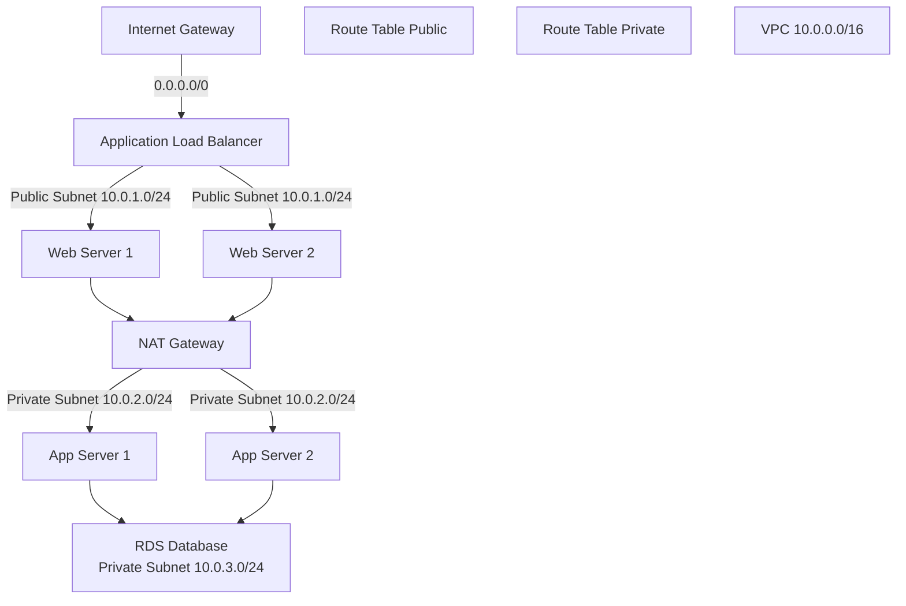
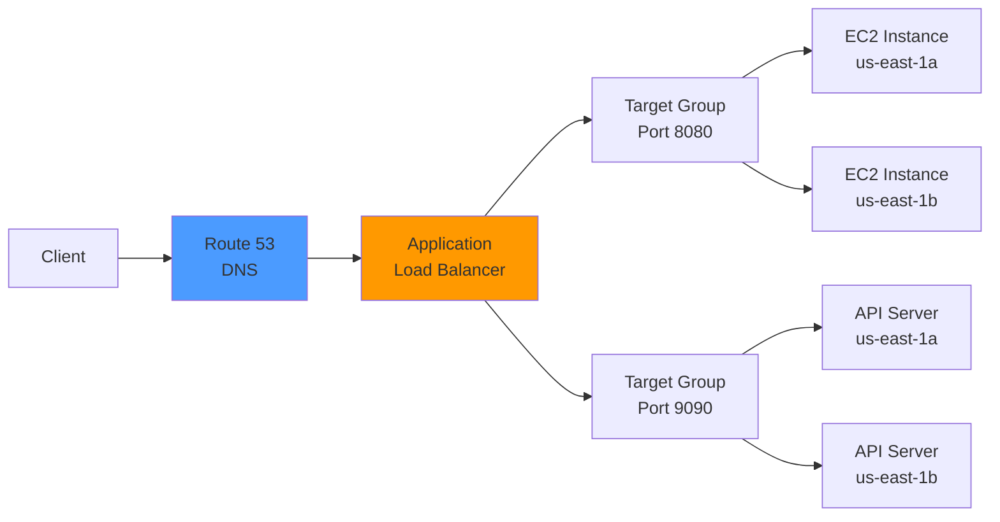

# AWS Compute & Networking

This guide provides a comprehensive overview of AWS compute and networking services, including EC2, Lambda, container services, VPC architecture, load balancing, DNS, and CDN.

## 1. EC2 (Elastic Compute Cloud)

EC2 provides resizable compute capacity in the cloud. It is the most flexible and widely used AWS service.

### Instance Types and Families

| Family | Use Case | Characteristics |
|--------|----------|-----------------|
| **General Purpose (t3, m5, m6i)** | Web servers, small databases, dev/test | Balanced compute, memory, networking |
| **Compute Optimized (c5, c6i, c7g)** | High-performance web servers, batch processing, CI/CD | High CPU, suitable for compute-intensive apps |
| **Memory Optimized (r5, r6i, x1)** | In-memory databases, caching, data analytics | Large RAM, SAP HANA, large datasets |
| **Storage Optimized (i3, d2, h1)** | NoSQL databases, data warehousing, Elasticsearch | High sequential I/O, large storage capacity |
| **Accelerated Computing (p3, g4, f1)** | Machine learning, GPU computing, FPGA | Hardware accelerators (GPU/FPGA/TPU) |

### Instance Lifecycle

Instances move through several states during their lifetime:

```
pending → running → stopping → stopped → terminated
  ↓
(can restart from stopped)
```

- **Pending**: Instance is preparing to enter running state
- **Running**: Instance is active and can accept traffic
- **Stopping**: Instance is being stopped (intentional shutdown)
- **Stopped**: Instance is stopped but not terminated; EBS volumes retained
- **Terminated**: Instance is deleted; cannot be restarted (cannot undo)

### AMIs, Key Pairs, and Security Groups

**Amazon Machine Images (AMIs)**
- Templates containing OS, application, and configuration
- Can be public (AWS-provided or community) or custom
- Regional; must copy to other regions for use

**Key Pairs**
- RSA asymmetric key for SSH access to Linux instances
- Windows instances use RDP with randomly generated password
- Must be created before launching instance; **cannot recover if lost**

**Security Groups**
- Virtual firewalls controlling inbound and outbound traffic
- Stateful: if inbound rule allows traffic, outbound response automatically allowed
- Can reference other security groups in rules
- Default deny-all inbound; allow-all outbound

### Purchasing Options

| Option | Cost | Best For | Duration |
|--------|------|----------|----------|
| **On-Demand** | Full hourly rate | Flexible, unpredictable workloads | By the hour |
| **Reserved** | ~40-60% discount | Predictable, long-running workloads | 1 or 3 years |
| **Spot** | ~70-90% discount | Fault-tolerant, batch jobs | Until outbid |
| **Dedicated Hosts** | Most expensive | License compliance, high control | 1 or 3 years |
| **Savings Plans** | ~20-40% discount | Flexible across instance types/regions | 1 or 3 years |

**AWS CLI: Launch On-Demand Instance**
```bash
aws ec2 run-instances \
  --image-id ami-0c55b159cbfafe1f0 \
  --instance-type t3.medium \
  --key-name my-key \
  --security-groups my-security-group \
  --subnet-id subnet-12345678
```

### User Data Scripts

User data scripts run once at instance launch as root:

```bash
#!/bin/bash
yum update -y
yum install -y httpd
systemctl start httpd
systemctl enable httpd

cat > /var/www/html/index.html <<EOF
<h1>Hello from $(hostname -f)</h1>
EOF
```

Pass to EC2 with `--user-data file://script.sh` in AWS CLI or via console.

### EC2 Instance Metadata Service (IMDS)

Access instance metadata without credentials:

```bash
# IMDSv2 (recommended, token-based)
TOKEN=$(curl -X PUT "http://169.254.169.254/latest/api/token" -H "X-aws-ec2-metadata-token-ttl-seconds: 21600")
curl -H "X-aws-ec2-metadata-token: $TOKEN" http://169.254.169.254/latest/meta-data/instance-id

# IMDSv1 (deprecated, less secure)
curl http://169.254.169.254/latest/meta-data/instance-id
```

Useful metadata endpoints:
- `/latest/meta-data/instance-id`
- `/latest/meta-data/iam/security-credentials/role-name`
- `/latest/meta-data/public-ipv4`
- `/latest/user-data`

### Placement Groups

Control how instances are placed in AWS infrastructure:

| Type | Behavior | Use Case |
|------|----------|----------|
| **Cluster** | Low latency, high throughput, same AZ | HPC, tightly-coupled applications |
| **Spread** | Separate hardware, different AZs/racks | Critical apps needing high availability |
| **Partition** | Grouped into partitions, distributed across AZs | Hadoop, Cassandra, Kafka |

**AWS CLI: Create Cluster Placement Group**
```bash
aws ec2 create-placement-group \
  --group-name my-cluster \
  --strategy cluster
```

### Auto Scaling Groups (ASG)

Automatically adjust instance count based on demand.

**Key Concepts:**
- **Desired Capacity**: Target number of instances
- **Minimum**: Lowest instance count
- **Maximum**: Highest instance count
- **Launch Template**: Specifies AMI, instance type, key pair, security groups

**AWS CLI: Create Auto Scaling Group**
```bash
# First, create a launch template
aws ec2 create-launch-template \
  --launch-template-name my-template \
  --version-description "v1" \
  --launch-template-data '{
    "ImageId": "ami-0c55b159cbfafe1f0",
    "InstanceType": "t3.medium",
    "KeyName": "my-key",
    "SecurityGroupIds": ["sg-12345678"],
    "UserData": "IyEvYmluL2Jhc2gK..."
  }'

# Create Auto Scaling group
aws autoscaling create-auto-scaling-group \
  --auto-scaling-group-name my-asg \
  --launch-template LaunchTemplateName=my-template,Version='$Latest' \
  --min-size 2 \
  --desired-capacity 4 \
  --max-size 8 \
  --vpc-zone-identifier "subnet-12345678,subnet-87654321" \
  --target-group-arns arn:aws:elasticloadbalancing:...
```

**AWS CLI: Create Scaling Policies**
```bash
# Scale up when CPU exceeds 70%
aws autoscaling put-scaling-policy \
  --auto-scaling-group-name my-asg \
  --policy-name scale-up \
  --policy-type TargetTrackingScaling \
  --target-tracking-configuration '{
    "TargetValue": 70.0,
    "PredefinedMetricSpecification": {
      "PredefinedMetricType": "ASGAverageCPUUtilization"
    }
  }'
```

---

## 2. AWS Lambda

Lambda is a serverless compute service for running code without managing servers.

### Serverless Compute and Event-Driven Architecture

Lambda functions execute in response to events and scale automatically. You pay only for execution time (100ms increments).

**Key Advantages:**
- No server management
- Automatic scaling
- Pay per invocation
- Built-in high availability

### Triggers and Event Sources

| Trigger | Use Case |
|---------|----------|
| **API Gateway** | HTTP REST or REST API endpoints |
| **S3** | Object uploads, deletions |
| **DynamoDB** | Stream processing, real-time changes |
| **CloudWatch Events** | Scheduled tasks, cron jobs |
| **SNS** | Publish-subscribe notifications |
| **SQS** | Process queue messages |
| **Kinesis** | Real-time data streaming |
| **ALB** | HTTP requests from load balancer |

### Lambda Limits

| Limit | Value |
|-------|-------|
| Memory | 128 MB - 10,240 MB (10 GB) |
| Timeout | 1 second - 15 minutes |
| Package size (zipped) | 50 MB |
| Package size (unzipped) | 250 MB |
| Concurrent executions | 1,000 (soft limit, request increase) |
| Ephemeral storage (/tmp) | 512 MB - 10,240 MB |

### Cold Starts and Optimization

**Cold Start**: Initial function invocation takes longer (100-500ms) because Lambda must provision the runtime.

**Optimization Strategies:**
- Use Provisioned Concurrency for predictable workloads
- Keep code size small and dependencies minimal
- Use Lambda Layers for shared libraries
- Lazy-load dependencies inside handler
- Choose appropriate memory (more memory = faster CPU)
- Use runtime-specific optimizations (Go, Rust faster than Python)

**AWS CLI: Create Lambda Function**
```bash
# Package code
zip lambda-function.zip index.js

# Create function
aws lambda create-function \
  --function-name my-function \
  --runtime nodejs18.x \
  --role arn:aws:iam::123456789012:role/lambda-role \
  --handler index.handler \
  --zip-file fileb://lambda-function.zip \
  --timeout 30 \
  --memory-size 256
```

**Sample Lambda Handler (Node.js)**
```javascript
exports.handler = async (event) => {
  console.log('Event:', JSON.stringify(event, null, 2));

  return {
    statusCode: 200,
    body: JSON.stringify({
      message: 'Hello from Lambda!',
      timestamp: new Date().toISOString()
    })
  };
};
```

### Lambda@Edge and CloudFront Functions

**Lambda@Edge**: Run Lambda functions at CloudFront edge locations for low-latency processing.
- Use case: Modify requests/responses, authentication, geolocation-based content
- Limited to 128 MB memory and 30-second timeout
- Higher cost than regular Lambda

**CloudFront Functions**: Lightweight, fast functions for simple operations.
- Built in to CloudFront, no separate creation needed
- ~10x faster than Lambda@Edge
- Limited feature set, suitable for authentication and request rewriting

### Example: Simple API with Lambda + API Gateway

**Step 1: Create IAM Role**
```bash
aws iam create-role \
  --role-name lambda-api-role \
  --assume-role-policy-document '{
    "Version": "2012-10-17",
    "Statement": [{
      "Effect": "Allow",
      "Principal": {"Service": "lambda.amazonaws.com"},
      "Action": "sts:AssumeRole"
    }]
  }'
```

**Step 2: Create Lambda Function**
```bash
cat > app.js <<EOF
exports.handler = async (event) => {
  const path = event.rawPath;
  const method = event.requestContext.http.method;

  if (path === '/api/users' && method === 'GET') {
    return {
      statusCode: 200,
      body: JSON.stringify([
        { id: 1, name: 'Alice' },
        { id: 2, name: 'Bob' }
      ])
    };
  }

  return { statusCode: 404, body: 'Not Found' };
};
EOF

zip app.zip app.js

aws lambda create-function \
  --function-name my-api \
  --runtime nodejs18.x \
  --role arn:aws:iam::123456789012:role/lambda-api-role \
  --handler app.handler \
  --zip-file fileb://app.zip
```

**Step 3: Create API Gateway Integration**
```bash
# Create HTTP API
aws apigatewayv2 create-api \
  --name my-api \
  --protocol-type HTTP \
  --target arn:aws:lambda:us-east-1:123456789012:function:my-api

# Lambda permissions already set up, API Gateway routes traffic automatically
```

---

## 3. Container Services

AWS provides multiple container orchestration and registry services.

### ECS (Elastic Container Service)

ECS manages Docker containers without managing Kubernetes.

**Launch Types:**
- **Fargate**: Serverless, AWS manages infrastructure (recommended for new projects)
- **EC2**: You manage EC2 instances, ECS manages task scheduling

**AWS CLI: Create Fargate Task Definition**
```bash
aws ecs register-task-definition \
  --family my-app \
  --network-mode awsvpc \
  --requires-compatibilities FARGATE \
  --cpu 256 \
  --memory 512 \
  --container-definitions '[{
    "name": "my-app",
    "image": "123456789012.dkr.ecr.us-east-1.amazonaws.com/my-app:latest",
    "portMappings": [{
      "containerPort": 8080,
      "hostPort": 8080,
      "protocol": "tcp"
    }],
    "logConfiguration": {
      "logDriver": "awslogs",
      "options": {
        "awslogs-group": "/ecs/my-app",
        "awslogs-region": "us-east-1",
        "awslogs-stream-prefix": "ecs"
      }
    }
  }]'
```

**AWS CLI: Create ECS Service**
```bash
aws ecs create-service \
  --cluster my-cluster \
  --service-name my-service \
  --task-definition my-app:1 \
  --desired-count 2 \
  --launch-type FARGATE \
  --network-configuration "awsvpcConfiguration={
    subnets=[subnet-12345678],
    securityGroups=[sg-12345678],
    assignPublicIp=ENABLED
  }" \
  --load-balancers "targetGroupArn=arn:aws:elasticloadbalancing:...,containerName=my-app,containerPort=8080"
```

### EKS (Elastic Kubernetes Service)

Managed Kubernetes service. AWS manages control plane; you manage worker nodes.

**When to Use:**
- Complex applications requiring Kubernetes features
- Multi-container orchestration with service mesh
- Existing Kubernetes expertise in team
- Helm charts and Kubernetes ecosystem

**AWS CLI: Create EKS Cluster**
```bash
# Create cluster
aws eks create-cluster \
  --name my-cluster \
  --version 1.27 \
  --role-arn arn:aws:iam::123456789012:role/eks-service-role \
  --resources-vpc-config subnetIds=subnet-12345678,subnet-87654321

# Add worker nodes (via CloudFormation or other means)
aws eks create-nodegroup \
  --cluster-name my-cluster \
  --nodegroup-name my-nodegroup \
  --subnets subnet-12345678 \
  --node-role arn:aws:iam::123456789012:role/eks-node-role \
  --scaling-config minSize=1,maxSize=3,desiredSize=2
```

### ECR (Elastic Container Registry)

Docker container registry for storing and managing images.

**AWS CLI: Push Image to ECR**
```bash
# Authenticate
aws ecr get-login-password --region us-east-1 | docker login --username AWS --password-stdin 123456789012.dkr.ecr.us-east-1.amazonaws.com

# Create repository
aws ecr create-repository \
  --repository-name my-app \
  --region us-east-1

# Tag and push image
docker tag my-app:latest 123456789012.dkr.ecr.us-east-1.amazonaws.com/my-app:latest
docker push 123456789012.dkr.ecr.us-east-1.amazonaws.com/my-app:latest
```

### When to Use ECS vs EKS vs Lambda

| Service | Best For | Complexity |
|---------|----------|-----------|
| **Lambda** | Short-lived, event-driven, simple functions | Low |
| **ECS Fargate** | Containerized applications, simple orchestration | Medium |
| **ECS EC2** | Full control, high utilization, cost optimization | Medium-High |
| **EKS** | Complex multi-container apps, Kubernetes ecosystem | High |

---

## 4. VPC (Virtual Private Cloud) - Deep Dive

VPC is a logically isolated network environment where you launch AWS resources.

### VPC Architecture

**CIDR Blocks**
- Classless Inter-Domain Routing notation: 10.0.0.0/16 means 65,536 IP addresses (10.0.0.0 - 10.0.255.255)
- Choose non-overlapping CIDR blocks for peering
- Common ranges: 10.0.0.0/8, 172.16.0.0/12, 192.168.0.0/16

**Subnets**
- Partition VPC into multiple networks
- Each subnet is in a single AZ
- Assign CIDR blocks within parent VPC CIDR

**Public vs Private Subnets**

| Aspect | Public | Private |
|--------|--------|---------|
| Internet access | Yes (via IGW) | No direct access (use NAT) |
| Route table | Contains IGW route | No IGW route |
| Typical use | Web servers, bastion hosts | Databases, app servers |
| EIP/NAT | Not required (but can use EIP) | Requires NAT Gateway for outbound |

**AWS CLI: Create VPC with Subnet**
```bash
# Create VPC
aws ec2 create-vpc --cidr-block 10.0.0.0/16

# Create subnet
aws ec2 create-subnet \
  --vpc-id vpc-12345678 \
  --cidr-block 10.0.1.0/24 \
  --availability-zone us-east-1a
```

### VPC Architecture Diagram



### Internet Gateway, NAT Gateway, and NAT Instance

**Internet Gateway (IGW)**
- Allows resources in public subnet to access internet
- Horizontally scaled, highly available
- Requires route table entry: 0.0.0.0/0 → IGW

**NAT Gateway**
- Allows private subnet resources to initiate outbound connections
- Managed service, highly available
- Placed in public subnet, requires Elastic IP
- One-way traffic (private → internet, not reverse)

**NAT Instance**
- EC2 instance running NAT software (older approach)
- Manual management required
- Less recommended than NAT Gateway (deprecated pattern)

**AWS CLI: Create NAT Gateway**
```bash
# Allocate Elastic IP
aws ec2 allocate-address --domain vpc

# Create NAT Gateway in public subnet
aws ec2 create-nat-gateway \
  --subnet-id subnet-12345678 \
  --allocation-id eipalloc-12345678

# Update private subnet route table
aws ec2 create-route \
  --route-table-id rtb-12345678 \
  --destination-cidr-block 0.0.0.0/0 \
  --nat-gateway-id nat-12345678
```

### Security Groups vs NACLs

| Feature | Security Group | NACL |
|---------|---|---|
| **Scope** | Instance level | Subnet level |
| **Statefulness** | Stateful (return traffic allowed automatically) | Stateless (must explicitly allow return) |
| **Rules** | Allow only | Allow and Deny |
| **Evaluation** | All applicable rules evaluated | Rules evaluated in order (first match wins) |
| **Performance** | Minimal overhead | Slightly higher overhead |
| **Best for** | Primary security control | Secondary layer, edge cases |

**AWS CLI: Create Security Group**
```bash
# Create security group
aws ec2 create-security-group \
  --group-name web-sg \
  --description "Security group for web servers" \
  --vpc-id vpc-12345678

# Allow HTTP inbound
aws ec2 authorize-security-group-ingress \
  --group-id sg-12345678 \
  --protocol tcp \
  --port 80 \
  --cidr 0.0.0.0/0

# Allow HTTPS inbound
aws ec2 authorize-security-group-ingress \
  --group-id sg-12345678 \
  --protocol tcp \
  --port 443 \
  --cidr 0.0.0.0/0

# Allow SSH from specific IP
aws ec2 authorize-security-group-ingress \
  --group-id sg-12345678 \
  --protocol tcp \
  --port 22 \
  --cidr 203.0.113.0/32
```

**AWS CLI: Create NACL Rule**
```bash
# Create NACL
aws ec2 create-network-acl \
  --vpc-id vpc-12345678

# Add inbound rule
aws ec2 create-network-acl-entry \
  --network-acl-id acl-12345678 \
  --rule-number 100 \
  --protocol tcp \
  --port-range From=80,To=80 \
  --cidr-block 0.0.0.0/0 \
  --ingress

# Add outbound rule
aws ec2 create-network-acl-entry \
  --network-acl-id acl-12345678 \
  --rule-number 100 \
  --protocol tcp \
  --port-range From=1024,To=65535 \
  --cidr-block 0.0.0.0/0 \
  --egress
```

### VPC Peering

Connect two VPCs to enable communication between instances as if they were in the same network.

**Requirements:**
- Non-overlapping CIDR blocks
- Both VPCs must accept peering request
- Route tables must include peering connection route

**AWS CLI: Create VPC Peering**
```bash
# Request peering
aws ec2 create-vpc-peering-connection \
  --vpc-id vpc-12345678 \
  --peer-vpc-id vpc-87654321

# Accept peering (from peer account/VPC)
aws ec2 accept-vpc-peering-connection \
  --vpc-peering-connection-id pcx-12345678

# Update route tables
aws ec2 create-route \
  --route-table-id rtb-12345678 \
  --destination-cidr-block 10.1.0.0/16 \
  --vpc-peering-connection-id pcx-12345678
```

### Transit Gateway

Hub-and-spoke model for connecting multiple VPCs and on-premises networks.

**Benefits:**
- Simplifies complex network topologies
- Enables centralized logging and monitoring
- Supports on-premises connections via VPN/Direct Connect

**AWS CLI: Create Transit Gateway**
```bash
aws ec2 create-transit-gateway \
  --description "Central hub" \
  --options AmazonSideAsn=64512,DefaultRouteTableAssociation=enable,DefaultRouteTablePropagation=enable

aws ec2 create-transit-gateway-attachment \
  --transit-gateway-id tgw-12345678 \
  --resource-type vpc \
  --resource-id vpc-12345678 \
  --subnet-ids subnet-12345678 subnet-87654321
```

### VPN and Direct Connect

**AWS Site-to-Site VPN**
- Encrypted tunnel over public internet
- Quick to set up, lower cost
- Variable latency/bandwidth

**AWS Direct Connect**
- Dedicated network connection to AWS
- Higher bandwidth, lower latency, consistent performance
- Higher cost, longer setup time
- Suitable for large data transfers, real-time applications

### VPC Flow Logs

Monitor network traffic in VPC by logging IP traffic.

**AWS CLI: Enable VPC Flow Logs**
```bash
# Create CloudWatch Logs group
aws logs create-log-group --log-group-name /aws/vpc/flowlogs

# Create IAM role for VPC Flow Logs
aws iam create-role \
  --role-name vpc-flow-logs-role \
  --assume-role-policy-document '{
    "Version": "2012-10-17",
    "Statement": [{
      "Effect": "Allow",
      "Principal": {"Service": "vpc-flow-logs.amazonaws.com"},
      "Action": "sts:AssumeRole"
    }]
  }'

# Enable VPC Flow Logs
aws ec2 create-flow-logs \
  --resource-type VPC \
  --resource-ids vpc-12345678 \
  --traffic-type ALL \
  --log-destination-type cloud-watch-logs \
  --log-group-name /aws/vpc/flowlogs \
  --deliver-logs-permission-iam-role-arn arn:aws:iam::123456789012:role/vpc-flow-logs-role
```

### Example: Design a 3-Tier VPC Architecture

```
VPC: 10.0.0.0/16
├─ Public Subnets (Web Tier)
│  ├─ 10.0.1.0/24 (us-east-1a) - ALB, Bastion Host
│  └─ 10.0.2.0/24 (us-east-1b) - ALB
│
├─ Private Subnets (Application Tier)
│  ├─ 10.0.10.0/24 (us-east-1a) - App Servers
│  └─ 10.0.11.0/24 (us-east-1b) - App Servers
│
├─ Private Subnets (Database Tier)
│  ├─ 10.0.20.0/24 (us-east-1a) - RDS Multi-AZ
│  └─ 10.0.21.0/24 (us-east-1b) - RDS Multi-AZ
│
├─ Internet Gateway (IGW)
├─ NAT Gateways (one per public subnet for HA)
└─ Route Tables
   ├─ Public: 0.0.0.0/0 → IGW
   ├─ App: 0.0.0.0/0 → NAT Gateway
   └─ Database: Local routing only (no internet access)
```

**Security Group Rules:**
- **Web SG**: Allow 80/443 from 0.0.0.0/0
- **App SG**: Allow 8080 from Web SG, allow SSH from Bastion SG
- **Database SG**: Allow 3306 from App SG only

**AWS CLI: Build 3-Tier Architecture**
```bash
# Create VPC
VPC_ID=$(aws ec2 create-vpc --cidr-block 10.0.0.0/16 --query 'Vpc.VpcId' --output text)

# Create public subnets
PUB1=$(aws ec2 create-subnet --vpc-id $VPC_ID --cidr-block 10.0.1.0/24 --availability-zone us-east-1a --query 'Subnet.SubnetId' --output text)
PUB2=$(aws ec2 create-subnet --vpc-id $VPC_ID --cidr-block 10.0.2.0/24 --availability-zone us-east-1b --query 'Subnet.SubnetId' --output text)

# Create app subnets
APP1=$(aws ec2 create-subnet --vpc-id $VPC_ID --cidr-block 10.0.10.0/24 --availability-zone us-east-1a --query 'Subnet.SubnetId' --output text)
APP2=$(aws ec2 create-subnet --vpc-id $VPC_ID --cidr-block 10.0.11.0/24 --availability-zone us-east-1b --query 'Subnet.SubnetId' --output text)

# Create database subnets
DB1=$(aws ec2 create-subnet --vpc-id $VPC_ID --cidr-block 10.0.20.0/24 --availability-zone us-east-1a --query 'Subnet.SubnetId' --output text)
DB2=$(aws ec2 create-subnet --vpc-id $VPC_ID --cidr-block 10.0.21.0/24 --availability-zone us-east-1b --query 'Subnet.SubnetId' --output text)

# Create Internet Gateway
IGW_ID=$(aws ec2 create-internet-gateway --query 'InternetGateway.InternetGatewayId' --output text)
aws ec2 attach-internet-gateway --internet-gateway-id $IGW_ID --vpc-id $VPC_ID

# Create route table for public subnets
PUB_RTB=$(aws ec2 create-route-table --vpc-id $VPC_ID --query 'RouteTable.RouteTableId' --output text)
aws ec2 create-route --route-table-id $PUB_RTB --destination-cidr-block 0.0.0.0/0 --gateway-id $IGW_ID
aws ec2 associate-route-table --subnet-id $PUB1 --route-table-id $PUB_RTB
aws ec2 associate-route-table --subnet-id $PUB2 --route-table-id $PUB_RTB

echo "VPC created: $VPC_ID"
echo "Public subnets: $PUB1, $PUB2"
echo "App subnets: $APP1, $APP2"
echo "DB subnets: $DB1, $DB2"
```

---

## 5. Elastic Load Balancing

Distribute incoming traffic across multiple targets.

### Load Balancing Architecture



### ALB (Application Load Balancer)

Layer 7 (Application) load balancing. Understands HTTP/HTTPS.

**Use Cases:**
- Web applications requiring path-based routing
- Microservices with hostname-based routing
- WebSocket and HTTP/2 applications

**Key Features:**
- Path-based routing: /api/* → API targets, /static/* → CDN targets
- Hostname-based routing: api.example.com → API, www.example.com → web
- Query parameter based routing
- Cross-zone load balancing enabled by default

**AWS CLI: Create ALB**
```bash
# Create ALB
ALB_ARN=$(aws elbv2 create-load-balancer \
  --name my-alb \
  --subnets subnet-12345678 subnet-87654321 \
  --security-groups sg-12345678 \
  --query 'LoadBalancers[0].LoadBalancerArn' \
  --output text)

# Create target group
TG_ARN=$(aws elbv2 create-target-group \
  --name my-targets \
  --protocol HTTP \
  --port 8080 \
  --vpc-id vpc-12345678 \
  --query 'TargetGroups[0].TargetGroupArn' \
  --output text)

# Register targets
aws elbv2 register-targets \
  --target-group-arn $TG_ARN \
  --targets Id=i-12345678 Id=i-87654321

# Create listener with path-based routing
aws elbv2 create-listener \
  --load-balancer-arn $ALB_ARN \
  --protocol HTTP \
  --port 80 \
  --default-actions Type=forward,TargetGroupArn=$TG_ARN
```

### NLB (Network Load Balancer)

Layer 4 (Transport) load balancing. Ultra-high performance for extreme throughput.

**Use Cases:**
- Real-time gaming, IoT applications
- Non-HTTP protocols (UDP, TCP)
- Millions of requests per second
- Extreme low latency requirements

**Key Features:**
- Ultra-high performance (millions of RPS)
- Very low latency
- Preserves source IP
- Suitable for real-time, gaming, financial applications

**AWS CLI: Create NLB**
```bash
NLB_ARN=$(aws elbv2 create-load-balancer \
  --name my-nlb \
  --scheme internet-facing \
  --type network \
  --subnets subnet-12345678 subnet-87654321 \
  --query 'LoadBalancers[0].LoadBalancerArn' \
  --output text)

TG_ARN=$(aws elbv2 create-target-group \
  --name my-nlb-targets \
  --protocol TCP \
  --port 443 \
  --vpc-id vpc-12345678 \
  --query 'TargetGroups[0].TargetGroupArn' \
  --output text)
```

### GLB (Gateway Load Balancer)

Layer 3 (Network) load balancing for virtual appliances.

**Use Case:** Distribute traffic through third-party security appliances, routers, etc.

### Classic Load Balancer (Legacy)

Older generation, being phased out. Use ALB or NLB instead.

### Load Balancer Comparison

| Feature | ALB | NLB | GLB | CLB |
|---------|-----|-----|-----|-----|
| **Layer** | Layer 7 (App) | Layer 4 (Transport) | Layer 3 (Network) | Layer 4/7 |
| **Performance** | High | Ultra-high | High | Medium |
| **Protocol Support** | HTTP, HTTPS, WebSocket | TCP, UDP, TLS | IP | HTTP, HTTPS, TCP |
| **Path/Hostname Routing** | Yes | No | No | Limited |
| **Recommended for New Projects** | Yes | Specialized use | Specialized use | No |

### Health Checks and Target Groups

Health checks determine if targets are healthy and receive traffic.

**AWS CLI: Configure Health Checks**
```bash
aws elbv2 modify-target-group \
  --target-group-arn $TG_ARN \
  --health-check-enabled \
  --health-check-protocol HTTP \
  --health-check-path /health \
  --health-check-interval-seconds 30 \
  --health-check-timeout-seconds 5 \
  --healthy-threshold-count 2 \
  --unhealthy-threshold-count 3
```

**Health Check Parameters:**
- **Interval**: How often to check (30 seconds default)
- **Timeout**: How long to wait for response (5 seconds default)
- **Healthy threshold**: Consecutive successful checks to mark healthy
- **Unhealthy threshold**: Consecutive failed checks to mark unhealthy

### Cross-Zone Load Balancing and Sticky Sessions

**Cross-Zone Load Balancing**
- Distribute traffic evenly across all AZs
- Enabled by default on ALB; optional on NLB
- Small additional cost on NLB

**Sticky Sessions (Session Affinity)**
- Route requests from same client to same target
- Useful for applications with local state
- Duration: 1 second to 7 days

**AWS CLI: Enable Sticky Sessions**
```bash
aws elbv2 modify-target-group-attributes \
  --target-group-arn $TG_ARN \
  --attributes \
    Key=stickiness.enabled,Value=true \
    Key=stickiness.type,Value=lb_cookie \
    Key=stickiness.lb_cookie.duration_seconds,Value=86400
```

---

## 6. Route 53

Highly available and scalable domain name system (DNS) service.

### DNS Records

| Record Type | Purpose | Example |
|------------|---------|---------|
| **A** | Maps domain to IPv4 address | example.com → 203.0.113.1 |
| **AAAA** | Maps domain to IPv6 address | example.com → 2001:0db8::1 |
| **CNAME** | Alias to another domain | www.example.com → example.com |
| **Alias** | AWS-specific alias to AWS resource | example.com → ALB DNS name |
| **MX** | Mail exchange server | 10 mail.example.com |
| **TXT** | Text record (SPF, DKIM, verification) | v=spf1 include:_spf.google.com ~all |
| **NS** | Nameserver | Delegates subdomain to different DNS |
| **SOA** | Start of Authority | Zone metadata |

**AWS CLI: Create Hosted Zone**
```bash
aws route53 create-hosted-zone \
  --name example.com \
  --caller-reference $(date +%s)
```

**AWS CLI: Create A Record**
```bash
# Get hosted zone ID
ZONE_ID=$(aws route53 list-hosted-zones-by-name \
  --dns-name example.com \
  --query 'HostedZones[0].Id' \
  --output text | cut -d/ -f3)

# Create A record
aws route53 change-resource-record-sets \
  --hosted-zone-id $ZONE_ID \
  --change-batch '{
    "Changes": [{
      "Action": "CREATE",
      "ResourceRecordSet": {
        "Name": "example.com",
        "Type": "A",
        "TTL": 300,
        "ResourceRecords": [{"Value": "203.0.113.1"}]
      }
    }]
  }'
```

**AWS CLI: Create Alias Record (ALB)**
```bash
aws route53 change-resource-record-sets \
  --hosted-zone-id $ZONE_ID \
  --change-batch '{
    "Changes": [{
      "Action": "CREATE",
      "ResourceRecordSet": {
        "Name": "www.example.com",
        "Type": "A",
        "AliasTarget": {
          "HostedZoneId": "Z35SXDOTRQ7X7K",
          "DNSName": "my-alb-1234567890.us-east-1.elb.amazonaws.com",
          "EvaluateTargetHealth": true
        }
      }
    }]
  }'
```

### Routing Policies

| Policy | Use Case | Distribution |
|--------|----------|--------------|
| **Simple** | Single resource | All traffic to one target |
| **Weighted** | A/B testing, traffic shifting | Distribute by percentage (e.g., 70/30) |
| **Latency** | Lowest latency | Route to closest region |
| **Failover** | Active-passive HA | Primary + standby |
| **Geolocation** | Location-based content | Route by country/continent |
| **Multi-value** | Multiple healthy records | Return up to 8 random healthy records |

**AWS CLI: Weighted Routing**
```bash
# 70% to primary, 30% to secondary
aws route53 change-resource-record-sets \
  --hosted-zone-id $ZONE_ID \
  --change-batch '{
    "Changes": [
      {
        "Action": "CREATE",
        "ResourceRecordSet": {
          "Name": "example.com",
          "Type": "A",
          "TTL": 300,
          "SetIdentifier": "Primary",
          "Weight": 70,
          "ResourceRecords": [{"Value": "203.0.113.1"}]
        }
      },
      {
        "Action": "CREATE",
        "ResourceRecordSet": {
          "Name": "example.com",
          "Type": "A",
          "TTL": 300,
          "SetIdentifier": "Secondary",
          "Weight": 30,
          "ResourceRecords": [{"Value": "198.51.100.1"}]
        }
      }
    ]
  }'
```

**AWS CLI: Latency-Based Routing**
```bash
aws route53 change-resource-record-sets \
  --hosted-zone-id $ZONE_ID \
  --change-batch '{
    "Changes": [
      {
        "Action": "CREATE",
        "ResourceRecordSet": {
          "Name": "example.com",
          "Type": "A",
          "TTL": 300,
          "SetIdentifier": "US-East",
          "Region": "us-east-1",
          "ResourceRecords": [{"Value": "203.0.113.1"}]
        }
      },
      {
        "Action": "CREATE",
        "ResourceRecordSet": {
          "Name": "example.com",
          "Type": "A",
          "TTL": 300,
          "SetIdentifier": "EU-West",
          "Region": "eu-west-1",
          "ResourceRecords": [{"Value": "198.51.100.1"}]
        }
      }
    ]
  }'
```

### Health Checks and DNS Failover

Health checks monitor endpoint availability and trigger failover.

**AWS CLI: Create Health Check**
```bash
aws route53 create-health-check \
  --health-check-config '{
    "Type": "HTTP",
    "IPAddress": "203.0.113.1",
    "Port": 80,
    "ResourcePath": "/health",
    "RequestInterval": 30,
    "FailureThreshold": 3
  }'

# Link health check to failover record
aws route53 change-resource-record-sets \
  --hosted-zone-id $ZONE_ID \
  --change-batch '{
    "Changes": [{
      "Action": "CREATE",
      "ResourceRecordSet": {
        "Name": "example.com",
        "Type": "A",
        "TTL": 60,
        "Failover": "PRIMARY",
        "SetIdentifier": "Primary",
        "AliasTarget": {
          "HostedZoneId": "Z35SXDOTRQ7X7K",
          "DNSName": "primary-alb.us-east-1.elb.amazonaws.com",
          "EvaluateTargetHealth": true
        }
      }
    }]
  }'
```

### Domain Registration

Route 53 can register and manage domain names.

**AWS CLI: Register Domain**
```bash
aws route53domains register-domain \
  --domain-name example.com \
  --duration-in-years 1 \
  --registrant-contact '{
    "FirstName": "John",
    "LastName": "Doe",
    "ContactType": "PERSON",
    "CountryCode": "US",
    "City": "Seattle",
    "State": "WA",
    "ZipCode": "98101",
    "PhoneNumber": "+1.2065551234",
    "Email": "john@example.com",
    "AddressLine1": "123 Main St"
  }'
```

---

## 7. CloudFront

Content Delivery Network (CDN) service for fast, secure content distribution.

### CDN Concepts

CloudFront caches content at edge locations (200+) worldwide, reducing latency and load on origin.

**Key Terms:**
- **Edge Location**: Caching node near end users
- **Regional Cache**: Larger cache between edge and origin
- **Origin**: Source of content (S3, ALB, custom HTTP server)
- **Distribution**: CloudFront configuration for delivering content

### Origin Types

| Type | Best For | Notes |
|------|----------|-------|
| **S3 Bucket** | Static content (images, CSS, JS) | Use Origin Access Control for security |
| **ALB/ELB** | Dynamic content, APIs | Must be internet-facing |
| **Custom HTTP** | Third-party origins, on-premises | Requires internet-accessible endpoint |
| **MediaStore** | Video streaming | AWS media service |

**AWS CLI: Create CloudFront Distribution (S3 Origin)**
```bash
aws cloudfront create-distribution \
  --distribution-config '{
    "CallerReference": "'"$(date +%s)"'",
    "Origins": {
      "Quantity": 1,
      "Items": [{
        "Id": "s3-origin",
        "DomainName": "my-bucket.s3.amazonaws.com",
        "S3OriginConfig": {
          "OriginAccessIdentity": ""
        }
      }]
    },
    "DefaultRootObject": "index.html",
    "DefaultCacheBehavior": {
      "TargetOriginId": "s3-origin",
      "ViewerProtocolPolicy": "redirect-to-https",
      "TrustedSigners": {
        "Enabled": false,
        "Quantity": 0
      },
      "MinTTL": 0,
      "ForwardedValues": {
        "QueryString": false,
        "Cookies": {"Forward": "none"}
      }
    },
    "Enabled": true
  }'
```

### Cache Behaviors and TTL

Cache behavior controls how CloudFront handles requests.

**TTL (Time To Live):**
- **Minimum TTL**: Minimum caching time (0 = cache everything)
- **Default TTL**: How long to cache if no Cache-Control header (86400 = 1 day)
- **Maximum TTL**: Never cache longer than this

**AWS CLI: Create Cache Behavior (API Endpoints)**
```bash
# Not cached, always hit origin
aws cloudfront create-distribution-with-tags \
  --distribution-config-with-tags '{
    "DistributionConfig": {
      "CacheBehaviors": [{
        "PathPattern": "/api/*",
        "TargetOriginId": "alb-origin",
        "ViewerProtocolPolicy": "https-only",
        "TrustedSigners": {"Enabled": false, "Quantity": 0},
        "MinTTL": 0,
        "DefaultTTL": 0,
        "MaxTTL": 0,
        "ForwardedValues": {
          "QueryString": true,
          "Cookies": {"Forward": "all"}
        }
      }]
    }
  }'
```

### Invalidations

Invalidate (clear) cached objects when content changes.

**AWS CLI: Invalidate Cache**
```bash
DISTRIBUTION_ID="E1234ABCD"

aws cloudfront create-invalidation \
  --distribution-id $DISTRIBUTION_ID \
  --paths "/*"  # Invalidate all objects

aws cloudfront create-invalidation \
  --distribution-id $DISTRIBUTION_ID \
  --paths "/index.html" "/about.html" "/api/*"
```

### Origin Access Control (OAC)

Restrict S3 bucket access to CloudFront only, preventing direct S3 access.

**AWS CLI: Create OAC and Update Bucket Policy**
```bash
# Create OAC
OAC_ID=$(aws cloudfront create-origin-access-control \
  --origin-access-control-config '{
    "Name": "S3-OAC",
    "OriginAccessControlOriginType": "s3",
    "SigningBehavior": "always",
    "SigningProtocol": "sigv4"
  }' \
  --query 'OriginAccessControl.Id' \
  --output text)

# Update S3 bucket policy to allow CloudFront
aws s3api put-bucket-policy \
  --bucket my-bucket \
  --policy '{
    "Version": "2012-10-17",
    "Statement": [{
      "Effect": "Allow",
      "Principal": {
        "Service": "cloudfront.amazonaws.com"
      },
      "Action": "s3:GetObject",
      "Resource": "arn:aws:s3:::my-bucket/*",
      "Condition": {
        "StringEquals": {
          "AWS:SourceArn": "arn:aws:cloudfront::123456789012:distribution/E1234ABCD"
        }
      }
    }]
  }'
```

---

## Exercises

### Exercise 1: Design a Highly Available VPC for a Web Application

**Requirements:**
- High availability across 2 AZs
- Multi-tier architecture (web, app, database)
- Auto-scaling capabilities
- Secure database access

**Tasks:**
1. Design VPC with CIDR block 10.0.0.0/16
2. Create public subnets in us-east-1a and us-east-1b for web tier
3. Create private subnets for application and database tiers
4. Set up Internet Gateway and NAT Gateways
5. Create appropriate route tables and associations
6. Design security group rules for each tier

**Solution Hints:**
- VPC CIDR: 10.0.0.0/16
- Public: 10.0.1.0/24, 10.0.2.0/24
- App: 10.0.10.0/24, 10.0.11.0/24
- Database: 10.0.20.0/24, 10.0.21.0/24
- Create separate security groups for web, app, and database

### Exercise 2: Set Up an ALB with EC2 Auto Scaling Group

**Requirements:**
- ALB distributing traffic across instances
- Auto Scaling group with minimum 2, desired 4, maximum 6 instances
- Scaling policies based on CPU utilization
- Health checks configured

**Tasks:**
1. Create launch template with t3.medium instance
2. Create target group with health checks
3. Create ALB in public subnets
4. Create listener rules
5. Create Auto Scaling group
6. Configure target tracking scaling policy (target CPU: 70%)
7. Test scaling by simulating load

**Solution Hints:**
- Use application/x-www-form-urlencoded for user data script
- Health check path: /health (configure application to respond)
- Enable cross-zone load balancing
- Use AWS CLI or CloudFormation for Infrastructure as Code

### Exercise 3: Create a Lambda Function Triggered by API Gateway

**Requirements:**
- Lambda function processing HTTP requests
- API Gateway exposing Lambda function
- Request path routing (/users, /products, etc.)
- Structured JSON responses

**Tasks:**
1. Create IAM role for Lambda execution
2. Create Lambda function with Node.js 18.x runtime
3. Implement handler processing different endpoints
4. Create HTTP API in API Gateway
5. Configure routes and integrations
6. Test with curl or Postman

**Example Handler:**
```javascript
exports.handler = async (event) => {
  const path = event.rawPath;
  const method = event.requestContext.http.method;

  if (path === '/users' && method === 'GET') {
    return {
      statusCode: 200,
      headers: {'Content-Type': 'application/json'},
      body: JSON.stringify({
        users: [
          {id: 1, name: 'Alice', email: 'alice@example.com'},
          {id: 2, name: 'Bob', email: 'bob@example.com'}
        ]
      })
    };
  }

  if (path === '/products' && method === 'GET') {
    return {
      statusCode: 200,
      headers: {'Content-Type': 'application/json'},
      body: JSON.stringify({
        products: [
          {id: 101, name: 'Widget', price: 19.99},
          {id: 102, name: 'Gadget', price: 29.99}
        ]
      })
    };
  }

  return {
    statusCode: 404,
    body: JSON.stringify({error: 'Not Found'})
  };
};
```

**Testing:**
```bash
# Deploy Lambda + API Gateway
# Test endpoints
curl https://api.example.com/users
curl https://api.example.com/products

# Monitor CloudWatch logs
aws logs tail /aws/lambda/my-api --follow
```

---

## Additional Resources

- [AWS EC2 Documentation](https://docs.aws.amazon.com/ec2/)
- [AWS Lambda Developer Guide](https://docs.aws.amazon.com/lambda/)
- [VPC User Guide](https://docs.aws.amazon.com/vpc/)
- [Elastic Load Balancing Documentation](https://docs.aws.amazon.com/elasticloadbalancing/)
- [Route 53 Developer Guide](https://docs.aws.amazon.com/route53/)
- [CloudFront Developer Guide](https://docs.aws.amazon.com/cloudfront/)

---

**Last Updated:** March 2026
