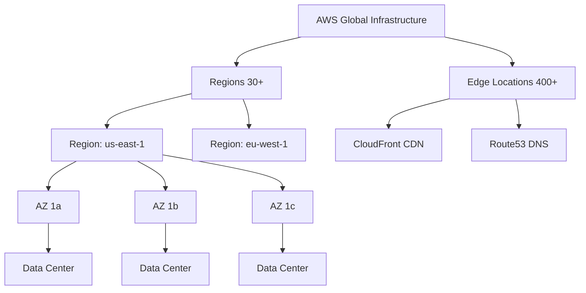

# AWS Fundamentals

## What is AWS?

Amazon Web Services (AWS) is the world's most comprehensive and widely adopted cloud computing platform, offering over 200 fully featured services across more than 30 service categories. Launched in 2006 by Amazon.com, AWS transformed the computing industry by making enterprise-grade cloud infrastructure accessible to organizations of all sizes.

### Market Position

- **Market Leader**: AWS commands approximately 32% of the global cloud infrastructure market
- **Enterprise Adoption**: Used by startups, Fortune 500 companies, governments, and educational institutions
- **Service Breadth**: From compute and storage to AI/ML, IoT, and quantum computing
- **Global Scale**: Operates in 33 geographic regions with 105+ Availability Zones worldwide

### Key AWS Services Categories

- **Compute**: EC2, Lambda, ECS, EKS, and more
- **Storage**: S3, EBS, EFS, Glacier
- **Database**: RDS, DynamoDB, Aurora, Redshift
- **Networking**: VPC, Route 53, CloudFront
- **Security & Identity**: IAM, KMS, WAF, Shield
- **Machine Learning**: SageMaker, Rekognition, Comprehend
- **Developer Tools**: CodePipeline, CodeBuild, CodeDeploy
- **Management & Monitoring**: CloudWatch, CloudTrail, CloudFormation

---

## Cloud Computing Fundamentals

### Service Models

Understanding the three primary cloud service models helps you choose the right AWS services for your needs:

#### Infrastructure as a Service (IaaS)

You manage applications, data, runtime, middleware, and OS. AWS manages virtualization, servers, storage, and networking. Examples: EC2, EBS, VPC.

#### Platform as a Service (PaaS)

You manage applications and data only. AWS manages runtime, middleware, OS, virtualization, servers, storage, and networking. Examples: RDS, Elastic Beanstalk, AppSync.

#### Software as a Service (SaaS)

AWS manages everything. You simply use the application. Examples: Amazon Chime, Amazon WorkSpaces, AWS Personal Health Dashboard.

### Deployment Models

**Public Cloud**: AWS manages infrastructure; you access over the internet. Highest scalability, lowest cost, but shared resources.

**Private Cloud**: Infrastructure dedicated to your organization, either on-premises or hosted. Higher security and control, higher costs.

**Hybrid Cloud**: Combination of public and private cloud. Flexibility to keep sensitive workloads on-premises while leveraging AWS for others.

### Six Advantages of Cloud Computing

1. **Trade Capital Expense for Variable Expense**
   - No upfront investment in hardware
   - Pay only for what you use
   - Reduces financial risk

2. **Benefit from Massive Economies of Scale**
   - AWS purchases capacity in bulk
   - Costs are lower than on-premises data centers
   - Savings passed to customers through lower pricing

3. **Stop Guessing Capacity**
   - Auto-scaling adjusts resources automatically
   - No over-provisioning or under-provisioning
   - Right-size infrastructure based on demand

4. **Increase Speed and Agility**
   - Deploy infrastructure in minutes, not months
   - Rapid experimentation and iteration
   - Faster time-to-market for applications

5. **Stop Spending Money on Data Centers**
   - No physical infrastructure to maintain
   - Eliminate real estate, cooling, and power costs
   - Focus budget on innovation

6. **Go Global in Minutes**
   - Deploy applications across multiple AWS regions worldwide
   - Serve users with low latency from nearby data centers
   - Global reach without global infrastructure costs

---

## AWS Global Infrastructure

AWS operates the world's most extensive and reliable cloud infrastructure, enabling you to deploy applications close to your users with high availability and disaster recovery capabilities.

### Infrastructure Components

#### Regions

- **30+ Geographic Regions** worldwide covering North America, Europe, Asia-Pacific, Middle East, Africa, and South America
- Each region is a completely isolated geographic area
- Regions contain multiple Availability Zones
- **When to Use Different Regions**:
  - **Compliance**: Store data in specific countries (GDPR, HIPAA)
  - **Latency**: Deploy closer to end users for faster response times
  - **Cost**: Pricing varies by region (typically higher in smaller regions)
  - **Service Availability**: New services roll out to certain regions first

#### Availability Zones (AZs)

- **105+ Availability Zones** across all regions
- Each AZ is a separate data center with independent power, cooling, and networking
- AZs within a region are connected by low-latency, high-bandwidth private links
- **High Availability**: Distribute applications across multiple AZs for fault tolerance
- If one AZ fails, traffic automatically routes to others

#### Edge Locations

- **400+ Edge Locations** worldwide
- Used by CloudFront (CDN) for content delivery
- Place content closer to end users for lower latency
- Edge Locations also support Route 53 (DNS) and WAF

#### Local Zones

- Extend AWS infrastructure to cities with single-digit millisecond latency
- Useful for ultra-low-latency applications
- Currently available in select cities

#### Wavelength Zones

- Enable ultra-low-latency applications for 5G devices
- Devices connect directly to Wavelength infrastructure
- Use cases: autonomous vehicles, real-time gaming, AR/VR

### AWS Global Infrastructure Diagram



### Choosing a Region

| Factor | Consideration |
|--------|---|
| **Compliance** | GDPR (EU), CCPA (California), data residency requirements |
| **Latency** | Choose region closest to users for best performance |
| **Cost** | us-east-1 typically cheapest; remote regions more expensive |
| **Service Availability** | New services launch in US regions first; check if needed service is available |
| **Disaster Recovery** | Use multiple regions for multi-region failover |
| **Redundancy** | Always use multiple Availability Zones within a region |

---

## AWS Shared Responsibility Model

The AWS Shared Responsibility Model defines clear boundaries between what AWS manages and what you (the customer) manage. Understanding this model is critical for security and compliance.

### AWS Responsibilities

AWS is responsible for:

- **Physical infrastructure**: Data center facilities, buildings, security
- **Networking infrastructure**: Routers, switches, firewalls, physical networking
- **Hypervisor and virtualization**: Ensuring guest operating systems cannot access other customers' systems
- **Service management**: Patching, updating, and maintaining managed services
- **Compliance certifications**: ISO 27001, SOC 2, PCI-DSS for their infrastructure

### Customer Responsibilities

You are responsible for:

- **Application code**: Development, testing, security
- **Operating system patches**: For EC2 instances and self-managed servers
- **Network configuration**: Security groups, NACLs, VPC setup
- **IAM & Access Control**: User management, permissions, credentials
- **Data encryption**: At-rest and in-transit encryption keys
- **Compliance monitoring**: Ensuring your workload meets regulatory requirements

### Responsibility by Service Type

#### IaaS (e.g., EC2, EBS)

| AWS Manages | You Manage |
|-------------|-----------|
| Physical infrastructure | Operating system patching |
| Hypervisor | Applications |
| Physical networking | Firewalls & security groups |
| | User accounts & permissions |
| | Data encryption |

#### PaaS (e.g., RDS, Elastic Beanstalk)

| AWS Manages | You Manage |
|-------------|-----------|
| Physical infrastructure | Application code |
| Hypervisor | Database configuration |
| OS and patches | User access |
| Database engine updates | Data within database |
| Backups | Encryption keys |

#### SaaS (e.g., S3, DynamoDB, Lambda)

| AWS Manages | You Manage |
|-------------|-----------|
| Everything infrastructure-related | User access and permissions |
| Service availability | Data encryption (if needed) |
| Updates and patches | Compliance of your data usage |
| | Logging and monitoring |

---

## Core AWS Services Overview

### Compute Services

| Service | Use Case | Description |
|---------|----------|---|
| **EC2** | Virtual servers | Full control over OS and application stack |
| **Lambda** | Serverless functions | Run code without provisioning servers; pay per execution |
| **ECS** | Container orchestration | Run Docker containers on EC2 or Fargate |
| **EKS** | Kubernetes | Managed Kubernetes cluster |
| **Fargate** | Container compute | Run containers without managing EC2 instances |
| **Elastic Beanstalk** | PaaS | Deploy web apps without infrastructure knowledge |
| **Lightsail** | Virtual private server | Simplified EC2 for small projects |

### Storage Services

| Service | Use Case | Description |
|---------|----------|---|
| **S3** | Object storage | Highly durable, scalable file storage (images, videos, archives) |
| **EBS** | Block storage | Persistent volumes for EC2 instances |
| **EFS** | File storage | Network file system for multiple EC2 instances |
| **Glacier** | Archive storage | Long-term archival with retrieval measured in hours |
| **Storage Gateway** | Hybrid storage | Connect on-premises storage to AWS |

### Database Services

| Service | Use Case | Description |
|---------|----------|---|
| **RDS** | Relational database | Managed MySQL, PostgreSQL, Oracle, SQL Server |
| **DynamoDB** | NoSQL database | Fully managed, serverless, key-value database |
| **Aurora** | High-performance SQL | MySQL/PostgreSQL compatible, auto-scaling |
| **ElastiCache** | In-memory cache | Redis or Memcached for fast data access |
| **Redshift** | Data warehouse | Petabyte-scale analytics and reporting |
| **DocumentDB** | Document database | MongoDB-compatible NoSQL database |

### Networking Services

| Service | Use Case | Description |
|---------|----------|---|
| **VPC** | Virtual network | Isolated cloud network with subnets and routing |
| **ELB/ALB** | Load balancing | Distribute traffic across EC2 instances |
| **Route 53** | DNS | Domain registration and routing policies |
| **CloudFront** | CDN | Global content delivery network |
| **API Gateway** | API management | Create REST/WebSocket APIs with authentication |
| **Direct Connect** | Dedicated connection | Private network link to AWS |

### Security Services

| Service | Use Case | Description |
|---------|----------|---|
| **IAM** | Identity management | Users, roles, policies, and access control |
| **KMS** | Key management | Create and manage encryption keys |
| **WAF** | Web firewall | Protect applications from web exploits |
| **Shield** | DDoS protection | Automatic DDoS protection (Standard) or advanced |
| **GuardDuty** | Threat detection | ML-based threat detection across AWS accounts |
| **Inspector** | Vulnerability scanning | Automated security assessment of EC2 instances |
| **Macie** | Data protection | Discover, monitor, and protect sensitive data in S3 |

### Management & Monitoring Services

| Service | Use Case | Description |
|---------|----------|---|
| **CloudWatch** | Monitoring | Collect metrics, logs, and create alarms |
| **CloudTrail** | Audit logging | Log all API calls for compliance and troubleshooting |
| **CloudFormation** | Infrastructure as Code | Define and deploy infrastructure using templates |
| **Systems Manager** | Resource management | Patch management, automation, compliance monitoring |
| **Config** | Configuration tracking | Track configuration changes and compliance |

### Developer Services

| Service | Use Case | Description |
|---------|----------|---|
| **CodePipeline** | CI/CD orchestration | Automate build, test, and deployment workflows |
| **CodeBuild** | Build service | Compile source code and run tests |
| **CodeDeploy** | Deployment | Deploy code to EC2, on-premises, or Lambda |
| **CodeCommit** | Git repository | AWS-hosted Git version control |

---

## AWS Well-Architected Framework

The AWS Well-Architected Framework provides a structured approach to evaluating and improving your cloud architecture. It consists of six pillars:

```mermaid
graph TB
    WAF["AWS Well-Architected Framework"]
    WAF --> OE["Operational Excellence"]
    WAF --> SEC["Security"]
    WAF --> REL["Reliability"]
    WAF --> PE["Performance Efficiency"]
    WAF --> COST["Cost Optimization"]
    WAF --> SUS["Sustainability"]
    OE --> OE1["Automate Changes"]
    OE --> OE2["Monitor Systems"]
    OE --> OE3["Continuous Improvement"]
    SEC --> SEC1["Least Privilege Access"]
    SEC --> SEC2["Encryption"]
    SEC --> SEC3["Traceability & Logging"]
    REL --> REL1["Multi-AZ Deployment"]
    REL --> REL2["Fault Tolerance"]
    REL --> REL3["Disaster Recovery"]
    PE --> PE1["Right-sizing"]
    PE --> PE2["Managed Services"]
    PE --> PE3["Performance Monitoring"]
    COST --> COST1["Reserved Instances"]
    COST --> COST2["Resource Optimization"]
    COST --> COST3["Cost Monitoring"]
    SUS --> SUS1["Efficient Services"]
    SUS --> SUS2["Resource Utilization"]
    SUS --> SUS3["Environmental Responsibility"]
```



### 1. Operational Excellence

**Focus**: Running and monitoring systems effectively, continuous improvement

**Key Principles**:
- Automate changes using infrastructure as code
- Regularly review and refine operational processes
- Monitor systems to detect issues before they impact users

**AWS Tools**: CloudFormation, CloudWatch, CloudTrail, AWS Config

### 2. Security

**Focus**: Protecting data, systems, and assets

**Key Principles**:
- Implement least privilege access (IAM)
- Enable encryption at rest and in transit
- Enable traceability through logging and monitoring

**AWS Tools**: IAM, KMS, WAF, GuardDuty, CloudTrail

### 3. Reliability

**Focus**: System resilience and recovery

**Key Principles**:
- Distribute load across multiple Availability Zones
- Implement fault tolerance and auto-recovery
- Plan for disaster recovery with backups and multi-region failover

**AWS Tools**: Auto Scaling, RDS Multi-AZ, Route 53 health checks, Backup

### 4. Performance Efficiency

**Focus**: Using computing resources effectively

**Key Principles**:
- Right-size resources based on demand
- Use managed services to offload optimization
- Monitor performance and adjust as needed

**AWS Tools**: Auto Scaling, CloudWatch, Lambda, RDS Performance Insights

### 5. Cost Optimization

**Focus**: Avoiding unnecessary costs

**Key Principles**:
- Use Reserved Instances and Savings Plans for predictable workloads
- Right-size instances based on actual usage
- Stop or terminate unused resources

**AWS Tools**: Cost Explorer, Trusted Advisor, Reserved Instance recommendations

### 6. Sustainability

**Focus**: Environmental responsibility

**Key Principles**:
- Leverage efficient, managed services
- Right-size infrastructure to minimize waste
- Optimize resource utilization

**AWS Tools**: CloudWatch, AWS Lambda, managed databases

---

## AWS Account Setup

Getting started with AWS requires a few key setup steps to ensure security and cost control.

### Creating an AWS Account

1. Visit [aws.amazon.com](https://aws.amazon.com)
2. Click "Create an AWS Account"
3. Provide email, password, and account name
4. Verify your email address
5. Add billing information (credit card required)
6. Verify your identity via phone or SMS
7. Select a support plan (Basic is free)

### Setting Up Multi-Factor Authentication (MFA)

Protect your root account with MFA:

1. Sign in to AWS Management Console as root user
2. Navigate to "Security Credentials"
3. Enable MFA:
   - Virtual authenticator (Google Authenticator, Authy)
   - Hardware security key
   - SMS (less secure, not recommended)

**Best Practice**: Always enable MFA on root account.

### Creating an IAM Admin User

Never use root account for daily operations:

1. Open IAM console
2. Create a new user (e.g., "admin-user")
3. Attach policy: "AdministratorAccess"
4. Create access key for CLI/programmatic access
5. Create login credentials for console access
6. Enable MFA for this user as well
7. Use this user for all operations

### Setting Up Billing Alerts

Monitor costs to avoid surprise bills:

1. Go to Billing & Cost Management console
2. Enable "Cost Explorer"
3. Create CloudWatch alarm:
   - Metric: Estimated Charges
   - Threshold: Set to your monthly budget (e.g., $100)
   - Action: Send SNS notification to your email

---

## AWS CLI Basics

The AWS Command Line Interface (CLI) allows you to interact with AWS services from your terminal.

### Installation

**macOS** (using Homebrew):
```bash
brew install awscli
```

**Linux**:
```bash
curl "https://awscli.amazonaws.com/awscli-exe-linux-x86_64.zip" -o "awscliv2.zip"
unzip awscliv2.zip
sudo ./aws/install
```

**Windows** (using MSI installer):
Download from [AWS CLI downloads page](https://aws.amazon.com/cli/)

### Configuration

```bash
aws configure
```

You'll be prompted for:
- AWS Access Key ID: (from IAM user)
- AWS Secret Access Key: (from IAM user)
- Default region: (e.g., us-east-1, eu-west-1)
- Default output format: (json, table, or text)

### Basic Commands

**List S3 buckets**:
```bash
aws s3 ls
```

**Describe EC2 instances**:
```bash
aws ec2 describe-instances
```

**Create an S3 bucket**:
```bash
aws s3 mb s3://my-unique-bucket-name
```

**Upload a file to S3**:
```bash
aws s3 cp myfile.txt s3://my-bucket/
```

**Get information about your account**:
```bash
aws sts get-caller-identity
```

**View billing information**:
```bash
aws ce get-cost-and-usage --time-period Start=2026-03-01,End=2026-03-21 --granularity MONTHLY --metrics "BlendedCost" --group-by Type=DIMENSION,Key=SERVICE
```

---

## AWS Pricing Model

Understanding AWS pricing helps you optimize costs and avoid unexpected charges.

### Pay-as-You-Go

The default pricing model:
- Pay for exactly what you use, measured hourly or per-second
- No upfront commitment required
- Most flexible but potentially highest cost for always-on workloads

### Reserved Instances (RIs)

Purchase instances for a fixed term:
- **1-Year or 3-Year Commitment**: Up to 72% discount vs. on-demand
- **Upfront, Partial, or No Upfront**: Choose payment flexibility
- Best for: Stable, predictable workloads
- Can be sold on AWS Marketplace if you no longer need them

### Spot Instances

Bid for unused capacity at significant discounts:
- Up to 90% cheaper than on-demand pricing
- Can be interrupted with 2-minute notice
- Best for: Fault-tolerant, flexible workloads (batch jobs, testing)

### Savings Plans

Flexible pricing for compute services:
- Up to 72% discount with commitment
- Covers EC2, Lambda, and Fargate usage
- More flexible than Reserved Instances
- Automatic discounts on any instance type/size/region

### Compute Savings Plans

- Covers EC2, Fargate, Lambda
- Apply across different instance families
- Most flexible option

### Convertible Savings Plans

- Can change instance attributes (family, size, OS)
- Up to 66% discount
- More flexibility than convertible RIs

### Free Tier

AWS offers a free tier for new customers:
- **Always Free**: EC2 (750 hours/month), S3 (5GB), RDS (750 hours), and others
- **12 Months Free**: Services up to certain limits (EC2, RDS, CloudFront)
- **Trials**: 30-90 day free trials on select services

**Tip**: Monitor Free Tier usage to avoid surprise charges after the free period ends.

### Cost Optimization Tips

1. **Right-size resources**: Monitor CloudWatch metrics and downsize over-provisioned instances
2. **Use managed services**: Lambda, DynamoDB, RDS eliminate operational overhead
3. **Stop/terminate unused resources**: EC2 instances, RDS databases, old snapshots
4. **Use spot instances**: For batch jobs, development/testing, non-critical workloads
5. **Enable S3 Intelligent-Tiering**: Automatically move data between access tiers
6. **Clean up old snapshots and backups**: Regular cleanup prevents unnecessary costs
7. **Leverage Reserved Instances**: For baseline production workloads
8. **Monitor with Cost Explorer**: Track spending by service, region, and tag

---

## Hands-On Exercises for Beginners

These exercises build foundational AWS skills through practical experience.

### Exercise 1: Create an AWS Account and Set Up IAM

**Objective**: Secure your AWS account and create an admin user

**Steps**:
1. Create a free AWS account at aws.amazon.com
2. Enable MFA on the root account (use authenticator app)
3. Create an IAM user named "admin-user"
4. Attach the "AdministratorAccess" policy to this user
5. Generate access keys for CLI access
6. Enable MFA for the IAM admin user
7. Sign out of root account and sign in with IAM user
8. Verify you can access the AWS Management Console

**Success Criteria**: You're logged in as an IAM user with MFA enabled

---

### Exercise 2: Launch Your First EC2 Instance

**Objective**: Deploy a virtual server and connect to it

**Steps**:
1. Sign in to AWS Console as your IAM admin user
2. Navigate to EC2 service
3. Click "Launch Instance"
4. Select Amazon Linux 2 AMI (always eligible for free tier)
5. Choose t2.micro instance type (free tier)
6. Leave default VPC and subnet settings
7. Create a new security group:
   - Allow SSH (port 22) from your IP
   - Allow HTTP (port 80) for web traffic
8. Create a new key pair (download the .pem file)
9. Click "Launch Instance"
10. Wait 2-3 minutes for instance to start
11. Note the Public IPv4 address
12. SSH into the instance:
    ```bash
    ssh -i your-key.pem ec2-user@PUBLIC_IP_ADDRESS
    ```
13. Run commands to verify access:
    ```bash
    whoami
    uname -a
    ```

**Success Criteria**: You can SSH into your EC2 instance and run commands

---

### Exercise 3: Create an S3 Bucket and Host a Static Website

**Objective**: Store files and host a simple static website

**Steps**:
1. Navigate to S3 in AWS Console
2. Click "Create bucket"
3. Name it something unique (e.g., my-website-YOURNAME)
4. Uncheck "Block all public access" (for website hosting)
5. Click "Create bucket"
6. Upload files:
   - Create a simple index.html file locally:
     ```html
     <html>
     <head><title>My Website</title></head>
     <body>
     <h1>Hello from AWS!</h1>
     </body>
     </html>
     ```
   - Upload to bucket
7. Configure static website hosting:
   - Go to bucket properties
   - Enable "Static website hosting"
   - Set index document to "index.html"
   - Note the endpoint URL
8. Edit bucket policy to make objects public:
   - Go to Permissions tab
   - Add bucket policy:
     ```json
     {
       "Version": "2012-10-17",
       "Statement": [{
         "Sid": "PublicReadGetObject",
         "Effect": "Allow",
         "Principal": "*",
         "Action": "s3:GetObject",
         "Resource": "arn:aws:s3:::YOUR-BUCKET-NAME/*"
       }]
     }
     ```
9. Visit the endpoint URL in your browser to see your website

**Success Criteria**: You can visit your S3-hosted website via the endpoint URL

---

### Exercise 4: Set Up CloudWatch Alarm for Billing

**Objective**: Monitor AWS costs and get notified if spending exceeds threshold

**Steps**:
1. Go to Billing & Cost Management console
2. Enable "Cost Explorer" if not already enabled
3. Go to CloudWatch console
4. Click "Alarms" then "Create alarm"
5. Click "Select metric"
6. Search for "Estimated Charges"
7. Select "EstimatedCharges" metric
8. Set threshold to $10 (or your desired limit)
9. Create an SNS topic for notifications:
   - Name: "BillingAlerts"
   - Confirm the SNS subscription in your email
10. Complete alarm creation
11. Test by modifying the alarm

**Success Criteria**: You receive an email notification when CloudWatch alarm is created

---

### Exercise 5: Use AWS CLI to Manage Resources

**Objective**: Interact with AWS using command-line tools

**Steps**:
1. Install AWS CLI (see instructions above)
2. Run `aws configure` with your IAM user credentials
3. Verify configuration:
   ```bash
   aws sts get-caller-identity
   ```
4. List your EC2 instances:
   ```bash
   aws ec2 describe-instances
   ```
5. List S3 buckets:
   ```bash
   aws s3 ls
   ```
6. Create a new S3 bucket via CLI:
   ```bash
   aws s3 mb s3://cli-bucket-YOURNAME
   ```
7. Upload a file:
   ```bash
   echo "Hello from CLI" > test.txt
   aws s3 cp test.txt s3://cli-bucket-YOURNAME/
   ```
8. List bucket contents:
   ```bash
   aws s3 ls s3://cli-bucket-YOURNAME/
   ```
9. Download the file back:
   ```bash
   aws s3 cp s3://cli-bucket-YOURNAME/test.txt downloaded.txt
   cat downloaded.txt
   ```
10. Get cost and usage data:
    ```bash
    aws ce get-cost-and-usage --time-period Start=2026-03-01,End=2026-03-21 --granularity DAILY --metrics BlendedCost
    ```

**Success Criteria**: You can create buckets, upload files, and query AWS resources via CLI

---

## Next Steps

After completing these fundamentals:

1. **Explore Compute**: Deep dive into EC2, Lambda, and containers
2. **Master Storage**: Understand S3, EBS, and data transfer costs
3. **Learn Networking**: VPC, subnets, security groups, and routing
4. **Implement Security**: IAM policies, encryption, and compliance
5. **Practice with Real Projects**: Build applications combining multiple services
6. **Study for Certifications**: AWS Solutions Architect, Developer, or SysOps Administrator

---

## Resources

- [AWS Documentation](https://docs.aws.amazon.com/)
- [AWS Free Tier](https://aws.amazon.com/free/)
- [AWS Pricing Calculator](https://calculator.aws/)
- [AWS Well-Architected Framework](https://aws.amazon.com/architecture/well-architected/)
- [AWS Certification Paths](https://aws.amazon.com/certification/)
- [AWS Skill Builder (Free)](https://skillbuilder.aws/)
