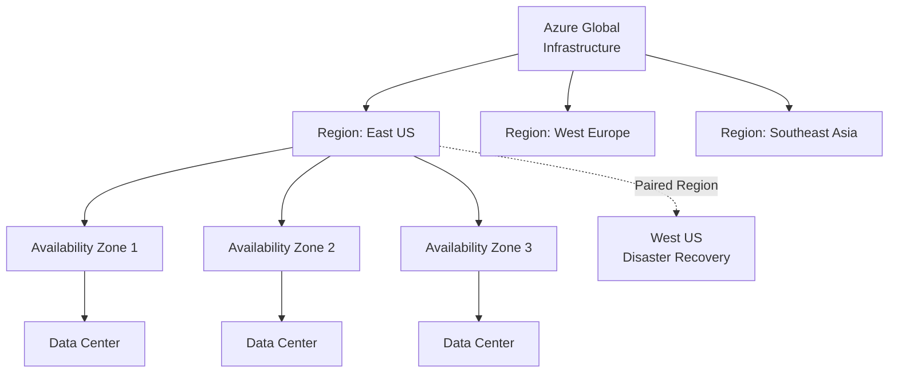
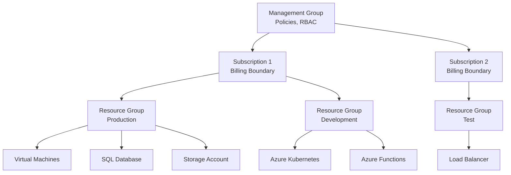

# Azure Fundamentals

Azure is Microsoft's cloud computing platform offering a wide range of services for computing, storage, networking, databases, analytics, AI, IoT, and more. This guide covers the foundational concepts you need to understand Azure architecture and core services.

## What is Azure?

Azure (Microsoft Azure) is a public cloud platform providing on-demand computing resources, storage, and services. Key characteristics include:

- **Global Scale**: Available in 60+ regions worldwide
- **Services**: 200+ services spanning compute, storage, networking, databases, analytics, and AI
- **Hybrid Capability**: Seamless integration with on-premises infrastructure
- **Enterprise Trust**: Backed by Microsoft's security and compliance expertise
- **Pay-as-you-go**: Flexible pricing aligned with consumption

## Global Infrastructure

### Azure Regions and Availability Zones



Azure's infrastructure is organized into regions and availability zones:

**Regions**: Geographic areas containing one or more data centers. Examples include `East US`, `West Europe`, `Southeast Asia`. Each region is paired with another region for disaster recovery.

**Availability Zones**: Physically separate data centers within a region, each with independent power, cooling, and networking. Zones protect against data center-level failures.

**Geography**: Collection of regions in the same geopolitical area (e.g., North America, Europe, Asia).

Deployment decisions should consider:
- Data residency and compliance requirements
- Latency and performance for users
- Cost differences between regions
- Service availability in specific regions

### Azure Resource Hierarchy



### Resource Organization

Azure uses a hierarchical organizational model:

1. **Management Group**: Top level for managing policies across multiple subscriptions
2. **Subscription**: Billing boundary and container for resources; enables role-based access control
3. **Resource Group**: Logical container for related resources within a subscription
4. **Resources**: Individual services (VMs, databases, storage accounts, etc.)

All resources must belong to a resource group in a subscription.

## Azure Resource Manager (ARM)

Azure Resource Manager is the deployment and management service for Azure. Key concepts:

- **Declarative**: You describe what you want, not how to deploy it
- **Consistent**: Works across all Azure services
- **Template-based**: Supports Infrastructure as Code (IaC)
- **Role-based Access Control (RBAC)**: Integrates security into resource management

ARM templates (JSON) and Bicep (more concise language) enable repeatable, version-controlled infrastructure deployments.

## Core Services Overview

### Compute Services

**Virtual Machines (VMs)**
- Full control over OS and software
- Scalable from single instance to thousands
- Pay for compute time per hour
- Use cases: Legacy app migration, custom configurations, development/testing

**App Service**
- Managed web and mobile app hosting
- Built-in autoscaling and load balancing
- Support for .NET, Java, Node.js, Python, PHP, Ruby
- Use cases: Web apps, REST APIs, mobile backends

**Azure Kubernetes Service (AKS)**
- Managed Kubernetes container orchestration
- Simplified cluster management and operations
- Integration with Azure DevOps and container registry
- Use cases: Microservices, containerized workloads, high-scale applications

**Azure Functions**
- Serverless compute for event-driven workloads
- Pay only for execution time (billed per millisecond)
- Triggers: HTTP, timers, message queues, database changes
- Use cases: Automation, data processing, real-time analytics

**Azure Container Instances (ACI)**
- Run containers without managing servers
- Simple and fast deployment
- Useful for batch jobs and CI/CD scenarios
- Use cases: Quick container deployments, development/testing

### Storage Services

**Blob Storage**
- Object storage for unstructured data
- Tiers: Hot (frequent access), Cool (infrequent, 30+ days), Archive (rare, 90+ days)
- Use cases: Documents, images, videos, backups, big data analytics

**Azure Files**
- Managed file shares accessible via SMB or NFS
- Mount from on-premises and cloud VMs
- Use cases: Shared file storage, legacy application migration

**Table Storage**
- NoSQL key-value store for semi-structured data
- High scalability, partition-based design
- Use cases: Session state, user profiles, sensor data

**Queue Storage**
- Message queue for asynchronous communication
- Decouples applications for scalability
- Use cases: Task scheduling, inter-service messaging

**Data Lake Storage**
- Petabyte-scale data repository
- Built on Blob Storage with optimizations for analytics
- Use cases: Big data analytics, data warehousing

### Networking Services

**Virtual Network (VNet)**
- Isolated network environment in Azure
- Custom IP address space, subnets, route tables
- Connects to on-premises via VPN or ExpressRoute
- Use cases: Multi-tier application architecture, hybrid connectivity

**Load Balancer**
- Distributes incoming traffic across multiple servers
- Operates at Layer 4 (transport layer)
- Internal and public load balancing
- Use cases: High availability, load distribution

**Application Gateway**
- Layer 7 (application layer) load balancing
- Supports URL-based routing, hostname-based routing, SSL termination
- Web application firewall (WAF) capabilities
- Use cases: Web application load balancing, API gateway

**Network Security Group (NSG)**
- Firewall rules for controlling inbound and outbound traffic
- Applied at subnet or network interface level
- Stateful filtering
- Use cases: Segment network, restrict traffic

**Azure Firewall**
- Managed, cloud-native firewall service
- Centralized protection across VNets
- Application and network level filtering
- Use cases: Hub-and-spoke network security

**Azure DNS**
- Host DNS domains and manage DNS records
- High availability, global scale
- Integrates with Azure RBAC
- Use cases: Domain hosting, DNS resolution

### Database Services

**Azure SQL Database**
- Managed relational database (SQL Server engine)
- Automatic backups, patching, and high availability
- Single database or elastic pools
- Use cases: Transactional systems, relational data

**Azure Cosmos DB**
- Globally distributed NoSQL database
- Multiple APIs: SQL, MongoDB, Cassandra, Gremlin, Table
- 99.99% availability SLA with multi-region replication
- Use cases: Real-time applications, IoT, content management

**Azure PostgreSQL / MySQL**
- Managed open-source relational databases
- Flexible Server (latest, recommended) or Single Server
- Automatic backups and high availability
- Use cases: Open-source relational workloads

**Azure Database for MariaDB**
- Managed MariaDB database service
- High availability and automatic backups
- Use cases: MariaDB migrations

## Azure Active Directory (Entra ID)

Azure Active Directory (now Azure Entra ID) is Microsoft's cloud identity and access management service:

- **User Management**: Create and manage user accounts and groups
- **MFA**: Multi-factor authentication for enhanced security
- **Conditional Access**: Grant or deny access based on conditions
- **RBAC**: Role-based access control for Azure resources
- **SSO**: Single sign-on integration with applications

Entra ID is the foundation for identity and security in Azure.

## Pricing Models

### Consumption-Based

Pay for resources you use:
- **Compute**: Billed per hour (or per second for some services)
- **Storage**: Billed per GB stored and per transaction
- **Data Transfer**: Billed per GB transferred out of Azure
- **Best for**: Variable workloads, development/testing

### Reserved Instances (RIs)

Commit to 1-year or 3-year terms for discounts (up to 72% off):
- Predictable workloads with consistent usage
- Significant cost savings
- Limited flexibility

### Spot VMs

Up to 90% discount on compute for interruptible workloads:
- Batch jobs, non-critical workloads
- Risk of eviction
- Use with caution for critical applications

### Free Tier

Azure free account includes:
- 12 months of free services (VMs, storage, databases)
- 200 USD credit for 30 days
- Always-free services (Functions, App Service, SQL Database in specific tiers)

## Management Tools

### Azure Portal

Web-based console for managing Azure resources:
- Intuitive GUI for resource creation and configuration
- Resource groups, cost analysis, monitoring dashboards
- Access control and compliance management
- Best for: GUI-based administration, exploration

### Azure CLI (az)

Command-line interface for Azure management:
```bash
az login
az group create --name myResourceGroup --location eastus
az vm create --resource-group myResourceGroup --name myVM --image UbuntuLTS
```

Benefits:
- Scriptable and automatable
- Works across platforms (Windows, macOS, Linux)
- Ideal for CI/CD pipelines

### Azure PowerShell

PowerShell module for Azure management:
```powershell
Connect-AzAccount
New-AzResourceGroup -Name myResourceGroup -Location EastUS
New-AzVM -ResourceGroupName myResourceGroup -Name myVM -Image UbuntuLTS
```

Benefits:
- Native Windows integration
- Advanced scripting capabilities
- Useful for systems administrators

### Azure Resource Manager Templates (ARM) / Bicep

Infrastructure as Code:
- Define infrastructure in declarative templates
- Version control and reproducibility
- Bicep offers cleaner syntax compared to ARM JSON
- Integration with CI/CD pipelines

## Five Essential Exercises

### Exercise 1: Create a Resource Group and Explore the Portal
1. Log into Azure Portal
2. Create a new resource group named `learning-rg` in East US
3. Navigate to the resource group and note the subscription ID, resource group ID, and location
4. Explore the Access Control (IAM) tab and note current role assignments

**Expected Outcome**: Understand resource group creation and portal navigation.

### Exercise 2: Deploy a Virtual Machine
1. In the resource group `learning-rg`, create a Linux VM (Ubuntu 20.04 LTS)
2. Configure basic settings: VM name, size (Standard_B1s), authentication (SSH key)
3. Create a new virtual network and subnet
4. Create a Network Security Group allowing SSH (port 22) only from your IP
5. Review the total estimated cost before deployment

**Expected Outcome**: Understand VM deployment, networking, and cost considerations.

### Exercise 3: Create a Storage Account and Upload Blob
1. In resource group `learning-rg`, create a Storage Account (Standard, Hot tier)
2. Create a container named `myfiles`
3. Upload a sample text file to the container
4. Generate a shared access signature (SAS) URL to access the file
5. Access the file using the SAS URL from a browser

**Expected Outcome**: Understand blob storage, access control, and SAS tokens.

### Exercise 4: Deploy an App Service Web App
1. In resource group `learning-rg`, create an App Service Plan (Free tier)
2. Create a Web App (.NET or Node.js)
3. Deploy sample code (use quickstart template)
4. Configure custom domain settings and SSL (optional)
5. View application logs and metrics in the Monitoring section

**Expected Outcome**: Understand App Service deployment and monitoring.

### Exercise 5: Use Azure CLI to List Resources
1. Install Azure CLI locally
2. Authenticate: `az login`
3. List all resource groups: `az group list`
4. List all resources in `learning-rg`: `az resource list --resource-group learning-rg`
5. Get details of a specific VM using: `az vm show --resource-group learning-rg --name <vmname>`
6. Clean up by deleting the resource group: `az group delete --name learning-rg --yes`

**Expected Outcome**: Understand Azure CLI usage and resource management via command line.

## Key Takeaways

- Azure provides a comprehensive cloud platform with global infrastructure
- Subscriptions, resource groups, and resources form the organizational hierarchy
- Compute services range from full control (VMs) to fully managed (Functions)
- Storage and database services support diverse data patterns
- Azure Resource Manager enables consistent, templated infrastructure management
- Management tools include Portal, CLI, PowerShell, and Infrastructure as Code
- Understanding pricing models helps optimize cloud costs
