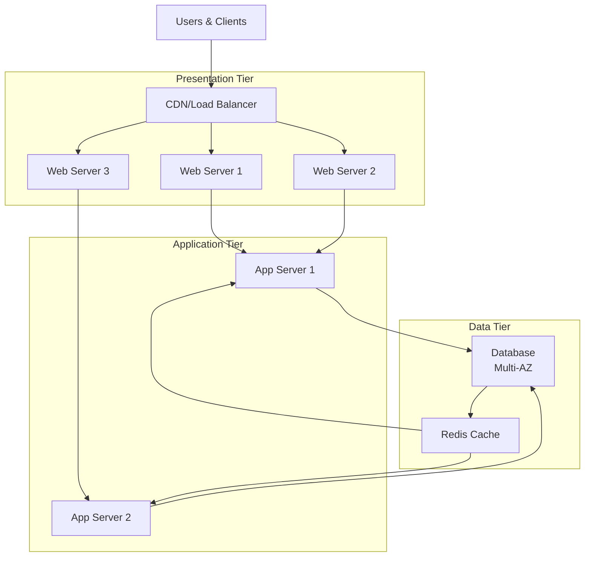
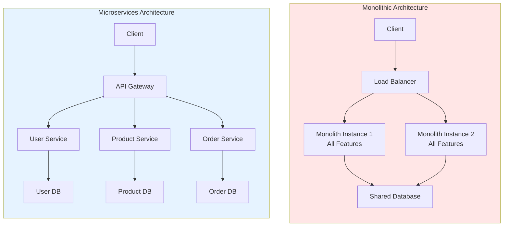

# Cloud Architecture & Design Patterns

## Cloud Design Principles

Before diving into specific patterns, understand the core principles of effective cloud architecture:

### 1. Scalability

Systems should grow efficiently with demand.

**Types:**
- **Vertical Scaling (Scale Up):** Increase resources (CPU, memory) on existing servers
- **Horizontal Scaling (Scale Out):** Add more servers to handle load

**Cloud-native approach:** Horizontal scaling through load balancing and auto-scaling

### 2. Reliability & Resilience

Systems should continue operating despite failures.

**Key concepts:**
- **Fault Tolerance:** System continues despite component failures
- **Self-Healing:** Automatic recovery from failures
- **Redundancy:** Multiple copies of critical components
- **Graceful Degradation:** Reduced functionality rather than complete failure

### 3. Elasticity

Resources automatically adjust to match demand.

**Without elasticity:** Fixed capacity, over-provision for peaks, waste during valleys
**With elasticity:** Right-sized capacity at all times, cost optimization

### 4. Security

Security is everyone's responsibility (shared responsibility model).

**Key practices:**
- Least privilege access
- Defense in depth (multiple security layers)
- Encryption at rest and in transit
- Regular security audits

### 5. Cost Optimization

Design for efficiency without compromising functionality.

**Strategies:**
- Use managed services to avoid infrastructure management
- Right-size resources based on actual needs
- Leverage auto-scaling for variable workloads
- Monitor and optimize continuously

---

## Common Cloud Architecture Patterns

### 3-Tier Architecture

The most common web application architecture.



**Characteristics:**
- Clear separation of concerns
- Each tier can scale independently
- Easier to secure (network rules per tier)
- Straightforward to implement and test

**When to use:** Traditional web applications, REST APIs, content management systems

**Implementation example:**

```
Tier 1: CloudFront CDN → ALB (Load Balancer)
Tier 2: EC2 Auto Scaling Group → Stateless app servers
Tier 3: RDS Multi-AZ → Read Replicas
```

### Microservices vs Monolith Architecture



**Characteristics:**
- Small, focused services (single responsibility)
- Independent deployment
- Technology flexibility (different tech stacks)
- Distributed system complexity

**Advantages:**
- Easy to scale individual services
- Faster development and deployment
- Fault isolation (one service failure doesn't crash all)
- Technology flexibility

**Challenges:**
- Complexity: more services to manage
- Network latency between services
- Distributed debugging
- Data consistency across services

**Best practices:**
- Keep services loosely coupled
- Use API gateways for routing
- Implement circuit breakers for fault tolerance
- Use correlation IDs for request tracing

### Serverless Architecture

Event-driven architecture where providers manage servers.

```
Events → Lambda → Database
              ↓
         API Gateway
```

**Characteristics:**
- No server management
- Pay per execution (truly pay-as-you-go)
- Automatic scaling
- Built-in high availability

**When to use:**
- Asynchronous processing (image processing, notifications)
- Scheduled jobs (backups, reports)
- Webhooks and integrations
- APIs with variable traffic
- Real-time data processing

**Advantages:**
- Lowest operational overhead
- Fastest scaling (milliseconds)
- Extreme cost optimization for variable workloads
- Easy deployment

**Limitations:**
- Cold starts (initial invocation slower)
- Execution time limits (typically 15 minutes max)
- State management complexity
- Vendor lock-in

### Event-Driven Architecture

Services communicate asynchronously via events.

```
┌─────────────────────────────────┐
│  Event Producer                 │
│  (User signup, order placed)    │
└────────────┬────────────────────┘
             │
             ▼
┌─────────────────────────────────┐
│  Event Bus/Message Queue        │
│  (SNS, Kafka, RabbitMQ)        │
└────────────┬────────────────────┘
             │
    ┌────────┴────────┬────────────┐
    ▼                 ▼            ▼
┌────────┐      ┌──────────┐  ┌────────┐
│Email   │      │Analytics │  │Payment │
│Service │      │Service   │  │Service │
└────────┘      └──────────┘  └────────┘
```

**Characteristics:**
- Loose coupling between services
- Asynchronous communication
- Improved scalability and resilience

**When to use:**
- Services need real-time notifications
- Multiple systems need same data
- Building event-sourcing patterns

### Cloud-Native Principles

Cloud-native applications are designed for cloud deployment from the start.

#### 12-Factor Application

A methodology for building scalable cloud applications:

| Factor | Principle |
|--------|-----------|
| **1. Codebase** | One codebase per app, version controlled |
| **2. Dependencies** | Explicitly declared, no implicit globals |
| **3. Configuration** | Environment variables, not hardcoded |
| **4. Backing Services** | Treat databases/queues as attached resources |
| **5. Build/Run** | Strictly separate build and run stages |
| **6. Processes** | Stateless and share-nothing processes |
| **7. Port Binding** | Export HTTP via port binding (no external server) |
| **8. Concurrency** | Scale horizontally via process model |
| **9. Disposability** | Fast startup/shutdown for elasticity |
| **10. Dev/Prod Parity** | Same tools and services locally and in production |
| **11. Logs** | Write logs to stdout, let environment handle storage |
| **12. Admin Tasks** | Run as one-off processes, not background jobs |

#### Key Cloud-Native Practices

**Containerization:**
- Package applications in containers (Docker)
- Enables consistent deployment across environments
- Simplifies scaling and orchestration

**Infrastructure as Code (IaC):**
- Define infrastructure via code (Terraform, CloudFormation)
- Version control for infrastructure
- Reproducible, automated deployments

**Observability:**
- Structured logging
- Metrics and monitoring
- Distributed tracing
- Understand system behavior in production

**CI/CD:**
- Continuous integration: automated testing on every commit
- Continuous deployment: automated release to production
- Fast feedback loops

---

## Load Balancing

Distribute traffic across multiple servers to prevent overload.

### Types of Load Balancers

**1. Network Load Balancer (Layer 4)**
- Works at transport layer (TCP/UDP)
- Ultra-high performance, lowest latency
- Best for: Non-HTTP protocols, extreme performance

**2. Application Load Balancer (Layer 7)**
- Works at application layer (HTTP/HTTPS)
- Intelligent routing based on URL paths, hostnames, headers
- Best for: Web applications, microservices

**3. Classic Load Balancer**
- Legacy option, simpler
- Works across layers 4 and 7
- Avoid for new applications

### Load Balancing Algorithms

| Algorithm | Use Case |
|-----------|----------|
| **Round Robin** | Equal distribution to all servers |
| **Weighted** | Servers with more capacity get more traffic |
| **Least Connections** | Send to server with fewest active connections |
| **IP Hash** | Same client always routes to same server (session persistence) |
| **Random** | Randomize distribution |

---

## Auto-Scaling

Automatically adjust capacity based on demand.

### Scaling Policies

**1. Reactive Scaling**
- Scale when metrics exceed thresholds
- Slower response (lag between demand and scaling)
- Example: "Add instance if CPU > 70% for 2 minutes"

**2. Predictive Scaling**
- Machine learning predicts future demand
- Faster scaling, better user experience
- Requires historical data

**3. Scheduled Scaling**
- Scale on a fixed schedule
- Example: "Double capacity at 9 AM on weekdays"
- Best for: Predictable patterns

### Metrics for Auto-Scaling

**Common metrics:**
- CPU utilization
- Memory usage
- Request count
- Network bandwidth
- Custom application metrics

**Best practices:**
- Scale on application metrics, not just CPU
- Set appropriate min/max capacity limits
- Avoid rapid scaling fluctuations ("flapping")
- Test scaling behavior before production

---

## Disaster Recovery & Business Continuity

### Recovery Metrics

**RTO (Recovery Time Objective)**
- How quickly must the system recover?
- Measured in hours, minutes, or seconds
- Business impact: downtime cost

**RPO (Recovery Point Objective)**
- How much data loss is acceptable?
- Measured in hours, minutes, or point-in-time
- Business impact: data loss consequences

### Disaster Recovery Strategies

**1. Backup & Restore**
- Take regular backups
- Restore from backups when disaster occurs
- RTO: Hours to days
- RPO: Hours to days
- Cost: Lowest

**2. Pilot Light**
- Minimal hot standby in another region
- Scale up when needed
- RTO: 10s of minutes
- RPO: Minutes to hours
- Cost: Low to moderate

**3. Warm Standby**
- Scaled-down copy running in another region
- Scale up quickly
- RTO: Minutes
- RPO: Seconds to minutes
- Cost: Moderate

**4. Hot Standby (Active-Active)**
- Fully operational copy in another region
- Instant failover
- RTO: Seconds
- RPO: Seconds or real-time replication
- Cost: Highest

### Implementing Disaster Recovery

**Database replication:**
- Primary-replica setup for continuous sync
- Read replicas for load distribution

**Multi-region deployment:**
- Applications running in multiple regions
- Traffic routing between regions

**Data backup strategy:**
- Regular snapshots of databases
- Geographic distribution of backups
- Test recovery procedures regularly

---

## Hands-On Exercises

### Exercise 1: Architecture Pattern Selection

For each scenario, recommend an appropriate architecture pattern:

1. A social media platform handling billions of reads and millions of writes
2. A mobile app that processes photos
3. A real-time analytics dashboard
4. A traditional enterprise business application

**Suggested answers:**
1. Microservices (read-optimized + write-optimized services)
2. Serverless (event-driven image processing)
3. Microservices + event-driven (real-time data)
4. 3-tier architecture

### Exercise 2: Design a Scalable E-commerce Platform

Design architecture for handling peak traffic (10x normal):
- How would you handle traffic spikes?
- What services would you use?
- Where would you add load balancing?
- How would you scale the database?

### Exercise 3: Disaster Recovery Plan

Create a DR plan for a critical payment processing system:
- What is an acceptable RTO and RPO?
- Which DR strategy would you choose and why?
- What services would you use?
- How would you test the plan?

### Exercise 4: Cloud-Native Evaluation

Evaluate an existing application against 12-factor principles:
- Which factors does it follow?
- Which factors need improvement?
- Create an action plan to improve cloud-native readiness

---

## Next Steps

- **Learn about cloud migration?** See [Cloud Migration Strategies](./migration.md)
- **Prepare for interviews?** Check out [Interview Questions](./interview-questions.md)
- **Back to fundamentals?** Read [Cloud Computing Fundamentals](./fundamentals.md)
