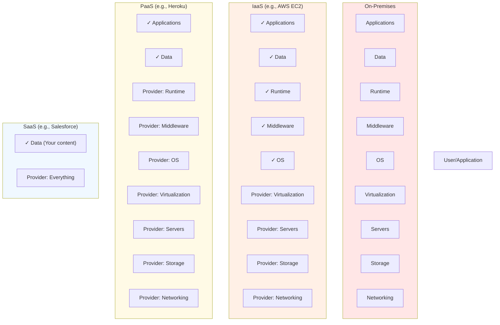

# Cloud Computing Fundamentals

## What is Cloud Computing?

Cloud computing is the on-demand availability of computer system resources—especially data storage and computing power—without direct active management by the user. At its core, the cloud is a datacenter you access over the internet, but it's much more than "someone else's datacenter."

### NIST Definition

The National Institute of Standards and Technology (NIST) defines cloud computing through five essential characteristics:

#### 1. On-Demand Self-Service
Cloud resources—compute, storage, databases, container orchestration, machine learning, and more—are available at the click of a button or via API. No tickets, emails, or waiting required.

#### 2. Broad Network Access
Access resources from anywhere using various devices and interfaces. Restart a service from your mobile phone, provision environments from your laptop, and monitor systems from anywhere.

#### 3. Resource Pooling
Cloud providers pool resources and make them available to multiple customers with proper security. You specify compute and memory requirements without worrying about physical machines or exact datacenter locations.

#### 4. Rapid Elasticity
Resources scale up to meet demand and scale down when demand decreases. This scaling can be manual (via API/UI) or automatic with no human intervention.

#### 5. Measured Service
Cloud systems track resource usage transparently. You pay for what you use—a "pay-as-you-go" model.

---

## Cloud Service Models

### Infrastructure as a Service (IaaS)

**What you get:** Virtual machines, storage, networking, and compute resources.

**You manage:** Applications, data, runtime, middleware, OS
**Provider manages:** Virtualization, servers, storage, networking

**Best for:** Maximum control and flexibility; custom applications requiring specific OS/middleware

**Examples:** AWS EC2, Microsoft Azure VMs, Google Compute Engine, DigitalOcean

**Use cases:**
- Hosting web applications
- Development/test environments
- High-performance computing
- Storage and backups

### Platform as a Service (PaaS)

**What you get:** Pre-configured development and deployment environments.

**You manage:** Applications and data
**Provider manages:** Everything else (OS, middleware, runtime, infrastructure)

**Best for:** Developers who want to focus on code, not infrastructure

**Examples:** AWS Elastic Beanstalk, Heroku, Google App Engine, Azure App Service

**Use cases:**
- Rapid application development
- API development and management
- Database management
- Business analytics/intelligence

### Software as a Service (SaaS)

**What you get:** Ready-to-use applications accessed via web browsers.

**You manage:** Nothing (just use it)
**Provider manages:** Everything

**Best for:** End-users and businesses needing pre-built solutions

**Examples:** Salesforce, Microsoft 365, Slack, Google Workspace, Zoom

**Use cases:**
- Email and collaboration
- Customer relationship management (CRM)
- Enterprise resource planning (ERP)
- Project management

### Function as a Service (FaaS) / Serverless

**What you get:** Write code that runs in response to events without managing servers.

**You manage:** Code and configuration
**Provider manages:** Servers, scaling, execution environment

**Best for:** Event-driven workloads, microservices, and cost optimization

**Examples:** AWS Lambda, Azure Functions, Google Cloud Functions

**Use cases:**
- Scheduled tasks and cron jobs
- Real-time data processing
- API backends
- Image/video processing

### Cloud Service Models Comparison



---

## Cloud Deployment Models

### Public Cloud

**Definition:** Services available to the general public over the internet.

**Characteristics:**
- Shared infrastructure
- Multi-tenant environment
- Lower cost
- Limited customization
- Highest scalability

**Best for:** Startups, cost-sensitive organizations, variable workloads

**Examples:** AWS, Microsoft Azure, Google Cloud Platform

### Private Cloud

**Definition:** Infrastructure dedicated to a single organization.

**Characteristics:**
- Single-tenant environment
- Higher control and security
- Higher cost
- On-premises or hosted
- Full customization

**Best for:** Enterprises with strict compliance requirements, legacy systems, or sensitive data

**Examples:** OpenStack, VMware vCloud, CloudStack

### Hybrid Cloud

**Definition:** Combination of public and private cloud resources with management and orchestration across both.

**Characteristics:**
- Flexibility to choose deployment per workload
- Data portability
- Consistent tooling and management
- Complex architecture

**Best for:** Enterprises transitioning to cloud, variable workloads, compliance-sensitive + scalable workloads

**Use cases:**
- Burst capacity: run on-premises normally, scale to public cloud during peaks
- Sensitive data: keep private data on private cloud, less sensitive on public
- Compliance: leverage both based on regulatory requirements

### Community Cloud

**Definition:** Infrastructure shared by specific organizations with common interests (compliance, mission, etc.).

**Characteristics:**
- Shared costs
- Industry or mission-specific
- Moderate security and control

**Examples:** Government clouds, healthcare clouds, financial services clouds

---

## Shared Responsibility Model

The cloud is a shared responsibility between provider and customer. Understanding who is responsible for what is critical.

### IaaS Responsibility Chart

```
┌─────────────────────────────────────┐
│ Customer Managed                    │
├─────────────────────────────────────┤
│ • Applications                       │
│ • Data                              │
│ • Runtime                           │
│ • Middleware                        │
│ • OS                                │
├─────────────────────────────────────┤
│ Provider Managed                    │
├─────────────────────────────────────┤
│ • Virtualization                    │
│ • Servers & Storage                 │
│ • Networking Infrastructure         │
│ • Physical Security                 │
└─────────────────────────────────────┘
```

### PaaS Responsibility Chart

```
┌─────────────────────────────────────┐
│ Customer Managed                    │
├─────────────────────────────────────┤
│ • Applications                       │
│ • Data                              │
├─────────────────────────────────────┤
│ Provider Managed                    │
├─────────────────────────────────────┤
│ • Runtime, Middleware, OS           │
│ • Virtualization through Infrastructure
│ • Physical Security                 │
└─────────────────────────────────────┘
```

### SaaS Responsibility Chart

```
┌─────────────────────────────────────┐
│ Customer Managed                    │
├─────────────────────────────────────┤
│ • Data                              │
│ • User Access Management            │
├─────────────────────────────────────┤
│ Provider Managed                    │
├─────────────────────────────────────┤
│ • Everything else                   │
└─────────────────────────────────────┘
```

---

## Cloud Economics

### Cost Advantages

**1. Reduced Capital Expenditure (CapEx)**
- No need to buy and maintain physical servers
- Shift from capital investment to operational expenses

**2. Economies of Scale**
- Cloud providers leverage massive scale to negotiate better hardware costs
- These savings are passed to customers

**3. Pay-as-You-Go Model**
- Only pay for resources consumed
- Scale costs with business growth

**4. Operational Efficiency**
- Reduced need for IT staff managing infrastructure
- Automated patching and updates
- Built-in redundancy and backup

### Cost Optimization Best Practices

**1. Right-sizing**
- Monitor actual resource usage
- Adjust instance types to match actual needs
- Avoid over-provisioning

**2. Reserved Instances**
- Commit to 1 or 3-year terms for significant discounts (up to 70%)
- Good for stable, predictable workloads

**3. Spot/Low-Priority Instances**
- Use unused capacity at deep discounts (up to 90% off)
- Good for batch jobs, non-critical workloads, development/testing

**4. Auto-Scaling**
- Automatically adjust capacity based on demand
- Pay only for capacity in use

**5. Data Transfer Optimization**
- Minimize egress charges (data leaving the cloud)
- Use content delivery networks (CDNs)
- Keep related resources in same region when possible

### FinOps

FinOps (Cloud Financial Operations) is a management discipline combining engineering and business practices to optimize cloud spending while improving business value.

**Key principles:**
- Make cloud spending visible and understandable
- Allocate costs to business units accurately
- Optimize costs continuously
- Balance cost, speed, and quality

---

## Regions and Availability Zones

### Regions

A region is a geographic area where cloud providers operate one or more datacenters.

**Characteristics:**
- Physically separate from other regions
- Dozens of kilometers apart to prevent common failure causes
- Independent infrastructure, power, cooling
- Full service availability within region

**Why choose a specific region:**
- **Latency:** Deploy closer to users for better performance
- **Compliance:** Some regulations require data residency in specific countries
- **Service availability:** Not all services available in all regions
- **Cost:** Pricing varies by region

**Examples:**
- US East, US West, Europe, Asia Pacific, etc.

### Availability Zones (AZs)

An availability zone is one or more physically separate datacenters within a region.

**Characteristics:**
- Isolated from other AZs via separate power, cooling, networking
- Low-latency networking between AZs (usually `< 2ms`)
- Same region means same compliance/latency benefits
- Enable high availability and disaster recovery

**Why use multiple AZs:**
- **High Availability:** If one AZ fails, others continue running
- **Fault Isolation:** Failures don't affect all your instances
- **Low latency:** Still very fast communication between AZs

**Best practice:** Distribute critical applications across multiple AZs within a region.

### Multi-Region Strategy

Some organizations deploy across multiple regions:
- **Disaster recovery:** Recover quickly from regional outages
- **Global availability:** Serve users with low latency worldwide
- **Compliance:** Meet data residency requirements in multiple countries
- **Business continuity:** Never fully dependent on single region

---

## Key Vocabulary

| Term | Definition |
|------|-----------|
| **Elasticity** | Ability to automatically scale resources up or down based on demand |
| **Scalability** | Ability to handle increased load by adding resources |
| **High Availability (HA)** | System continues operating despite failures of components |
| **Disaster Recovery (DR)** | Ability to recover from regional failures or major outages |
| **RTO** | Recovery Time Objective—how long before system is back up |
| **RPO** | Recovery Point Objective—how much data loss is acceptable |
| **SLA** | Service Level Agreement—uptime guarantee from provider |
| **Tenancy** | Single-tenant (private) vs multi-tenant (shared) infrastructure |

---

## Hands-On Exercises

### Exercise 1: Service Model Matching

Match the following scenarios to the appropriate service model (IaaS, PaaS, SaaS, FaaS):

1. Your team needs to build a web application and deploy it without managing servers.
2. You need a spreadsheet application accessible from any device.
3. You want complete control over the OS and can install custom software.
4. You need to process images whenever they're uploaded to cloud storage.

**Answers:** 1-PaaS, 2-SaaS, 3-IaaS, 4-FaaS

### Exercise 2: Responsibility Model Analysis

Review your current application architecture:
- List what your team manages
- List what your cloud provider manages
- Are there any gaps or unclear responsibilities?

### Exercise 3: Region and AZ Strategy

Plan a deployment for a global e-commerce platform:
1. Which regions should you deploy to and why?
2. How should you distribute across availability zones?
3. What about your database—single region or multi-region?

### Exercise 4: Cost Optimization Challenge

Analyze a hypothetical cloud bill:
- Compute: `$5,000/month` (on-demand instances running 24/7)
- Storage: `$500/month`
- Data transfer: `$1,200/month` (most egress to internet)

What optimizations would you recommend and estimate savings?

---

## Next Steps

- **Ready for architecture patterns?** See [Cloud Architecture & Design Patterns](./architecture.md)
- **Planning a cloud move?** Check out [Cloud Migration Strategies](./migration.md)
- **Interview prep?** Explore [Interview Questions](./interview-questions.md)
