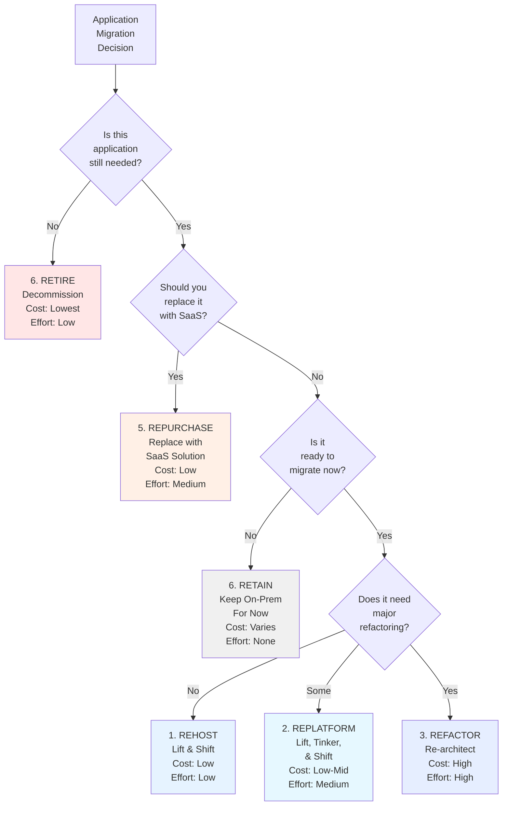

# Cloud Migration Strategies

## Why Migrate to the Cloud?

Organizations migrate to cloud for various reasons:

**Operational Benefits:**
- Reduced infrastructure management burden
- Faster time to market
- Improved scalability
- Better disaster recovery capabilities
- Access to latest technology

**Cost Benefits:**
- Reduced capital expenditure
- Pay-as-you-go model
- Reduced operational overhead
- Avoid datacenter decommissioning

**Strategic Benefits:**
- Global reach through regional datacenters
- Improved security compliance
- Access to AI/ML services
- Digital transformation enablement

---

## The 6 Rs of Cloud Migration

AWS defines six primary strategies for cloud migration. Understanding each helps you choose the right approach for your applications.

### 6 Rs Decision Tree



### 1. Rehost (Lift and Shift)

**Definition:** Move applications as-is to cloud with minimal changes.

**Process:**
- Migrate OS and application
- Minimal refactoring
- Similar infrastructure in cloud

**Advantages:**
- Fastest migration path
- Lowest cost and complexity
- Good for getting off expensive on-premises infrastructure

**Disadvantages:**
- Doesn't optimize for cloud
- May not leverage cloud benefits
- Potential license issues with poorly-designed legacy apps

**Best for:**
- Legacy applications with limited modification
- Applications nearing end-of-life (temporary measure)
- Quick wins to show ROI

**Example:** Migrating a traditional Java application from physical servers to AWS EC2 instances with same configuration

### 2. Replatform (Lift, Tinker, and Shift)

**Definition:** Make targeted optimizations while moving to cloud.

**Changes made:**
- Upgrade to cloud-optimized versions
- Switch to managed services
- Minor code changes

**Advantages:**
- Better cloud optimization than rehost
- Still relatively quick
- Moderate effort
- Leverage some cloud benefits (managed databases, etc.)

**Disadvantages:**
- Some refactoring required
- More complex than pure rehost
- Still may not achieve full cloud potential

**Best for:**
- Applications benefiting from managed services
- Databases ready for upgrade
- Applications with technical debt

**Example:** Moving to RDS (managed database) instead of self-managed database on EC2, or upgrading to latest application version during migration

### 3. Refactor/Re-architect

**Definition:** Redesign application for cloud from the ground up.

**Changes made:**
- Modernize architecture
- Adopt microservices if applicable
- Leverage cloud-native services (serverless, containers)
- Significant code changes

**Advantages:**
- Maximizes cloud benefits
- Best long-term investment
- Optimized cost and performance
- Future-proof architecture

**Disadvantages:**
- Highest cost and complexity
- Longest migration timeline
- Significant development effort
- Higher risk

**Best for:**
- Core strategic applications
- Applications with long remaining lifespan
- Complex applications needing modernization

**Example:** Converting monolithic application to microservices on Kubernetes, switching to event-driven architecture, adopting serverless components

### 4. Repurchase (Drop and Shop)

**Definition:** Replace application with a different SaaS product.

**Process:**
- License new SaaS application
- Migrate data
- Retrain users

**Advantages:**
- Get modern application features
- Reduced maintenance burden
- Access to continuous updates
- Potential for faster deployment

**Disadvantages:**
- Loss of customization
- Vendor lock-in
- May require significant change management
- Data migration complexity

**Best for:**
- Legacy systems with SaaS equivalents
- Non-strategic applications
- Systems lacking required features

**Example:** Moving from on-premises email to Microsoft 365, or replacing legacy CRM with Salesforce

### 5. Retire

**Definition:** Decommission applications no longer needed.

**Process:**
- Document application
- Archive data if needed
- Decommission infrastructure

**Advantages:**
- Reduce complexity and costs immediately
- Simpler IT portfolio
- Reduced security footprint

**Disadvantages:**
- May lose capabilities
- Historical data archived, not accessible
- Potential user dissatisfaction

**Best for:**
- Redundant applications
- Outdated systems with low usage
- Applications replaced by other solutions

**Example:** Decommissioning legacy reporting systems replaced by modern analytics platform

### 6. Retain (Do Nothing)

**Definition:** Keep application on-premises for now.

**Reasons:**
- Not ready for migration
- Technical blockers
- Business reasons
- Regulatory compliance constraints

**Best for:**
- Applications still being developed
- Systems needing major refactoring
- Pending strategic decisions

**Note:** Even retained applications should be monitored for future migration readiness.

---

## Migration Assessment Framework

Before starting migration, thoroughly assess your environment.

### 1. Application Portfolio Analysis

**For each application, document:**

| Attribute | Examples |
|-----------|----------|
| **Name** | Order processing system |
| **Business criticality** | Critical/Important/Nice-to-have |
| **Current infrastructure** | On-prem, colo, hybrid |
| **Architecture** | Monolith, N-tier, microservices |
| **Database** | Oracle, SQL Server, PostgreSQL |
| **Dependencies** | Other apps, external services |
| **Licensing** | Licensed, open-source |
| **Compliance** | HIPAA, PCI-DSS, GDPR |
| **Performance requirements** | Latency, throughput, availability |

### 2. Readiness Assessment

**Technical readiness:**
- Outdated vs. modern technology
- Licensing compatibility with cloud
- Architecture suitability for cloud
- Security and compliance requirements

**Organizational readiness:**
- Team cloud expertise
- DevOps maturity
- Change management capability
- Available resources and budget

### 3. Prioritization Matrix

```
┌────────────────────────────────────────┐
│High Value,          │ QUICK WINS       │
│Low Effort           │ (Rehost, migrate)│
│                     │                   │
├────────────────────┼─────────────────────┤
│ HIGH EFFORT/RISK   │ Strategic,         │
│ Complex, needs      │ Future-focused    │
│ refactoring         │ (Refactor later)  │
│                     │                   │
├────────────────────┼─────────────────────┤
│Low Value           │ Retire or Keep    │
│(Keep or Retire)    │                   │
└────────────────────────────────────────┘
```

**Migration wave planning:**
1. **Wave 1:** Quick wins (rehost candidates)
2. **Wave 2:** Strategic apps (replatform/refactor)
3. **Wave 3:** Complex apps (refactor/retire)

---

## Lift-and-Shift Challenges & Solutions

### The Myth: "Lift-and-Shift Is Simple"

Lift-and-shift often underestimates complexity:

**Common challenges:**

| Challenge | Cause | Solution |
|-----------|-------|----------|
| **Licensing costs** | Per-socket licensing in cloud | Use license-included options, negotiate licenses |
| **Performance degradation** | Different hardware characteristics | Test and optimize, consider different instance types |
| **Network latency** | On-prem optimized for same datacenter | Redesign for cloud latency |
| **Security issues** | On-prem security model doesn't translate | Implement zero-trust, cloud security practices |
| **Compliance gaps** | Cloud regions don't meet requirements | Use private regions or hybrid cloud |
| **Vendor lock-in** | Moving to AWS/Azure/GCP | Use container/Kubernetes for portability |

### Why Lift-and-Shift Often Fails

1. **Underestimated complexity:** Network, security, performance need redesign
2. **Higher than expected costs:** Legacy apps inefficient in cloud, licensing issues
3. **Limited cloud benefits:** Don't leverage elasticity, managed services, economies of scale
4. **Technical debt:** Apps designed for on-prem never improve

### Making Lift-and-Shift Successful

**1. Proper assessment:** Understand real migration complexity before starting
**2. Realistic planning:** Account for testing, optimization, troubleshooting
**3. Quick wins first:** Build momentum with easy wins before complex migrations
**4. Plan for refactoring:** After initial migration, plan modernization
**5. Cloud skill building:** Ensure team has cloud expertise

---

## Hybrid Cloud Strategy

### What is Hybrid Cloud?

Infrastructure combining on-premises, private cloud, and public cloud resources with unified management.

### When to Use Hybrid Cloud

**Compliance requirements:**
- Sensitive data stays on-premises
- Less sensitive data leverages public cloud elasticity

**Gradual migration:**
- Phased migration over time
- Both environments run simultaneously

**Burst capacity:**
- Normal load on-premises
- Peak load spills to public cloud

**Technology preferences:**
- Different tools for different workloads
- Flexibility in technology choice

### Hybrid Cloud Architecture

```
┌──────────────────────────┐
│   On-Premises            │
│  ┌────────────────────┐  │
│  │  Core Systems      │  │
│  │  Sensitive Data    │  │
│  │  Legacy Apps       │  │
│  └────────────────────┘  │
└────────────┬─────────────┘
             │
        ┌────▼─────────┐
        │ Integration  │
        │ & Security   │
        │ Layer        │
        └────┬─────────┘
             │
┌────────────▼──────────────┐
│   Public Cloud            │
│  ┌────────────────────┐   │
│  │  Scalable Apps     │   │
│  │  Analytics         │   │
│  │  Burst Capacity    │   │
│  │  SaaS Integration  │   │
│  └────────────────────┘   │
└─────────────────────────────┘
```

### Implementation Considerations

**Network connectivity:**
- Dedicated connections (AWS Direct Connect, Azure ExpressRoute)
- VPN as backup
- Sufficient bandwidth for data transfer

**Data synchronization:**
- Keep data consistent across environments
- Handle latency and failures

**Security:**
- Secure inter-environment communication
- Consistent access controls
- Unified monitoring and logging

---

## Multi-Cloud Management

### Multi-Cloud vs. Hybrid Cloud

| Aspect | Multi-Cloud | Hybrid Cloud |
|--------|-----------|-------------|
| **Definition** | Multiple public clouds | Public + private cloud |
| **Use case** | Avoid vendor lock-in, best service per workload | Compliance + public cloud benefits |
| **Complexity** | Very high | High |
| **Cost | Higher operational overhead | Moderate |

### Multi-Cloud Strategy

**Reasons for multi-cloud:**
- Avoid vendor lock-in
- Choose best service per cloud provider
- Geographic compliance requirements
- Disaster recovery across clouds
- Service availability options

### Multi-Cloud Challenges

**1. Increased complexity**
- Different APIs, tools, management interfaces
- Operational overhead increases significantly

**2. Cost visibility**
- Harder to understand and optimize costs
- Potential for overprovisioning

**3. Security & compliance**
- Different security models per provider
- Compliance complexity

**4. Skills requirements**
- Teams need expertise in multiple cloud platforms
- Harder to hire and retain expertise

### Multi-Cloud Best Practices

**1. Use abstraction layers**
- Kubernetes for workload portability
- Infrastructure as Code with multi-cloud support (Terraform)
- Microservices to reduce platform coupling

**2. Standardize on tools**
- Use multi-cloud monitoring tools
- Cloud-agnostic CI/CD pipelines
- Language/framework agnostic applications

**3. Clear governance**
- Define which workloads go on which cloud
- Enforce cost and security policies
- Regular optimization reviews

**4. Avoid unnecessary complexity**
- Multi-cloud only when clear benefit
- Start with single cloud, migrate as needed

---

## Cost Optimization & FinOps

### Cloud Migration Cost Spikes

Migrations often incur unexpected costs:

**1. Initial infrastructure costs**
- New infrastructure running during migration
- Old infrastructure still operating
- Temporary redundancy and failover systems

**2. Professional services**
- Consulting and implementation
- Training and enablement
- Custom tooling development

**3. Performance tuning**
- Post-migration optimization
- Re-architecture of inefficient apps

**4. Data transfer**
- Moving large data volumes
- Egress charges from cloud

### Managing Migration Costs

**1. Right-sizing**
- Start with larger instances, monitor, downsize
- Use performance monitoring data
- Regular capacity reviews

**2. Reserved instances**
- Commit to 1-3 year terms
- Save 30-70% vs. on-demand
- Reserve for known baseline capacity

**3. Spot instances**
- Use for non-critical, interruptible workloads
- 70-90% discount vs. on-demand
- Good for batch jobs, testing

**4. Data transfer optimization**
- Minimize inter-region transfer
- Use storage services in same region as compute
- CDNs for external data delivery

### FinOps Framework

FinOps is a management discipline optimizing cloud costs.

**Core principles:**
1. **Visibility:** Everyone sees cloud costs
2. **Accountability:** Teams own their costs
3. **Optimization:** Continuous cost improvement
4. **Governance:** Policy enforcement for cost control

**FinOps Phases:**

| Phase | Focus | Activities |
|-------|-------|-----------|
| **Inform** | Cost awareness | Allocate costs, create budgets |
| **Optimize** | Cost reduction | Right-size, reserved instances, commitments |
| **Operate** | Continuous improvement | Monitoring, alerts, governance |

**Key metrics:**
- Cost per transaction
- Cost per user
- Cost per unit of work
- Month-over-month cost trend

---

## Hands-On Exercises

### Exercise 1: 6 Rs Assessment

For a portfolio of applications, recommend migration strategy:

1. **Legacy CRM system** - Stable, low priority, not changing
2. **E-commerce platform** - Core business, high traffic, needs modernization
3. **Business intelligence tool** - Being replaced by modern analytics
4. **Internal wiki/documentation** - Low criticality, could use Confluence SaaS

**Expected answers:**
1. Retire (or keep if some value)
2. Refactor (core strategic app)
3. Repurchase (modern alternative exists)
4. Repurchase (SaaS migration)

### Exercise 2: Migration Timeline

Create a migration plan for a mid-sized company with 50 applications:

- Which applications migrate in which wave?
- What's the timeline for each wave?
- What resources do you need?
- What are the key risks?

### Exercise 3: Cost Projection

Estimate cloud migration costs:

**Current state:**
- 20 physical servers @ `$2,000/month` hardware cost
- 5 staff managing infrastructure @ `$120,000/year` total
- 2 PB total data

**Expected costs:**
- Consulting and tools
- Temporary dual infrastructure
- Data transfer
- Cloud infrastructure (post-optimization)

Create a migration cost model with payback period.

### Exercise 4: FinOps Implementation

Design a FinOps program for your organization:

1. Who are the stakeholders (Finance, Ops, Development)?
2. What cost allocation method?
3. What optimization targets?
4. How will you track progress?

---

## Next Steps

- **Interview preparation?** See [Interview Questions](./interview-questions.md)
- **Cloud architecture patterns?** Review [Cloud Architecture & Design Patterns](./architecture.md)
- **Cloud basics?** Read [Cloud Computing Fundamentals](./fundamentals.md)
