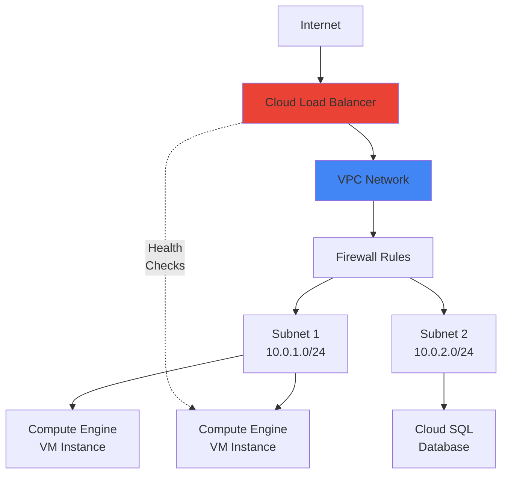
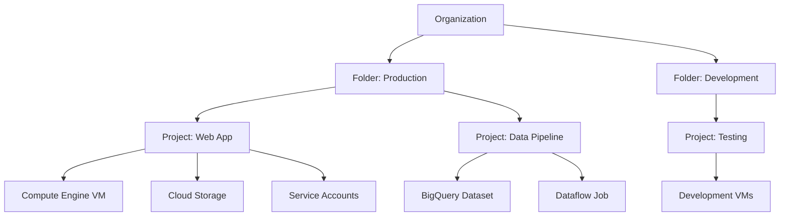

# GCP Fundamentals

## Global Infrastructure

Google Cloud Platform operates on a global infrastructure consisting of:

### Regions and Zones
- **Regions**: Geographical areas containing multiple zones (e.g., us-central1, europe-west1)
- **Zones**: Individual data centers within a region (e.g., us-central1-a, us-central1-b)
- **Multi-region**: Resources distributed across multiple geographic locations for high availability

### Availability and Redundancy
- Zones are independent failure domains
- Resources can be deployed across zones for fault tolerance
- Multi-zone deployments provide automatic failover capabilities

## Core Services Overview

### Compute Services

| Service | Use Case | Key Features |
|:--------|:---------|:-------------|
| **Compute Engine** | VMs and custom infrastructure | Full control, scalable, pay-per-second |
| **GKE** (Google Kubernetes Engine) | Container orchestration | Managed Kubernetes, auto-scaling, networking |
| **Cloud Run** | Serverless containers | Event-driven, auto-scaling, pay-per-request |
| **Cloud Functions** | Event-driven code | Serverless, trigger-based, minimal infrastructure |
| **App Engine** | Managed application platform | Fully managed, auto-scaling, language support |

### Storage Services

| Service | Type | Use Case |
|:--------|:-----|:---------|
| **Cloud Storage** | Object storage | Files, backups, static content, data lakes |
| **Persistent Disk** | Block storage | VMs, databases, high IOPS |
| **Filestore** | Managed NFS | Shared filesystems, legacy apps |

### GCP Network Architecture



### Networking Services

| Service | Function |
|:--------|:---------|
| **VPC (Virtual Private Cloud)** | Network isolation and security |
| **Cloud VPN** | Secure site-to-site connectivity |
| **Cloud Load Balancing** | Distribute traffic across instances |
| **Cloud Interconnect** | Dedicated network connection |
| **Cloud CDN** | Content delivery network |

### Identity and Access Management (IAM)

IAM enables fine-grained access control through:

- **Roles**: Bundles of permissions (Basic, Predefined, Custom)
- **Service Accounts**: Identity for applications and services
- **Members**: Users, service accounts, groups, and domains
- **Policies**: Bind members to roles with conditions

#### Role Hierarchy
1. **Basic Roles**: Owner, Editor, Viewer (deprecated for new projects)
2. **Predefined Roles**: Service-specific with granular permissions
3. **Custom Roles**: Tailored permissions for organizational needs

### GCP Resource Hierarchy



**Key Concepts:**
- **Organization**: Top-level container (optional)
- **Folders**: Logical groupings for organizational structure
- **Projects**: Resource containers for billing and access control
- **Resources**: Compute, storage, databases, etc.

## Security and Responsibility Model

Google manages:
- Physical security of hardware
- Infrastructure security
- Network infrastructure
- Data center operations

Customers manage:
- Identity and access control
- Data encryption (application-level)
- Network security policies
- API security
- Audit logging and monitoring

## Billing and Cost Management

### Cost Structure
- **Compute**: Charged per second/minute of usage
- **Storage**: Charged per GB per month
- **Network**: Ingress free, egress charges vary by region
- **Data transfer**: Between regions and to internet incur costs

### Cost Optimization
- **Committed Use Discounts (CUD)**: Reserve capacity for 1-3 years
- **Sustained Use Discounts (SUD)**: Automatic discounts for long-running resources
- **Preemptible VMs**: Lower-cost, interruptible instances
- **Free tier**: Always-free services with monthly quotas

### Billing Controls
- Set budgets and alerts
- Export billing data to BigQuery
- Analyze costs by project, service, region
- Use the Cost Management tools in Cloud Console

## Cloud Marketplace

The Cloud Marketplace provides:
- Pre-built solutions and templates
- Third-party applications
- SaaS solutions
- Open-source software
- Professional services

## Hands-on Exercises

### Exercise 1: Create a Compute Engine Instance
```bash
# Set your project
gcloud config set project PROJECT_ID

# Create a VM instance
gcloud compute instances create my-instance \
  --image-family ubuntu-2004-lts \
  --image-project ubuntu-os-cloud \
  --zone us-central1-a \
  --machine-type e2-medium

# Connect via SSH
gcloud compute ssh my-instance --zone us-central1-a

# List instances
gcloud compute instances list

# Delete the instance
gcloud compute instances delete my-instance --zone us-central1-a
```

### Exercise 2: Create a Cloud Storage Bucket
```bash
# Create a bucket (must be globally unique)
gsutil mb gs://my-unique-bucket-name/

# Upload a file
gsutil cp local-file.txt gs://my-unique-bucket-name/

# Download a file
gsutil cp gs://my-unique-bucket-name/local-file.txt .

# List bucket contents
gsutil ls gs://my-unique-bucket-name/

# Delete the bucket
gsutil rm -r gs://my-unique-bucket-name/
```

### Exercise 3: Assign IAM Roles
```bash
# Grant a user Editor role on a project
gcloud projects add-iam-policy-binding PROJECT_ID \
  --member=user:user@example.com \
  --role=roles/editor

# Grant a service account Compute Instance Admin role
gcloud projects add-iam-policy-binding PROJECT_ID \
  --member=serviceAccount:sa@PROJECT_ID.iam.gserviceaccount.com \
  --role=roles/compute.admin

# View IAM policy
gcloud projects get-iam-policy PROJECT_ID

# Remove a role
gcloud projects remove-iam-policy-binding PROJECT_ID \
  --member=user:user@example.com \
  --role=roles/editor
```

### Exercise 4: Create a Service Account
```bash
# Create service account
gcloud iam service-accounts create my-service-account \
  --display-name="My Service Account"

# Grant roles to service account
gcloud projects add-iam-policy-binding PROJECT_ID \
  --member=serviceAccount:my-service-account@PROJECT_ID.iam.gserviceaccount.com \
  --role=roles/compute.admin

# Create and download a key
gcloud iam service-accounts keys create key.json \
  --iam-account=my-service-account@PROJECT_ID.iam.gserviceaccount.com

# Authenticate with the service account
gcloud auth activate-service-account --key-file=key.json
```

### Exercise 5: Enable APIs
```bash
# List available services
gcloud services list --available

# Enable an API
gcloud services enable compute.googleapis.com
gcloud services enable storage.googleapis.com
gcloud services enable container.googleapis.com

# List enabled APIs
gcloud services list --enabled

# Disable an API
gcloud services disable compute.googleapis.com
```

## Key Takeaways

- GCP uses regions and zones for global resource deployment
- The resource hierarchy (Organization > Folder > Project > Resource) enables scalable management
- IAM provides granular access control through roles, members, and service accounts
- Understanding the shared security responsibility model is critical
- Billing controls and cost optimization tools help manage expenses
- The gcloud CLI is essential for automation and infrastructure-as-code

## Review Questions

1. What is the difference between a region and a zone in GCP?
2. How does the IAM role hierarchy work?
3. Name three ways to reduce costs on GCP.
4. What are the components of a resource hierarchy in GCP?
5. Which party is responsible for data encryption in GCP?
