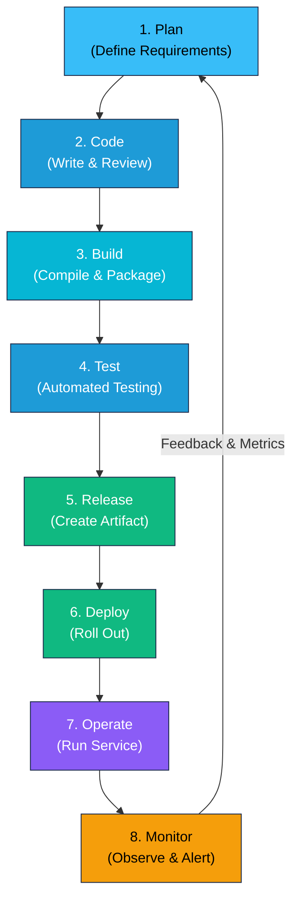
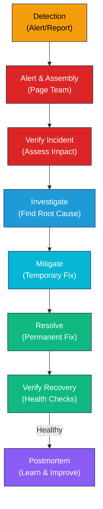

# DevOps Practices

Learn the hands-on techniques and practices that implement DevOps culture.

## DevOps Infinity Loop

### Continuous Cycle of Improvement



:::info This Guide Covers
CI/CD pipelines, deployment strategies, observability, incident management, and advanced practices like GitOps and chaos engineering.
:::

## Continuous Integration (CI)

**Continuous Integration** is the practice of integrating code changes frequently (multiple times per day) with automated testing.

### Core Principles

- **Integrate Frequently**: Merge to main branch multiple times daily
- **Automated Tests**: Run comprehensive tests on every commit
- **Build Automation**: Automated builds on every change
- **Fast Feedback**: Developers get results within minutes
- **Self-Testing Code**: Developers write and maintain tests

### CI Pipeline Stages

```
Commit → Compile → Unit Tests → Integration Tests → Code Quality → Artifact Build
```

### Best Practices for CI

1. **Commit to Main Branch Frequently**
   - Reduces merge conflicts
   - Enables small, reviewable changes
   - Catches issues earlier
   - Minimum: daily commits per developer

2. **Automated Tests**
   - Unit tests for individual components
   - Integration tests for component interactions
   - Contract tests for API boundaries
   - Aim for 80%+ code coverage minimum

3. **Build Every Commit**
   - Trigger build on every push to main
   - Fail fast on compilation errors
   - Provide immediate feedback to developers

4. **Quick Feedback Loop**
   - Target: Build and test in `< 10` minutes
   - Allows developers to stay in flow
   - Enables multiple integrations per day

5. **Artifact Management**
   - Version artifacts with commit SHA
   - Tag stable build artifacts
   - Immutable artifacts for traceability

### Tools for CI

- **Jenkins**: Flexible, plugin-rich automation server
- **GitHub Actions**: Native to GitHub, simple workflow syntax
- **GitLab CI/CD**: Integrated with GitLab repositories
- **CircleCI**: Cloud-native CI with good caching
- **Travis CI**: Simple YAML configuration

## Continuous Delivery (CD)

**Continuous Delivery** means every code change is potentially deployable to production after passing automated tests.

### Key Difference: CI vs CD vs Continuous Deployment

| Aspect | CI | CD (Delivery) | Continuous Deployment |
|:-------|:---|:--|:--|
| **Frequency** | Multiple times per day | Every commit is production-ready | Automatic production release |
| **Manual Step** | Build automated | Deploy automated, release manual | Everything automated |
| **Risk** | Catches integration issues | High confidence but controlled release | Highest velocity, requires excellent testing |

### Deployment Pipeline Architecture

A deployment pipeline is the automated path from code to production:

```
Developer Push → CI Build → Test Stages → Staging Deploy → Manual Approval → Production Deploy
```

### Pipeline Stages

1. **Build Stage**
   - Compile code
   - Run unit tests
   - Check code quality and security
   - Create artifact

2. **Test Stage**
   - Integration tests
   - Contract tests
   - Performance tests
   - Security scanning

3. **Staging Environment**
   - Deploy to production-like environment
   - Run smoke tests
   - Verify infrastructure
   - Human approval (for Continuous Delivery)

4. **Production Deployment**
   - Deploy using chosen strategy (blue-green, canary, etc.)
   - Health checks and smoke tests
   - Automated rollback on failure

### Repeatable Deployment Process

- **Infrastructure as Code**: Environments are reproducible and version-controlled
- **Idempotent Deployments**: Running deploy multiple times produces same result
- **Automated Verification**: Health checks, smoke tests, automated rollback
- **Version Everything**: Code, infrastructure, configuration, data migrations

## Deployment Strategies

Different strategies for rolling out new versions with varying risk/speed tradeoffs.

### 1. Blue-Green Deployment

**Concept**: Maintain two identical production environments; switch traffic between them.

```
Blue (current) ← Traffic → Switch → Green (new version)
```

**Advantages:**
- Instant rollback (switch traffic back)
- Full testing of new version in production environment
- Zero downtime deployment

**Disadvantages:**
- Double infrastructure costs
- Database migrations require special handling
- Not suitable for gradual rollouts

**Use Case**: Applications where you want instant rollback capability

### 2. Canary Deployment

**Concept**: Roll out new version to a small percentage of users first; gradually increase percentage.

```
Version A (old) ← 95% traffic
Version B (new) ← 5% traffic → Monitor → 50% → 100%
```

**Advantages:**
- Detect issues with real traffic before full rollout
- Minimal blast radius if problems occur
- Gradual ramp-up builds confidence

**Disadvantages:**
- Requires sophisticated traffic routing
- Gradual rollout takes longer
- Monitoring must be excellent to detect issues early

**Use Case**: High-traffic applications where issues could impact many users

### 3. Rolling Deployment

**Concept**: Replace instances incrementally until all are running new version.

```
Instance 1: Version A → Version B
Instance 2: Version A → Version B (after 1 becomes healthy)
Instance 3: Version A → Version B
Instance 4: Version A → Version B
```

**Advantages:**
- Gradual resource transition
- No duplicate infrastructure needed
- Relatively simple to implement

**Disadvantages:**
- Multiple versions running simultaneously
- Harder to rollback completely
- Database schema changes more complex

**Use Case**: Stateless applications with load balancing

### 4. Feature Flags (Feature Toggles)

**Concept**: Deploy code but control feature availability at runtime via configuration.

```
Deploy Feature X to Production (disabled by default)
  → Test in production
  → Enable for 10% of users
  → Monitor metrics
  → Gradually increase percentage
  → Enable for all users
```

**Advantages:**
- Decouple deployment from release
- Instant "rollback" by disabling flag
- A/B testing and gradual rollout
- Kill switches for problematic features

**Disadvantages:**
- Code complexity (must support multiple versions)
- Flag management overhead
- Storage and performance considerations

**Use Case**: Feature releases with uncertainty about impact

### 5. Shadow Deployment

**Concept**: Route traffic to both old and new versions; use new version's output for testing only.

```
Request → Old Version (return result to user)
       → New Version (process but discard result) — Monitor
```

**Advantages:**
- Test new version with real production traffic
- Zero risk (user never sees new version)
- Real-world performance metrics

**Disadvantages:**
- Double processing cost
- Complex to set up
- Not suitable for all application types

**Use Case**: Critical systems where you want to validate new version extensively

## Monitoring and Observability

**Monitoring** answers "Is the system working?" while **Observability** answers "Why is it not working?"

### Observability Pillars

#### 1. Metrics

Quantitative measurements over time.

- **System Metrics**: CPU, memory, disk, network
- **Application Metrics**: Requests/sec, error rate, latency
- **Business Metrics**: Orders processed, revenue, user signups

**Tools**: Prometheus, Grafana, InfluxDB, Datadog

**Key Metrics**:
- Request rate (requests per second)
- Error rate (percentage of requests with errors)
- Latency (response time at p50, p95, p99)
- Saturation (how full are resources?)

#### 2. Logs

Discrete events and contextual information.

- **Application Logs**: What is the code doing?
- **System Logs**: What is the OS and infrastructure doing?
- **Audit Logs**: Who did what and when?

**Tools**: ELK Stack (Elasticsearch, Logstash, Kibana), Splunk, CloudWatch Logs

**Best Practices**:
- Structured logging (JSON format with keys)
- Consistent log levels (DEBUG, INFO, WARN, ERROR)
- Include correlation IDs for tracing requests
- Don't log sensitive data (passwords, tokens)

#### 3. Traces

Request flow through distributed systems.

- Show how a request moves through microservices
- Identify latency bottlenecks
- Track asynchronous operations

**Tools**: Jaeger, Zipkin, DataDog APM, AWS X-Ray

**Example**:
```
User Request
  → API Gateway (10ms)
  → Auth Service (50ms)
  → Product Service (100ms)
  → Inventory Service (80ms)
  → Payment Service (200ms)
Total: 440ms
```

### Alerting Strategy

Effective alerting prevents alert fatigue while catching real issues.

**Levels of Alerts**:
- **Critical**: Page on-call engineer immediately (SLA violation, data loss risk)
- **High**: Create ticket, notify team (service degradation, high error rate)
- **Medium**: Log for review (unusual patterns, performance degradation)
- **Low**: Ignore (expected operational events)

**Alerting Best Practices**:
- Alert on symptoms, not causes (alert on high latency, not high CPU)
- Include context and remediation steps in alert
- Use runbooks to guide incident response
- Tune alerts to reduce false positives
- Practice incident response regularly

## Incident Management

Structured processes for responding to and learning from production issues.

### Incident Response Flow



### Incident Severity Levels

| Level | Example | Response Time | On-Call | Escalation |
|:------|:--------|:---|:---|:---|
| **Critical (SEV1)** | Complete service outage | Immediate | Page on-call | Executive notification |
| **High (SEV2)** | Partial degradation, SLA at risk | Under 15 min | Page on-call | Team lead |
| **Medium (SEV3)** | Minor functionality issue | Under 1 hour | Email notification | Team lead |
| **Low (SEV4)** | Minor, workaround exists | Under 4 hours | Ticket tracking | Team |

### Incident Response Process

1. **Detection**
   - Monitoring alert triggers
   - Customer report
   - Internal observation

2. **Alert & Assembly**
   - Alert on-call engineer
   - Declare severity level
   - Assemble response team
   - Establish communication channel

3. **Initial Response**
   - Verify the incident
   - Assess impact (customers, revenue, data)
   - Begin initial diagnosis
   - Communicate status updates

4. **Investigation & Mitigation**
   - Identify root cause
   - Implement temporary fix if needed
   - Prevent further spread or data loss
   - Restore service to normal state

5. **Recovery**
   - Monitor for stability
   - Verify affected systems
   - Communicate all-clear to stakeholders
   - Close incident ticket

6. **Post-Incident**
   - Blameless postmortem (within 24 hours)
   - Document root causes
   - Create action items to prevent recurrence
   - Track and complete action items

### On-Call Best Practices

- **Reasonable Coverage**: Not 24/7 for everyone; rotate schedules
- **Clear Escalation**: Know who to page and when
- **Runbooks**: Pre-written response procedures for common issues
- **Practice**: Regularly practice incident response
- **Feedback**: Share lessons learned with the team
- **Limits**: Protect on-call engineers from burnout

## GitOps

**GitOps** uses Git as the single source of truth for infrastructure and application state.

### GitOps Principles

1. **Declarative**: Entire system state described in Git
2. **Versioned & Immutable**: All changes tracked with full history
3. **Pulled Automatically**: Operators watch Git and apply changes
4. **Continuously Reconciled**: System always matches Git state

### GitOps Workflow

```
Developer commits configuration to Git
  → Webhook triggers
  → GitOps operator (ArgoCD, Flux) detects change
  → Operator applies manifests to cluster
  → System state matches Git
```

### Benefits

- **Audit Trail**: All changes in Git history
- **Easy Rollback**: Revert commit, system rolls back
- **Disaster Recovery**: Full state in Git
- **Approval Process**: Pull request reviews before production changes
- **Familiar Workflow**: Uses Git, not custom deployment tools

### Tools

- **ArgoCD**: Kubernetes-native GitOps
- **Flux**: Event-driven automation for Kubernetes
- **Helm with Git**: Package management + GitOps

## Chaos Engineering

**Chaos Engineering** is the practice of intentionally injecting failures to test system resilience.

### Objectives

- Verify system resilience to failures
- Identify weak points before customers experience them
- Build confidence in automated recovery
- Learn how systems behave under stress

### Types of Chaos Experiments

#### 1. Infrastructure Chaos
- Kill random instances
- Introduce network latency
- Cause resource exhaustion (CPU, memory)
- Simulate disk failures

#### 2. Dependency Chaos
- Fail downstream service
- Introduce error rates
- Slow down API responses
- Cause cascading timeouts

#### 3. Data Chaos
- Corrupt data
- Introduce inconsistencies
- Simulate database failures
- Test data recovery

### Chaos Engineering Process

1. **Establish Baseline**: Measure normal system behavior
2. **Hypothesize**: "If X fails, Y should still work"
3. **Design Experiment**: What will we inject and monitor?
4. **Run in Staging**: Test with real-world-like setup first
5. **Observe**: What happens? Does it match hypothesis?
6. **Improve**: Fix any failures or gaps
7. **Run in Production**: Low-traffic hours, limited blast radius
8. **Learn & Share**: Document findings and improvements

### Tools

- **Chaos Monkey**: Kill random production instances
- **Gremlin**: Comprehensive chaos engineering platform
- **Pumba**: Chaos for Docker containers
- **Locust**: Load testing and chaos simulation

### Best Practices

- Start small: Test non-critical paths first
- Clear communication: Team knows experiment is running
- Automated rollback: Have kill switch ready
- Scheduled runs: Control blast radius and timing
- Build learning culture: Share results, don't blame

## Exercises & Practices

### Exercise 1: Design a Deployment Pipeline
**Objective**: Create a complete CI/CD pipeline design

1. Define your application:
   - Monolith or microservices?
   - Stateful or stateless?
   - Database changes required?

2. Design pipeline stages:
   - What tests at each stage?
   - Performance/load test criteria?
   - Production readiness checklist?

3. Choose deployment strategy:
   - Why blue-green vs canary vs rolling?
   - What monitoring will you use?
   - Rollback strategy?

4. Create runbook:
   - What to do if deployment fails?
   - How to quickly rollback?
   - Who to notify?

### Exercise 2: Build Observability Stack
**Objective**: Set up comprehensive monitoring

1. Collect metrics:
   - Configure Prometheus or similar
   - Define key metrics to track
   - Set up Grafana dashboards

2. Centralize logs:
   - Send application logs to ELK or similar
   - Use structured logging
   - Create useful log queries

3. Implement tracing:
   - Set up Jaeger or similar
   - Instrument applications
   - Trace a sample request end-to-end

4. Create alerts:
   - Define critical, high, medium thresholds
   - Write clear alert messages
   - Test alert routing

### Exercise 3: Run Chaos Experiment
**Objective**: Practice chaos engineering

1. Pick a non-critical service
2. Hypothesize: "If X fails, system should Y"
3. Design experiment: Kill an instance, slow down API, etc.
4. Run in staging first
5. Observe and document:
   - What actually happened?
   - Did it match hypothesis?
   - What failed?
6. Improve: Fix any resilience gaps
7. Write report: Share learnings

### Exercise 4: Incident Simulation
**Objective**: Practice incident response

1. Create a fictional incident scenario
2. Assemble response team
3. Go through incident response process:
   - Detection and alert
   - Initial diagnosis
   - Mitigation steps
   - Recovery verification
4. Conduct postmortem:
   - What went well?
   - What could improve?
   - Action items?
5. Document learnings

## Key Takeaways

- **CI/CD Enables Confidence**: Frequent, automated deployments reduce risk
- **Choose Strategy Wisely**: Blue-green, canary, and rolling each have tradeoffs
- **Observability Requires Three Pillars**: Metrics, logs, and traces together provide insight
- **Incident Management is a Skill**: Practice and refinement make teams better
- **GitOps Provides Control**: Git as single source of truth enables safety and auditability
- **Chaos Engineering Builds Resilience**: Intentional failure testing reveals and fixes weaknesses

## Next Steps

- Set up a deployment pipeline for a project
- Implement comprehensive monitoring and alerting
- Run a chaos engineering experiment
- Practice incident response with your team
- Read: [Release It!](https://pragprog.com/titles/mnee2/release-it-second-edition/) by Michael Nygard
