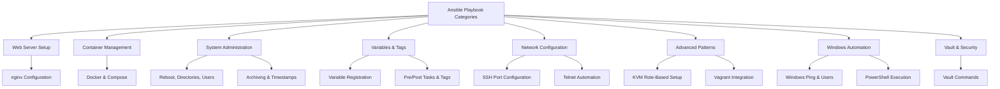

# Ansible Playbook Examples

This page showcases practical, real-world Ansible playbook examples organized by use case. Each example includes the full YAML code and brief explanations to help you understand and adapt them for your infrastructure automation needs.



---

## 1. Web Server Setup

### Nginx Configuration and Deployment

This playbook installs nginx, configures virtual hosts, manages symbolic links, and deploys static website content.

```yaml
---
- hosts:
  become: true
  tasks:

  - name: Checking nginx is at the latest version
    apt: name=nginx state=latest

  - name: starting nginx service
    service:
      name: nginx
      state: started

  - name: nginx config file copy and service restart
    copy:
      src: /home/foo/static_site.cfg
      dest: /etc/nginx/sites-available/static_site.cfg

  - name: creating symbolic-link
    file:
      src: /etc/nginx/sites-available/static_site.cfg
      dest: /etc/nginx/sites-enabled/default
      state: link

  - name: Copying the content of the web site of just copy index.html
    copy:
      src: /home/foo/static-site-src/
      dest: /home/foo/static-site

  - name: restarting the nginx service
    service:
      name: nginx
      state: restarted
```

**Key Concepts:**
- Uses `become: true` for elevated privileges
- Manages package updates with `apt` module
- Handles service lifecycle with `service` module
- Creates symbolic links for site configuration
- Copies static content to web root

---

## 2. Container Management

### Docker and Docker Compose Installation

This playbook automates Docker and Docker Compose installation on CentOS, with checks to skip reinstallation if already present.

```yaml
---
- name: Install Docker and Docker Compose on CentOS
  hosts: '{{ host }}'
  become: true

  tasks:
    - name: Upgrade all packages
      yum: name=* state=latest

    - name: Check if Docker is installed
      command: systemctl status docker
      register: docker_check
      ignore_errors: yes

    - name: Download the Docker installer
      get_url:
        url: https://get.docker.com/
        dest: /root/install_docker.sh
        mode: 0700
      when: docker_check.stderr.find('service could not be found') != -1

    - name: Install Docker
      shell: /root/install_docker.sh
      when: docker_check.stderr.find('service could not be found') != -1

    - name: Remove the Docker installer file.
      file:
        state: absent
        path: /root/install_docker.sh

    - name: Enable the Docker daemon in systemd
      systemd:
        name: docker
        enabled: yes
        masked: no

    - name: Start the Docker daemon
      systemd:
        name: docker
        state: started
        masked: no

    - name: Check if Docker Compose is installed
      command: docker-compose --version
      register: docker_compose_check
      ignore_errors: yes

    - name: Download and install Docker Compose
      get_url:
        url: https://github.com/docker/compose/releases/download/1.24.0/docker-compose-Linux-x86_64
        dest: /usr/bin/docker-compose
        mode: 0755
      when:
        - docker_compose_check.msg is defined
        - docker_compose_check.msg.find('No such file or directory') != -1

    - name: Clone repo
      git:
        repo: https://github.com/syedsaadahmed/DevOps-Homework.git
        dest: /home
```

**Key Concepts:**
- Uses `register` to capture command output for conditional logic
- Leverages `ignore_errors: yes` to handle expected failures
- Downloads and executes installation scripts
- Manages systemd services with proper enablement
- Clones git repositories for application deployment

---

## 3. System Administration

### Server Reboot with Wait

Demonstrates asynchronous task execution, server reboot, and waiting for the server to come back online.

```yaml
---
- hosts:
  become: true
  tasks:

  - name: restart server
    shell: sleep 2 && shutdown -r now "Ansible updates triggered"
    async: 1
    poll: 0
    ignore_errors: true

  - name: waiting for the server to come back
    local_action: wait_for host=testcentos state=started delay=30 timeout=300
```

**Key Concepts:**
- `async: 1` runs the command asynchronously
- `poll: 0` means fire-and-forget (don't wait for result)
- `local_action` executes on the control machine (where Ansible runs)
- `wait_for` pauses execution until the server responds

### Create Multiple Directories

Uses the `with_items` loop to create multiple directories in a single task.

```yaml
---
- hosts:
  become: true
  tasks:
  - name: Creating multiple directories
    file: path={{item}} state=directory
    with_items:
    - '/home/ansible/dir1'
    - '/home/ansible/dir2'
    - '/home/ansible/dir3'
```

**Key Concepts:**
- `with_items` iterates over a list
- Single task definition applies to all items
- More efficient than multiple similar tasks

### User Management: Create and Delete

Creates a user, then demonstrates user removal in subsequent tasks.

```yaml
---
- hosts:
  become: true
  tasks:
  - name: Creating the User
    user: name=testuser password=testuser123 groups=ansible shell=/bin/bash

  - name: Removing the User
    user: name=testuser state=absent remove=yes force=yes
```

**Key Concepts:**
- `user` module handles account creation and deletion
- `state: absent` removes the user
- `remove: yes` deletes the home directory
- `force: yes` forces removal even if user is logged in

### Date and Timestamp Operations

Captures system date/time facts and creates timestamped files.

```yaml
---
- hosts:
  become: true
  tasks:

  - name: Date and Time Display
    debug:
     var=ansible_date_time.date

  - name: Date and Time Example in Ansible
    debug:
     var=ansible_date_time.time

  - name: Timestamp example with file
    command: touch helloworld{{ansible_date_time.date}}.log
```

**Key Concepts:**
- `ansible_date_time` is a built-in fact
- Access specific components like `.date` and `.time`
- Use Jinja2 templating to embed variables in commands

### File Archiving

Creates ZIP archives of single files, multiple files, and entire directories.

```yaml
---
- hosts: all
  become: true
  tasks:

  - name: Ansible zip file example
    archive:
     path: /home/ansible/helloworld.txt
     dest: /home/ansible/helloworld.zip
     format: zip

  - name: Ansible zip multiple files example
    archive:
     path:
      - /home/ansible/helloworld1.txt
      - /home/ansible/helloworld.txt
     dest: /home/ansible/helloworld.zip
     format: zip

  - name: Ansible zip directory example
    archive:
     path:
      - /home/ansible
     dest: /home/ansible/helloworld.zip
     format: zip
```

**Key Concepts:**
- `archive` module supports various formats (zip, tar, gz, bz2, xz)
- Can archive single files or lists of files
- `dest` specifies the output archive path

---

## 4. Variables and Tags

### Variable Registration and Declaration

Demonstrates variable declaration, arrays, and capturing command output with `register`.

```yaml
---
# Basic variable declaration
- hosts: all
  vars:
    name: hellowolrd
  tasks:
  - name: Variable Example Basic
    debug:
     msg: "{{ name }}"

# Array variable example
- hosts: all
  vars:
    name:
      - helloworld
      - pythonworld
  tasks:
  - name: Ansible Array Example
    debug:
     msg: "{{ name[1] }}"

# Register variable to capture command output
- hosts: all
  tasks:
  - name: Ansible register variable basic example
    shell: "find *.txt"
    args:
     chdir: "/home/Ansible"
    register: reg_output
  - debug:
     var: reg_output
```

**Key Concepts:**
- `vars` block defines playbook variables
- Variables are accessed with `{{ variable_name }}`
- Arrays are indexed starting from 0
- `register` captures task output for later use
- Registered variables can be used in subsequent tasks

### Pre/Post Tasks and Tags

Executes setup tasks before and cleanup tasks after main tasks; demonstrates selective execution with tags.

```yaml
---
# Pre-tasks and post-tasks with tags
- hosts:
  become: true
  name: Post, Pre tasks and Tags
  tags:
     - helloworld
  pre_tasks:
  - debug: msg="task with tag - helloworld"
  tasks:
   - name: Execute of main task
     debug: msg="now in our node"
  post_tasks:
  - debug: msg="task with tag - helloworld"

# Separate play without tags
  - name: Go without tags
    hosts: localhost
    become: true
    tasks:
    - name: Command for files list
      shell: ls -lrt > helloworld.txt
```

**Usage Examples:**

```bash
# List all available tags
ansible-playbook preposttagseg.yml --list-tags

# Run only tasks with specific tag
ansible-playbook preposttagseg.yml --tags helloworld

# Skip tasks with specific tag
ansible-playbook preposttagseg.yml --skip-tags helloworld
```

**Key Concepts:**
- `pre_tasks` run before `tasks`
- `post_tasks` run after all tasks
- `tags` allow selective task execution
- Tags can be applied at play or task level

---

## 5. Network Configuration

### SSH Port Configuration

Modifies SSH configuration, restarts the service on a new port, and updates Ansible's connection port.

```yaml
---
- name: Setup alternate SSH port
  lineinfile:
    dest: "/etc/ssh/sshd_config"
    regexp: "^Port"
    line: "Port 10786"

- name: restart server
  shell: sleep 2 && shutdown -r now "Ansible updates triggered"
  async: 1
  poll: 0
  become: true
  ignore_errors: true

- name: waiting for the server to come back
  local_action: wait_for host={{ KvmIP }} port=10786 state=started delay=30 timeout=300
  sudo: false

- name: Changed SSH Port
  set_fact:
    ansible_port: 10786
```

**Key Concepts:**
- `lineinfile` modifies configuration files line-by-line
- `regexp` matches the line to replace
- `set_fact` updates Ansible variables for subsequent connections
- Critical to update `ansible_port` after changing SSH configuration

### Telnet Automation with Expect

Demonstrates interactive telnet login and command execution using the `expect` module.

```yaml
---
- name: Telnet {{ hostname }}
  ignore_errors: yes
  expect:
    timeout: 10
    command: telnet 127.0.0.1 10896
    responses:
     "Escape character is": "\n"
     "login:": "root"
     "password: ": "admin123"
     "# ":
       - conf
       - hostname {{ hostname }}
       - exit
       - save all
```

**Key Concepts:**
- `expect` module automates interactive commands
- `responses` maps prompts to expected input
- Useful for legacy systems without API access
- Multiple commands can be chained in sequence

---

## 6. Advanced Patterns

### KVM Setup with Roles

A role-based infrastructure setup that installs KVM, configures networking, and provisions virtual machines.

**Main Playbook (infra-setup.yml):**

```yaml
---

- hosts: "{{ host }}"
  roles:
        - { role: initial-server-setup }
        - { role: vm-setup }
```

**Initial Server Setup Role (initial-server-setup/tasks/main.yml):**

```yaml
- name: Installing the required software & other Dependencies
  become: yes
  yum:
    name: "{{ item }}"
    state: latest
  with_items:
    - libguestfs-tools
    - libvirt
    - qemu-kvm
    - virt-manager
    - virt-install
    - xorg-x11-apps
    - xauth
    - virt-viewer
    - libguestfs-xfs
  notify: enable_service

- name: Starting and enabling libvirtd service
  systemd:
    state: started
    daemon_reload: yes
    enabled: yes
    name: libvirtd

- name: Destroying Default Virtual Network
  virt_net:
    command: destroy
    name: default

- name: Undefining Default Virtual Network
  virt_net:
    command: undefine
    name: default

- name: Restarting Libvirtd service
  systemd:
    state: restarted
    daemon_reload: yes
    name: libvirtd

- name: Disabling unwanted services on server
  service:
    name: "{{ item }}"
    enabled: no
    state: stopped
  with_items:
    - firewalld
    - firewalld
    - NetworkManager
    - NetworkManager
    - ntpd
    - ntpd
    - postfix
    - postfix
    - chronyd
    - chronyd
    - avahi-daemon
    - avahi-daemon
    - dhclient

- name: Disable SELinux on server
  selinux: state=disabled

- name: Setup alternate SSH port
  lineinfile:
    dest: "/etc/ssh/sshd_config"
    regexp: "^Port"
    line: "Port 10896"

- name: restart server
  shell: sleep 2 && shutdown -r now "Ansible updates triggered"
  async: 1
  poll: 0
  become: true
  ignore_errors: true

- name: waiting for the server to come back
  local_action: wait_for host={{ baseServerIP }} port=10896 state=started delay=30 timeout=300
  sudo: false

- name: Changed SSH Port
  set_fact:
    ansible_port: 10896

- name: Initializing performance parameters
  raw: sysctl -p
```

**VM Setup Role (vm-setup/tasks/main.yml):**

```yaml

- name: Getting server Template
  command: mv /root/DevOps-Homework/VM_IMAGE/centos7-minimal.qcow2 /home/kvm/images/

- name: System preparation is running on Template
  command: virt-sysprep -a /home/kvm/images/centos7-minimal.qcow2

- name: provisioning Server
  command: virt-install -n {{ KVMHostname }}
           --ram 2048 \
           --vcpus 2 \
           --os-type linux \
           --os-variant rhel7 \
           --import \
           --disk path=/home/kvm/images/centos7-minimal.qcow2,device=disk,bus=virtio,format=qcow2 \
           --network bridge=br0 \
           --graphics none \
           --serial tcp,host=127.0.0.1:7001,mode=bind,protocol=telnet

- name: "Starting {{ KVMHostname }} Server"
  pause:
    seconds: 40

- name: Configuring {{ KVMHostname }}
  ignore_errors: yes
  expect:
    command: telnet 127.0.0.1 7001
    timeout: 30
    responses:
      "Escape character is": "root"
      "Password: ": "abc123+"
      "# ":
        - cd /root/DevOps-Homework/
        - docker-compose up -d --build
```

**Key Concepts:**
- Roles organize tasks into reusable components
- `virt_net` and `virt_install` manage KVM resources
- `pause` adds delays for system initialization
- `expect` automates interactive guest configuration

### Vagrant Integration with Ansible

**Vagrantfile:**

```ruby
Vagrant.configure("2") do |config|
  config.vm.box = "ubuntu/trusty64"   # Specifies the base Ubuntu Vagrant image
  config.vm.hostname = "web"          # Sets the target name for the Ansible playbook

  # Port forwarding configuration
  config.vm.network "forwarded_port", guest: 80, host: 8080     # Forwards port 80 from the VM to port 8080 on your local machine

  # Ansible provisioning
  config.vm.provision "ansible_local" do |a|
    a.playbook = "apache.yaml"  # Specifies the Ansible playbook to run (replace with your playbook filename)
  end

    #Add more provisioning blocks for additional playbooks
    #  config.vm.provision "ansible_local" do |a|
    #    a.playbook = "playbook2.yaml"  # Specifies the second Ansible playbook to run
    #  end

end
```

**Ansible Playbook (apache.yaml):**

```yaml
---
- hosts: all
  become: true
  gather_facts: false
  tasks:
    - name: Update apt cache
      apt:
        update_cache: yes

    - name: Install Apache
      apt:
        name: apache2
        state: present

    - name: Start Apache service
      service:
        name: apache2
        state: started
        enabled: yes   # Auto-start Apache on system boot
```

**Key Concepts:**
- Vagrant automates VM provisioning with `vagrant up`
- `ansible_local` runs Ansible inside the guest VM
- Port forwarding maps guest ports to host
- Ansible playbooks can be chained for complex setups

---

## 7. Windows Automation

### Windows Ping Test

Basic connectivity test for Windows hosts using the Windows-specific `win_ping` module.

```yaml
---
- name: Ping windows host
  hosts: win_host
  tasks:
  - name: ping win_host
    win_ping:
```

**Key Concepts:**
- `win_ping` is the Windows equivalent of `ping`
- Requires WinRM configured on Windows hosts
- No arguments needed for basic connectivity check

### Windows User Creation

Creates a local user on Windows systems with specified password and state.

```yaml
---
- name: Add a user
  hosts: win_host
  tasks:
  - name: Add User
    win_user:
      name: testuser
      password: "test123"
      state: present
```

**Key Concepts:**
- `win_user` module manages Windows local accounts
- `state: present` creates the user
- `state: absent` removes the user
- Passwords must meet Windows complexity requirements

### Windows IP Configuration

Executes `ipconfig` command and displays network configuration.

```yaml
---
- name: ipconfig module
  hosts: win_hosts
  tasks:
    - name: run ipconfig
      raw: ipconfig
      register: ipconfig
    - debug: var=ipconfig
```

**Key Concepts:**
- `raw` module executes arbitrary commands without parsing
- Windows-specific commands work with `raw` module
- Output is captured and displayed with `debug`

---

## 8. Ansible Vault (Secrets Management)

Vault encrypts sensitive files like passwords, API keys, and inventory files containing credentials.

### Create Encrypted Files

```bash
# Create a new encrypted file
ansible-vault create secrets.yml

# Encrypt an existing YAML file
ansible-vault encrypt inventory.yml
```

### View and Edit Encrypted Files

```bash
# View encrypted file (prompts for password)
ansible-vault view secrets.yml

# Edit encrypted file
ansible-vault edit secrets.yml

# Change vault password
ansible-vault rekey secrets.yml
```

### Execute Playbooks with Vault

```bash
# Prompt for vault password at runtime
ansible-playbook playbook.yml --ask-vault-pass

# Use password from file (file contains only the password)
ansible-playbook playbook.yml --vault-password-file ./vault-pass.txt

# Use password from script (script outputs password to stdout)
ansible-playbook playbook.yml --vault-password-file ./vault-pass.py
```

### Decrypting Files

```bash
# Decrypt vault file permanently
ansible-vault decrypt secrets.yml
```

**Best Practices:**
- Store vault passwords in secure password managers
- Use `.gitignore` to exclude vault password files from version control
- Rotate vault passwords regularly
- Use separate vault passwords for different environments

---

## Common Patterns and Tips

### Conditional Task Execution

```yaml
- name: Install package only if not already installed
  apt:
    name: nginx
    state: present
  when: "'nginx' not in ansible_packages"
```

### Loop Examples

```yaml
# Loop with list
- name: Create users
  user:
    name: "{{ item }}"
    state: present
  loop:
    - user1
    - user2
    - user3

# Loop with dictionary
- name: Configure services
  service:
    name: "{{ item.name }}"
    state: "{{ item.state }}"
  loop:
    - { name: 'nginx', state: 'started' }
    - { name: 'mysql', state: 'started' }
```

### Error Handling

```yaml
# Ignore errors for non-critical tasks
- name: Remove old packages
  apt:
    name: deprecated-package
    state: absent
  ignore_errors: yes

# Fail on specific conditions
- name: Check disk space
  shell: df -h / | awk 'NR==2 {print $5}'
  register: disk_usage
  failed_when: disk_usage.stdout | int > 90
```

### Handlers for Service Restarts

```yaml
handlers:
  - name: restart nginx
    service:
      name: nginx
      state: restarted

tasks:
  - name: Update nginx config
    copy:
      src: nginx.conf
      dest: /etc/nginx/nginx.conf
    notify: restart nginx
```

---

## Running Playbooks

```bash
# Basic execution
ansible-playbook playbook.yml

# With inventory file
ansible-playbook -i inventory.ini playbook.yml

# Target specific hosts
ansible-playbook playbook.yml --limit webservers

# Run specific tags
ansible-playbook playbook.yml --tags "deploy"

# Verbose output
ansible-playbook playbook.yml -vvv

# Dry run (check mode)
ansible-playbook playbook.yml --check
```

---

## Resources

- [Official Ansible Documentation](https://docs.ansible.com/)
- [Ansible Module Index](https://docs.ansible.com/ansible/latest/modules/modules_by_category.html)
- [Ansible Galaxy - Role Library](https://galaxy.ansible.com/)
- [Ansible Best Practices](https://docs.ansible.com/ansible/latest/user_guide/playbooks_best_practices.html)
