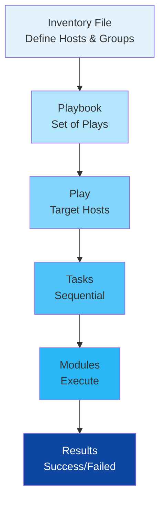

# Ansible Fundamentals

## What is Ansible?

Ansible is an open-source IT automation and configuration management platform built on Python. It simplifies provisioning, configuration management, application deployment, and task automation across infrastructure by using simple, human-readable automation language.

### Key Characteristics

- **Agentless**: No agents required on target systems (uses SSH/WinRM)
- **Simple**: YAML-based syntax, easy to learn
- **Powerful**: Orchestration and multi-tier deployments
- **Scalable**: Manages infrastructure at any scale
- **Idempotent**: Safe to run repeatedly with the same result

## Agentless Architecture

Ansible operates without installing software on managed nodes:

### Ansible Architecture Diagram

```mermaid
graph LR
    A["Control Node<br/>Ansible Host"]
    B["Inventory<br/>Hosts Groups"]
    C["Playbooks"]
    D["Roles"]

    A -->|"Reads"| B
    A -->|"Executes"| C
    C -->|"Uses"| D

    E["SSH Connection"]
    F["WinRM Connection"]

    A -->|"OpenSSH"| E
    A -->|"Windows RM"| F

    E --> G["Linux/Unix<br/>Target Node 1"]
    E --> H["Linux/Unix<br/>Target Node 2"]
    F --> I["Windows<br/>Target Node"]

    G -->|"Execute<br/>Modules"| J["Tasks"]
    H -->|"Execute<br/>Modules"| J
    I -->|"Execute<br/>Modules"| J

    J -->|"Return<br/>Results"| A

    style A fill:#1B2A4A
    style A color:#fff
    style B fill:#38BDF8
    style C fill:#38BDF8
    style D fill:#38BDF8
    style G fill:#e8f5e9
    style H fill:#e8f5e9
    style I fill:#e8f5e9
    style J fill:#fff9c4
```



### Execution Flow



**Advantages**:
- Minimal dependencies on target systems
- No background services consuming resources
- Easy bootstrapping of new servers
- Reduced attack surface

## Inventory Files

Inventory files define the hosts Ansible manages.

### INI Format

```ini
[webservers]
web1.example.com
web2.example.com
web3.example.com

[databases]
db1.example.com
db2.example.com

[all:vars]
ansible_user=ubuntu
ansible_private_key_file=~/.ssh/id_rsa
ansible_python_interpreter=/usr/bin/python3
```

### YAML Format

```yaml
all:
  children:
    webservers:
      hosts:
        web1.example.com:
        web2.example.com:
      vars:
        http_port: 80
    databases:
      hosts:
        db1.example.com:
        db2.example.com:
      vars:
        db_port: 5432
  vars:
    ansible_user: ubuntu
    ansible_private_key_file: ~/.ssh/id_rsa
```

### Host Variables

```yaml
servers:
  hosts:
    webserver:
      ansible_host: 192.168.1.10
      ansible_port: 2222
      app_env: production
```

## Ad-Hoc Commands

Run single tasks without playbooks.

```bash
# Ping hosts
ansible all -i inventory.ini -m ping

# Run shell command
ansible webservers -i inventory.ini -m shell -a "uptime"

# Copy file
ansible all -i inventory.ini -m copy -a "src=/local/path dest=/remote/path"

# Install package
ansible databases -i inventory.ini -m apt -a "name=postgresql state=present"

# Restart service
ansible webservers -i inventory.ini -m service -a "name=nginx state=restarted"

# Gather facts
ansible all -i inventory.ini -m setup
```

## Playbooks

Playbooks are YAML files defining a series of plays and tasks.

### Basic Playbook Structure

```yaml
---
- name: Configure web servers
  hosts: webservers
  gather_facts: yes
  vars:
    http_port: 80
    app_version: 1.0

  tasks:
    - name: Update system packages
      apt:
        update_cache: yes
      become: yes

    - name: Install nginx
      apt:
        name: nginx
        state: present
      become: yes

    - name: Start nginx service
      service:
        name: nginx
        state: started
        enabled: yes
      become: yes
```

### Playbook Execution

```bash
ansible-playbook -i inventory.ini site.yml
ansible-playbook -i inventory.ini site.yml -v          # Verbose
ansible-playbook -i inventory.ini site.yml --check     # Dry-run
ansible-playbook -i inventory.ini site.yml --tags web  # Run specific tags
```

## Roles

Roles organize playbooks into reusable components.

### Role Directory Structure

```
roles/
  webserver/
    tasks/
      main.yml          # Tasks definition
    handlers/
      main.yml          # Event handlers
    templates/
      nginx.conf.j2     # Jinja2 templates
    files/
      app.conf          # Static files
    vars/
      main.yml          # Variables
    defaults/
      main.yml          # Default variables
    meta/
      main.yml          # Role dependencies
```

### Using Roles in Playbooks

```yaml
---
- name: Deploy web application
  hosts: webservers

  roles:
    - webserver
    - { role: ssl, become: yes }
    - role: monitoring
      vars:
        monitoring_port: 9100
```

## Modules

Modules are the units of work in Ansible. Some common ones:

| Module | Purpose | Example |
|--------|---------|---------|
| `apt` / `yum` | Package management | Install, update packages |
| `copy` | Copy files | Local to remote |
| `file` | File/directory operations | Create, delete, permissions |
| `template` | Deploy Jinja2 templates | Config files with variables |
| `service` | Manage services | Start, stop, restart |
| `user` | User management | Create, modify users |
| `command` / `shell` | Execute commands | Run shell commands |
| `lineinfile` | Modify files | Edit specific lines |
| `git` | Git operations | Clone, pull repositories |
| `docker_container` | Docker management | Run containers |
| `debug` | Output debugging info | Print variables |

### Module Example

```yaml
- name: Configure system
  tasks:
    - name: Create application user
      user:
        name: appuser
        state: present
        shell: /bin/bash
        home: /home/appuser

    - name: Set file permissions
      file:
        path: /var/www/app
        owner: appuser
        group: appuser
        mode: '0755'
        state: directory
```

## Handlers

Handlers execute tasks only when notified by other tasks (event-driven).

```yaml
---
- name: Web server configuration
  hosts: webservers

  tasks:
    - name: Copy nginx config
      copy:
        src: nginx.conf
        dest: /etc/nginx/nginx.conf
      notify: restart nginx

    - name: Update app config
      template:
        src: app.conf.j2
        dest: /etc/app/config.conf
      notify:
        - restart app
        - send notification

  handlers:
    - name: restart nginx
      service:
        name: nginx
        state: restarted

    - name: restart app
      service:
        name: myapp
        state: restarted

    - name: send notification
      debug:
        msg: "Application configuration updated"
```

## Variables

Variables store dynamic values used throughout playbooks.

### Variable Definition

```yaml
---
- name: Variable demonstration
  hosts: all

  vars:
    web_servers: ['web1', 'web2', 'web3']
    config:
      port: 8080
      timeout: 30
      debug: true

  vars_files:
    - vars/common.yml
    - vars/secrets.yml

  tasks:
    - name: Display variables
      debug:
        msg: "Server port is {{ config.port }}"

    - name: Loop through list
      debug:
        msg: "Server: {{ item }}"
      loop: "{{ web_servers }}"
```

### Variable Sources (Priority Order)

1. Extra vars (`-e` flag)
2. Task vars
3. Block vars
4. Play vars
5. Role vars
6. Host facts
7. Inventory host vars
8. Inventory group vars
9. Role defaults

### Facts

Facts are system information gathered automatically:

```yaml
tasks:
  - name: Display system information
    debug:
      msg: |
        OS: {{ ansible_os_family }}
        Distribution: {{ ansible_distribution }}
        IP Address: {{ ansible_default_ipv4.address }}
        Processors: {{ ansible_processor_count }}
```

## Templates (Jinja2)

Jinja2 templating allows dynamic file generation.

### Template Example

**Template file (config.j2)**:

```jinja2
# Configuration for {{ app_name }}
server {
    listen {{ http_port }};
    server_name {{ server_name }};

    location / {
        proxy_pass http://localhost:{{ app_port }};
    }

    
    ssl_certificate {{ ssl_cert_path }};
    ssl_certificate_key {{ ssl_key_path }};
    
}
```

**Playbook task**:

```yaml
- name: Deploy application config
  template:
    src: config.j2
    dest: /etc/nginx/sites-available/app.conf
  vars:
    app_name: myapp
    server_name: app.example.com
    http_port: 80
    app_port: 3000
    enable_ssl: true
    ssl_cert_path: /etc/ssl/certs/app.crt
    ssl_key_path: /etc/ssl/private/app.key
```

## Conditionals

Execute tasks based on conditions.

```yaml
tasks:
  - name: Install nginx (Debian)
    apt:
      name: nginx
      state: present
    when: ansible_os_family == "Debian"

  - name: Install nginx (RedHat)
    yum:
      name: nginx
      state: present
    when: ansible_os_family == "RedHat"

  - name: Create directory if not exists
    file:
      path: /var/myapp
      state: directory
    when: not ansible_check_mode

  - name: Configure based on host group
    set_fact:
      app_env: production
    when: inventory_hostname in groups['prod']
```

## Loops

Iterate over lists or dictionaries.

```yaml
tasks:
  - name: Install multiple packages
    apt:
      name: "{{ item }}"
      state: present
    loop:
      - nginx
      - git
      - curl

  - name: Create multiple users
    user:
      name: "{{ item.name }}"
      groups: "{{ item.groups }}"
      shell: /bin/bash
    loop:
      - { name: user1, groups: wheel }
      - { name: user2, groups: sudo }

  - name: Configure services
    service:
      name: "{{ item }}"
      state: started
      enabled: yes
    loop: "{{ services }}"
```

## Ansible Galaxy

Ansible Galaxy is a repository for community roles and collections.

### Galaxy Commands

```bash
# Install a role
ansible-galaxy role install geerlingguy.docker

# Install from requirements file
ansible-galaxy role install -r requirements.yml

# Create a new role
ansible-galaxy role init my_new_role

# Install collections
ansible-galaxy collection install community.general

# List installed roles
ansible-galaxy role list
```

### Requirements File (requirements.yml)

```yaml
---
roles:
  - name: geerlingguy.docker
    version: 5.0.0

  - name: geerlingguy.nginx
    src: https://github.com/geerlingguy/ansible-role-nginx.git
    scm: git

collections:
  - name: community.general
    version: ">=5.0.0"
  - name: ansible.posix
```

## Ansible vs Chef vs Puppet

| Feature | Ansible | Chef | Puppet |
|---------|---------|------|--------|
| **Agent** | Agentless (SSH) | Agent required | Agent required |
| **Learning Curve** | Easy (YAML) | Steep (Ruby DSL) | Moderate (Puppet DSL) |
| **Language** | Python/YAML | Ruby | Puppet DSL |
| **Scalability** | Very High | High | Very High |
| **Real-time Updates** | Push-based | Pull-based | Pull-based |
| **Community** | Large/Active | Large/Active | Large/Active |
| **Cost** | Free/Open-source | Commercial | Commercial |
| **Setup Time** | Minutes | Hours | Hours |

---

## Practical Exercises

### Exercise 1: Create Basic Inventory and Run Ad-Hoc Commands

Create an inventory file and run commands against local environment:

```bash
# Create inventory
cat > inventory.ini << 'EOF'
[local]
localhost ansible_connection=local
EOF

# Run ad-hoc commands
ansible local -i inventory.ini -m ping
ansible local -i inventory.ini -m setup -a "filter=ansible_os_family"
```

### Exercise 2: Write a Simple Playbook

Create a playbook to install and configure Nginx:

```yaml
---
- name: Install and configure Nginx
  hosts: local
  become: yes

  tasks:
    - name: Update package cache
      apt:
        update_cache: yes

    - name: Install Nginx
      apt:
        name: nginx
        state: present

    - name: Start Nginx
      service:
        name: nginx
        state: started
        enabled: yes

    - name: Verify Nginx is running
      shell: systemctl status nginx
      register: nginx_status

    - name: Display status
      debug:
        var: nginx_status.stdout_lines
```

### Exercise 3: Use Variables and Jinja2 Templates

Create a playbook with dynamic configuration:

```yaml
---
- name: Deploy application with variables
  hosts: local
  vars:
    app_name: myapp
    app_port: 3000
    app_user: appuser

  tasks:
    - name: Create application user
      user:
        name: "{{ app_user }}"
        state: present

    - name: Create app directory
      file:
        path: "/opt/{{ app_name }}"
        owner: "{{ app_user }}"
        state: directory
```

### Exercise 4: Create a Role Structure

Organize tasks in a reusable role:

```bash
ansible-galaxy role init webserver

# In roles/webserver/tasks/main.yml
---
- name: Update package cache
  apt:
    update_cache: yes

- name: Install packages
  apt:
    name: "{{ item }}"
    state: present
  loop:
    - nginx
    - curl
```

### Exercise 5: Use Handlers and Conditionals

Create a playbook with event-driven actions:

```yaml
---
- name: Conditional and handler example
  hosts: local

  tasks:
    - name: Check if config exists
      stat:
        path: /etc/myapp/config.yml
      register: config_stat

    - name: Deploy config if missing
      copy:
        src: config.yml
        dest: /etc/myapp/config.yml
      notify: restart app
      when: not config_stat.stat.exists

  handlers:
    - name: restart app
      service:
        name: myapp
        state: restarted
```

---

## Key Takeaways

- Ansible is agentless and uses SSH for communication
- Playbooks define automation workflows in simple YAML
- Roles organize reusable automation components
- Handlers provide event-driven task execution
- Jinja2 templates enable dynamic content generation
- Variables and facts make playbooks flexible
- Ansible Galaxy extends functionality through community roles
