## Overview

This page showcases real-world Bash scripts from the CloudCaptain repository, organized by use case and skill level. Each script demonstrates practical patterns and core Bash concepts including variable assignment, conditionals, loops, functions, and system administration techniques.

```mermaid
graph TD
    A["Bash Script Categories"] --> B["Getting Started"]
    A --> C["Math & Logic"]
    A --> D["String & File Operations"]
    A --> E["System Administration"]
    A --> F["Networking & Security"]
    A --> G["Backup & Automation"]
    A --> H["Number Conversions"]
    A --> I["Fun & Utility"]
    A --> J["Installation Scripts"]

    B --> B1["User Input"]
    B --> B2["Menu Driven Programs"]

    C --> C1["Calculations"]
    C --> C2["Number Theory"]

    D --> D1["Text Processing"]
    D --> D2["File Testing"]

    E --> E1["Process Monitoring"]
    E --> E2["Performance Checks"]

    F --> F1["Network Discovery"]
    F --> F2["IP Geolocation"]

    G --> G1["Local Backup"]
    G --> G2["Encryption"]

    H --> H1["Base Conversion"]

    I --> I1["Productivity"]
    I --> I2["System Information"]

    J --> J1["Package Installation"]
```



---

## 1. Getting Started

### hello-world.sh
Simple introduction to Bash scripting: demonstrates the shebang header and basic echo output.

```bash
#!/usr/bin/env bash
echo "Hello World!"
```

### interactive.sh
Demonstrates user input with `read` and string variable interpolation across multiple prompts.

```bash
#! /bin/bash
echo "Hey what's Your First Name?"
read a
echo "welcome Mr./Mrs. $a, would you like to tell us, Your Last Name"
read b
echo "Thanks Mr./Mrs. $a $b for telling us your name"
echo "*******************"
echo "Mr./Mrs. $b, it's time to say you good bye"
```

### read-menu.sh
Interactive menu-driven system information utility using `case` statements, `if` conditionals, and command substitution.

```bash
#!/usr/bin/env bash
# read-menu: a menu driven system information program
clear
cat << EOF
Please Select:

    1. Display System Information
    2. Display Disk Space
    3. Display Home Space Utilization
    0. Quit

EOF
echo -n 'Enter selection [0-3]: '
read -r sel

case $sel in
	0) echo "Program terminated.";;
	1) echo "Hostname: $HOSTNAME"; uptime;;
	2) df -h;;
	3)
		if [ "$UID" = 0 ]; then
			echo "Home Space Utilization (All Users)"
			du -sh /home/*
		else
			echo "Home Space Utilization ($USER)"
			du -sh "$HOME"
		fi
	;;
	*)
		echo "Invalid entry." >&2
		exit 1
esac
```

---

## 2. Math & Logic

### factorial.sh
Calculates factorial using a while loop and arithmetic expansion (`$((...))`).

```bash
#!/usr/bin/env bash
echo -n "Enter The Number: "
read -r a
fact=1
while [ "$a" -ne 0 ]; do
	fact=$((fact * a))
	a=$((a - 1))
done
echo $fact
```

### fibonacci.sh
Generates Fibonacci sequence using variable manipulation and infinite loop with `sleep` for pacing.

```bash
#!/usr/bin/env bash

x=0; y=1; i=2
while true; do
	i=$((i + 1))
	z=$((x + y))
	echo -n "$z "
	x=$y
	y=$z
	sleep .5
done
```

### prime.sh
Tests whether a number is prime using modulo arithmetic and loop iteration.

```bash
#!/usr/bin/env bash
echo -n "Enter Any Number: "
read -r n
i=1; c=1
while [ $i -le "$n" ]; do
	i=$((i + 1))
	r=$((n % i))
	[ $r -eq 0 ] && c=$((c + 1))
done

if [ $c -eq 2 ]; then
	echo "Prime"
else
	echo "Not Prime"
fi
```

### armstrong.sh
Checks for Armstrong number (narcissistic number) using digit extraction and summation.

```bash
#!/usr/bin/env bash
echo -n "Enter A Number: "
read -r n
arm=0
temp=$n
while [ "$n" -ne 0 ]; do
	r=$((n % 10))
	arm=$((arm + r * r * r))
	n=$((n / 10))
done
echo $arm
if [ $arm -eq "$temp" ]; then
	echo "Armstrong"
else
	echo "Not Armstrong"
fi
```

### evenodd.sh
Determines if a number is even or odd using conditional test and modulo operator.

```bash
#!/usr/bin/env bash
echo -n "Enter The Number: "
read -r n
if [ $((n % 2)) -eq 0 ]; then
	echo "is a Even Number"
else
	echo "is a Odd Number"
fi
```

### simplecalc.sh
Multi-operation calculator menu using `case` statements and `expr` for arithmetic with loop continuation.

```bash
#! /bin/bash
clear
sum=0
i="y"

echo " Enter one no."
read n1
echo "Enter second no."
read n2
while [ $i = "y" ]; do
	echo "1.Addition"
	echo "2.Subtraction"
	echo "3.Multiplication"
	echo "4.Division"
	echo "Enter your choice"
	read ch
	case $ch in
	1)
		sum=$(expr $n1 + $n2)
		echo "Sum ="$sum
		;;
	2)
		sum=$(expr $n1 - $n2)
		echo "Sub = "$sum
		;;
	3)
		sum=$(expr $n1 \* $n2)
		echo "Mul = "$sum
		;;
	4)
		sum=$(expr $n1 / $n2)
		echo "Div = "$sum
		;;
	*) echo "Invalid choice" ;;
	esac
	echo "Do u want to continue (y/n)) ?"
	read i
	if [ $i != "y" ]; then
		exit
	fi
done
```

---

## 3. String & File Operations

### convertlowercase.sh
Converts uppercase text to lowercase using `tr` command, file redirection, and error handling.

```bash
#!/usr/bin/env bash

echo -n "Enter File Name: "
read -r file

if [ ! -f "$file" ]; then
	echo "Filename $file does not exists"
	exit 1
fi

tr '[:upper:]' '[:lower:]' < "$file" >> small.txt
```

### count-lines.sh
Counts lines in all files using `wc` command and globbing patterns.

```bash
#!/usr/bin/env bash

wc -l ./*
```

### list-dir.sh
Lists directory contents using parameter expansion `set --` and `for` loop iteration.

```bash
#!/usr/bin/env bash

set -- *

for i; do
	echo "$i"
done
```

### directorysize.sh
Calculates directory size using `du` command with user-specified path input.

```bash
#!/bin/bash

echo -n "Enter your directory: "
read -r x
du -sh "$x"
```

### test-file.sh
Comprehensive file testing utility using conditional test operators like `-e`, `-f`, `-d`, `-r`, `-w`, `-x`.

```bash
#!/bin/bash
# test-file: Evaluate the status of a file
echo "Hey what's the File/Directory name (using the absolute path)?"
read FILE

if [ -e "$FILE" ]; then
	if [ -f "$FILE" ]; then
		echo "$FILE is a regular file."
	fi
	if [ -d "$FILE" ]; then
		echo "$FILE is a directory."
	fi
	if [ -r "$FILE" ]; then
		echo "$FILE is readable."
	fi
	if [ -w "$FILE" ]; then
		echo "$FILE is writable."
	fi
	if [ -x "$FILE" ]; then
		echo "$FILE is executable/searchable."
	fi
else
	echo "$FILE does not exist"
	exit 1
fi
exit
```

---

## 4. System Administration

### CheckRoot.sh
Verifies script execution as root user using `id -u` and exits with error if unprivileged.

```bash
#!/bin/bash

if [ "$(id -u)" != 0 ]; then
  echoerr "This script must be run as root. 'sudo bash $0'"
  exit 1
fi
```

### CheckMemory.sh
Validates minimum RAM requirement using `free` and `awk` for system prerequisites.

```bash
#!/bin/bash

phymem="$(free | awk '/^Mem:/{print $2}')"
[ -z "$phymem" ] && phymem=0
if [ "$phymem" -lt 1000000 ]; then
  echoerr "A minimum of 1024 MB RAM is required."
  exit 1
fi
```

### process.sh
Lists current processes with user context using `ps` command and variable substitution.

```bash
#!/usr/bin/env bash
echo "Hello $USER"
echo "Hey i am $USER and will be telling you about the current processes"
echo "Running processes List"
ps
```

### cpu.sh
Monitors CPU usage and sends alert email if threshold exceeded using `grep` and conditional logic.

```bash
MAX=95
EMAIL=server@127.0.0.1

USE=$(grep 'cpu ' /proc/stat | awk '{usage=($2+$4)*100/($2+$4+$5)} END {print usage ""}')
if [ $USE -gt $MAX ]; then
	echo "Percent used: $USE" | mail -s "Running out of CPU power" $EMAIL
fi
```

### disk-space.sh
Checks disk usage percentage and sends alert when approaching capacity threshold.

```bash
MAX=95
EMAIL=server@127.0.0.1
PART=sda1

USE=$(df -h | grep $PART | awk '{ print $5 }' | cut -d'%' -f1)
if [ $USE -gt $MAX ]; then
	echo "Percent used: $USE" | mail -s "Running out of disk space" $EMAIL
fi
```

### server-health.sh
Comprehensive server health check displaying uptime, memory, disk, connections, and processes with system commands.

```bash
#!/bin/bash
date
echo "uptime:"
uptime
echo "Currently connected:"
w
echo "--------------------"
echo "Last logins:"
last -a | head -3
echo "--------------------"
echo "Disk and memory usage:"
df -h | xargs | awk '{print "Free/total disk: " $11 " / " $9}'
free -m | xargs | awk '{print "Free/total memory: " $17 " / " $8 " MB"}'
echo "--------------------"
start_log=$(head -1 /var/log/messages | cut -c 1-12)
oom=$(grep -ci kill /var/log/messages)
echo -n "OOM errors since $start_log :" $oom
echo ""
echo "--------------------"
echo "Utilization and most expensive processes:"
top -b | head -3
echo
top -b | head -10 | tail -4
echo "--------------------"
echo "Open TCP ports:"
nmap -p -T4 127.0.0.1
echo "--------------------"
echo "Current connections:"
ss -s
echo "--------------------"
echo "processes:"
ps auxf --width=200
echo "--------------------"
echo "vmstat:"
vmstat 1 5
```

---

## 5. Networking & Security

### CheckIP.sh
Retrieves public IP address using `curl` and handles network failures with error checking.

```bash
#!/bin/bash

MY_IP_ADDR=$(curl -s http://myip.enix.org/REMOTE_ADDR)
[ "$MY_IP_ADDR" ] || {
  echo "Sorry, I could not figure out my public IP address."
  echo "(I use http://myip.enix.org/REMOTE_ADDR/ for that purpose.)"
  exit 1
}
```

### collectnetworkinfo.sh
Comprehensive network diagnostics tool collecting configuration, routes, firewall settings, and DNS info with root check.

```bash
#!/bin/bash

IP4FW=/sbin/iptables
IP6FW=/sbin/ip6tables
LSPCI=/usr/bin/lspci
ROUTE=/sbin/route
NETSTAT=/bin/netstat
LSB=/usr/bin/lsb_release

## files ##
DNSCLIENT="/etc/resolv.conf"
DRVCONF="/etc/modprobe.conf"
NETALIASCFC="/etc/sysconfig/network-scripts/ifcfg-eth?-range?"
NETCFC="/etc/sysconfig/network-scripts/ifcfg-eth?"
NETSTATICROUTECFC="/etc/sysconfig/network-scripts/route-eth?"
SYSCTL="/etc/sysctl.conf"

## Output file ##
OUTPUT="network.$(date +'%d-%m-%y').info.txt"

## Email info to?? ##
SUPPORT_ID="your_name@service_provider.com"

chk_root() {
	local meid=$(id -u)
	if [ $meid -ne 0 ]; then
		echo "You must be root user to run this tool"
		exit 999
	fi
}

write_header() {
	echo "---------------------------------------------------" >>$OUTPUT
	echo "$@" >>$OUTPUT
	echo "---------------------------------------------------" >>$OUTPUT
}

dump_info() {
	echo "* Hostname: $(hostname)" >$OUTPUT
	echo "* Run date and time: $(date)" >>$OUTPUT

	write_header "Linux Distro"
	echo "Linux kernel: $(uname -mrs)" >>$OUTPUT
	$LSB -a >>$OUTPUT

	[ -x ${HWINF} ] && write_header "${HWINF}"
	[ -x ${HWINF} ] && ${HWINF} >>$OUTPUT

	[ -x ${HWINF} ] && write_header "${HWINF}"
	[ -x ${HWINF} ] && ${HWINF} >>$OUTPUT

	write_header "PCI Devices"
	${LSPCI} -v >>$OUTPUT

	write_header "$IFCFG Output"
	$IFCFG >>$OUTPUT

	write_header "Kernel Routing Table"
	$ROUTE -n >>$OUTPUT

	write_header "Network Card Drivers Configuration $DRVCONF"
	[ -f $DRVCONF ] && grep eth $DRVCONF >>$OUTPUT || echo "Error $DRVCONF file not found." >>$OUTPUT

	write_header "DNS Client $DNSCLIENT Configuration"
	[ -f $DNSCLIENT ] && cat $DNSCLIENT >>$OUTPUT || echo "Error $DNSCLIENT file not found." >>$OUTPUT

	write_header "Network Configuration File"
	for f in $NETCFC; do
		if [ -f $f ]; then
			echo "** $f **" >>$OUTPUT
			cat $f >>$OUTPUT
		else
			echo "Error $f not found." >>$OUTPUT
		fi
	done

	write_header "Network Aliase File"
	for f in $NETALIASCFC; do
		if [ -f $f ]; then
			echo "** $f **" >>$OUTPUT
			cat $f >>$OUTPUT
		else
			echo "Error $f not found." >>$OUTPUT
		fi
	done

	write_header "Network Static Routing Configuration"
	for f in $NETSTATICROUTECFC; do
		if [ -f $f ]; then
			echo "** $f **" >>$OUTPUT
			cat $f >>$OUTPUT
		else
			echo "Error $f not found." >>$OUTPUT
		fi
	done

	write_header "IP4 Firewall Configuration"
	$IP4FW -L -n >>$OUTPUT

	write_header "IP6 Firewall Configuration"
	$IP6FW -L -n >>$OUTPUT

	write_header "Network Stats"
	$NETSTAT -s >>$OUTPUT

	write_header "Network Tweaks via $SYSCTL"
	[ -f $SYSCTL ] && cat $SYSCTL >>$OUTPUT || echo "Error $SYSCTL not found." >>$OUTPUT

	echo "The Network Configuration Info Written To $OUTPUT. Please email this file to $SUPPORT_ID."
}

chk_root
dump_info
```

### SubScan.sh
Subnet scanner performing DNS reverse lookups on IP ranges using `host` command and string parsing.

```bash
#!/bin/bash

IPPFX=$1
for i in `seq 1 255` ; do LIST="$LIST ${IPPFX}.$i" ; done
for i in $LIST ; do
    ENTRY="`host $i`"
    [ $? -ne 0 ] && continue
    ENTRY=`echo "$ENTRY" l sed -e 's/.* //' -e 's/\.$//'`
    echo -e "$i\t$ENTRY"
done
```

### whereIP.sh
Geolocation lookup for IP addresses using `jq` JSON parsing and `curl` to query ip-api.com API.

```bash
#!/usr/bin/env bash

#
# Author: Abhishek Shingane (abhisheks@iitbhilai.ac.in)
# Date: 11 Sep 2020
#

if ! [ -x "$(command -v jq)" ]; then
  echo 'Error: jq is not installed. Install via https://stedolan.github.io/jq/download/'
  exit 1
fi

if [[ $# -ne 1 ]]; then
	echo 'Provide I.P as command line parameter. Usage:  ' $0 ' 15.45.0.1 '
	exit 1
fi
link=$(echo "http://ip-api.com/json/"$1)
data=$(curl $link -s) # -s for slient output

status=$(echo $data | jq '.status' -r)

if [[ $status == "success" ]]; then

	city=$(echo $data | jq '.city' -r)
	regionName=$(echo $data | jq '.regionName' -r)
	country=$( echo $data | jq '.country' -r)
	echo $city, $regionName in $country.
fi
```

---

## 6. Backup & Automation

### remotebackup.sh
Remote backup script using `rsync` over SSH with email notification upon completion.

```bash
#!/bin/bash

rsync -avz -e "ssh " /path/to/yourfile user@backupserver.com:/backup/
echo "backup for $(date) " | mail -s "backup complete" user@youremail.com
```

### archive-and-encrypt.sh
Creates compressed tar archive and encrypts with GPG using positional parameters and command substitution.

```bash
#!/usr/bin/env bash
name=$1
path=$2
tar -czvf "$name.tar.gz" "$path"
gpg -c "$name.tar.gz"
rm -rf "$name.tar.gz"
```

### encrypt.sh
Interactive file encryption using GPG symmetric cipher with user confirmation and file deletion.

```bash
#!/usr/bin/env bash

echo "Welcome, I am ready to encrypt a file/folder for you"
echo "currently I have a limitation, Place me to the same folder, where a file to be encrypted is present"
echo "Enter the Exact File Name with extension"
read -r file
# decryption command
# gpg -d filename.gpg > filename
gpg -c "$file"
echo "I have encrypted the file sucessfully..."
echo "Now I will be removing the original file"
rm -rf "$file"
```

---

## 7. Number Conversions

### binary2decimal.sh
Converts binary to decimal using arithmetic operations and modulo extraction of digits.

```bash
#!/usr/bin/env bash
echo -n "Enter a number: "
read -r binary
if [ "$binary" -eq 0 ]; then
	echo "Enter a valid number "
	return
else
	while [ "$binary" -ne 0 ]; do
		decimal=0
		power=1
		while [ "$binary" -ne 0 ]; do
			rem=$((binary % 10))
			decimal=$((decimal + (rem * power)))
			power=$((power * 2))
			binary=$((binary / 10))
		done
		echo " $decimal"
	done
fi
```

### decimal2binary.sh
Converts decimal to binary using bit shifting and array operations with formatted output.

```bash
#!/usr/bin/env bash

for ((i = 32; i >= 0; i--)); do
	r=$((2 ** i))
	Probablity+=($r)
done

[[ $# -eq 0 ]] && {
	echo -e "Usage \n \t $0 numbers"
	exit 1
}

echo -en "Decimal\t\tBinary\n"
for input_int; do
	s=0
	test ${#input_int} -gt 11 && {
		echo "Support Upto 10 Digit number :: skiping \"$input_int\""
		continue
	}

	printf "%-10s\t" "$input_int"

	for n in ${Probablity[@]}; do

		if [[ $input_int -lt $n ]]; then
			[[ $s == 1 ]] && printf "%d" 0
		else
			echo -n 1
			s=1
			input_int=$((input_int - n))
		fi
	done
	echo -e
done
```

### dec2hex.sh
Converts decimal to hexadecimal using `printf` formatting shortcut.

```bash
#!/usr/bin/env bash
printf "0x%x\n" "$1"
```

### hextodec.sh
Converts hexadecimal to decimal using `printf` with base conversion.

```bash
#!/usr/bin/env bash
printf "%d\n " "$1"
```

---

## 8. Fun & Utility

### pomodoro.sh
Pomodoro timer with cross-platform support (macOS/Linux) using date arithmetic and system notifications.

```bash
#!/bin/bash

# A simple shell script to use as a pomodoro app.
# The first argument is the focus time length.
# The second argument is the break length.
# Made by Kiailandi (https://github.com/kiailandi)

wseconds=${1:-25}*60;
pseconds=${2:-wseconds/300}*60;

# Check os and behave accordingly
if [ "$(uname)" == "Darwin" ]; then
    while true; do
        date1=$((`date +%s` + $wseconds));
        while [ "$date1" -ge `date +%s` ]; do
            echo -ne "$(date -u -j -f %s $(($date1 - `date +%s`)) +%H:%M:%S)\r";
        done
        osascript -e 'display notification "Time to walk and rest!" with title "Break"';
        read -n1 -rsp $'Press any key to continue or Ctrl+C to exit...\n';
        date2=$((`date +%s` + $pseconds));
        while [ "$date2" -gt `date +%s` ]; do
            echo -ne "$(date -u -j -f %s $(($date2 - `date +%s`)) +%H:%M:%S)\r";
        done
        osascript -e 'display notification "Time to get back to work" with title "Work"';
        read -n1 -rsp $'Press any key to continue or Ctrl+C to exit...\n';
    done
elif [ "$(expr substr $(uname -s) 1 5)" == "Linux" ]; then
    while true; do
        date1=$((`date +%s` + $wseconds));
        while [ "$date1" -ge `date +%s` ]; do
            echo -ne "$(date -u --date @$(($date1 - `date +%s` )) +%H:%M:%S)\r";
        done
        notify-send "Break" "Time to walk and rest";
        read -n1 -rsp $'Press any key to continue or Ctrl+C to exit...\n';
        date2=$((`date +%s` + $pseconds));
        while [ "$date2" -ge `date +%s` ]; do
            echo -ne "$(date -u --date @$(($date2 - `date +%s` )) +%H:%M:%S)\r";
        done
        notify-send "Work" "Time to get back to work";
        read -n1 -rsp $'Press any key to continue or Ctrl+C to exit...\n';
    done
else
    echo -ne "Your OS is currently not supported\n";
fi
```

### weather.sh
Weather information retrieval with optional location parameter using command-line argument parsing and curl.

```bash
#!/bin/bash
# weather.sh
# Copyright 2018 computer-geek64. All rights reserved.

program=Weather
version=1.1
year=2018
developer=computer-geek64

case $1 in
-h | --help)
	echo "$program $version"
	echo "Copyright $year $developer. All rights reserved."
	echo
	echo "Usage: weather [options]"
	echo "Option          Long Option             Description"
	echo "-h              --help                  Show the help screen"
	echo "-l [location]   --location [location]   Specifies the location"
	;;
-l | --location)
	curl https://wttr.in/$2
	;;
*)
	curl https://wttr.in
	;;
esac
```

### get-temperature.sh
Reads CPU temperature from sysfs and converts from millidegrees to Fahrenheit.

```bash
#!/usr/bin/env bash

TEMP_FILE=/sys/class/thermal/thermal_zone0/temp

ORIGINAL_TEMP=$(cat $TEMP_FILE)
TEMP_C=$((ORIGINAL_TEMP/1000))
TEMP_F=$(($TEMP_C * 9/5 + 32))

echo $TEMP_F F
```

### random-emoji.sh
Displays random Unicode emoji continuously using `shuf` and Unicode escape sequences with sleep pacing.

```bash
#!/usr/bin/env bash

while true; do
	rand=$(shuf -i 2600-2700 -n 1)
	echo -en "   \u$rand"
	sleep 1
done
```

### ColoredEcho.sh
Helper functions for colored terminal output using ANSI escape codes for success (green) and error (red) messages.

```bash
#!/bin/bash

ok() {
    echo -e '\e[32m'$1'\e[m';
}

#exp
ok "❯❯❯ apt-get update"

die() {
    echo -e '\e[1;31m'$1'\e[m'; exit 1;
}

die "❯❯❯ apt-get update"
```

### color.sh
Cycles through different ANSI color codes displaying text with varied terminal color effects.

```bash
#!/usr/bin/env bash

for c in 90 31 91 32 33 34 35 95 36 97; do
	echo -en "\r \e[${c}m LOVE \e[0m "
	sleep 1
done
```

---

## 9. Installation Scripts

### InstallSpotify.sh
Automated Spotify installation for Debian-based systems including repository setup, GPG key verification, and package installation.

```bash
#! /bin/bash

#Check root
if [ $(id -u) != "0" ];
then
	echo "Needs to be run by a user with root privilege."
	exit 1
fi

# Check debian packages manager
if [ -n "$(command -v apt-get | wc -l)" != "1" ]
then
	echo "Please use Debian based system"
	exit 1
fi

# Check to see if Spotify repository
echo "  Checking /etc/apt/sources.list for repository."
ssource=`grep -o -E "deb http://repository.spotify.com stable non-free" /etc/apt/sources.list | wc -l`
if [ $ssource -eq 0 ]; then
	echo '' | sudo tee -a /etc/apt/sources.list.d/spotify.list
	echo '## SPOTIFY-CLIENT' | sudo tee -a /etc/apt/sources.list.d/spotify.list
	echo 'deb http://repository.spotify.com stable non-free' | sudo tee -a /etc/apt/sources.list.d/spotify.list
else
	echo "  Skipping addition to /etc/apt/sources.list.d/sources.list."
fi

# Verify downloaded packages
sudo apt-key adv --keyserver hkp://keyserver.ubuntu.com:80 --recv-keys BBEBDCB318AD50EC6865090613B00F1FD2C19886

# Run apt-get update
sudo apt-get update

# Install spotify!
sudo apt-get install spotify-client

echo "  Done. Add Spotify to your system"
echo "  Press any key to continue."
read
```

### GhostInstall.sh
Enterprise blogging platform installation automating system checks, Node.js setup, Nginx reverse proxy, and PM2 process management (excerpt).

```bash
#!/bin/bash

clear

set -e

echo ""

echoerr() { echo "ERROR: ${1}" >&2; }

if [ "$(id -u)" != 0 ]; then
  echoerr "This script must be run as root. 'sudo bash $0'"
  exit 1
fi

os_type="$(lsb_release -si 2>/dev/null)"
if [ "$os_type" != "Ubuntu" ] && [ "$os_type" != "Debian" ]; then
  echoerr "Only supports Ubuntu/Debian"
  exit 1
fi

if [ "$os_type" = "Ubuntu" ]; then
  os_ver="$(lsb_release -sr)"
  if [ "$os_ver" != "16.04" ] && [ "$os_ver" != "14.04" ] && [ "$os_ver" != "12.04" ]; then
    echoerr "Only supports Ubuntu 12.04/14.04/16.04"
    exit 1
  fi
fi

if [ "$os_type" = "Debian" ]; then
  os_ver="$(sed 's/\..*//' /etc/debian_version 2>/dev/null)"
  if [ "$os_ver" != "8" ]; then
    echoerr "Only supports Debian 8 (Jessie)"
    exit 1
  fi
fi

phymem="$(free | awk '/^Mem:/{print $2}')"
[ -z "$phymem" ] && phymem=0
if [ "$phymem" -lt 1000000 ]; then
  echoerr "A minimum of 1024 MB RAM is required."
  exit 1
fi

echo "Please enter valid hostname:"
echo ""
read HOSTNAME

FQDN_REGEX='^(([a-zA-Z](-?[a-zA-Z0-9])*)\.)*[a-zA-Z](-?[a-zA-Z0-9])+\.[a-zA-Z]{2,}$'
if ! printf %s "$HOSTNAME" | grep -Eq "$FQDN_REGEX"; then
  echoerr "Invalid parameter. You must enter a FQDN domain name... exp: blog.mertcangokgoz.com"
  exit 1
fi

echo "System upgrade and install dependencies"
apt-get -y update
apt-get -y upgrade
apt-get install -y npm nodejs nodejs-legacy zip nginx
curl -sL https://deb.nodesource.com/setup_8.x | sudo bash -

echo "Ghost download and configuring"
mkdir -p /var/www
cd /var/www/
curl -L -O https://ghost.org/zip/ghost-latest.zip
unzip -d ghost ghost-latest.zip
rm ghost-latest.zip
cd ghost/
sed -e "s/my-ghost-blog.com/$HOSTNAME/" <config.example.js > config.js
npm install -g grunt-cli
npm install --production

echo "configuring ghost user"
adduser --shell /bin/bash --gecos 'Ghost application' ghost --disabled-password
echo ghost:ghost | chpasswd
chown -R ghost:ghost /var/www/ghost/

echo "configuring nginx"
touch /etc/nginx/sites-available/ghost
echo "server {" >> /etc/nginx/sites-available/ghost
echo "    listen 80;" >> /etc/nginx/sites-available/ghost
echo "    server_name $HOSTNAME;" >> /etc/nginx/sites-available/ghost
echo "    location / {" >> /etc/nginx/sites-available/ghost
echo "        proxy_set_header   X-Real-IP \$remote_addr;" >> /etc/nginx/sites-available/ghost
echo "        proxy_set_header   Host      \$http_host;" >> /etc/nginx/sites-available/ghost
echo "        proxy_pass         http://127.0.0.1:2368;" >> /etc/nginx/sites-available/ghost
echo "        }" >> /etc/nginx/sites-available/ghost
echo "    }" >> /etc/nginx/sites-available/ghost

ln -s /etc/nginx/sites-available/ghost /etc/nginx/sites-enabled/ghost

echo "remove default profile and restart nginx"
rm /etc/nginx/sites-available/default
rm /etc/nginx/sites-enabled/default
service nginx restart

echo "install PM2"
echo "#!/bin/bash" >> /home/ghost/start.sh
echo "export NODE_ENV=production" >> /home/ghost/start.sh
echo "cd /var/www/ghost/" >> /home/ghost/start.sh
echo "npm start --production" >> /home/ghost/start.sh
chmod +x /home/ghost/start.sh
npm install pm2 -g

echo "configuring PM2"
su -c "echo 'export NODE_ENV=production' >> ~/.profile" -s /bin/bash ghost
su -c "source ~/.profile" -s /bin/bash ghost
su -c "/usr/local/bin/pm2 kill" -s /bin/bash ghost
su -c "env /usr/local/bin/pm2 start /home/ghost/start.sh --interpreter=bash --name ghost" -s /bin/bash ghost
env PATH=$PATH:/usr/bin pm2 startup ubuntu -u ghost --hp /home/ghost
su -c "pm2 save" -s /bin/bash ghost

echo "Ghost CMS Started"
```

---

## Learning Resources

**Key Bash Concepts Demonstrated:**
- `#!/usr/bin/env bash` — Portable shebang header
- `read` — User input with optional flags like `-r` (raw input)
- `echo` — Output with `-n` (no newline) and `-e` (enable escapes)
- Arithmetic expansion `$((...))` — Math operations
- String substitution `$variable` — Variable interpolation
- Conditional tests `[ condition ]` or `[[ condition ]]` — If statements
- `case` statements — Multi-way branching
- `while` and `for` loops — Iteration
- Command substitution `$(...)`  — Capture command output
- Pipes `|` and redirection `>`, `>>`, `<` — Data flow
- Globbing `*`, `?` — Pattern matching
- Functions — Code reusability and organization
- Error handling — Exit codes and conditional execution

For additional learning, explore the full CloudCaptain Bash directory and combine these scripts to solve complex automation problems.
