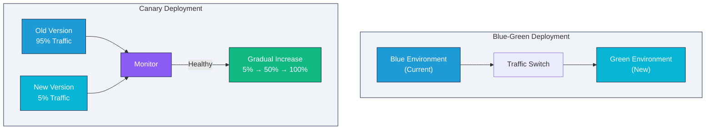

# CI/CD Fundamentals

Learn the core concepts, principles, and best practices for implementing effective Continuous Integration and Continuous Deployment pipelines.

## What is Continuous Integration?

Continuous Integration (CI) is the practice of automating the build and testing of code every time a change is made and committing that code back to a central repository. Key benefits include:

- **Easier Bug Fixes** — Issues are identified sooner, making them easier and cheaper to fix
- **Reduced Risk** — Small, modular changes minimize impact on other developers
- **Improved Quality** — Automated testing detects issues quickly across the entire codebase
- **Higher Productivity** — Developers focus on feature development rather than manual testing

## What is Continuous Delivery?

Continuous Delivery (CD) is the practice of ensuring code changes are always in a state ready for release. Unlike Continuous Deployment, CD doesn't automatically deploy to production—releases are triggered manually. Key characteristics:

- Code is always deployable
- Changes go through automated testing and quality checks
- Manual approval gates before production deployment
- Enables rapid release cycles when needed

## What is Continuous Deployment?

Continuous Deployment goes further than Continuous Delivery by automatically releasing every change that passes automated tests to production. This requires:

- Highly reliable automated test suites
- Robust monitoring and alerting
- Quick rollback capabilities
- Strong quality gates

## Pipeline Stages

A typical CI/CD pipeline consists of these stages:

### CI/CD Pipeline Flow

```mermaid
graph LR
  Source["Source<br/>Code Commit"]
  Build["Build"]
  UnitTest["Unit Tests"]
  IntTest["Integration Tests"]
  StagingDeploy["Deploy Staging"]
  AcceptanceTest["Acceptance Tests"]
  ProdDeploy["Deploy Production"]
  Monitor["Monitor"]

  Source --> Build
  Build --> UnitTest
  UnitTest --> IntTest
  IntTest --> StagingDeploy
  StagingDeploy --> AcceptanceTest
  AcceptanceTest --> ProdDeploy
  ProdDeploy --> Monitor

  style Source fill:#38BDF8,stroke:#1B2A4A,color:#000
  style Build fill:#1E9BD7,stroke:#1B2A4A,color:#fff
  style UnitTest fill:#1E9BD7,stroke:#1B2A4A,color:#fff
  style IntTest fill:#1E9BD7,stroke:#1B2A4A,color:#fff
  style StagingDeploy fill:#06B6D4,stroke:#1B2A4A,color:#fff
  style AcceptanceTest fill:#1E9BD7,stroke:#1B2A4A,color:#fff
  style ProdDeploy fill:#10B981,stroke:#1B2A4A,color:#fff
  style Monitor fill:#8B5CF6,stroke:#1B2A4A,color:#fff
```



### 1. Source Control / Commit
- Developer commits code to version control (Git, SVN, Mercurial)
- CI server is notified of the commit or polls periodically

### 2. Build
- Code is checked out from the repository
- Compilation/bundling occurs
- Build artifacts are created (JAR, WAR, Docker images, etc.)
- Failed builds are reported immediately

### 3. Unit Testing
- Automated unit tests run against the code
- Fast feedback to developers
- Tests run in the same environment as the build

### 4. Code Quality & Security Analysis
- Static code analysis detects vulnerabilities and style issues
- Code coverage is measured
- Security scanning for dependencies (SAST/SCA)
- Results feed back to developers immediately

### 5. Integration Testing
- Tests run against integrated components
- Database and service integration tests
- API contract testing
- Results reported with detailed logs

### 6. Artifact Management
- Build artifacts (binaries, containers) are stored in a registry
- Artifacts are tagged and versioned
- Traceability links build to source code
- Cleanup policies remove old artifacts

### 7. Staging Deployment
- Artifact is deployed to a staging environment
- Environment mirrors production as closely as possible
- Smoke tests and acceptance tests run
- Security and compliance scanning occurs

### 8. Production Deployment
- Approved artifacts are deployed to production
- Deployment strategy is executed (blue-green, canary, rolling)
- Health checks verify the deployment
- Monitoring alerts are activated

### 9. Monitoring & Feedback
- Continuous monitoring of application health
- Performance metrics collected
- Errors and exceptions tracked
- Logs aggregated and analyzed

## Artifact Management

Artifacts are the outputs of the build process that move through the pipeline:

### Artifact Storage
- **Registry** — Central repository for storing build artifacts (Docker Hub, Artifactory, Nexus, ECR)
- **Versioning** — Each artifact has a unique version identifier
- **Tagging** — Artifacts tagged for traceability (e.g., `app:v1.2.3-build-456`)
- **Metadata** — Build information, source commit, timestamp stored with artifact

### Traceability
- Every artifact can be traced back to its source commit
- Build logs and test results associated with the artifact
- Deployment history shows which version is running where
- Helps troubleshoot issues by identifying exact code version

### Retention & Cleanup
- Old artifacts are automatically cleaned up based on policies
- Keeps storage costs manageable
- Policy example: Keep last 10 builds, delete older than 90 days
- Critical releases kept indefinitely

## Pipeline-as-Code

Pipeline-as-Code means defining the entire CI/CD pipeline as code rather than through a GUI. Benefits:

### Advantages
- **Version Control** — Pipeline changes are tracked in Git
- **Reproducibility** — Same pipeline runs every time
- **Code Review** — Pipeline changes reviewed before merge
- **Portability** — Pipeline definition moves with the code
- **Documentation** — Code is self-documenting

### Implementation
- **Jenkinsfile** — Pipeline defined in Groovy (Jenkins)
- **GitHub Actions Workflow** — YAML files in `.github/workflows/`
- **GitLab CI** — `.gitlab-ci.yml` at repository root
- **CircleCI Config** — `.circleci/config.yml`

### Example Structure
```yaml
name: CI Pipeline
on: [push, pull_request]
jobs:
  build:
    runs-on: ubuntu-latest
    steps:
      - uses: actions/checkout@v2
      - name: Build
        run: npm run build
      - name: Test
        run: npm test
      - name: Deploy
        run: npm run deploy
```

## Deployment Strategies

Different strategies for releasing new versions to production:

### Deployment Strategies Comparison



### Blue-Green Deployment

Two identical production environments (Blue and Green). Traffic switches from one to the other:

- **Blue** — Current production environment serving users
- **Green** — New version deployed and tested
- **Switch** — Traffic routed to Green; Blue kept for quick rollback
- **Advantages** — Zero downtime, instant rollback
- **Disadvantages** — Requires duplicate infrastructure

### Canary Deployment

New version gradually rolled out to a small percentage of users:

- **Phase 1** — Deploy to 5% of users, monitor for errors
- **Phase 2** — If healthy, deploy to 25%
- **Phase 3** — If stable, roll out to 100%
- **Advantages** — Risk mitigation, gradual feedback
- **Disadvantages** — Complex routing logic, longer deployment time

### Rolling Deployment

Gradually replace instances of the old version with the new one:

- **Instance 1** — Old version to new version
- **Instance 2** — Old version to new version (Instance 1 handles traffic)
- **Instance N** — Continue until all upgraded
- **Advantages** — No extra infrastructure needed
- **Disadvantages** — Temporary mixed versions, longer deployment

### Feature Toggles

Hide new features behind toggles that can be enabled per user:

- **Config-based** — Features toggled via configuration files
- **User-based** — Different users see different features
- **Percentage-based** — Gradually enable for X% of users
- **Advantages** — Deploy frequently without exposing incomplete work
- **Disadvantages** — Code complexity, toggle management overhead

## Trunk-Based Development

Development practice where developers work on short-lived branches that merge to main frequently:

### Principles
- **Main branch is always releasable** — CI/CD passes all checks
- **Short-lived branches** — Feature branches exist for hours/days, not weeks
- **Frequent integration** — Merge to main multiple times daily
- **Feature toggles** — Incomplete features are hidden, not held in branches

### Benefits
- Avoids merge conflicts from diverged branches
- Continuous feedback on code quality
- Supports continuous deployment
- Easier code review (smaller changes)

### Practices
- Create branch for feature/fix
- Keep branch in sync with main
- Merge after code review and passing tests
- Delete branch after merge
- Prefer rebasing over merge commits (keeps history clean)

## Quality Gates

Quality gates are automated checks that must pass before code advances in the pipeline:

### Types of Gates
- **Build Success** — Code must compile without errors
- **Test Coverage** — Minimum percentage of code covered by tests (e.g., 80%)
- **Static Analysis** — Code quality score above threshold
- **Security Scan** — No critical vulnerabilities found
- **Performance** — Performance metrics within acceptable range
- **Manual Approval** — Human review before production deployment

### Gate Configuration
- Define thresholds for each check
- Fail pipeline if gates not met
- Provide clear feedback on what failed
- Allow exceptions/overrides when justified (with audit trail)

### Implementation
- Gate checks run automatically in pipeline
- Results displayed in CI/CD dashboard
- Notifications sent when gates fail
- Easy rollback if needed

## Best Practices

### 1. Fail Fast
- Run fast tests first, slow tests later
- Fail build on first error to save time
- Report issues immediately

### 2. Keep Pipelines Fast
- Parallelize independent stages
- Cache dependencies
- Use lightweight test environments
- Optimize build times regularly

### 3. Maintain Clear Feedback
- Detailed build logs
- Clear error messages
- Visual pipeline status
- Notify developers of failures

### 4. Secure the Pipeline
- Protect credentials with secure vaults
- Scan for secrets in code (gitleaks, Trivy)
- Authenticate all registry access
- Audit pipeline modifications

### 5. Instrument Everything
- Collect metrics on build times
- Track deployment frequency
- Measure test coverage
- Monitor pipeline success rates

### 6. Version Everything
- Version application code
- Version infrastructure code
- Version pipeline definitions
- Version dependencies

## Exercises

### Exercise 1: Design a Pipeline
Design a CI/CD pipeline for a Node.js web application that:
- Runs on every commit
- Builds and tests the application
- Publishes a Docker image
- Deploys to staging for approval
- Auto-deploys to production if approved

Include: stages, quality gates, deployment strategy, and artifact management.

### Exercise 2: Implement Quality Gates
Create quality gates for a Java microservice that enforce:
- 80% code coverage minimum
- No high-severity security findings
- Build time under 5 minutes
- Zero failing tests

Define threshold values and how to report failures.

### Exercise 3: Compare Deployment Strategies
Compare blue-green, canary, and rolling deployments for:
- A financial transaction system
- A video streaming service
- A mobile app backend

For each, recommend the best strategy and justify your choice.

### Exercise 4: Trunk-Based Development
Convert a feature-branch workflow to trunk-based development for a team of 8 developers. Address:
- How to prevent incomplete features from impacting production
- How to manage code review workflow
- How to handle long-running features
- Team communication strategy

## Key Takeaways

- CI/CD automates the entire software delivery process
- Pipelines consist of distinct stages with quality gates
- Artifacts move through pipeline and are traced to source
- Pipeline-as-code enables version control and reproducibility
- Deployment strategies (blue-green, canary, rolling) minimize risk
- Trunk-based development enables frequent integration
- Quality gates enforce standards before advancement
- Fast feedback and clear communication are critical
