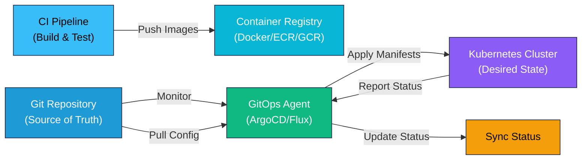

# GitOps

Learn how to use Git as the single source of truth for infrastructure and application configuration.

## GitOps Workflow

### GitOps Architecture and Flow



---

## What is GitOps?

GitOps is a developer-centric approach to continuous delivery where Git is the single source of truth for both application code and infrastructure configuration. Changes go through Git workflows (pull requests, code review, merge) rather than direct deployments.

### Core Principles

1. **Git as Source of Truth** — All desired state is declared in Git
2. **Declarative Configuration** — Describe desired state, not commands
3. **Version Control** — All changes tracked with full history
4. **Automated Reconciliation** — Controllers continuously sync actual state to desired state
5. **Human Review** — All changes go through pull request review

## Traditional Deployment vs GitOps

### Traditional Deployment (Push-based)
```
Developer commits code
    ↓
CI Pipeline builds artifact
    ↓
CI Pipeline pushes to production
    ↓
Application runs
```

**Issues:**
- Credentials stored on CI/CD server
- Limited visibility into what's deployed
- Difficult to replicate deployments
- Hard to track configuration changes

### GitOps Deployment (Pull-based)
```
Developer commits code + config to Git
    ↓
CI Pipeline validates and builds artifact
    ↓
Developer merges to main branch
    ↓
GitOps Controller detects change in Git
    ↓
GitOps Controller pulls latest from Git
    ↓
Controller syncs cluster to match Git
```

**Advantages:**
- Git has full audit trail
- Configuration as code
- Easy rollback (revert commit)
- Self-healing (controller fixes drift)
- Better security (credentials on cluster, not CI/CD)

## Key Components

### 1. Git Repository Structure

Typical GitOps repo layout:

```
gitops-repo/
  apps/
    app-1/
      base/
        deployment.yaml
        service.yaml
        kustomization.yaml
      overlays/
        dev/
          kustomization.yaml
        staging/
          kustomization.yaml
        prod/
          kustomization.yaml
  infrastructure/
    networking/
      network-policies.yaml
    storage/
      storage-classes.yaml
  README.md
```

### 2. Application Manifests

Kubernetes manifests describing desired state:

```yaml
# deployment.yaml
apiVersion: apps/v1
kind: Deployment
metadata:
  name: myapp
spec:
  replicas: 3
  selector:
    matchLabels:
      app: myapp
  template:
    metadata:
      labels:
        app: myapp
    spec:
      containers:
      - name: myapp
        image: myapp:v1.2.3
        ports:
        - containerPort: 8080
```

### 3. GitOps Controller

Continuously monitors Git repository and reconciles cluster state:

- **ArgoCD** — Kubernetes-native GitOps controller
- **Flux** — Lightweight GitOps controller
- **Jenkins X** — Kubernetes-native CI/CD
- **GitKube** — Kubernetes-native Git push deployment

### 4. Synchronization

Controller detects differences and applies changes:

```
Git Desired State: app:v2.0
       ↑
Diff Check
       ↓
Cluster State: app:v1.0
```

When diff detected, controller reconciles cluster to match Git.

## GitOps Workflow

### Step 1: Update Configuration
Developer updates deployment configuration in Git:

```bash
git checkout -b update-app-version
# Edit app deployment version in deployment.yaml
git commit -am "Update app to v1.2.3"
git push origin update-app-version
```

### Step 2: Code Review
Create pull request for review:

```
Pull Request: Update app to v1.2.3
- Changes app image from v1.2.2 to v1.2.3
- Approved by lead engineer
- CI/CD validates YAML syntax
```

### Step 3: Merge
Reviewer approves and merges to main:

```bash
git checkout main
git merge --no-ff update-app-version
git push origin main
```

### Step 4: Automatic Sync
GitOps controller detects change and syncs cluster:

```
Controller polling Git repository...
Latest commit: Update app to v1.2.3
Desired state: app:v1.2.3
Current state: app:v1.2.2
Status: OUTOFSYNCH
→ Applying changes to cluster
→ Rolling out new deployment
→ Waiting for pods to become healthy
Status: SYNCHED
```

### Step 5: Verification
Monitor deployment status:

```yaml
argocd app get myapp
→ Status: Synced
→ Desired commit: abc123def
→ Live commit: abc123def
→ Replicas: 3/3 running
```

## ArgoCD

Popular GitOps tool for Kubernetes.

### Installation

```bash
kubectl create namespace argocd
kubectl apply -n argocd -f https://raw.githubusercontent.com/argoproj/argo-cd/stable/manifests/install.yaml

# Get initial password
kubectl -n argocd get secret argocd-initial-admin-secret -o jsonpath="{.data.password}" | base64 -d
```

### Creating an Application

```yaml
apiVersion: argoproj.io/v1alpha1
kind: Application
metadata:
  name: myapp
  namespace: argocd
spec:
  project: default
  source:
    repoURL: https://github.com/user/gitops-repo.git
    targetRevision: main
    path: apps/myapp/overlays/prod
  destination:
    server: https://kubernetes.default.svc
    namespace: production
  syncPolicy:
    automated:
      prune: true
      selfHeal: true
```

### Key Features

- **Multi-cluster** — Deploy to multiple clusters from single Git source
- **Kustomize/Helm support** — Use templating tools
- **Progressive sync** — Sync waves, hooks for ordered deployment
- **Diff visualization** — See exactly what will change
- **Rollback** — Revert to previous Git commit
- **Notifications** — Slack, email on sync events

## Flux

Lightweight GitOps toolkit for Kubernetes.

### Installation

```bash
curl -s https://fluxcd.io/install.sh | sudo bash
flux install --version=latest
```

### Creating Sources

Define where to get configuration:

```yaml
apiVersion: source.toolkit.fluxcd.io/v1beta2
kind: GitRepository
metadata:
  name: myapp-repo
  namespace: flux-system
spec:
  interval: 1m0s
  url: https://github.com/user/gitops-repo.git
  ref:
    branch: main
```

### Creating Kustomizations

Define what to deploy:

```yaml
apiVersion: kustomize.toolkit.fluxcd.io/v1
kind: Kustomization
metadata:
  name: myapp
  namespace: flux-system
spec:
  interval: 10m
  sourceRef:
    kind: GitRepository
    name: myapp-repo
  path: ./apps/myapp
  prune: true
  wait: true
```

## Push vs Pull Deployment

### Push Deployment (Traditional)
- CI/CD pushes directly to cluster
- Faster feedback (immediate)
- Credentials on CI/CD server
- Hard to manage drift
- Difficult for multiple clusters

### Pull Deployment (GitOps)
- Controller pulls from Git
- Slight delay (polling interval)
- Credentials on cluster only
- Self-healing from drift
- Consistent multi-cluster management

## Repository Structure Patterns

### Pattern 1: Kustomize-based

```
repo/
  apps/
    myapp/
      base/
        deployment.yaml
        kustomization.yaml
      overlays/
        dev/kustomization.yaml
        prod/kustomization.yaml
```

### Pattern 2: Helm-based

```
repo/
  releases/
    myapp-dev.yaml    # HelmRelease for dev
    myapp-prod.yaml   # HelmRelease for prod
  charts/
    myapp/
      templates/
      values.yaml
```

### Pattern 3: Environment-per-directory

```
repo/
  development/
    namespace.yaml
    apps/
      app1/deployment.yaml
      app2/deployment.yaml
  staging/
    namespace.yaml
    apps/
      app1/deployment.yaml
  production/
    namespace.yaml
    apps/
      app1/deployment.yaml
```

### Pattern 4: Mono-repo

```
repo/
  infrastructure/
    networking/
    storage/
  applications/
    app-1/
      src/
      charts/
      deployments/
    app-2/
      src/
      charts/
      deployments/
```

## GitOps Best Practices

### 1. Keep Git Repository Clean
- Only store declarative configuration
- Don't store binary files or large assets
- Organize logically
- Clear naming conventions

### 2. Environment Parity
- Keep dev, staging, prod configs as similar as possible
- Use overlays for differences
- Minimize custom per-environment logic

### 3. Version Control Everything
- Application code in Git
- Infrastructure code in Git
- Configuration in Git
- Deployment manifests in Git

### 4. Implement Proper Code Review
```
Feature branch → Pull request → Review → Approval → Merge → Auto-deploy
```

### 5. Use RBAC for Git Access
- Developers can propose changes
- Team leads approve changes
- Automated tools can't bypass review

### 6. Monitor Sync Status
- Watch for OutOfSync applications
- Alert when sync fails
- Track sync frequency and duration
- Monitor controller health

### 7. Plan Rollback Strategy
```
Rollback = Revert Git commit
git revert abc123def
git push origin main
→ Controller automatically syncs cluster
```

### 8. Secrets Management
Don't store secrets in Git directly!

**Options:**
- Sealed Secrets — Encrypt secrets in Git
- External Secrets Operator — Fetch from vault
- ArgoCD Vault — Store secrets in separate system
- CI/CD integration — Inject at deployment time

## Exercises

### Exercise 1: Basic GitOps Setup
Set up ArgoCD and create an application that:
- Syncs from a Git repository
- Deploys a simple web application
- Automatically syncs when Git changes
- Shows application status in ArgoCD UI

### Exercise 2: Multi-environment Deployment
Create a GitOps structure for dev, staging, and prod that:
- Uses Kustomize overlays
- Has different replica counts per environment
- Uses different resource limits
- Shares common base manifests

### Exercise 3: Implement Self-healing
Configure ArgoCD to:
- Detect drift between Git and cluster
- Automatically sync when drift detected
- Prune resources not in Git
- Prevent manual changes by overwriting them

### Exercise 4: Secrets Management
Implement secret management where:
- Database passwords not stored in Git
- Secrets encrypted in Git (Sealed Secrets)
- Secrets rotated without Git changes
- Different secrets per environment

## Comparison: ArgoCD vs Flux

| Aspect | ArgoCD | Flux |
|--------|--------|------|
| **UI Dashboard** | Yes (excellent) | No |
| **Complexity** | More features, steeper learning curve | Lightweight, simpler |
| **GitOps Model** | Pull-based | Pull-based |
| **Multi-cluster** | Excellent support | Good support |
| **Community** | Large, very active | Growing, active |
| **RBAC** | Built-in | Via Kubernetes RBAC |
| **Notifications** | Built-in | Via controllers |
| **Use Case** | Large teams, complex deployments | Smaller teams, lightweight |

## Common Pitfalls

### 1. Manual Changes Outside GitOps
**Problem:** Team makes manual changes directly on cluster
**Solution:** Enforce GitOps for all changes, educate team

### 2. Credentials in Git
**Problem:** Database passwords stored in repository
**Solution:** Use secrets management (Sealed Secrets, Vault)

### 3. Git Branch Strategy Issues
**Problem:** Developers push to main without review
**Solution:** Implement branch protection, require PRs

### 4. Sync Strategy Too Aggressive
**Problem:** Controller constantly syncs, causes noise
**Solution:** Configure appropriate sync intervals and policies

### 5. Not Monitoring Sync Status
**Problem:** Changes don't apply but nobody notices
**Solution:** Monitor ArgoCD/Flux, set up alerts

## Key Takeaways

- **GitOps makes Git the single source of truth** for infrastructure and application configuration
- **Pull-based deployment is more secure** than push-based (credentials on cluster, not CI/CD)
- **Controllers continuously reconcile** actual state to desired state in Git
- **Self-healing automatically fixes drift** without manual intervention
- **Git history provides full audit trail** of all infrastructure changes
- **Code review workflow applies to infrastructure** changes as well
- **Rollback is as simple as reverting a Git commit** with automatic cluster sync
- **ArgoCD and Flux are popular GitOps tools** with different trade-offs
- **Secrets must be handled separately**, not stored directly in Git
