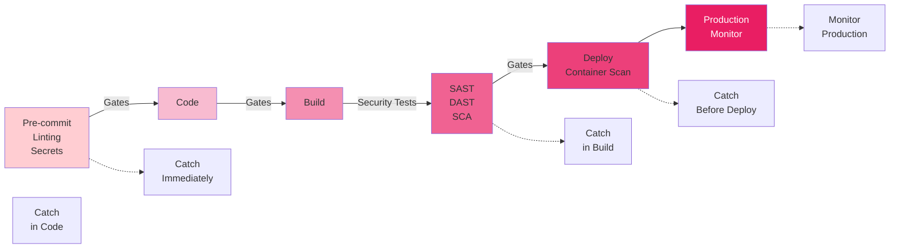
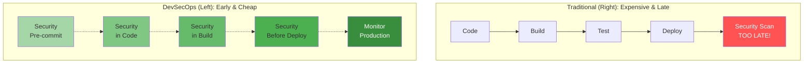

# DevSecOps Fundamentals

Learn how to integrate security practices throughout the software development and deployment lifecycle.

## What is DevSecOps?

DevSecOps (Development + Security + Operations) is the practice of integrating security checks, testing, and tools throughout the entire software delivery pipeline—from development through production. Security is everyone's responsibility, not just the security team's.

### Core Principles

1. **Shift-Left Security** — Move security checks earlier in the pipeline
2. **Automation** — Automate security checks to enable fast feedback
3. **Collaboration** — Development, operations, and security teams work together
4. **Continuous Monitoring** — Monitor security throughout the application lifecycle
5. **Measurable Security** — Track and measure security metrics
6. **Compliance-as-Code** — Encode security and compliance requirements as code

## Shift-Left Security

Shift-left means moving security checks earlier in the development process, from right (deployment) to left (development).

### DevSecOps Pipeline Diagram



### Shift-Left vs Traditional Approach



### Traditional Approach (Shift-Right)
```
Code → Build → Test → Deploy → Security Scan
                                   (too late!)
```

**Problems:**
- Vulnerabilities found late (expensive to fix)
- Developer has moved on to other work
- Fix takes time, blocks deployment
- Security seen as blocker, not enabler

### DevSecOps Approach (Shift-Left)
```
Pre-commit → Code → Build → Security Test → Deploy
   ↓                                      ↓
  SAST,              DAST, Secrets    Monitoring
 Linting,            Scanning, SCA
 Secrets
(catch early!)
```

**Benefits:**
- Issues caught when developer still focused
- Cheaper and faster to fix
- Security integrated into development
- Developers invest in security

### Implementation Levels

**Level 1: Pre-commit hooks**
```bash
# .git/hooks/pre-commit
#!/bin/bash
gitleaks detect --staged  # Check for exposed secrets
eslint .                  # Check code quality
exit $?
```

**Level 2: CI/CD pipeline**
- SAST on every commit
- Dependency scanning
- Container image scanning

**Level 3: IDE plugins**
- Real-time feedback while coding
- Security warnings in editor
- Automated fixes

## SAST (Static Application Security Testing)

SAST analyzes source code without running it to find vulnerabilities.

### How SAST Works

```
Source Code
    ↓
Lexical Analysis → Parse into tokens
    ↓
Syntax Analysis → Build abstract syntax tree
    ↓
Semantic Analysis → Check for vulnerabilities
    ↓
Report Issues
```

### Common Vulnerabilities SAST Finds

- SQL Injection — Unsanitized user input in database queries
- Cross-Site Scripting (XSS) — Unsanitized output to HTML
- Cross-Site Request Forgery (CSRF) — Missing CSRF tokens
- Insecure Deserialization — Untrusted data deserialization
- Hardcoded Secrets — API keys, passwords in code
- Buffer Overflow — Unchecked array/buffer access
- Weak Cryptography — Use of outdated encryption

### Popular SAST Tools

| Tool | Language | Type |
|------|----------|------|
| SonarQube | Multiple | Self-hosted |
| Checkmarx | Multiple | Commercial |
| Semgrep | Multiple | Open-source |
| Snyk | Multiple | Cloud + CLI |
| Fortify | Multiple | Commercial |
| Bandit | Python | Open-source |
| Brakeman | Ruby | Open-source |

### SAST Integration in Pipeline

```yaml
# GitHub Actions example
- name: Run Semgrep SAST
  uses: returntocorp/semgrep-action@v1
  with:
    config: >-
      p/security-audit
      p/owasp-top-ten
    generateSarif: true

- name: Upload SARIF
  uses: github/codeql-action/upload-sarif@v2
  with:
    sarif_file: semgrep.sarif
```

## DAST (Dynamic Application Security Testing)

DAST tests running applications to find vulnerabilities in behavior.

### How DAST Works

```
Running Application
    ↓
Send Requests → Observe Responses
    ↓
Check for Vulnerabilities
    ↓
Report Issues
```

### Common Vulnerabilities DAST Finds

- Authentication issues — Bypass, weak session management
- Authorization flaws — Access control bypass
- Business logic flaws — Race conditions, workflow bypass
- API security — Missing auth, injection in APIs
- Configuration issues — Debug mode enabled, verbose errors
- Cryptographic issues — Weak TLS, deprecated protocols

### Popular DAST Tools

| Tool | Type | Best For |
|------|------|----------|
| OWASP ZAP | Open-source | General web apps |
| Burp Suite | Commercial | Detailed testing |
| Acunetix | Commercial | Automated scanning |
| w3af | Open-source | Web application testing |
| Nuclei | Open-source | Template-based testing |

### DAST in Pipeline

```yaml
# GitLab CI example
dast:
  stage: deploy
  script:
    - docker run -t owasp/zap2docker-stable zap-baseline.py
        -t https://staging.example.com
  allow_failure: true
```

## SCA (Software Composition Analysis)

SCA identifies vulnerabilities in third-party dependencies and open-source libraries.

### How SCA Works

```
Dependencies (package.json, requirements.txt, etc.)
    ↓
Compare against vulnerability database
    ↓
Report known vulnerabilities
    ↓
Recommend patches/upgrades
```

### Types of Issues Found

- Known vulnerabilities in dependencies
- Outdated versions with patches available
- License compliance issues
- Malicious packages
- Unmaintained packages

### Popular SCA Tools

| Tool | Type | Features |
|------|------|----------|
| Snyk | Cloud/CLI | Fix recommendations |
| Dependabot | GitHub-native | Auto-generated PRs |
| Black Duck | Commercial | License scanning |
| Whitesource | Commercial | Enterprise features |
| Safety | Open-source | Python-focused |

### SCA Integration

```bash
# Snyk CLI example
snyk test                    # Check for vulnerabilities
snyk fix                     # Auto-fix some issues
snyk monitor                 # Continuous monitoring
```

## Container Security Scanning

Scan Docker images for vulnerabilities before deployment.

### Scanning Approaches

**Build-time scanning:**
```bash
# Before pushing to registry
docker build -t myapp:latest .
trivy image myapp:latest
```

**Registry scanning:**
```bash
# Images are scanned when pushed to registry
docker push registry.example.com/myapp:latest
# Registry scans automatically
```

**Runtime scanning:**
```bash
# Monitor running containers
falco --rules=/etc/falco/rules.yaml
```

### Popular Container Scanning Tools

| Tool | Type | Features |
|------|------|----------|
| Trivy | Open-source | Fast, comprehensive |
| Grype | Open-source | Accurate CVE detection |
| Clair | Open-source | Registry integration |
| Aqua | Commercial | Advanced scanning |
| Harbor | Open-source | Registry + scanning |

### Scanning in Pipeline

```yaml
# GitHub Actions
- name: Scan image with Trivy
  uses: aquasecurity/trivy-action@master
  with:
    image-ref: myapp:${{ github.sha }}
    format: 'sarif'
    output: 'trivy-results.sarif'
```

## Secrets Management

Never store secrets (passwords, keys, tokens) in code or version control.

### Secrets to Protect

- Database credentials
- API keys and tokens
- SSH keys
- Private certificates
- Encryption keys
- OAuth credentials

### Secret Detection Tools

| Tool | Purpose | Method |
|------|---------|--------|
| GitLeaks | Detect exposed secrets | Regex patterns |
| TruffleHog | Find secrets in Git history | Entropy checking |
| Detect-Secrets | Prevent secret commits | Pre-commit hooks |
| Vault | Centralized secret storage | Encrypted backend |

### Secret Management Best Practices

1. **Never commit secrets to Git**
2. **Use secrets management tools** (Vault, AWS Secrets Manager, Azure Key Vault)
3. **Rotate secrets regularly** (every 30-90 days)
4. **Scan for exposed secrets** in commits and deployments
5. **Limit secret access** (principle of least privilege)
6. **Audit secret access** (who accessed what and when)
7. **Use short-lived credentials** when possible
8. **Never log secrets** (sanitize logs)

### GitLeaks Example

```bash
# Pre-commit hook to prevent secret commits
gitleaks detect --staged

# Scan entire repository history
gitleaks detect --verbose

# Scan specific commit
gitleaks detect --commit abc123def
```

## Supply Chain Security

Secure the entire software supply chain from source to production.

### Supply Chain Threats

- **Compromised dependencies** — Malicious code in libraries
- **Compromised source** — Attacker gains access to repository
- **Compromised build** — Build system is compromised
- **Compromised artifact** — Docker image is tampered with
- **Compromised registry** — Package registry is compromised

### SBOM (Software Bill of Materials)

Document every component in your software:

```json
{
  "bomFormat": "CycloneDX",
  "specVersion": "1.4",
  "components": [
    {
      "type": "library",
      "name": "lodash",
      "version": "4.17.21",
      "purl": "pkg:npm/lodash@4.17.21"
    }
  ]
}
```

### Supply Chain Protections

1. **Dependency pinning** — Lock exact versions
2. **Signature verification** — Verify artifact signatures
3. **Build attestation** — Certify who built what
4. **Artifact scanning** — Scan for vulnerabilities
5. **Source code scanning** — SAST and secrets detection
6. **Access controls** — Limit who can change what

## Compliance-as-Code

Encode security and compliance requirements as code to enforce them automatically.

### Examples

```hcl
# Terraform security check
resource "aws_s3_bucket" "example" {
  bucket = "my-bucket"

  # Enforce encryption
  server_side_encryption_configuration {
    rule {
      apply_server_side_encryption_by_default {
        sse_algorithm = "AES256"
      }
    }
  }

  # Block public access
  block_public_acls       = true
  block_public_policy     = true
  ignore_public_acls      = true
  restrict_public_buckets = true
}
```

### Infrastructure-as-Code Scanning

```bash
# Checkov scans Terraform for security issues
checkov -f main.tf --framework terraform

# Snyk scans Kubernetes manifests
snyk iac test kubernetes-deployment.yaml
```

## OWASP Top 10

The 10 most critical web application security risks.

| Risk | Description | Prevention |
|------|-------------|-----------|
| Injection | SQL injection, command injection | Use parameterized queries, input validation |
| Broken Authentication | Weak password, session fixation | MFA, strong passwords, secure session handling |
| Sensitive Data Exposure | Unencrypted PII, weak encryption | Use HTTPS, encrypt data, mask PII |
| XML External Entities (XXE) | XXE injection attacks | Disable XXE parsing, validate XML |
| Broken Access Control | Authorization bypass | Implement proper access control checks |
| Security Misconfiguration | Debug mode, outdated libraries | Keep systems patched, secure defaults |
| XSS (Cross-Site Scripting) | Execute script in user browser | Input validation, output encoding, CSP headers |
| Insecure Deserialization | Untrusted data deserialization | Avoid deserialization, use safe libraries |
| Using Components with Known Vulnerabilities | Outdated dependencies | Keep dependencies updated, use SCA tools |
| Insufficient Logging & Monitoring | Missing security logs | Log security events, monitor for anomalies |

## DevSecOps Pipeline Example

```yaml
stages:
  - source
  - build
  - test
  - deploy
  - monitor

pre-commit:
  stage: source
  script:
    - gitleaks detect --staged
    - eslint .
    - npm audit

build:
  stage: build
  script:
    - npm install
    - npm run build
    - docker build -t myapp:$CI_COMMIT_SHA .

sast:
  stage: test
  script:
    - semgrep --config=p/security-audit --json --output=semgrep.json .

sca:
  stage: test
  script:
    - snyk test --json > snyk-results.json

container-scan:
  stage: test
  script:
    - trivy image myapp:$CI_COMMIT_SHA --format sarif

dast:
  stage: test
  script:
    - docker run -t owasp/zap2docker-stable zap-baseline.py -t https://staging.example.com

deploy:
  stage: deploy
  script:
    - docker push registry.example.com/myapp:$CI_COMMIT_SHA

monitor:
  stage: monitor
  script:
    - snyk monitor
    - falco monitor
```

## Best Practices

### 1. Integrate Security Early
- Pre-commit hooks for local checks
- SAST on every commit
- Dependency scanning for all changes

### 2. Make Security Accessible
- Show security issues in code review
- Provide remediation guidance
- Don't blame, educate

### 3. Automate Everything
- Automated SAST/DAST/SCA
- Automated scanning in pipeline
- Automated patching for some vulnerabilities

### 4. Monitor Continuously
- Scan production applications
- Monitor for new vulnerabilities
- Track security metrics

### 5. Secure the Supply Chain
- Verify software integrity
- Document dependencies (SBOM)
- Scan artifacts before deployment

## Exercises

### Exercise 1: SAST Setup
Set up Semgrep or SonarQube for a project and:
- Identify top 10 security issues
- Fix the most critical ones
- Integrate into CI/CD pipeline

### Exercise 2: Secrets Detection
Scan a repository for exposed secrets:
- Use GitLeaks to find existing secrets
- Add pre-commit hook to prevent new secrets
- Rotate any found secrets

### Exercise 3: Container Security
Build and scan a Docker image:
- Create a Dockerfile
- Scan with Trivy
- Fix identified vulnerabilities
- Scan again to verify fixes

### Exercise 4: OWASP Top 10 Review
For a web application:
- Identify which OWASP risks apply
- Find examples of each in code
- Propose fixes
- Implement fixes

## Key Takeaways

- **DevSecOps integrates security throughout the pipeline**, not just at the end
- **Shift-left moves security earlier**, enabling faster, cheaper fixes
- **SAST finds code vulnerabilities** before runtime
- **DAST finds application vulnerabilities** in running code
- **SCA identifies vulnerable dependencies** and licenses
- **Container scanning catches image vulnerabilities** before deployment
- **Secrets must never be in code** — use management tools instead
- **Supply chain security protects** the entire development process
- **Compliance-as-code automates** security and compliance checking
- **OWASP Top 10 represents the most critical web security risks**
