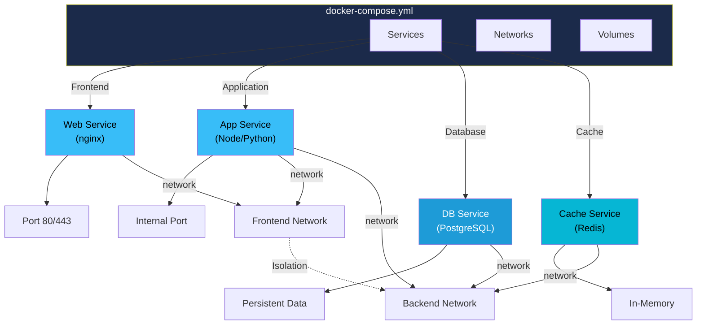
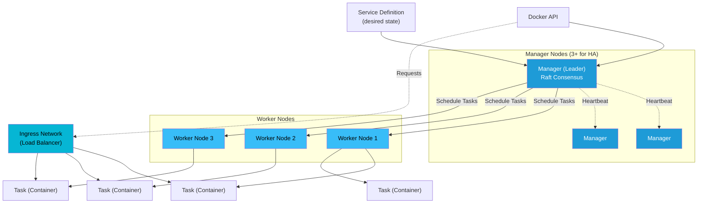

# Docker Compose & Swarm

Learn to manage multi-container applications with Docker Compose and scale them across clusters with Docker Swarm. These tools bridge the gap between single-container deployments and enterprise orchestration platforms.

---

## Docker Compose

### What is Docker Compose?

Docker Compose is a tool for defining and running multi-container Docker applications. Instead of manually starting each container with complex `docker run` commands, you define your entire application stack in a single declarative `docker-compose.yml` file.

### Multi-Container Application Architecture



**Key Benefits:**
- Single file definition for entire application
- One-command startup/teardown
- Automatic networking between services
- Easy environment configuration
- Perfect for development, testing, and production

### Compose File Structure

Here's a comprehensive, annotated `docker-compose.yml` example with all major features:

```yaml
# Compose version (use 3.9+ for most features)
version: '3.9'

# Named volumes for persistent data
volumes:
  db_data:
    driver: local
  cache_data:
    driver: local

# Custom networks for service communication
networks:
  frontend:
    driver: bridge
  backend:
    driver: bridge

services:
  # Web Application Service
  web:
    # Option 1: Use a pre-built image
    image: myapp:1.0

    # Option 2: Build from Dockerfile
    # build:
    #   context: ./web
    #   dockerfile: Dockerfile
    #   args:
    #     - BUILD_ENV=production

    # Container name (optional)
    container_name: myapp-web

    # Port mappings: host:container
    ports:
      - "8080:3000"
      - "8443:3443"

    # Expose ports to other services (not to host)
    expose:
      - 3000

    # Environment variables
    environment:
      - NODE_ENV=production
      - LOG_LEVEL=info
      - DATABASE_URL=postgres://db:5432/myapp

    # Alternative: Load from .env file
    # env_file:
    #   - .env
    #   - .env.prod

    # Volume mounts: host:container or named_volume:container
    volumes:
      # Bind mount (development)
      - ./web:/app
      - /app/node_modules  # Anonymous volume to exclude node_modules

      # Named volume (production)
      # - app_data:/app/data

    # Networks this service joins
    networks:
      - frontend
      - backend

    # Service dependencies
    depends_on:
      db:
        condition: service_healthy
      cache:
        condition: service_started

    # Restart policy: no, always, on-failure, unless-stopped
    restart_policy:
      condition: on-failure
      max_attempts: 3
      delay: 5s

    # Resource limits and reservations
    deploy:
      resources:
        limits:
          cpus: '0.5'
          memory: 512M
        reservations:
          cpus: '0.25'
          memory: 256M

    # Health check
    healthcheck:
      test: ["CMD", "curl", "-f", "http://localhost:3000/health"]
      interval: 30s
      timeout: 10s
      retries: 3
      start_period: 40s

    # Override the default command
    # command: npm run start:prod

    # Pass signals to container
    # stop_signal: SIGTERM
    # stop_grace_period: 10s

  # Database Service
  db:
    image: postgres:15-alpine
    container_name: myapp-db

    ports:
      - "5432:5432"

    environment:
      - POSTGRES_DB=myapp
      - POSTGRES_USER=appuser
      - POSTGRES_PASSWORD=secretpassword

    volumes:
      - db_data:/var/lib/postgresql/data
      - ./init.sql:/docker-entrypoint-initdb.d/init.sql

    networks:
      - backend

    restart_policy:
      condition: unless-stopped

    healthcheck:
      test: ["CMD-SHELL", "pg_isready -U appuser"]
      interval: 10s
      timeout: 5s
      retries: 5

  # Cache Service
  cache:
    image: redis:7-alpine
    container_name: myapp-cache

    ports:
      - "6379:6379"

    volumes:
      - cache_data:/data

    networks:
      - backend

    restart_policy:
      condition: unless-stopped

    healthcheck:
      test: ["CMD", "redis-cli", "ping"]
      interval: 10s
      timeout: 5s
      retries: 3

    # Redis configuration
    command: redis-server --appendonly yes
```

### Compose Commands Cheat Sheet

| Command | Description |
|---------|-------------|
| `docker compose up -d` | Start all services in background |
| `docker compose down` | Stop and remove all containers |
| `docker compose ps` | List running services |
| `docker compose logs -f` | Follow logs from all services |
| `docker compose logs web` | View logs for specific service |
| `docker compose exec web bash` | Execute shell command in service |
| `docker compose build` | Build/rebuild images |
| `docker compose pull` | Pull latest images |
| `docker compose config` | Validate and print compose file |
| `docker compose restart` | Restart all services |
| `docker compose restart web` | Restart specific service |
| `docker compose up -d --scale web=3` | Scale service to N replicas |
| `docker compose pause` | Pause all services |
| `docker compose unpause` | Resume paused services |
| `docker compose top web` | Show running processes in service |
| `docker compose cp web:/app/file.txt .` | Copy files from service |

### Real-World Compose Examples

#### Example 1: WordPress + MySQL + phpMyAdmin

```yaml
version: '3.9'

volumes:
  wordpress_data:
  mysql_data:

services:
  wordpress:
    image: wordpress:latest
    ports:
      - "80:80"
    environment:
      - WORDPRESS_DB_HOST=mysql
      - WORDPRESS_DB_NAME=wordpress
      - WORDPRESS_DB_USER=wordpress
      - WORDPRESS_DB_PASSWORD=wp_secure_pass
    volumes:
      - wordpress_data:/var/www/html
    depends_on:
      - mysql
    restart: unless-stopped

  mysql:
    image: mysql:8
    environment:
      - MYSQL_ROOT_PASSWORD=root_secure_pass
      - MYSQL_DATABASE=wordpress
      - MYSQL_USER=wordpress
      - MYSQL_PASSWORD=wp_secure_pass
    volumes:
      - mysql_data:/var/lib/mysql
    restart: unless-stopped
    healthcheck:
      test: ["CMD", "mysqladmin", "ping", "-h", "localhost"]
      interval: 10s
      timeout: 5s
      retries: 5

  phpmyadmin:
    image: phpmyadmin:latest
    ports:
      - "8080:80"
    environment:
      - PMA_HOST=mysql
      - PMA_USER=wordpress
      - PMA_PASSWORD=wp_secure_pass
    depends_on:
      - mysql
    restart: unless-stopped
```

#### Example 2: Node.js + MongoDB + Redis

```yaml
version: '3.9'

services:
  app:
    build: .
    ports:
      - "3000:3000"
    environment:
      - NODE_ENV=production
      - MONGODB_URI=mongodb://mongo:27017/myapp
      - REDIS_URL=redis://cache:6379
    depends_on:
      mongo:
        condition: service_healthy
      cache:
        condition: service_healthy
    restart: unless-stopped

  mongo:
    image: mongo:6
    ports:
      - "27017:27017"
    volumes:
      - mongo_data:/data/db
    restart: unless-stopped
    healthcheck:
      test: echo 'db.runCommand("ping").ok' | mongosh localhost:27017/test --quiet
      interval: 10s
      timeout: 5s
      retries: 5

  cache:
    image: redis:7-alpine
    ports:
      - "6379:6379"
    restart: unless-stopped
    healthcheck:
      test: ["CMD", "redis-cli", "ping"]
      interval: 10s
      timeout: 5s
      retries: 3

volumes:
  mongo_data:
```

#### Example 3: Python Flask + PostgreSQL + Nginx Reverse Proxy

```yaml
version: '3.9'

services:
  nginx:
    image: nginx:alpine
    ports:
      - "80:80"
      - "443:443"
    volumes:
      - ./nginx.conf:/etc/nginx/nginx.conf:ro
      - ./ssl:/etc/nginx/ssl:ro
    depends_on:
      - flask_app
    restart: unless-stopped

  flask_app:
    build:
      context: .
      dockerfile: Dockerfile
    expose:
      - "5000"
    environment:
      - FLASK_ENV=production
      - DATABASE_URL=postgresql://flask_user:flask_pass@db:5432/flask_db
    volumes:
      - ./app:/app
    depends_on:
      db:
        condition: service_healthy
    restart: unless-stopped
    healthcheck:
      test: ["CMD", "curl", "-f", "http://localhost:5000/health"]
      interval: 10s
      timeout: 5s
      retries: 5

  db:
    image: postgres:15-alpine
    environment:
      - POSTGRES_DB=flask_db
      - POSTGRES_USER=flask_user
      - POSTGRES_PASSWORD=flask_pass
    volumes:
      - db_data:/var/lib/postgresql/data
    restart: unless-stopped
    healthcheck:
      test: ["CMD-SHELL", "pg_isready -U flask_user"]
      interval: 10s
      timeout: 5s
      retries: 5

volumes:
  db_data:
```

### Compose Networking

Docker Compose automatically creates a network for your services, enabling seamless communication:

**Default Behavior:**
- Services are accessible by name within the Compose network
- Service name resolves to the container's IP address
- No need to manually link containers

**Example Network Communication:**
```yaml
services:
  web:
    environment:
      - DATABASE_HOST=db  # Service name as hostname
      - REDIS_HOST=cache

  db:
    image: postgres

  cache:
    image: redis
```

**Custom Networks:**
```yaml
networks:
  frontend:
    driver: bridge
  backend:
    driver: bridge

services:
  web:
    networks:
      - frontend
      - backend  # Can join multiple networks

  db:
    networks:
      - backend
```

### Environment Variables

Manage configuration securely using environment variables:

**Method 1: In Compose File**
```yaml
services:
  web:
    environment:
      - NODE_ENV=production
      - LOG_LEVEL=info
```

**Method 2: From .env File**
```yaml
services:
  web:
    env_file: .env
```

**.env File Example:**
```
NODE_ENV=production
DATABASE_URL=postgresql://user:pass@db:5432/myapp
API_KEY=secret123
DEBUG=false
```

**Method 3: Variable Interpolation**
```yaml
services:
  web:
    image: myapp:${APP_VERSION}
    environment:
      - DATABASE_URL=${DB_HOST}:${DB_PORT}/${DB_NAME}
```

---

## Docker Swarm

### What is Docker Swarm?

Docker Swarm is Docker's native clustering and orchestration solution. It allows you to manage a cluster of Docker machines as a single virtual system, enabling high availability and scaling.

**Key Concepts:**
- **Decentralized Design**: No single point of failure
- **Declarative Service Model**: Define desired state
- **Multi-host Networking**: Secure service-to-service communication
- **Load Balancing**: Automatic request distribution
- **Rolling Updates**: Zero-downtime deployments

### Swarm Architecture

**Components:**

| Component | Role |
|-----------|------|
| **Manager Node** | Maintains cluster state, schedules services, accepts commands |
| **Worker Node** | Executes tasks assigned by managers |
| **Raft Database** | Consensus mechanism for state consistency |
| **Service** | High-level abstraction defining desired state |
| **Task** | Individual container running a service replica |
| **Ingress Network** | Load balances external traffic to service ports |

**Docker Swarm Cluster Architecture:**



### Swarm Commands Cheat Sheet

**Cluster Management:**
```bash
# Initialize a new Swarm
docker swarm init

# Join an existing Swarm as worker
docker swarm join --token SWMTKN-1-xxx host-ip:2377

# Join as manager
docker swarm join-token manager
docker swarm join --token SWMTKN-1-xxx host-ip:2377

# View cluster status
docker node ls

# Promote/demote nodes
docker node promote worker1
docker node demote manager2

# Remove node from Swarm
docker node rm node_id
```

**Service Management:**
```bash
# Create a service
docker service create --name web -p 80:80 nginx

# Create with replicas
docker service create --name web -p 80:80 --replicas 3 nginx

# List services
docker service ls

# View service details
docker service inspect web

# View service tasks
docker service ps web

# Scale service
docker service scale web=5

# Update service (image, ports, etc.)
docker service update --image nginx:latest web

# Update replicas
docker service update --replicas 5 web

# View service logs
docker service logs web

# Remove service
docker service rm web
```

**Stack Management:**
```bash
# Deploy a stack from compose file
docker stack deploy -c docker-compose.yml myapp

# List stacks
docker stack ls

# View stack services
docker stack services myapp

# View stack tasks
docker stack ps myapp

# Remove stack
docker stack rm myapp
```

### Services, Tasks, and Containers

Understanding the hierarchy:

```
Service (desired state)
  ├── Task 1 (container)
  ├── Task 2 (container)
  └── Task 3 (container)
```

**Example:**
```bash
# Create a service with 3 replicas
docker service create --name web --replicas 3 nginx

# This creates:
# - 1 Service (web)
# - 3 Tasks (web.1, web.2, web.3)
# - 3 Containers (running nginx)

# View all:
docker service ps web
```

### Rolling Updates & Rollbacks

**Rolling Update Strategy:**
```yaml
version: '3.9'

services:
  web:
    image: myapp:1.0
    deploy:
      # Rolling update configuration
      update_config:
        parallelism: 1          # Update 1 replica at a time
        delay: 10s              # Wait 10s between updates
        failure_action: pause   # pause | continue
        monitor: 5s             # Monitor for 5s after update

      # Automatic rollback on failure
      rollback_config:
        parallelism: 2
        delay: 5s
        failure_action: continue
```

**Rolling Update Command:**
```bash
# Update image
docker service update --image myapp:2.0 web

# Monitor update progress
docker service ps web

# Rollback if needed
docker service update --image myapp:1.0 web
```

### Secrets and Configs

Manage sensitive data securely in Swarm:

**Creating Secrets:**
```bash
# From file
docker secret create db_password ./password.txt

# From stdin
echo "supersecret" | docker secret create api_key -

# View secrets
docker secret ls

# Remove secret
docker secret rm api_key
```

**Using Secrets in Services:**
```bash
# Create service with secret
docker service create \
  --name web \
  --secret db_password \
  myapp

# Secret mounted at /run/secrets/db_password in container
```

**In Compose File:**
```yaml
version: '3.9'

secrets:
  db_password:
    file: ./secrets/db_password.txt

services:
  web:
    image: myapp
    secrets:
      - db_password
```

**Configs:**
```bash
# Store non-sensitive configuration
docker config create app_config ./config.json

# Use in service
docker service create \
  --config app_config \
  myapp
```

### Swarm vs Kubernetes

When to use each:

| Feature | Swarm | Kubernetes |
|---------|-------|-----------|
| **Setup Complexity** | Simple, integrated | Complex, steeper learning curve |
| **Scaling** | Good for 100s of nodes | Scales to 1000s+ nodes |
| **Resource Requirements** | Lightweight | Heavy (etcd, control plane) |
| **Multi-cloud** | Limited | Excellent |
| **CLI Learning Curve** | Easy (`docker` commands) | Steep (`kubectl` is complex) |
| **Ecosystem** | Minimal tooling | Rich ecosystem (Helm, operators, etc.) |
| **Production Readiness** | Good for smaller deployments | Enterprise standard |
| **Networking** | Native overlay network | Flexible, pluggable CNI |
| **Storage** | Basic | Advanced persistent volumes |
| **Service Discovery** | Built-in via DNS | Built-in + external options |
| **Use Case** | Small-medium teams, on-prem | Large teams, multi-cloud, enterprise |

**Choose Swarm if:**
- Team is small/medium
- Already comfortable with Docker CLI
- Infrastructure is single-datacenter
- Want minimal operational overhead

**Choose Kubernetes if:**
- Scaling to thousands of containers
- Multi-cloud deployment
- Complex networking/storage needs
- Team can invest in learning curve

---

## Exercises

### Exercise 1: Create a 3-Tier Web Application with Docker Compose

**Objective:** Build a complete voting application stack with frontend, backend, and database.

**Requirements:**
- Frontend: Nginx serving static HTML
- Backend: Python Flask API
- Database: PostgreSQL

**Tasks:**

1. Create the project structure:
```bash
mkdir -p vote-app/{frontend,backend}
cd vote-app
```

2. Create `backend/Dockerfile`:
```dockerfile
FROM python:3.11-slim

WORKDIR /app

COPY requirements.txt .
RUN pip install -r requirements.txt

COPY . .

CMD ["flask", "run", "--host=0.0.0.0"]
```

3. Create `backend/requirements.txt`:
```
Flask==2.3.2
psycopg2-binary==2.9.6
```

4. Create `backend/app.py`:
```python
from flask import Flask, jsonify
import psycopg2
import os

app = Flask(__name__)

def get_db_connection():
    conn = psycopg2.connect(
        host=os.getenv('DB_HOST'),
        database=os.getenv('DB_NAME'),
        user=os.getenv('DB_USER'),
        password=os.getenv('DB_PASSWORD')
    )
    return conn

@app.route('/health')
def health():
    return jsonify({"status": "healthy"}), 200

@app.route('/api/votes')
def get_votes():
    try:
        conn = get_db_connection()
        cur = conn.cursor()
        cur.execute('SELECT COUNT(*) FROM votes')
        count = cur.fetchone()[0]
        cur.close()
        conn.close()
        return jsonify({"total_votes": count}), 200
    except Exception as e:
        return jsonify({"error": str(e)}), 500

if __name__ == '__main__':
    app.run(debug=False)
```

5. Create `frontend/nginx.conf`:
```nginx
server {
    listen 80;
    location / {
        root /usr/share/nginx/html;
        index index.html;
    }
    location /api {
        proxy_pass http://backend:5000;
    }
}
```

6. Create `frontend/index.html`:
```html
<!DOCTYPE html>
<html>
<head>
    <title>Voting App</title>
</head>
<body>
    <h1>Voting Application</h1>
    <p>Total votes: <span id="votes">0</span></p>
    <script>
        fetch('/api/votes')
            .then(r => r.json())
            .then(d => document.getElementById('votes').innerText = d.total_votes);
    </script>
</body>
</html>
```

7. Create `docker-compose.yml`:
```yaml
version: '3.9'

volumes:
  db_data:

services:
  backend:
    build: ./backend
    expose:
      - 5000
    environment:
      - DB_HOST=db
      - DB_NAME=votes
      - DB_USER=voteuser
      - DB_PASSWORD=votesecure
    depends_on:
      db:
        condition: service_healthy
    restart: unless-stopped

  frontend:
    image: nginx:alpine
    ports:
      - "80:80"
    volumes:
      - ./frontend/nginx.conf:/etc/nginx/conf.d/default.conf:ro
      - ./frontend:/usr/share/nginx/html:ro
    depends_on:
      - backend
    restart: unless-stopped

  db:
    image: postgres:15-alpine
    environment:
      - POSTGRES_DB=votes
      - POSTGRES_USER=voteuser
      - POSTGRES_PASSWORD=votesecure
    volumes:
      - db_data:/var/lib/postgresql/data
      - ./init.sql:/docker-entrypoint-initdb.d/init.sql
    restart: unless-stopped
    healthcheck:
      test: ["CMD-SHELL", "pg_isready -U voteuser"]
      interval: 10s
      timeout: 5s
      retries: 5
```

8. Create `init.sql`:
```sql
CREATE TABLE IF NOT EXISTS votes (
    id SERIAL PRIMARY KEY,
    option VARCHAR(50),
    created_at TIMESTAMP DEFAULT CURRENT_TIMESTAMP
);
```

**Run it:**
```bash
docker compose up -d
docker compose logs -f
# Visit http://localhost
```

---

### Exercise 2: Initialize Swarm, Deploy Stack, and Scale Services

**Objective:** Set up a Docker Swarm cluster and deploy a distributed application.

**Prerequisites:** 3 machines (or use Docker Desktop with Swarm enabled)

**Part A: Initialize Swarm**

1. On first machine (manager):
```bash
docker swarm init
# Output: docker swarm join --token SWMTKN-1-xxx 192.168.1.100:2377
```

2. On second machine (worker):
```bash
docker swarm join --token SWMTKN-1-xxx 192.168.1.100:2377
```

3. On manager, view cluster:
```bash
docker node ls
# Shows all nodes with roles
```

**Part B: Deploy a Stack**

1. Create `distributed-app.yml`:
```yaml
version: '3.9'

services:
  web:
    image: nginx:alpine
    ports:
      - target: 80
        published: 8080
        protocol: tcp
        mode: ingress
    deploy:
      replicas: 3
      update_config:
        parallelism: 1
        delay: 5s
    healthcheck:
      test: ["CMD", "wget", "--quiet", "--tries=1", "--spider", "http://localhost"]
      interval: 10s
      timeout: 5s
      retries: 3

  app:
    image: myapp:latest
    ports:
      - target: 5000
        published: 5000
        protocol: tcp
        mode: ingress
    deploy:
      replicas: 2
      placement:
        constraints: [node.role == worker]
    environment:
      - ENVIRONMENT=production

volumes:
  app_data:
```

2. Deploy the stack:
```bash
docker stack deploy -c distributed-app.yml myapp
docker stack ls
docker stack services myapp
docker stack ps myapp
```

**Part C: Scaling and Updates**

1. Scale the web service:
```bash
docker service scale myapp_web=5
docker service ps myapp_web

# Watch services spread across nodes
```

2. Update to new image:
```bash
docker service update --image nginx:latest myapp_web
docker service ps myapp_web
# Note the rolling update in progress
```

3. Monitor logs:
```bash
docker service logs myapp_web
docker service logs myapp_app
```

**Part D: Cleanup**

```bash
docker stack rm myapp
docker swarm leave --force  # On workers
docker swarm leave --force  # On manager (last)
```

---

## Key Takeaways

- **Docker Compose** simplifies multi-container development with declarative YAML configuration
- **Networking and environment variables** eliminate hardcoding and simplify configuration
- **Docker Swarm** provides native clustering with minimal overhead
- **Services and tasks** enable scaling and self-healing in production
- **Rolling updates** deliver zero-downtime deployments
- Choose **Compose** for development; choose **Swarm** for small-to-medium production clusters; choose **Kubernetes** for enterprise scale
