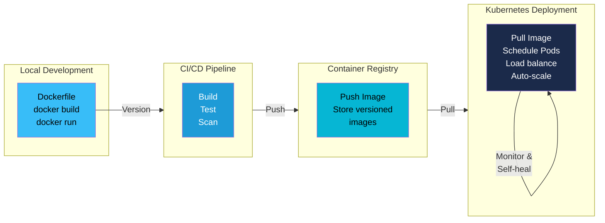

# Docker & Kubernetes: From Containers to Orchestration

Docker revolutionized application deployment, but Kubernetes takes it further by orchestrating thousands of containers across clusters. This guide explains how these tools complement each other and how to deploy Dockerized applications to Kubernetes.

## From Docker to Kubernetes: Why Orchestration is Needed

### Docker to Kubernetes Journey



### The Docker Limitation

Docker is excellent for **packaging and running individual containers**, but it has limitations at scale:

- **Single host management** — Docker runs containers on one machine; scaling across multiple hosts requires manual coordination
- **No automatic failover** — If a container crashes, it doesn't restart automatically
- **Load balancing** — No built-in way to distribute traffic across multiple container instances
- **Cluster networking** — Connecting containers across multiple machines requires manual setup
- **Rolling updates** — No native mechanism for zero-downtime deployments
- **Resource constraints** — No automatic scheduling based on CPU/memory availability

### The Kubernetes Solution

Kubernetes (K8s) is a **container orchestration platform** that automates:

- **Scaling** — Run multiple replicas with one command
- **Self-healing** — Automatically restart failed containers
- **Load balancing** — Distribute traffic across healthy pods
- **Rolling updates** — Deploy new versions without downtime
- **Resource management** — Intelligently schedule containers based on available resources
- **Secrets management** — Securely handle sensitive data
- **Multi-host networking** — Seamless communication across nodes

**In short**: Docker is *how* you containerize; Kubernetes is *how* you run containers at scale.

## How Docker and Kubernetes Work Together

### The Relationship

```
┌─────────────────────────────────────────────────────────────┐
│                     Your Application                         │
├─────────────────────────────────────────────────────────────┤
│                    Dockerfile                                │
│              (Build instructions)                            │
└────────────────────┬────────────────────────────────────────┘
                     │
                     ▼
        ┌────────────────────────┐
        │   Docker Build         │
        │  (docker build)        │
        └────────────┬───────────┘
                     │
                     ▼
        ┌────────────────────────┐
        │   Docker Image         │
        │  (stored in registry)  │
        └────────────┬───────────┘
                     │
                     ▼
        ┌────────────────────────────────────────┐
        │    Kubernetes Cluster                  │
        │  ┌──────────────────────────────────┐  │
        │  │  Pod (contains Docker container) │  │
        │  │  ┌──────────────────────────┐    │  │
        │  │  │ Container (from image)   │    │  │
        │  │  │ (docker run)             │    │  │
        │  │  └──────────────────────────┘    │  │
        │  └──────────────────────────────────┘  │
        │                                        │
        │  Pod ─┐   ┌── Service (Load Balancer) │
        │  Pod ─┼───┤                            │
        │  Pod ─┘   └── Ingress (URL routing)   │
        │                                        │
        │  ReplicaSet (3 replicas)              │
        │  Deployment (rolling updates)         │
        │  Namespaces (logical isolation)       │
        └────────────────────────────────────────┘
```

### The Workflow

1. **Developer writes Dockerfile** — Instructions to build the image
2. **Docker builds the image** — `docker build` creates a layered image
3. **Image pushed to registry** — Image stored in Docker Hub, ECR, GCR, etc.
4. **Kubernetes pulls the image** — K8s pulls from registry and runs containers
5. **Kubernetes manages the containers** — Scaling, networking, updates, self-healing

**Key insight**: Kubernetes doesn't build images; it *runs* Docker (or other container) images. You still need Docker (or a compatible tool) to build.

## Key Kubernetes Concepts for Docker Users

If you know Docker, here's how Kubernetes concepts map:

| Docker Concept | Kubernetes Equivalent | Difference |
|---|---|---|
| `docker run image` | Pod with container | A Pod is a thin wrapper around one or more containers |
| Container | Container in a Pod | K8s runs containers inside Pods |
| Docker Network | Service | Services provide stable IP and DNS for pods |
| Manual scaling | ReplicaSet/Deployment | K8s automatically manages replicas |
| `docker update` | Deployment | Declarative updates with rolling strategies |
| `docker ps` | kubectl get pods | Check running pods across the cluster |
| Container volume | PersistentVolume (PV) | Survives pod deletion; decoupled from nodes |
| Environment variables | ConfigMap + Secrets | ConfigMap for non-sensitive data, Secrets for passwords/keys |
| Port mapping | Service + Ingress | Services expose ports; Ingress routes URLs to services |

### Pod

**Definition**: The smallest deployable unit in Kubernetes. Usually contains one container, but can contain multiple tightly coupled containers.

**Analogy**: If a Docker container is like a single process, a Pod is like a single "machine" that can run one or more containers that share networking and storage.

```yaml
# A Pod with one container
apiVersion: v1
kind: Pod
metadata:
  name: my-app
spec:
  containers:
  - name: app
    image: myapp:1.0
    ports:
    - containerPort: 8080
```

### Deployment

**Definition**: Describes desired state for your application (replicas, image, updates strategy). K8s continuously works to match the current state to the desired state.

**Analogy**: Instead of `docker run`, you declare "I want 3 replicas of my app, and I want rolling updates."

```yaml
apiVersion: apps/v1
kind: Deployment
metadata:
  name: myapp-deployment
spec:
  replicas: 3
  selector:
    matchLabels:
      app: myapp
  template:
    metadata:
      labels:
        app: myapp
    spec:
      containers:
      - name: app
        image: myapp:1.0
        ports:
        - containerPort: 8080
```

### ReplicaSet

**Definition**: Ensures a specified number of pod replicas are running at all times.

**Analogy**: Similar to Docker Swarm's service model—if a pod crashes, ReplicaSet respawns it.

*Note*: You usually don't create ReplicaSets directly; Deployments create them for you.

### Service

**Definition**: Exposes pods to other pods and external traffic. Provides stable IP and DNS name.

**Analogy**: Like Docker's `--network`, but with automatic load balancing across multiple pods.

```yaml
apiVersion: v1
kind: Service
metadata:
  name: myapp-service
spec:
  selector:
    app: myapp
  ports:
  - protocol: TCP
    port: 80           # External port
    targetPort: 8080   # Pod port
  type: LoadBalancer   # or ClusterIP, NodePort
```

### Namespace

**Definition**: Virtual cluster within a physical cluster. Enables multitenancy and resource isolation.

**Analogy**: Like creating separate Docker networks, but for organizational purposes (dev, staging, production).

```bash
# Create a namespace
kubectl create namespace production

# Deploy to a namespace
kubectl apply -f deployment.yaml -n production
```

## Deploying Docker Containers to Kubernetes

### Step 1: Build Your Docker Image

```bash
docker build -t myapp:1.0 .
```

### Step 2: Push to a Container Registry

```bash
# Tag the image
docker tag myapp:1.0 myregistry/myapp:1.0

# Push to registry (Docker Hub example)
docker push myregistry/myapp:1.0
```

### Step 3: Create a Deployment YAML

Create `deployment.yaml`:

```yaml
apiVersion: apps/v1
kind: Deployment
metadata:
  name: myapp
  labels:
    app: myapp
spec:
  replicas: 3
  selector:
    matchLabels:
      app: myapp
  template:
    metadata:
      labels:
        app: myapp
    spec:
      containers:
      - name: myapp
        image: myregistry/myapp:1.0
        ports:
        - containerPort: 8080
        env:
        - name: ENVIRONMENT
          value: production
        resources:
          requests:
            memory: "256Mi"
            cpu: "250m"
          limits:
            memory: "512Mi"
            cpu: "500m"
        livenessProbe:
          httpGet:
            path: /health
            port: 8080
          initialDelaySeconds: 30
          periodSeconds: 10
```

### Step 4: Apply the Deployment

```bash
kubectl apply -f deployment.yaml
```

### Step 5: Expose the Service

Create `service.yaml`:

```yaml
apiVersion: v1
kind: Service
metadata:
  name: myapp-service
spec:
  selector:
    app: myapp
  ports:
  - protocol: TCP
    port: 80
    targetPort: 8080
  type: LoadBalancer
```

Apply it:

```bash
kubectl apply -f service.yaml
```

Get the external IP:

```bash
kubectl get svc myapp-service
```

### Step 6: Verify

```bash
# Check deployment status
kubectl get deployments
kubectl describe deployment myapp

# Check pods
kubectl get pods
kubectl logs <pod-name>

# Check service
kubectl get svc
```

## Docker Compose to Kubernetes: Using Kompose

### Why Convert?

Docker Compose is great for **local development**, but Kubernetes is for **production orchestration**. The `kompose` tool helps bridge them.

### Install Kompose

```bash
# macOS
brew install kompose

# Linux
curl -L https://github.com/kubernetes/kompose/releases/download/v1.28.0/kompose-linux-amd64 -o kompose
chmod +x kompose
sudo mv kompose /usr/local/bin/
```

### Conversion Example

**docker-compose.yml**:

```yaml
version: '3'
services:
  web:
    image: myapp:1.0
    ports:
      - "8080:8080"
    environment:
      DATABASE_URL: postgres://db:5432/mydb
    depends_on:
      - db

  db:
    image: postgres:14
    environment:
      POSTGRES_PASSWORD: secret
    volumes:
      - db-data:/var/lib/postgresql/data

volumes:
  db-data:
```

**Convert to Kubernetes**:

```bash
kompose convert -f docker-compose.yml -o kubernetes/
```

This generates:
- `web-deployment.yaml` — Deployment for the web service
- `db-deployment.yaml` — Deployment for the database
- `web-service.yaml` — Service for the web app
- `db-service.yaml` — Service for the database

### Differences Between Compose and Kubernetes

| Feature | Docker Compose | Kubernetes |
|---|---|---|
| Scope | Single host | Cluster of machines |
| Declarative | Yes | Yes |
| Rolling updates | Manual | Automatic |
| Self-healing | No | Yes |
| Storage | Local or named volumes | PersistentVolumes |
| Networking | Built-in bridge | Services + Ingress |
| Scaling | Manual (replicas) | kubectl scale or HPA |
| Service discovery | DNS (service name) | DNS + environment vars |

**Use Compose for**: Local development, testing, small deployments
**Use Kubernetes for**: Production, multi-host clusters, self-healing requirements

## CI/CD with Docker and Kubernetes

### Complete Pipeline

```
┌──────────────┐
│   Developer  │
│  (git push)  │
└──────┬───────┘
       │
       ▼
┌──────────────────┐
│  GitHub Actions  │
│  (or Jenkins)    │
└────────┬─────────┘
         │
    ┌────┴────────────────────────┐
    ▼                             ▼
┌─────────────────┐      ┌──────────────────┐
│ 1. Build Image  │      │ 2. Run Tests     │
│ (docker build)  │      │ (unit, integration)
└────────┬────────┘      └──────┬───────────┘
         │                      │
         └──────────┬───────────┘
                    ▼
          ┌──────────────────┐
          │ 3. Push to       │
          │    Registry      │
          │ (ECR/Docker Hub) │
          └────────┬─────────┘
                   │
         ┌─────────┴─────────┐
         ▼                   ▼
    ┌──────────┐      ┌──────────┐
    │ Staging  │      │Production│
    │ Cluster  │      │ Cluster  │
    └──────────┘      └──────────┘
```

### Example GitHub Actions Workflow

```yaml
name: Docker Build & Deploy to K8s

on:
  push:
    branches: [ main ]

jobs:
  build-and-deploy:
    runs-on: ubuntu-latest

    steps:
    # Step 1: Checkout code
    - uses: actions/checkout@v3

    # Step 2: Build Docker image
    - name: Build Docker image
      run: |
        docker build -t myapp:${{ github.sha }} .
        docker tag myapp:${{ github.sha }} myapp:latest

    # Step 3: Run tests
    - name: Run tests
      run: |
        docker run myapp:latest npm test

    # Step 4: Push to registry
    - name: Push to Docker Hub
      run: |
        echo "${{ secrets.DOCKER_PASSWORD }}" | docker login -u "${{ secrets.DOCKER_USERNAME }}" --password-stdin
        docker push myapp:${{ github.sha }}
        docker push myapp:latest

    # Step 5: Deploy to Kubernetes
    - name: Deploy to K8s
      run: |
        mkdir -p $HOME/.kube
        echo "${{ secrets.KUBECONFIG }}" | base64 -d > $HOME/.kube/config

        kubectl set image deployment/myapp myapp=myapp:${{ github.sha }} -n production
        kubectl rollout status deployment/myapp -n production
```

### Pipeline Stages Explained

| Stage | Action | Tool |
|---|---|---|
| **Source** | Code pushed to repository | Git/GitHub |
| **Build** | Build Docker image from Dockerfile | Docker |
| **Test** | Run unit/integration tests | Docker (container with test runner) |
| **Push** | Push image to registry | Docker/Registry API |
| **Deploy** | Update K8s deployment with new image | kubectl |
| **Verify** | Check deployment status | kubectl |

## Deployment Strategies

### Rolling Update (Default)

**How it works**: Gradually replace old pods with new ones.

```yaml
spec:
  strategy:
    type: RollingUpdate
    rollingUpdate:
      maxSurge: 1          # Max extra pods during update
      maxUnavailable: 0    # Min pods always available
```

**Pros**: Zero downtime, gradual rollout
**Cons**: Multiple versions running temporarily
**Best for**: Most applications

### Blue-Green Deployment

**How it works**: Run two identical environments (blue = current, green = new). Switch traffic when ready.

```yaml
# Blue environment (current)
apiVersion: v1
kind: Service
metadata:
  name: myapp
spec:
  selector:
    version: blue  # Points to blue deployment

---

# Green environment (new)
apiVersion: apps/v1
kind: Deployment
metadata:
  name: myapp-green
spec:
  template:
    metadata:
      labels:
        version: green
---

# Switch traffic: patch service selector from blue to green
# kubectl patch service myapp -p '{"spec":{"selector":{"version":"green"}}}'
```

**Pros**: Instant rollback, full testing before switch
**Cons**: Double infrastructure, not ideal for stateful apps
**Best for**: Critical services, requires 100% uptime

### Canary Deployment

**How it works**: Send small percentage of traffic to new version, increase gradually.

```yaml
# Using Flagger or manual split with services
# 95% traffic to stable version
# 5% traffic to canary version

apiVersion: v1
kind: Service
metadata:
  name: myapp-stable
---
apiVersion: v1
kind: Service
metadata:
  name: myapp-canary

# Use Ingress to split traffic:
# nginx.ingress.kubernetes.io/canary: "true"
# nginx.ingress.kubernetes.io/canary-weight: "10"  # 10% to canary
```

**Pros**: Detect issues in production with minimal blast radius
**Cons**: More complex monitoring, longer rollout
**Best for**: High-traffic services, risk-sensitive deployments

## Container Runtime Interface (CRI): The Evolution

### Brief History

**Docker Era** (2013–2020): Kubernetes originally integrated tightly with Docker.

**Problem**: Docker was complex; K8s only needed the runtime part (running containers).

**CRI Standard** (2016): Kubernetes introduced the Container Runtime Interface—a standard API for any container runtime.

### Container Runtimes

| Runtime | Description | Current Status |
|---|---|---|
| **Docker** | Full container platform (build, run, manage) | Still popular locally; deprecated in K8s 1.20+ |
| **containerd** | Lightweight runtime (run only) | K8s default since 1.24 |
| **CRI-O** | Minimal CRI implementation | Used by Red Hat OpenShift |
| **Podman** | Docker-compatible, daemonless | Growing adoption |

### Docker to Containerd Migration

**Why containerd?**
- Lighter weight
- CRI-compliant
- Better resource usage
- Faster startup

**Impact**: If you use Docker locally, everything works the same (`docker build`, `docker run`). But Kubernetes clusters typically run `containerd` instead of Docker's full daemon.

**In practice**: You still build Docker images with `docker build`, but K8s uses `containerd` to run them.

## Exercise: Deploy a Dockerized App to Minikube

### Prerequisites

```bash
# Install minikube
brew install minikube  # macOS
# or visit: https://minikube.sigs.k8s.io/docs/start/

# Install kubectl
brew install kubectl

# Start minikube
minikube start

# Verify
kubectl cluster-info
```

### Create a Simple App

**Dockerfile**:

```dockerfile
FROM node:18-alpine
WORKDIR /app
COPY package.json .
RUN npm install
COPY . .
EXPOSE 3000
CMD ["node", "index.js"]
```

**index.js**:

```javascript
const express = require('express');
const app = express();

app.get('/', (req, res) => {
  res.json({ message: 'Hello from Kubernetes!', timestamp: new Date() });
});

app.get('/health', (req, res) => {
  res.status(200).json({ status: 'healthy' });
});

app.listen(3000, () => {
  console.log('Server running on port 3000');
});
```

**package.json**:

```json
{
  "name": "k8s-app",
  "version": "1.0.0",
  "dependencies": {
    "express": "^4.18.2"
  }
}
```

### Build and Deploy

```bash
# Build image (using minikube's Docker)
eval $(minikube docker-env)
docker build -t myapp:1.0 .

# Create deployment YAML
cat > deployment.yaml << 'EOF'
apiVersion: apps/v1
kind: Deployment
metadata:
  name: myapp
spec:
  replicas: 3
  selector:
    matchLabels:
      app: myapp
  template:
    metadata:
      labels:
        app: myapp
    spec:
      containers:
      - name: myapp
        image: myapp:1.0
        imagePullPolicy: Never  # Use local image
        ports:
        - containerPort: 3000
        livenessProbe:
          httpGet:
            path: /health
            port: 3000
          initialDelaySeconds: 10
          periodSeconds: 5
---
apiVersion: v1
kind: Service
metadata:
  name: myapp-service
spec:
  selector:
    app: myapp
  ports:
  - port: 80
    targetPort: 3000
  type: LoadBalancer
EOF

# Deploy
kubectl apply -f deployment.yaml

# Check status
kubectl get pods
kubectl get svc

# Access the app
minikube service myapp-service  # Opens in browser

# View logs
kubectl logs <pod-name>

# Scale up
kubectl scale deployment myapp --replicas=5

# Rolling update
docker build -t myapp:2.0 .
kubectl set image deployment/myapp myapp=myapp:2.0

# Cleanup
kubectl delete -f deployment.yaml
minikube stop
```

### Expected Output

```bash
$ kubectl get pods
NAME                     READY   STATUS    RESTARTS   AGE
myapp-77d8dcf5f-abc12    1/1     Running   0          10s
myapp-77d8dcf5f-def45    1/1     Running   0          10s
myapp-77d8dcf5f-ghi67    1/1     Running   0          10s

$ curl http://localhost:3000
{"message":"Hello from Kubernetes!","timestamp":"2024-03-21T..."}
```

---

## Summary

- **Docker** packages; **Kubernetes** orchestrates
- Kubernetes speaks Docker (and other container formats via CRI)
- Learn the core concepts: Pods, Deployments, Services, Namespaces
- Build once, deploy anywhere: Docker image → Registry → Kubernetes cluster
- Embrace declarative configuration (YAML manifests)
- Use CI/CD pipelines to automate build → test → push → deploy
- Choose deployment strategy (rolling, blue-green, canary) based on risk tolerance
- Start with minikube locally, scale to production clusters

**Next steps**: Explore advanced topics like Helm, Operators, and network policies.
