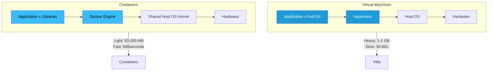
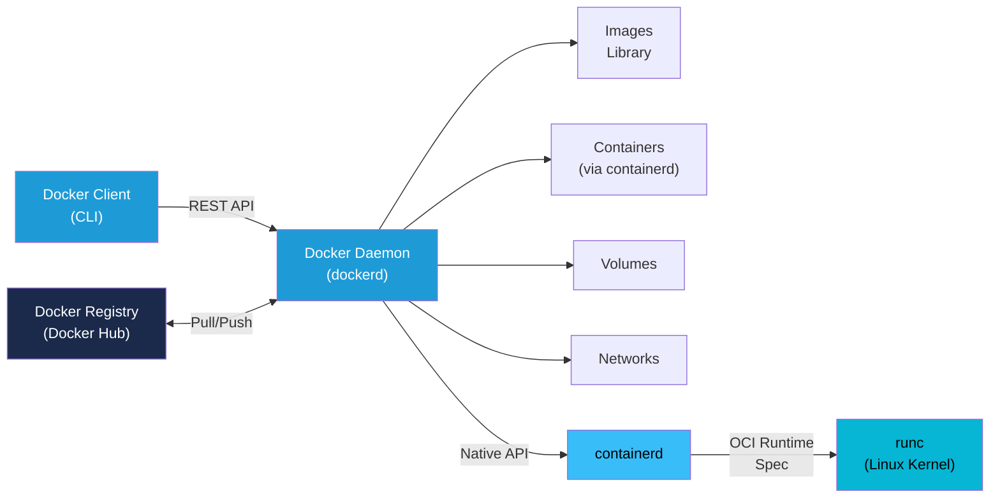

# Docker Fundamentals

## What is Docker?

Docker is a containerization platform that packages your application code, runtime, system tools, and dependencies into a standardized unit called a **container**. Containers are lightweight, portable, and consistent across any environment—from your local machine to production servers.

### The "Works on My Machine" Problem

Before Docker, developers faced a classic problem: an application worked perfectly on their development machine but failed in staging or production due to differences in:

- Operating systems
- Library versions
- Environment variables
- System configurations
- Dependencies

This inconsistency consumed countless hours debugging environmental issues. Docker solved this by containerizing the entire application environment, ensuring it runs identically everywhere.

### How Docker Works: The Container Approach

A Docker container wraps your application with everything it needs to run:

```
┌──────────────────────────────┐
│     Docker Container         │
├──────────────────────────────┤
│     Your Application         │
├──────────────────────────────┤
│   Runtime (Node, Python, etc)│
├──────────────────────────────┤
│   System Libraries & Tools   │
├──────────────────────────────┤
│   Operating System Layer     │
├──────────────────────────────┤
│   Shared Host Kernel         │
└──────────────────────────────┘
```

The key insight: containers don't contain a full OS. They share the host's kernel but isolate the filesystem, processes, and network. This makes them lightweight and fast compared to virtual machines.

---

## Containers vs Virtual Machines

Understanding the difference between containers and virtual machines (VMs) is crucial for choosing the right tool.

### Detailed Comparison

| Aspect | Containers | Virtual Machines |
|--------|-----------|------------------|
| **Isolation Level** | Process and filesystem isolation | Complete OS isolation |
| **Boot Time** | Milliseconds | 30 seconds to minutes |
| **Size** | Megabytes (typically 5-500 MB) | Gigabytes (1-20 GB) |
| **Performance** | Near-native (minimal overhead) | 5-10% performance overhead |
| **OS Flexibility** | Must use same kernel as host | Can run different OS |
| **Resource Usage** | ~1-2% per container | 10-15% per VM minimum |
| **Density** | Hundreds per host | Tens per host |
| **Startup Speed** | Immediate | Several seconds |
| **Portability** | High (Linux kernel compatible) | High (works across platforms) |
| **Use Case** | Microservices, CI/CD, rapid scaling | Legacy apps, strict isolation, different OSes |

### Visual Architecture Comparison



**When to use each:**
- **Containers**: Microservices, CI/CD pipelines, cloud-native apps, rapid scaling
- **VMs**: Legacy applications, strict security boundaries, running different OS families

---

## Docker Architecture

Docker uses a **client-server architecture** where components communicate via a REST API. Understanding this architecture is essential for working effectively with Docker.

### Core Components

#### 1. Docker Client
The command-line interface (CLI) you interact with daily. Commands like `docker build`, `docker run`, and `docker pull` are sent to the Docker Daemon via the REST API.

#### 2. Docker Daemon (dockerd)
The server process running on the host machine that manages:
- Creating and running containers
- Building images
- Managing volumes and networks
- Storing and retrieving images from registries

#### 3. Docker Engine
The complete runtime that combines the Docker Daemon with containerd and runc.

#### 4. containerd
A high-level container runtime that manages the container lifecycle. It handles pulling images, creating containers, and delegating low-level operations to runc.

#### 5. runc
The low-level container runtime that interacts directly with the Linux kernel to:
- Create namespaces (for isolation)
- Set up cgroups (for resource limits)
- Mount filesystems
- Create the actual container process

#### 6. Docker Registry
A service storing and distributing Docker images. Docker Hub is the default public registry, but organizations can run private registries.

### Docker Architecture Diagram



### Communication Flow

1. You run `docker run nginx`
2. Docker CLI sends a request to the Docker Daemon via REST API
3. Docker Daemon checks if the `nginx` image exists locally
4. If not, it pulls the image from Docker Registry
5. The Daemon instructs containerd to create a container
6. containerd uses runc to interact with the kernel
7. The container starts and the Daemon returns control

---

## Images vs Containers

This distinction is fundamental to Docker. Think of it this way:
- **Image** = Blueprint or template (read-only)
- **Container** = Running instance based on that blueprint (writable)

### Images: The Blueprint

A Docker image is a lightweight, standalone, executable package containing:
- Application code
- Runtime environment (Python 3.11, Node.js 18, etc.)
- System libraries and tools
- Environment variables and default configurations

Key characteristics:
- **Read-only**: Images never change once built
- **Layered**: Built from multiple filesystem layers (see next section)
- **Portable**: Same image runs everywhere
- **Reusable**: One image can create many containers

### Containers: The Running Instance

A container is a running process created from an image. Multiple containers can run from the same image simultaneously, each with its own:
- Isolated filesystem (writable layer on top of image)
- Process namespace
- Network interfaces
- Environment variables
- Resource constraints

### The Relationship Visualized

```
                    Docker Image
                  (Read-only template)
                 ┌──────────────────┐
                 │  nginx:latest    │
                 │  - OS layer      │
                 │  - Library layer │
                 │  - App layer     │
                 └──────────────────┘
                        │
         ┌──────────────┼──────────────┐
         │              │              │
         ▼              ▼              ▼
    Container 1    Container 2    Container 3
    (Writable)     (Writable)     (Writable)
    Port 8080      Port 8081      Port 8082
    Running        Running        Running
```

### Union File System and Copy-on-Write

Docker uses the **Union File System** (AUFS, OverlayFS, etc.) with a **copy-on-write (CoW)** mechanism:

1. **Layered Storage**: The image consists of read-only layers stacked on top of each other
2. **Container Layer**: When a container starts, a thin writable layer is added on top
3. **Copy-on-Write**: When a file is modified, only that file is copied from the read-only layer to the writable layer
4. **Efficiency**: Unchanged files are shared between containers, saving disk space

**Example:**
```
Container 1 (8KB writable)     Container 2 (8KB writable)
    ↓                              ↓
┌─────────────────────────────────────┐
│  Image Layer 3 (modified app.js)    │ (shared, 100KB)
├─────────────────────────────────────┤
│  Image Layer 2 (system libraries)   │ (shared, 300MB)
├─────────────────────────────────────┤
│  Image Layer 1 (base OS)            │ (shared, 200MB)
└─────────────────────────────────────┘

Result: Two containers using only 216MB total
        instead of 412MB each (if duplicated)
```

---

## Docker Image Layers

Every Docker image is built as a series of **layers**. Understanding layers is crucial for writing efficient Dockerfiles and optimizing build times.

### How Layers Work

Each instruction in a Dockerfile creates a new layer. The complete image is a union of all layers stacked on top of each other.

**Example Dockerfile and its layers:**

```dockerfile
FROM ubuntu:22.04              # Layer 1: Base OS (200MB)
RUN apt-get update             # Layer 2: Package index updates
RUN apt-get install -y python3 # Layer 3: Python runtime (150MB)
COPY app.py /app/              # Layer 4: Application code (50KB)
CMD ["python3", "/app/app.py"] # Layer 5: Metadata (no size)
```

Results in 5 layers totaling ~350MB.

### Docker Layer Caching

Docker caches each layer to speed up subsequent builds:

```
Build 1: FROM ubuntu → RUN apt-get → RUN install python3 → COPY app.py
         (first time, all steps run)

Build 2: FROM ubuntu → RUN apt-get → RUN install python3 → COPY app.py
         (cache hit for first 3 layers, only COPY runs)
```

**Cache invalidation rules:**
- If a layer changes, all subsequent layers rebuild (even if unchanged)
- A layer is considered "changed" if:
  - The Dockerfile instruction changes
  - Any ADD/COPY source files change
  - Environment variables change
  - Parent image updates

### Optimizing Layer Order

**Wrong (inefficient):**
```dockerfile
FROM python:3.11
COPY . /app               # COPY changes frequently
RUN pip install -r requirements.txt  # Cache misses every time
WORKDIR /app
CMD ["python", "app.py"]
```

Each code change invalidates the pip install cache, forcing a full reinstall.

**Right (efficient):**
```dockerfile
FROM python:3.11
WORKDIR /app
COPY requirements.txt .   # Separate from code
RUN pip install -r requirements.txt  # Cache persists
COPY . /app               # COPY code last (most frequent changes)
CMD ["python", "app.py"]
```

Now dependency installs are cached unless `requirements.txt` changes.

### Viewing Image Layers

```bash
# See all layers of an image
docker history nginx:latest

# See layer sizes
docker history --human nginx:latest

# Inspect detailed layer information
docker inspect nginx:latest
```

---

## Docker Registry & Docker Hub

A Docker **registry** is a centralized service that stores and distributes Docker images. It's the equivalent of GitHub for container images.

### Types of Registries

#### Public Registries
- **Docker Hub** (default): Millions of community images, free tier available
- **GitHub Container Registry (ghcr.io)**: GitHub-integrated registry
- **GitLab Registry**: GitLab CI/CD integrated
- **Quay.io**: Red Hat's container registry with advanced features

#### Private Registries
- **Docker Registry**: Open-source registry you can self-host
- **Amazon ECR**: AWS Elastic Container Registry
- **Azure Container Registry**: Microsoft's registry
- **Google Artifact Registry**: GCP's registry
- **Harbor**: Enterprise-grade open-source registry

### Docker Hub

Docker Hub is the default public registry with over 14 million images. It's built into Docker and requires zero configuration for basic use.

**Official images** have the Docker seal of approval:
- Maintained by Docker or vendor
- Follow best practices
- Regularly scanned for vulnerabilities
- Examples: `ubuntu`, `nginx`, `python`, `postgres`

### Pulling Images

```bash
# Pull from Docker Hub (default)
docker pull nginx

# Pull specific version
docker pull nginx:1.25-alpine

# Pull from private registry
docker pull myregistry.azurecr.io/myapp:v1.0

# Pull all tags of an image
docker pull -a myimage
```

### Pushing Images

Before pushing, you must:
1. Tag your image with the registry URL
2. Authenticate with the registry
3. Push the image

```bash
# Tag image for Docker Hub
docker tag myapp:latest yourname/myapp:latest

# Login to Docker Hub
docker login

# Push to Docker Hub
docker push yourname/myapp:latest

# Push to private registry
docker tag myapp:v1.0 myregistry.azurecr.io/myapp:v1.0
docker login myregistry.azurecr.io
docker push myregistry.azurecr.io/myapp:v1.0
```

### Image Naming Convention

Docker image names follow this format:
```
[REGISTRY]/[NAMESPACE]/[REPOSITORY]:[TAG]

Examples:
- nginx                          (Docker Hub official)
- dockerhub.io/library/nginx     (fully qualified)
- myregistry.io/team/myapp:v1.0  (private registry)
- ghcr.io/yourname/project:main  (GitHub registry)
```

**Components:**
- **Registry**: Where the image is stored (defaults to Docker Hub)
- **Namespace**: Usually your username or organization
- **Repository**: The image name
- **Tag**: Version identifier (defaults to `latest`)

---

## Why Docker? The Business Case

Organizations adopt Docker for concrete, measurable benefits:

### 1. **Consistency Across Environments**

Problem: "Works on my machine but not in production"

Solution: Docker guarantees identical environments from development → testing → staging → production.

**Impact:**
- Eliminate environment-related bugs
- Reduce deployment failures
- Speed up problem diagnosis

### 2. **Microservices Enablement**

Docker's lightweight nature makes microservices architectures practical:
- Deploy dozens of independent services per server
- Scale individual services based on demand
- Develop and deploy services independently
- Isolate failures to specific services

**Impact:**
- Faster feature deployment (minutes instead of hours/days)
- Improved system resilience
- Better resource utilization

### 3. **Resource Efficiency**

Containers use significantly fewer resources than VMs:

```
Example: Running 100 application instances

VMs (2GB each):
- 100 × 2GB = 200GB required
- 100 boot processes
- High licensing costs for OS

Containers (100MB each):
- 100 × 100MB = 10GB required (20× more efficient)
- Instant startup
- Single OS license
```

**Impact:**
- Reduce infrastructure costs by 50-70%
- Run more workloads per server
- Lower cloud bills

### 4. **Faster Deployments**

Containers enable rapid, reliable deployments:

```
Traditional VM: Deploy → Boot → Start app → Health check = 2-5 minutes
Container:      Deploy → Start app → Health check = 10-30 seconds
```

**Impact:**
- Reduce deployment time 90%
- Enable multiple deployments per day
- Faster time-to-market for features

### 5. **Developer Productivity**

Developers can:
- Run production-like environments locally
- Test infrastructure changes
- Collaborate with consistent environments
- Onboard new team members faster

**Impact:**
- Reduced "works on my machine" issues
- Faster development cycle
- Better code quality

### 6. **Operational Simplicity**

Standardized units simplify operations:
- Same deployment process for all applications
- Reduced operational complexity
- Better logging and monitoring
- Easier troubleshooting

**Impact:**
- Reduce operational overhead
- Faster incident resolution
- Improved system reliability

---

## Microservices Architecture with Docker

Docker is the enabling technology for microservices. Let's understand how.

### Monolithic vs Microservices

**Monolithic Architecture:**
```
┌────────────────────────────┐
│  E-Commerce Application    │
├────────────────────────────┤
│ ├─ User Management         │
│ ├─ Product Catalog         │
│ ├─ Shopping Cart           │
│ ├─ Payment Processing      │
│ ├─ Order Management        │
│ ├─ Inventory               │
│ └─ Shipping                │
└────────────────────────────┘
     Single Database
     Single Deployment
     Single Technology Stack
```

**Problems:**
- One bug can bring down the entire system
- Scaling: must scale entire app, not individual components
- Technology lock-in: all services use same language/framework
- Deployment: any change requires testing the entire application
- Development bottleneck: large teams step on each other's toes

**Microservices Architecture:**
```
┌─────────────┐  ┌─────────────┐  ┌─────────────┐
│   User      │  │   Product   │  │   Payment   │
│ Service     │  │  Service    │  │  Service    │
│ (Node.js)   │  │  (Python)   │  │  (Java)     │
└─────────────┘  └─────────────┘  └─────────────┘
      │                │                │
      ▼                ▼                ▼
   User DB         Product DB      Payment DB

┌─────────────┐  ┌─────────────┐  ┌─────────────┐
│   Cart      │  │   Order     │  │ Inventory   │
│ Service     │  │  Service    │  │  Service    │
│ (Go)        │  │  (Node.js)  │  │  (Python)   │
└─────────────┘  └─────────────┘  └─────────────┘
      │                │                │
      ▼                ▼                ▼
   Cart DB         Order DB        Inventory DB
```

**Advantages:**
- **Independent Scaling**: Scale only the Payment Service during sales
- **Technology Freedom**: Use Python for ML tasks, Go for high-performance services, Java for enterprise features
- **Rapid Deployment**: Deploy User Service without testing Cart Service
- **Resilience**: Payment Service failure doesn't crash the entire site
- **Team Autonomy**: Different teams own different services

### How Docker Enables Microservices

1. **Consistency**: Each service runs in its own container with identical behavior everywhere
2. **Lightweight**: Hundreds of containers run on a single server
3. **Fast Startup**: Services start in milliseconds, enabling dynamic scaling
4. **Isolation**: Services can't interfere with each other
5. **Deployment**: Same deployment process for all services

### Example: E-Commerce Microservices Deployment

```bash
# User Service (Node.js)
docker run -d --name user-service \
  -p 3001:3000 \
  -e DB_HOST=postgres \
  user-service:v1.0

# Product Service (Python)
docker run -d --name product-service \
  -p 3002:3000 \
  -e DB_HOST=postgres \
  product-service:v1.0

# Payment Service (Java)
docker run -d --name payment-service \
  -p 3003:8080 \
  -e DB_HOST=postgres \
  payment-service:v1.0

# All three services run independently
# Each can be scaled, updated, or restarted independently
```

---

## Docker Engine Components

The Docker Engine is composed of three essential components that work together to create and manage containers.

### 1. Docker Daemon (dockerd)

The server process that manages Docker objects and operations.

**Responsibilities:**
- Listen for Docker API requests from the CLI or SDKs
- Manage images (build, pull, store)
- Manage containers (create, start, stop, delete)
- Manage networks and volumes
- Handle authentication and image signing
- Coordinate with containerd

**Lifecycle:**
```bash
# Start Docker Daemon (usually started automatically)
sudo systemctl start docker

# Check if daemon is running
docker version

# View daemon logs
journalctl -u docker -f
```

**Configuration:**
Daemon settings in `/etc/docker/daemon.json`:
```json
{
  "debug": false,
  "storage-driver": "overlay2",
  "log-driver": "json-file",
  "max-concurrent-downloads": 5,
  "max-concurrent-uploads": 5,
  "insecure-registries": ["myregistry.io"]
}
```

### 2. Docker Client

The CLI tool you use to interact with Docker. Sends commands to the Docker Daemon.

**Common commands:**
```bash
docker build    # Build images from Dockerfile
docker run      # Create and run containers
docker pull     # Download images from registry
docker push     # Upload images to registry
docker logs     # View container output
docker exec     # Run commands inside containers
docker ps       # List running containers
docker images   # List available images
docker network  # Manage networks
docker volume   # Manage volumes
docker compose  # Multi-container applications
```

**Client-Daemon Communication:**
By default, clients connect to `/var/run/docker.sock` (Unix socket) on the same machine. For remote connections:
```bash
# Connect to remote Docker daemon
docker -H tcp://remote-host:2375 ps

# Set DOCKER_HOST environment variable
export DOCKER_HOST=tcp://remote-host:2375
```

### 3. REST API

Underlying protocol that enables client-daemon communication.

**Access the API directly:**
```bash
# List containers via API
curl --unix-socket /var/run/docker.sock \
  http://localhost/v1.40/containers/json

# Inspect an image
curl --unix-socket /var/run/docker.sock \
  http://localhost/v1.40/images/nginx/json
```

**API Versions:**
Docker maintains multiple API versions for backward compatibility. Current version is typically 1.40+. Check with:
```bash
docker version
# Shows both Client API and Server API versions
```

### Component Interaction Flow

```
┌──────────────────────────────────────────────┐
│         Docker Client (CLI)                  │
│  docker run -d --name web nginx              │
└──────────────┬───────────────────────────────┘
               │ REST API
               │ POST /containers/create
               │
┌──────────────▼───────────────────────────────┐
│      Docker Daemon (dockerd)                 │
│  ├─ Validate request                         │
│  ├─ Check if nginx:latest image exists       │
│  ├─ If not, pull from registry               │
│  └─ Delegate to containerd                   │
└──────────────┬───────────────────────────────┘
               │ Native API
               │
┌──────────────▼───────────────────────────────┐
│        containerd                            │
│  ├─ Prepare container rootfs                 │
│  ├─ Set up cgroups                           │
│  ├─ Create namespaces                        │
│  └─ Delegate process creation to runc        │
└──────────────┬───────────────────────────────┘
               │ OCI Runtime Spec
               │
┌──────────────▼───────────────────────────────┐
│        runc (OCI Runtime)                    │
│  ├─ Create Linux namespaces                  │
│  ├─ Apply cgroup limits                      │
│  ├─ Mount filesystems                        │
│  └─ Execute container process                │
└──────────────┬───────────────────────────────┘
               │
┌──────────────▼───────────────────────────────┐
│      Linux Kernel                            │
│  Container process runs isolated             │
└───────────────────────────────────────────────┘
```

---

## Quick Start: Your First Containers

Get hands-on with Docker in minutes.

### 1. Verify Docker is Installed

```bash
docker --version
docker run hello-world
```

The `hello-world` container confirms Docker works correctly.

### 2. Run an Interactive Container

Explore Ubuntu's environment interactively:

```bash
docker run -it ubuntu bash
```

Inside the container, you can:
```bash
apt update
apt install -y curl
curl https://example.com
exit  # Exit the container
```

**Flags explained:**
- `-it` = Interactive terminal (attach stdin/stdout)
- `ubuntu` = Image to run
- `bash` = Command to execute

### 3. Run a Web Server

Start an Nginx web server:

```bash
docker run -d -p 8080:80 nginx
```

Then visit `http://localhost:8080` in your browser.

**Flags explained:**
- `-d` = Detached (run in background)
- `-p 8080:80` = Map port 8080 on host to port 80 in container
- `nginx` = Image to run

**Verify it's running:**
```bash
docker ps  # See all running containers
```

**Stop the container:**
```bash
docker stop <container_id>
```

### 4. Run a Database Container

Start a PostgreSQL database:

```bash
docker run -d \
  --name postgres-db \
  -e POSTGRES_PASSWORD=mysecret \
  -p 5432:5432 \
  postgres:15
```

**Connect to it:**
```bash
docker exec -it postgres-db psql -U postgres
# Now you're inside the PostgreSQL CLI
```

### 5. View Container Logs

```bash
# See last 100 lines of logs
docker logs --tail 100 postgres-db

# Follow logs in real-time
docker logs -f postgres-db

# Exit with Ctrl+C
```

### 6. Inspect Running Containers

```bash
# List all running containers
docker ps

# List all containers (including stopped)
docker ps -a

# Get detailed information about a container
docker inspect <container_id>

# View resource usage
docker stats
```

### 7. Clean Up

```bash
# Stop a container
docker stop <container_id>

# Remove a stopped container
docker rm <container_id>

# Remove an image
docker rmi nginx

# Remove all stopped containers
docker container prune

# Remove dangling images
docker image prune
```

---

## What's Next?

You now understand Docker fundamentals. Continue your learning journey:

- **[Docker Images](./images.md)** — Build custom images with Dockerfiles
- **[Container Networking](./networking.md)** — Connect multiple containers
- **[Docker Volumes](./volumes.md)** — Persist data across containers
- **[Docker Compose](./docker-compose.md)** — Multi-container applications
- **[Best Practices](./best-practices.md)** — Write efficient, secure Dockerfiles
- **[Docker Security](./security.md)** — Secure your containers in production

### Recommended Learning Path

1. Build and run your first custom image
2. Connect multiple containers with networks
3. Use Docker Compose to orchestrate multi-container apps
4. Deploy to a container orchestration platform (Kubernetes)

---

## Summary

Docker revolutionizes application deployment by solving the "works on my machine" problem through containerization. Understanding images as templates, containers as instances, and the layered architecture enables you to build, ship, and run applications reliably across any environment. The Docker Engine's client-server architecture ensures scalability and consistency, while microservices architectures leverage Docker's lightweight nature to create resilient, independently deployable systems.
