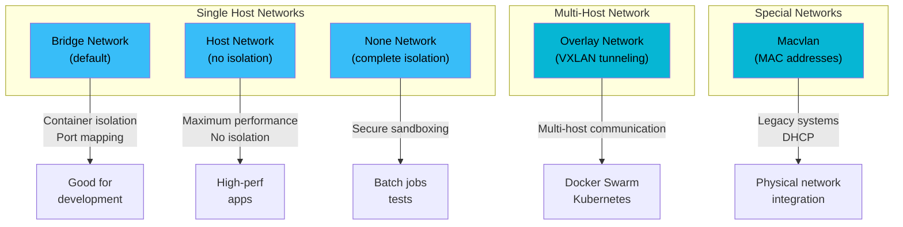
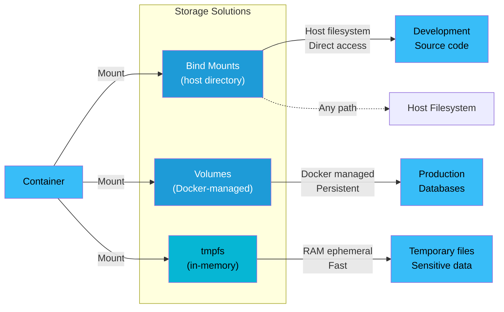

# Docker Networking & Storage

Master container networking and persistent data management. This guide covers how Docker isolates and connects containers, manages networks across hosts, and persists data beyond container lifetime.

---

## Docker Networking Overview

Docker containers don't exist in isolation—they need to communicate with each other, the host, and external networks. Docker's networking layer abstracts this complexity using **network namespaces** (Linux kernel feature) to provide each container its own isolated network stack.

### Key Concepts

**Network Namespaces**: Linux kernel feature that provides process isolation. Each container has its own:
- Network interfaces
- Routing table
- Firewall rules (iptables)
- IP addresses and ports

**Container Network Model (CNM)**: Docker's architecture for container networking consists of three components:

1. **Sandbox**: Network namespace for the container
2. **Endpoint**: Virtual network interface (veth pair) connecting the container to a network
3. **Network**: Docker-managed network connecting multiple endpoints

```
┌─────────────────────────────────────────┐
│         Docker Network Namespace        │
├─────────────────────────────────────────┤
│                                         │
│  ┌──────────────┐    ┌──────────────┐  │
│  │ Container 1  │    │ Container 2  │  │
│  │ Sandbox      │    │ Sandbox      │  │
│  └──────┬───────┘    └──────┬───────┘  │
│         │ Endpoint          │ Endpoint  │
│         └──────────┬────────┘           │
│                    │                    │
│              Network (bridge)           │
│                    │                    │
│         ┌──────────┴──────────┐         │
│         │   Virtual Bridge    │         │
│         │   (docker0, br-xxx) │         │
│         └────────────────────┘         │
│                                         │
└─────────────────────────────────────────┘
         │ (veth pair)
         ↓ Host Network Stack
```

---

## Network Drivers

Docker supports multiple network drivers, each optimized for different use cases. You select a driver when creating a network or running a container.

### Network Drivers Architecture



### 1. Bridge (Default)

The default driver for standalone containers on a single host.

**How it works**:
- Docker creates a virtual bridge interface (e.g., `docker0`, `br-1234567890ab`)
- Each container gets a virtual Ethernet interface (veth) paired to the bridge
- Containers on the same bridge can communicate directly
- Containers are isolated from those on other bridges
- Port mapping routes traffic from host to container

**Key characteristics**:
- **Isolation**: Containers on different bridges are isolated
- **Performance**: Near-native speeds
- **Persistence**: Bridge persists across container restarts
- **Automatic DNS**: Only on user-defined bridges (not `docker0`)

**Bridge Diagram**:

```
Host Network Stack
    ↓
┌───────────────────────────────────────┐
│  bridge (docker0 or br-xxx)           │
│  IP: 172.17.0.1 (or 172.18.0.1, etc) │
└────────────┬────────────────────┬─────┘
             │                    │
        ┌────▼─────┐         ┌────▼─────┐
        │veth1234  │         │veth5678  │
        │(pair)    │         │(pair)    │
        └────┬─────┘         └────┬─────┘
             │                    │
        ┌────▼──────────┐    ┌────▼──────────┐
        │  Container 1  │    │  Container 2  │
        │ eth0:172.17.0.2 │    │ eth0:172.17.0.3 │
        └───────────────┘    └───────────────┘
```

**When to use**: Most standalone containers, development, single-host applications.

### 2. Host

Containers share the host's network stack—no isolation, maximum performance.

**How it works**:
- Container uses host's network interfaces directly
- No veth pairs, no bridge
- Container and host have identical IP addresses and ports
- Port mapping is unnecessary (not allowed with `--net host`)

**Key characteristics**:
- **Performance**: Lowest overhead, native performance
- **Isolation**: None (security implications)
- **IP Address**: Shared with host
- **Use Case**: High-performance applications, network appliances

**When to use**: Monitoring tools, network proxies, services requiring maximum throughput.

**Important**: Host mode is unavailable on Docker Desktop (Windows/Mac) due to virtualization.

### 3. None

Complete network isolation—containers have no external connectivity.

**How it works**:
- Container has only a loopback interface (`lo`)
- No external network access
- Containers cannot communicate with each other

**Key characteristics**:
- **Isolation**: Complete
- **Use Cases**: Batch jobs, sandboxing, tests

**When to use**: Security-sensitive operations, isolated workloads, testing.

### 4. Overlay

Multi-host networking for distributed systems (Swarm, Kubernetes).

**How it works**:
- Creates virtual networks spanning multiple Docker hosts
- Uses VXLAN (Virtual eXtensible LAN) tunneling
- Each host runs a VXLAN tunnel endpoint
- Packets are encapsulated and sent through the tunnel

**Key characteristics**:
- **Multi-host**: Connects containers across different machines
- **Automatic Discovery**: Service discovery built-in
- **Performance**: Slight overhead due to encapsulation
- **Encryption**: Optional network-level encryption
- **Requirements**: Docker Swarm or Kubernetes

**When to use**: Swarm services, multi-host deployments, microservices architecture.

### 5. Macvlan

Assigns each container a unique MAC address, making it appear as a physical device on the network.

**How it works**:
- Bypasses Docker's NAT
- Containers get IP addresses from the host's network (not a separate subnet)
- Each container has its own MAC address
- Useful for legacy systems or DHCP scenarios

**Key characteristics**:
- **MAC Address**: Unique per container
- **IP Assignment**: From existing network (via DHCP or static)
- **Performance**: Direct network attachment
- **Limitations**: Parent interface cannot be used by host in some configurations

**When to use**: Integrating containers with physical networks, legacy applications, VLAN scenarios.

---

## Network Drivers Comparison Table

| Feature | Bridge | Host | None | Overlay | Macvlan |
|---------|--------|------|------|---------|---------|
| **Scope** | Single host | Single host | Single host | Multi-host | Single host |
| **Isolation** | Yes | No | Complete | Yes | Partial |
| **Performance** | Good | Excellent | N/A | Good | Excellent |
| **Port Mapping** | Yes | No | No | Yes | Optional |
| **DNS** | Automatic (user-defined) | Host's DNS | N/A | Built-in | Host's DNS |
| **Use Case** | Default, development | High-perf | Isolation | Swarm/K8s | Legacy systems |
| **Multi-host** | No | No | No | Yes | No |

---

## Network Commands Cheat Sheet

### Create and Manage Networks

```bash
# List all networks
docker network ls

# Create a custom bridge network
docker network create mynet
docker network create --driver bridge --subnet 172.20.0.0/16 mynet

# Create an overlay network (Swarm only)
docker network create --driver overlay myswarmnet

# Inspect a network (detailed info: containers, IP config, driver options)
docker network inspect mynet

# Connect a running container to a network
docker network connect mynet container1

# Disconnect a container from a network
docker network disconnect mynet container1

# Remove a network
docker network rm mynet

# Remove all unused networks
docker network prune

# Create network with custom driver options
docker network create --driver bridge \
  --opt "com.docker.network.bridge.name"=br0 \
  --opt "com.docker.network.driver.mtu"=9000 \
  mynet
```

### View Network Info

```bash
# List networks with custom format
docker network ls --format "table {{.Name}}\t{{.Driver}}\t{{.Scope}}"

# Get container's network info
docker inspect --format='{{json .NetworkSettings}}' container1 | jq

# Check which networks a container is connected to
docker inspect --format='{{range $k := .NetworkSettings.Networks}}{{$k.IPAddress}} {{end}}' container1
```

---

## Container-to-Container Communication

Containers need to communicate reliably. Docker provides several methods:

### User-Defined Bridge Networks (Recommended)

**Best practice**: Create a custom bridge network and connect containers to it.

```bash
# Create custom network
docker network create myapp

# Run containers on the custom network
docker run -d --name web --network myapp nginx
docker run -d --name db --network myapp postgres

# Now 'web' can reach 'db' by hostname!
docker exec web curl http://db:5432  # Works!
```

**Why this works**: Docker's embedded DNS server automatically resolves container names to IP addresses on user-defined bridges.

```bash
# Inside the 'web' container
root@web:~# getent hosts db
172.18.0.3  db

root@web:~# curl http://db:5432
(connects to postgres service)
```

### Default Bridge (docker0)

The `docker0` bridge does NOT have automatic DNS resolution by name.

```bash
# This won't work on docker0!
docker run --name web busybox
docker run --name db busybox
docker exec web ping db  # FAILS: "unknown host"
```

**Workaround**: Use `--link` (legacy, deprecated):

```bash
docker run -d --name db busybox
docker run -d --name web --link db busybox
docker exec web ping db  # Now works, but don't use this!
```

### Legacy Linking (Deprecated)

Don't use `--link` for new applications—use custom bridge networks instead. Linking:
- Only works on the default bridge
- Doesn't survive container restart with new IP
- Creates tight coupling between containers

---

## Port Mapping

Port mapping exposes container ports on the host, allowing external access.

### The `-p` Flag

**Syntax**: `-p [HOST_IP:]HOST_PORT:CONTAINER_PORT[/PROTOCOL]`

```bash
# Map container port 80 to host port 8080
docker run -d -p 8080:80 nginx

# Map to specific host interface
docker run -d -p 127.0.0.1:8080:80 nginx  # localhost only
docker run -d -p 0.0.0.0:8080:80 nginx    # all interfaces (default)

# Map multiple ports
docker run -d -p 8080:80 -p 8443:443 nginx

# Map port range
docker run -d -p 9000-9010:3000-3010 myapp

# Specify protocol
docker run -d -p 8080:80/tcp -p 5353:5353/udp myapp
```

### Publishing All Ports (`-P`)

```bash
# Publish all EXPOSE'd ports to random host ports
docker run -d -P nginx

# Check which ports were mapped
docker port nginx
# Output:
# 80/tcp -> 0.0.0.0:32768
# 443/tcp -> 0.0.0.0:32769
```

### Port Mapping Diagram

```
┌──────────────────────────────────────┐
│  Host (192.168.1.100)                │
│  Port 8080 listening                 │
└─────────────────┬────────────────────┘
                  │ iptables NAT rule
                  ↓
┌──────────────────────────────────────┐
│  Docker Bridge (172.17.0.1)          │
└─────────────────┬────────────────────┘
                  │
                  ↓
┌──────────────────────────────────────┐
│  Container (172.17.0.2)              │
│  Port 80 (Nginx listening)           │
└──────────────────────────────────────┘

curl http://192.168.1.100:8080
  ↓ (host network)
iptables NAT: 8080 → container 172.17.0.2:80
  ↓
Request reaches container's Nginx
```

### Common Port Mapping Patterns

```bash
# Web application
docker run -d -p 80:3000 -p 443:3443 myapp

# Database (usually NOT exposed to host)
docker run -d --network mynet -e POSTGRES_PASSWORD=secret postgres
# No -p flag! Access via container name instead

# Multiple services with different interfaces
docker run -d -p 127.0.0.1:6379:6379 redis       # Local only
docker run -d -p 0.0.0.0:5432:5432 postgres     # All interfaces
```

---

## Docker Storage Overview

By default, container data is **ephemeral**—it's lost when the container is removed.

### Volume Architecture: Persistence Methods



### Container Layers

Docker uses a **union filesystem** to layer container changes:

```
┌─────────────────────────────────────┐
│  Container Layer (writable)         │ ← Your writes go here
├─────────────────────────────────────┤
│  Image Layer 3 (read-only)          │
├─────────────────────────────────────┤
│  Image Layer 2 (read-only)          │
├─────────────────────────────────────┤
│  Base Layer (read-only)             │
└─────────────────────────────────────┘
```

The container layer is **temporary**. When you `docker rm`, that layer is deleted.

### Why Data Doesn't Persist

```bash
docker run -d --name db postgres
# ... write data to /var/lib/postgresql/data ...
docker rm db
# ❌ All data is gone! The container layer is deleted.
```

### Three Persistence Methods

1. **Volumes**: Managed by Docker, best for most use cases
2. **Bind Mounts**: Mount host directories, great for development
3. **tmpfs Mounts**: In-memory storage, ephemeral and fast

---

## Volumes

Docker-managed volumes are the recommended way to persist data.

### What Are Volumes?

- **Managed by Docker**: Located in `/var/lib/docker/volumes/` (on Linux)
- **Persistent**: Survive container removal
- **Shareable**: Multiple containers can use the same volume
- **Driver support**: Local, NFS, cloud storage plugins
- **Easy backup**: Docker provides volume utilities

### Volume Commands

```bash
# Create a volume
docker volume create mydata

# List volumes
docker volume ls

# Get detailed volume info (mount point, labels, driver)
docker volume inspect mydata

# Remove a volume
docker volume rm mydata

# Remove all unused volumes
docker volume prune

# Create volume with specific driver
docker volume create --driver local mydata

# Create volume with NFS driver (requires plugin)
docker volume create --driver nfs \
  --opt type=nfs \
  --opt o=addr=192.168.1.100,vers=4,soft,timeo=180,bg,tcp \
  --opt device=:/export/data \
  nfsdata
```

### Mounting Volumes

**Short syntax** (`-v`):
```bash
docker run -d -v mydata:/app/data nginx
# Format: -v VOLUME_NAME:CONTAINER_PATH[:ro|rw]

docker run -d -v mydata:/app/data:ro nginx  # Read-only
docker run -d -v mydata:/app/data:rw nginx  # Read-write (default)
```

**Long syntax** (`--mount`):
```bash
docker run -d \
  --mount type=volume,source=mydata,target=/app/data \
  nginx

# With options
docker run -d \
  --mount type=volume,source=mydata,target=/app/data,readonly \
  nginx

# Multiple volumes
docker run -d \
  -v vol1:/app/data \
  -v vol2:/app/logs \
  nginx
```

### Practical Volume Example

```bash
# Create volume for database
docker volume create postgres_data

# Run Postgres with persistent storage
docker run -d \
  --name mydb \
  -e POSTGRES_PASSWORD=secret \
  -v postgres_data:/var/lib/postgresql/data \
  postgres:15

# Insert data
docker exec mydb psql -U postgres -c "CREATE TABLE test (id INT);"
docker exec mydb psql -U postgres -c "INSERT INTO test VALUES (1);"

# Verify data persists across container removal
docker rm -f mydb
docker run -d \
  --name mydb \
  -e POSTGRES_PASSWORD=secret \
  -v postgres_data:/var/lib/postgresql/data \
  postgres:15

# Data still exists!
docker exec mydb psql -U postgres -c "SELECT * FROM test;"
# Output: id: 1
```

### Volume Location on Host

```bash
# Where are volumes stored?
docker volume inspect mydata
# Output:
# [
#   {
#     "Name": "mydata",
#     "Driver": "local",
#     "Mountpoint": "/var/lib/docker/volumes/mydata/_data",
#     ...
#   }
# ]

# On Linux, you can directly access
ls -la /var/lib/docker/volumes/mydata/_data
```

---

## Bind Mounts

Map a host directory or file to a container path. Useful for development and direct host access.

### Bind Mount Syntax

```bash
# Simple bind mount
docker run -d -v /host/path:/container/path nginx

# Read-only bind mount
docker run -d -v /host/path:/container/path:ro nginx

# Long syntax
docker run -d \
  --mount type=bind,source=/host/path,target=/container/path \
  nginx

# With read-only option
docker run -d \
  --mount type=bind,source=/host/path,target=/container/path,readonly \
  nginx
```

### Development Workflow Example

```bash
# Project structure
project/
  app.js
  src/
    index.js
    utils.js
  package.json

# Run app with bind mount
docker run -d \
  -v $(pwd):/app \
  -w /app \
  node:18 \
  npm start

# Changes to local files are immediately reflected in container!
# Edit src/index.js locally → Container sees changes instantly
```

### Bind Mount vs Volume Comparison

| Aspect | Bind Mount | Volume |
|--------|-----------|--------|
| **Location** | Any host path | `/var/lib/docker/volumes/` |
| **Management** | Manual | Docker-managed |
| **Performance** | Slower (file sync) | Faster |
| **Backup** | Manual | Docker utilities |
| **Portability** | Host-dependent | Works across machines |
| **Use Case** | Development | Production |

### File Sync Issues (Docker Desktop)

On Docker Desktop (Mac/Windows), bind mounts use file sharing services (Osxfs, Wsl2) which can be slow:

```bash
# Watch for changes more efficiently
docker run -d \
  -v $(pwd):/app \
  -e CHOKIDAR_USEPOLLING=true \
  node:18 \
  npm start
```

---

## tmpfs Mounts

In-memory storage—fast but ephemeral, never written to disk.

### tmpfs Syntax

```bash
# Basic tmpfs mount
docker run -d --tmpfs /tmp tmpfs_example

# Specify size limit (5MB)
docker run -d --tmpfs /tmp:size=5m tmpfs_example

# Long syntax
docker run -d \
  --mount type=tmpfs,target=/tmp,tmpfs-size=10m,tmpfs-mode=1777 \
  tmpfs_example
```

### Use Cases

1. **Sensitive data**: Ensure secrets never touch disk
2. **Performance**: In-memory temporary files
3. **Caches**: Fast, temporary caches that don't need persistence

### Example: Secure Temporary Files

```bash
# Create tmpfs for session data
docker run -d \
  --name webserver \
  --tmpfs /app/sessions:size=100m \
  -v app_code:/app \
  node:18

# Session files are created in RAM
# Never written to persistent storage
# Destroyed when container stops
```

---

## Storage Drivers

Docker uses a storage driver to manage the union filesystem and container layers. Different drivers have different performance and compatibility characteristics.

### Common Storage Drivers

**1. overlay2** (Recommended for Linux)
- Modern, stable, fast
- Uses OverlayFS (kernel 4.0+)
- Lower memory overhead
- Preferred driver on most distributions

```bash
# Check storage driver
docker info | grep "Storage Driver"
# Output: Storage Driver: overlay2
```

**2. aufs** (Legacy, for older kernels)
- Older OverlayFS alternative
- Less efficient than overlay2
- Deprecated on newer systems

**3. devicemapper** (Legacy)
- Uses LVM (Logical Volume Manager)
- Block-level storage
- Older method, mostly replaced by overlay2
- Can have performance issues with many images

**4. btrfs** (Advanced filesystems)
- Uses Btrfs filesystem features
- Good for advanced scenarios
- Requires Btrfs filesystem
- Not widely used

### Checking and Changing Storage Driver

```bash
# Check current storage driver
docker info | grep -i "storage driver"

# View storage details
docker info | grep -A 5 "Storage Driver"

# Storage driver is set at daemon startup (not per-container)
# On Linux, usually in /etc/docker/daemon.json:
# {
#   "storage-driver": "overlay2"
# }
```

---

## Networking Exercises

### Exercise 1: Custom Bridge Network & Container Communication

**Objective**: Create a custom bridge network and verify automatic DNS resolution.

```bash
# Step 1: Create a custom bridge network
docker network create myapp-net

# Step 2: Run first container (web server)
docker run -d \
  --name web \
  --network myapp-net \
  nginx

# Step 3: Run second container (test client)
docker run -d \
  --name test \
  --network myapp-net \
  curlimages/curl sleep 1000

# Step 4: Test communication using container name
docker exec test curl -s http://web | head -10
# Should see Nginx HTML response!

# Step 5: Verify DNS resolution
docker exec test getent hosts web
# Output: 172.18.0.2  web

# Step 6: Cleanup
docker stop web test
docker rm web test
docker network rm myapp-net
```

**What you learned**:
- Custom bridge networks enable automatic DNS by container name
- Containers on the same network can communicate directly
- No need for port mapping for inter-container communication

---

### Exercise 2: Multi-Container App with Isolated Networks

**Objective**: Create a realistic app with frontend and backend on separate networks (with a proxy connecting them).

**Architecture**:
```
┌─────────────────────────────┐
│     nginx (reverse proxy)   │
│  ┌──────────────────────┐   │
│  │ ports: 80, 443       │   │
│  └──────────────────────┘   │
├──────────────┬──────────────┤
│              │              │
┌──────────┐   │         ┌──────────┐
│ frontend │   │         │ backend  │
│ network  │   │         │ network  │
├──────────┤   │         ├──────────┤
│ web      │   │         │ api      │
│ (React)  │   │         │ (Node)   │
│ port3000 │   │         │ port5000 │
└──────────┘   │         └──────────┘
               │
         (only nginx bridges)
```

```bash
# Step 1: Create isolated networks
docker network create frontend-net
docker network create backend-net

# Step 2: Run backend API
docker run -d \
  --name api \
  --network backend-net \
  -e PORT=5000 \
  node:18 \
  bash -c "npm install express && node -e \"const e=require('express')(); e.get('/api/data', (r,s)=>s.json({msg:'Hello from API'})); e.listen(5000);\""

# Step 3: Run frontend
docker run -d \
  --name web \
  --network frontend-net \
  nginx

# Step 4: Run reverse proxy (connected to both networks)
docker run -d \
  --name nginx-proxy \
  --network frontend-net \
  --network-alias proxy \
  -p 80:80 \
  nginx

# Step 5: Connect nginx-proxy to backend network
docker network connect backend-net nginx-proxy

# Step 6: Configure nginx-proxy (in production, use config files)
# For now, verify it can reach both networks
docker exec nginx-proxy ping -c 1 web
docker exec nginx-proxy ping -c 1 api

# Step 7: Cleanup
docker rm -f api web nginx-proxy
docker network rm frontend-net backend-net
```

**Key lessons**:
- Separate networks isolate unrelated services
- A container can be connected to multiple networks
- This pattern works for front-end, back-end, and database isolation

---

## Storage Exercises

### Exercise 1: Volume Persistence

**Objective**: Create a volume, write data, remove container, verify data persists.

```bash
# Step 1: Create a volume
docker volume create myapp-data

# Step 2: Run container with volume
docker run -d \
  --name dataapp \
  -v myapp-data:/data \
  busybox \
  sh -c "echo 'Hello from container' > /data/test.txt && sleep 1000"

# Step 3: Verify file was written
docker exec dataapp cat /data/test.txt
# Output: Hello from container

# Step 4: Check volume location
docker volume inspect myapp-data
# Note the Mountpoint

# Step 5: Stop and remove container
docker stop dataapp
docker rm dataapp

# Step 6: Volume still exists (verify)
docker volume ls | grep myapp-data

# Step 7: Run new container with same volume
docker run -d \
  --name dataapp2 \
  -v myapp-data:/data \
  busybox \
  sleep 1000

# Step 8: Verify data persists!
docker exec dataapp2 cat /data/test.txt
# Output: Hello from container (STILL THERE!)

# Step 9: Cleanup
docker stop dataapp2
docker rm dataapp2
docker volume rm myapp-data
```

**What you learned**:
- Volumes persist beyond container lifecycle
- Same volume can be mounted to different containers
- Data survives container removal and recreation

---

### Exercise 2: Development Workflow with Bind Mounts

**Objective**: Set up a Node.js app with hot-reload using bind mounts.

**Setup**:
```bash
# Create project directory
mkdir -p ~/myproject
cd ~/myproject

# Create app files
cat > package.json <<'EOF'
{
  "name": "myapp",
  "version": "1.0.0",
  "main": "app.js",
  "scripts": {
    "start": "node app.js",
    "dev": "nodemon app.js"
  },
  "dependencies": {
    "express": "^4.18.0",
    "nodemon": "^3.0.0"
  }
}
EOF

cat > app.js <<'EOF'
const express = require('express');
const app = express();

app.get('/', (req, res) => {
  res.send('Hello from Docker! Current time: ' + new Date().toLocaleString());
});

app.listen(3000, () => {
  console.log('Server running on port 3000');
});
EOF
```

**Development workflow**:

```bash
# Step 1: Run container with bind mount
docker run -d \
  --name devapp \
  -v $(pwd):/app \
  -w /app \
  -p 3000:3000 \
  node:18 \
  bash -c "npm install && npm run dev"

# Step 2: Check logs
docker logs -f devapp
# Watch for nodemon starting

# Step 3: Test the app
curl http://localhost:3000
# Output: Hello from Docker! Current time: ...

# Step 4: Edit app.js locally
sed -i 's/Hello from Docker/Hello from Hot-Reload!/' app.js

# Step 5: Refresh browser or curl again
curl http://localhost:3000
# Output: Hello from Hot-Reload! Current time: ...
# Notice: No container restart needed! nodemon detected the change.

# Step 6: Check container logs
docker logs devapp | tail -5
# Should show "restarted" messages from nodemon

# Step 7: Cleanup
docker stop devapp
docker rm devapp
```

**Best practices for development**:
- Use bind mounts for source code
- Use volumes for dependencies (node_modules)
- Use nodemon or similar watchers for hot-reload
- Keep database data in volumes, not bind mounts

**Advanced**: Separate source and dependencies

```bash
docker run -d \
  --name devapp \
  -v $(pwd):/app \
  -v app-node-modules:/app/node_modules \
  -w /app \
  -p 3000:3000 \
  node:18 \
  bash -c "npm install && npm run dev"

# Benefits:
# - node_modules lives in volume (faster, not synced with host)
# - Source code synced via bind mount (hot-reload works)
# - Windows/Mac benefit from better performance
```

---

## Summary Cheat Sheet

### Networking Quick Reference

```bash
# Create network
docker network create mynet

# Run container on network
docker run --network mynet --name svc myimage

# Communication
docker exec svc ping othersvc  # Works via DNS!

# Port mapping
docker run -p 8080:80 nginx    # host:container

# Port check
docker port mycontainer
```

### Storage Quick Reference

```bash
# Volume (recommended)
docker volume create mydata
docker run -v mydata:/app/data myimage

# Bind mount (development)
docker run -v $(pwd):/app myimage

# tmpfs (temporary)
docker run --tmpfs /tmp myimage

# Check where data lives
docker inspect mycontainer | grep -A 5 Mounts
```

### Debugging Network Issues

```bash
# Check container's network
docker inspect mycontainer | grep -A 10 NetworkSettings

# Check network details
docker network inspect mynet

# Test connectivity
docker exec mycontainer ping othersvc
docker exec mycontainer curl http://othersvc:3000

# Check listening ports (inside container)
docker exec mycontainer netstat -tuln
docker exec mycontainer ss -tuln

# Check host-side port mapping
docker port mycontainer
netstat -tulpn | grep LISTEN
```

### Debugging Storage Issues

```bash
# Check mounts
docker inspect mycontainer | grep -A 10 Mounts

# Check volume info
docker volume inspect myvolume

# Verify volume exists on host
ls -la /var/lib/docker/volumes/myvolume/_data

# Check disk usage
docker system df
docker system df -v

# Check container layer size
docker ps -s
```

---

## Best Practices Summary

### Networking
- ✅ Use user-defined bridge networks for container communication
- ✅ Leverage automatic DNS (container names)
- ✅ Avoid `--link` (deprecated)
- ✅ Use overlay networks for multi-host deployments
- ✅ Don't expose databases to host via port mapping (unless necessary)

### Storage
- ✅ Use volumes for persistent data (databases, uploads)
- ✅ Use bind mounts for development code
- ✅ Use tmpfs for temporary sensitive data
- ✅ Always specify a volume for stateful services
- ✅ Backup volumes regularly
- ✅ Use volume drivers (NFS, cloud storage) for scaling

---

## Further Reading

- [Docker Networking Official Docs](https://docs.docker.com/network/)
- [Docker Storage Official Docs](https://docs.docker.com/storage/)
- [Container Network Model](https://github.com/moby/libnetwork/blob/master/docs/design.md)
- [OverlayFS Documentation](https://docs.kernel.org/filesystems/overlayfs.html)
