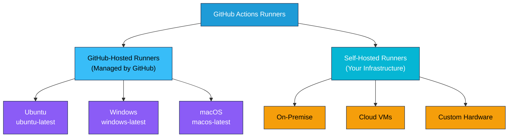

# GitHub Actions Fundamentals

## What is GitHub Actions?

GitHub Actions is a CI/CD and automation platform built into GitHub. It allows you to automate workflows directly in your repository—building, testing, and deploying code on every push or pull request.

### Core Components

```
Workflow (YAML file)
├─ Events (triggers)
├─ Jobs (parallel or sequential)
│  ├─ Runners (execution environment)
│  ├─ Steps (individual tasks)
│  │  ├─ Actions (reusable code)
│  │  └─ Run (shell commands)
│  └─ Environment variables & secrets
└─ Artifacts (build outputs)
```

---

## Workflows

A workflow is a YAML file in `.github/workflows/` that defines automated processes.

### GitHub Actions Workflow Structure

```mermaid
graph LR
  Event["Event Trigger<br/>(Push, PR, Schedule)"]
  Job1["Job 1<br/>(runs-on: ubuntu-latest)"]
  Step1["Step 1: Checkout"]
  Step2["Step 2: Build"]
  Step3["Step 3: Test"]
  Job2["Job 2<br/>(depends on Job 1)"]
  Step4["Step 4: Deploy"]
  Done["Workflow Complete"]

  Event --> Job1
  Job1 --> Step1
  Step1 --> Step2
  Step2 --> Step3
  Step3 --> Job2
  Job2 --> Step4
  Step4 --> Done

  style Event fill:#38BDF8,stroke:#1B2A4A,color:#000
  style Job1 fill:#1E9BD7,stroke:#1B2A4A,color:#fff
  style Job2 fill:#1E9BD7,stroke:#1B2A4A,color:#fff
  style Step1 fill:#06B6D4,stroke:#1B2A4A,color:#fff
  style Step2 fill:#06B6D4,stroke:#1B2A4A,color:#fff
  style Step3 fill:#06B6D4,stroke:#1B2A4A,color:#fff
  style Step4 fill:#06B6D4,stroke:#1B2A4A,color:#fff
  style Done fill:#10B981,stroke:#1B2A4A,color:#fff
```



---


```yaml
name: Build and Deploy
on: [push, pull_request]

jobs:
  build:
    runs-on: ubuntu-latest
    steps:
      - uses: actions/checkout@v3
      - name: Run tests
        run: npm test
      - name: Deploy
        run: npm run deploy
```

**File Location:** `.github/workflows/my-workflow.yml`

---

## Events (Triggers)

Workflows are triggered by GitHub events.

```yaml
on:
  # Repository events
  push:
    branches: [main, develop]
    paths: ['src/**']  # Only when src/ changes
  pull_request:
    branches: [main]

  # Scheduled events
  schedule:
    - cron: '0 9 * * 1'  # Every Monday at 9 AM

  # Manual trigger
  workflow_dispatch:
    inputs:
      environment:
        description: 'Environment to deploy'
        required: true

  # Release events
  release:
    types: [published]

  # External events
  workflow_run:
    workflows: [CI]
    types: [completed]
```

---

## Jobs

Jobs are a set of steps that execute on the same runner.

```yaml
jobs:
  build:
    runs-on: ubuntu-latest
    steps:
      - run: echo "Building..."

  test:
    runs-on: ubuntu-latest
    needs: build  # Wait for 'build' job first
    steps:
      - run: echo "Testing..."

  deploy:
    runs-on: ubuntu-latest
    needs: [build, test]  # Depends on multiple jobs
    if: github.ref == 'refs/heads/main'  # Only on main branch
    steps:
      - run: echo "Deploying..."
```

---

## Runners

Runners are machines that execute your jobs.

### Runner Types



### GitHub-Hosted Runners

```yaml
jobs:
  linux:
    runs-on: ubuntu-latest      # or ubuntu-20.04
  windows:
    runs-on: windows-latest
  macos:
    runs-on: macos-latest
```

### Self-Hosted Runners

```yaml
jobs:
  build:
    runs-on: [self-hosted, linux, x64]
    steps:
      - run: echo "Running on self-hosted runner"
```

---

## Steps

Steps are individual tasks within a job.

```yaml
jobs:
  example:
    runs-on: ubuntu-latest
    steps:
      # Use an action
      - uses: actions/checkout@v3
        with:
          ref: develop

      # Run shell command
      - name: Install dependencies
        run: npm install

      # Run multiline command
      - name: Build
        run: |
          npm run build
          npm run test

      # Use environment variables
      - name: Deploy
        env:
          API_KEY: ${{ secrets.API_KEY }}
          NODE_ENV: production
        run: npm run deploy
```

---

## Actions (Reusable Code)

Actions are reusable units of code.

### Official Actions

```yaml
# Checkout repository
- uses: actions/checkout@v3

# Setup Node.js
- uses: actions/setup-node@v3
  with:
    node-version: '16'

# Setup Python
- uses: actions/setup-python@v4
  with:
    python-version: '3.9'

# Upload artifacts
- uses: actions/upload-artifact@v3
  with:
    name: build-output
    path: dist/

# Deploy to GitHub Pages
- uses: actions/deploy-pages@v2
```

### Community Actions

```yaml
# Build and push Docker image
- uses: docker/build-push-action@v4
  with:
    context: .
    push: true
    tags: myregistry/myimage:latest

# Create a PR
- uses: peter-evans/create-pull-request@v4
  with:
    title: 'Automated PR'
    body: 'This is an automated pull request'
```

---

## Secrets

Sensitive data (API keys, passwords) stored securely.

```yaml
# Define in GitHub settings
# Settings > Secrets and variables > Actions > New repository secret

jobs:
  deploy:
    runs-on: ubuntu-latest
    steps:
      - name: Deploy to AWS
        env:
          AWS_ACCESS_KEY_ID: ${{ secrets.AWS_ACCESS_KEY_ID }}
          AWS_SECRET_ACCESS_KEY: ${{ secrets.AWS_SECRET_ACCESS_KEY }}
        run: |
          aws s3 cp build/ s3://my-bucket/
```

**Best Practices:**
- Never hardcode secrets in YAML
- Use organization secrets for shared values
- Rotate secrets regularly
- Audit secret access

---

## Matrix Builds

Test across multiple versions/environments.

```yaml
jobs:
  test:
    runs-on: ubuntu-latest
    strategy:
      matrix:
        node-version: [14, 16, 18]
        os: [ubuntu-latest, windows-latest]
    steps:
      - uses: actions/checkout@v3
      - uses: actions/setup-node@v3
        with:
          node-version: ${{ matrix.node-version }}
      - run: npm test
```

**Generated Matrix:**
- Node 14 on Ubuntu
- Node 16 on Ubuntu
- Node 18 on Ubuntu
- Node 14 on Windows
- Node 16 on Windows
- Node 18 on Windows

(6 total combinations)

---

## Caching

Cache dependencies to speed up workflows.

```yaml
jobs:
  build:
    runs-on: ubuntu-latest
    steps:
      - uses: actions/checkout@v3

      - uses: actions/setup-node@v3
        with:
          node-version: 16
          cache: 'npm'  # Automatically cache node_modules

      # Or manual cache
      - uses: actions/cache@v3
        with:
          path: ~/.npm
          key: ${{ runner.os }}-npm-${{ hashFiles('**/package-lock.json') }}
          restore-keys: |
            ${{ runner.os }}-npm-

      - run: npm ci
      - run: npm test
```

---

## Environment Variables

Define variables at different scopes.

```yaml
# Workflow level
env:
  REGISTRY: ghcr.io

jobs:
  build:
    runs-on: ubuntu-latest

    # Job level
    env:
      NODE_ENV: production

    steps:
      # Step level
      - name: Deploy
        env:
          API_KEY: ${{ secrets.API_KEY }}
        run: ./deploy.sh

      # Default environment variables
      - run: echo $GITHUB_EVENT_NAME
      - run: echo $GITHUB_REPOSITORY
      - run: echo $GITHUB_SHA
```

---

## Conditional Execution

Control when steps/jobs run.

```yaml
jobs:
  build:
    runs-on: ubuntu-latest
    steps:
      # Run if condition is true
      - name: Build
        if: github.event_name == 'push'
        run: npm run build

      # Always run
      - name: Notify
        if: always()
        run: curl notify.example.com

      # Run if previous step failed
      - name: Error handler
        if: failure()
        run: echo "Build failed!"

  deploy:
    needs: build
    # Skip if any needed job failed
    if: success()
    runs-on: ubuntu-latest
    steps:
      - run: npm run deploy
```

---

## Practical Examples

### Example 1: Simple CI

```yaml
name: CI

on:
  push:
    branches: [main]
  pull_request:
    branches: [main]

jobs:
  test:
    runs-on: ubuntu-latest
    steps:
      - uses: actions/checkout@v3

      - uses: actions/setup-node@v3
        with:
          node-version: 16
          cache: 'npm'

      - run: npm ci
      - run: npm run lint
      - run: npm test
      - run: npm run build
```

### Example 2: Build and Publish Docker Image

```yaml
name: Docker Build

on:
  push:
    branches: [main]

jobs:
  build:
    runs-on: ubuntu-latest
    steps:
      - uses: actions/checkout@v3

      - uses: docker/setup-buildx-action@v2

      - uses: docker/login-action@v2
        with:
          registry: ghcr.io
          username: ${{ github.actor }}
          password: ${{ secrets.GITHUB_TOKEN }}

      - uses: docker/build-push-action@v4
        with:
          context: .
          push: true
          tags: ghcr.io/${{ github.repository }}:latest
```

### Example 3: Deploy to AWS

```yaml
name: Deploy to AWS

on:
  push:
    branches: [main]

jobs:
  deploy:
    runs-on: ubuntu-latest
    steps:
      - uses: actions/checkout@v3

      - uses: actions/setup-node@v3
        with:
          node-version: 16

      - run: npm ci
      - run: npm run build

      - uses: aws-actions/configure-aws-credentials@v2
        with:
          role-to-assume: arn:aws:iam::123456789:role/github-actions
          aws-region: us-east-1

      - run: aws s3 sync dist/ s3://my-bucket/
```

---

## Key Takeaways

1. **Workflows are YAML**: Simple syntax, version-controlled
2. **Events trigger workflows**: Push, PR, schedule, manual, etc.
3. **Jobs run on runners**: GitHub-hosted or self-hosted
4. **Actions are reusable**: Use official or community actions
5. **Secrets are secure**: Never hardcode sensitive data
6. **Matrix builds**: Test multiple configurations easily
7. **Caching speeds up**: Cache dependencies, build artifacts

---

## Further Resources

- [GitHub Actions Documentation](https://docs.github.com/en/actions)
- [Workflow Syntax](https://docs.github.com/en/actions/using-workflows/workflow-syntax-for-github-actions)
- [Marketplace](https://github.com/marketplace?type=actions)
