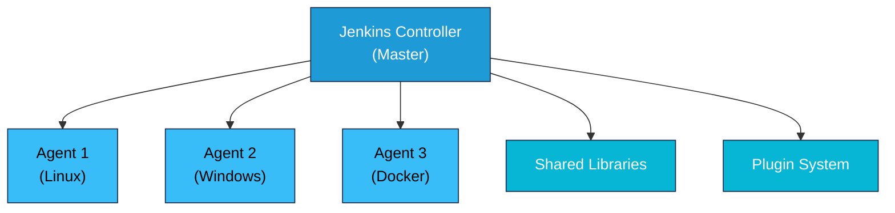

# Jenkins Fundamentals

## What is Jenkins?

Jenkins is an open-source automation server used for continuous integration (CI) and continuous delivery (CD). It enables developers to reliably build, test, and deploy software by automating parts of software development. Jenkins is written in Java and runs on various platforms.

### Key Characteristics

- **Open-source**: Free and community-driven
- **Extensible**: Large plugin ecosystem
- **Distributed**: Master-agent architecture for scalability
- **Pipeline-as-code**: Define CI/CD workflows in version control
- **Multi-language**: Supports any programming language
- **Cloud-ready**: Integrates with cloud platforms

## CI/CD Concepts

### Continuous Integration (CI)

CI is the practice of merging code changes into a central repository frequently, with automated testing after each commit.

**Benefits**:
- Early bug detection
- Reduced integration problems
- Faster feedback to developers
- Improved code quality

### Continuous Delivery (CD)

CD extends CI by automating the deployment process to production-like environments.

**Benefits**:
- Reduced deployment risk
- Faster time-to-market
- Automated release process
- Consistent deployments

### Continuous Deployment

Automatically deploy to production after passing tests (no manual approval).

## Jenkins Architecture

### Master-Agent Architecture



**Master (Controller)**:
- Manages jobs and builds
- Schedules builds
- Monitors agents
- Serves web interface
- Stores configurations

**Agents**:
- Execute builds
- Run tests
- Deploy applications
- Distributed across infrastructure
- Can be on-premise or cloud

### Components

- **Jenkins Master**: Central server managing orchestration
- **Agents**: Remote/local machines executing jobs
- **Plugins**: Extend Jenkins functionality
- **Pipeline**: Define build/test/deploy workflows
- **Repository**: SCM integration (Git, SVN, etc.)

## Installation

### Linux Installation

```bash
# Ubuntu/Debian
curl -fsSL https://pkg.jenkins.io/debian-stable/jenkins.io.key | \
  sudo tee /usr/share/keyrings/jenkins-keyring.asc > /dev/null
echo deb [signed-by=/usr/share/keyrings/jenkins-keyring.asc] \
  https://pkg.jenkins.io/debian-stable binary/ | \
  sudo tee /etc/apt/sources.list.d/jenkins.list > /dev/null
sudo apt-get update
sudo apt-get install jenkins

# Start Jenkins
sudo systemctl start jenkins
sudo systemctl enable jenkins
```

### Docker Installation

```bash
docker run -p 8080:8080 -p 50000:50000 \
  -v jenkins_home:/var/jenkins_home \
  -v /var/run/docker.sock:/var/run/docker.sock \
  jenkins/jenkins:latest
```

### Initial Setup

1. Access Jenkins at `http://localhost:8080`
2. Get initial admin password: `/var/lib/jenkins/secrets/initialAdminPassword`
3. Install suggested plugins
4. Create admin user
5. Configure Jenkins URL

## Jenkins Pipeline Flow

### Typical Pipeline Stages

```mermaid
graph LR
  Commit["Code Commit"]
  Build["Build"]
  Test["Test"]
  Staging["Deploy to Staging"]
  Approval["Approval Gate"]
  Prod["Deploy to Production"]
  Complete["Complete"]

  Commit --> Build
  Build --> Test
  Test --> Staging
  Staging --> Approval
  Approval --> Prod
  Prod --> Complete

  style Commit fill:#38BDF8,stroke:#1B2A4A,color:#000
  style Build fill:#1E9BD7,stroke:#1B2A4A,color:#fff
  style Test fill:#1E9BD7,stroke:#1B2A4A,color:#fff
  style Staging fill:#06B6D4,stroke:#1B2A4A,color:#fff
  style Approval fill:#F59E0B,stroke:#1B2A4A,color:#000
  style Prod fill:#1E9BD7,stroke:#1B2A4A,color:#fff
  style Complete fill:#10B981,stroke:#1B2A4A,color:#fff
```



## Creating Jobs

### Freestyle Jobs

Traditional Jenkins jobs with GUI configuration.

```
1. Dashboard → New Item → Freestyle Job
2. Configure source control (Git, SVN)
3. Add build triggers
4. Add build steps (shell, Maven, Gradle)
5. Add post-build actions
6. Save and build
```

**When to use**: Simple builds, quick setup, legacy systems.

### Pipeline Jobs

Define builds as code in version control.

```
1. Dashboard → New Item → Pipeline
2. Pipeline section:
   - Definition: Pipeline script from SCM
   - SCM: Git repository
   - Script path: Jenkinsfile
3. Save and build
```

**When to use**: Complex workflows, CI/CD best practices, modern projects.

## Jenkinsfile

A Jenkinsfile is a text file defining the build pipeline.

### Declarative Pipeline

```groovy
pipeline {
    agent any

    environment {
        ENV_VAR = "value"
    }

    triggers {
        githubPush()
    }

    options {
        timeout(time: 1, unit: 'HOURS')
        timestamps()
    }

    stages {
        stage('Checkout') {
            steps {
                checkout scm
            }
        }

        stage('Build') {
            steps {
                sh 'mvn clean package'
            }
        }

        stage('Test') {
            steps {
                sh 'mvn test'
            }
        }

        stage('Deploy') {
            steps {
                sh './deploy.sh'
            }
        }
    }

    post {
        always {
            cleanWs()
        }

        success {
            echo 'Build succeeded!'
        }

        failure {
            echo 'Build failed!'
        }
    }
}
```

### Scripted Pipeline

```groovy
node {
    stage('Checkout') {
        checkout scm
    }

    stage('Build') {
        sh 'mvn clean package'
    }

    stage('Test') {
        sh 'mvn test'
    }

    try {
        stage('Deploy') {
            sh './deploy.sh'
        }
    } catch (Exception e) {
        currentBuild.result = 'FAILURE'
        throw e
    }
}
```

**Declarative vs Scripted**:
- Declarative: Simpler, recommended for most use cases
- Scripted: More flexible, Groovy-based, for complex logic

## Stages, Steps, and Post

### Stages

Stages represent logical sections of a pipeline:

```groovy
stages {
    stage('Build') {
        steps {
            // Build steps
        }
    }

    stage('Test') {
        steps {
            // Test steps
        }
    }
}
```

### Steps

Individual commands or operations within stages:

```groovy
steps {
    sh 'echo "Building application"'
    sh 'npm install'
    sh 'npm run build'
}
```

### Post

Runs after stages complete (conditionally or always):

```groovy
post {
    always {
        // Always run
        cleanWs()
    }

    success {
        // Run on success
        echo 'Deployment successful'
    }

    failure {
        // Run on failure
        emailext(
            subject: "Build Failed",
            body: "Build failed: ${BUILD_LOG}",
            to: "team@example.com"
        )
    }

    cleanup {
        // Cleanup resources
        sh 'rm -rf temp/*'
    }
}
```

## Agents

Agents specify where pipeline runs (master or specific agent).

### Agent Types

```groovy
// Any available agent
agent any

// Specific agent label
agent {
    label 'linux-docker'
}

// Docker container
agent {
    docker {
        image 'maven:3.8-openjdk-11'
        args '-v /var/run/docker.sock:/var/run/docker.sock'
    }
}

// Kubernetes pod
agent {
    kubernetes {
        yaml '''
apiVersion: v1
kind: Pod
spec:
  containers:
  - name: maven
    image: maven:3.8
    command:
    - cat
    tty: true
'''
    }
}

// No agent required (declarative only)
agent none
```

## Triggers

Triggers determine when builds start.

### SCM Polling

```groovy
triggers {
    // Poll Git every 5 minutes
    pollSCM('*/5 * * * *')
}
```

### Webhook Trigger

```groovy
triggers {
    // GitHub webhook
    githubPush()

    // Generic webhook
    genericWebhook(
        token: 'my-secret-token'
    )
}
```

### Cron Trigger

```groovy
triggers {
    // Build at 2 AM daily
    cron('0 2 * * *')
}
```

### Timer Trigger

```groovy
triggers {
    // Build every hour
    timerTrigger('H * * * *')
}
```

### Upstream Trigger

```groovy
triggers {
    // Trigger after another job succeeds
    upstream(threshold: 'FAILURE', upstreamProjects: 'upstream-job')
}
```

## Plugins

Plugins extend Jenkins functionality. Essential plugins include:

| Plugin | Purpose |
|--------|---------|
| Git | Git repository integration |
| Pipeline | Pipeline support |
| Docker | Docker integration |
| Kubernetes | Kubernetes integration |
| Email Extension | Advanced email notifications |
| Blue Ocean | Modern UI |
| Slack | Slack integration |
| SonarQube | Code quality analysis |
| Artifactory | Artifact repository |
| AWS | AWS integration |

### Installing Plugins

1. Manage Jenkins → Plugin Manager
2. Search for plugin
3. Click Install
4. Restart Jenkins if needed

## Credentials Management

### Types of Credentials

- **Username/Password**: Basic auth
- **SSH Keys**: For Git over SSH
- **API Tokens**: For service authentication
- **Secret File**: Credential files
- **Secret Text**: Encrypted strings

### Using Credentials in Pipeline

```groovy
pipeline {
    agent any

    environment {
        // Reference credentials
        GIT_CREDS = credentials('github-ssh-key')
        DB_PASS = credentials('db-password')
    }

    stages {
        stage('Checkout') {
            steps {
                git(
                    url: 'git@github.com:myorg/repo.git',
                    credentialsId: 'github-ssh-key',
                    branch: 'main'
                )
            }
        }

        stage('Deploy') {
            steps {
                withCredentials([
                    string(credentialsId: 'api-key', variable: 'API_KEY'),
                    usernamePassword(
                        credentialsId: 'docker-hub',
                        usernameVariable: 'DOCKER_USER',
                        passwordVariable: 'DOCKER_PASS'
                    )
                ]) {
                    sh '''
                        echo $API_KEY > /tmp/api.key
                        docker login -u $DOCKER_USER -p $DOCKER_PASS
                    '''
                }
            }
        }
    }
}
```

## Jenkins with Docker

### Running Jobs in Docker Containers

```groovy
pipeline {
    agent any

    stages {
        stage('Build') {
            agent {
                docker {
                    image 'maven:3.8-openjdk-11'
                    args '-v /var/run/docker.sock:/var/run/docker.sock'
                }
            }

            steps {
                sh 'mvn clean package'
            }
        }

        stage('Docker Image') {
            steps {
                sh '''
                    docker build -t myapp:${BUILD_NUMBER} .
                    docker push myregistry.azurecr.io/myapp:${BUILD_NUMBER}
                '''
            }
        }
    }
}
```

### Running Jenkins in Docker

```bash
docker run -d \
  -p 8080:8080 \
  -p 50000:50000 \
  -v jenkins_home:/var/jenkins_home \
  -v /var/run/docker.sock:/var/run/docker.sock \
  --name jenkins \
  jenkins/jenkins:latest
```

## Jenkins with Kubernetes

### Deploy Jenkins to Kubernetes

```bash
# Using Helm
helm repo add jenkins https://charts.jenkins.io
helm install jenkins jenkins/jenkins -f values.yaml
```

### Running Pipeline on Kubernetes

```groovy
pipeline {
    agent {
        kubernetes {
            yaml '''
apiVersion: v1
kind: Pod
metadata:
  labels:
    jenkins: agent
spec:
  serviceAccountName: jenkins
  containers:
  - name: maven
    image: maven:3.8-openjdk-11
    command: ['cat']
    tty: true
  - name: docker
    image: docker:20.10-dind
    securityContext:
      privileged: true
'''
        }
    }

    stages {
        stage('Build') {
            container('maven') {
                steps {
                    sh 'mvn clean package'
                }
            }
        }

        stage('Docker Build') {
            container('docker') {
                steps {
                    sh 'docker build -t myapp:latest .'
                }
            }
        }
    }
}
```

---

## Practical Exercises

### Exercise 1: Create a Simple Freestyle Job

```
1. New Item → Enter name "HelloWorld" → Freestyle
2. Build section:
   - Add Build Step → Execute shell
   - Command: echo "Hello, Jenkins!"
3. Save
4. Click "Build Now"
5. View console output
```

### Exercise 2: Create a Pipeline Job with Git

```groovy
pipeline {
    agent any

    stages {
        stage('Checkout') {
            steps {
                checkout scm
            }
        }

        stage('Build') {
            steps {
                sh 'ls -la'
            }
        }
    }
}
```

### Exercise 3: Create Pipeline with Docker Agent

```groovy
pipeline {
    agent {
        docker {
            image 'node:16'
            args '-v /var/run/docker.sock:/var/run/docker.sock'
        }
    }

    stages {
        stage('Setup') {
            steps {
                sh 'npm --version'
            }
        }

        stage('Build') {
            steps {
                sh 'npm install && npm run build'
            }
        }

        stage('Test') {
            steps {
                sh 'npm test'
            }
        }
    }
}
```

### Exercise 4: Pipeline with Environment Variables

```groovy
pipeline {
    agent any

    environment {
        APP_NAME = 'myapp'
        BUILD_VERSION = "${BUILD_NUMBER}"
        DOCKER_REGISTRY = 'myregistry.azurecr.io'
    }

    stages {
        stage('Print Vars') {
            steps {
                sh '''
                    echo "App: $APP_NAME"
                    echo "Version: $BUILD_VERSION"
                    echo "Registry: $DOCKER_REGISTRY"
                '''
            }
        }
    }
}
```

### Exercise 5: Pipeline with Post Actions

```groovy
pipeline {
    agent any

    stages {
        stage('Build') {
            steps {
                sh 'echo "Building..."'
            }
        }
    }

    post {
        always {
            echo 'Build completed'
        }

        success {
            echo 'Build succeeded!'
        }

        failure {
            echo 'Build failed!'
        }

        unstable {
            echo 'Build is unstable'
        }
    }
}
```

---

## Key Concepts

- **Master-Agent**: Distributed architecture for scalability
- **Pipeline**: Code-based workflow definition
- **Declarative**: Simplified pipeline syntax (recommended)
- **Scripted**: Groovy-based pipeline (advanced)
- **Stages**: Logical workflow sections
- **Post**: Actions after pipeline completion
- **Agents**: Execution environments
- **Triggers**: Build initiation mechanisms
- **Plugins**: Extensibility through community contributions
- **Credentials**: Secure secrets management

## Next Steps

- Install Jenkins locally or in Docker
- Create first pipeline
- Integrate with Git repository
- Add automated tests
- Set up artifact publishing
- Implement deployment automation
