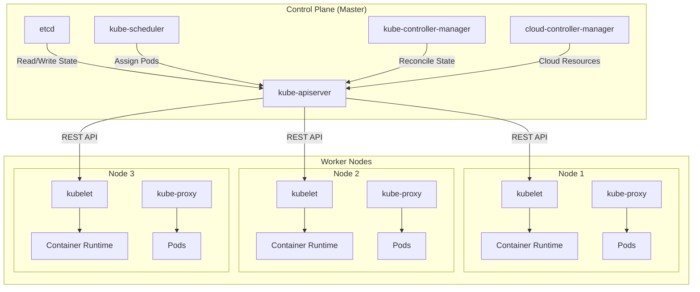
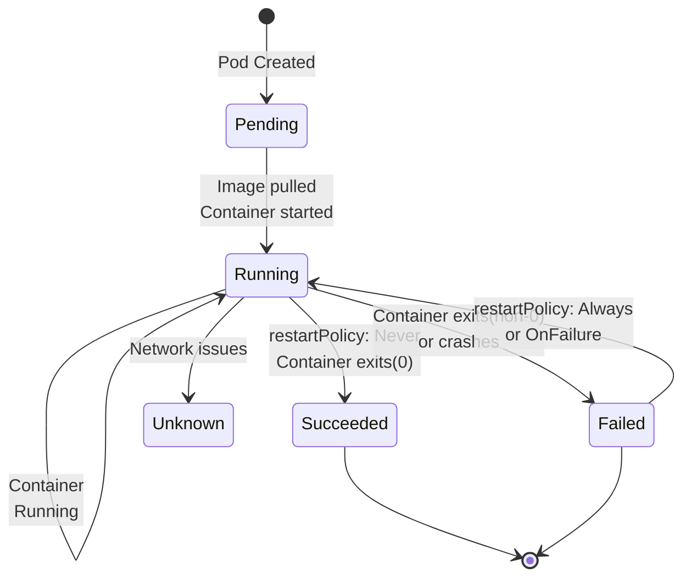

# Kubernetes Fundamentals

Welcome to the comprehensive guide to Kubernetes! This guide covers everything you need to understand how Kubernetes works, from basic concepts to practical deployments.

## What is Kubernetes?

**Kubernetes** (often abbreviated as K8s) is an open-source container orchestration platform originally developed by Google and now maintained by the Cloud Native Computing Foundation (CNCF). It automates the deployment, scaling, and management of containerized applications across clusters of machines.

### The Problem It Solves

Containers have revolutionized application deployment by packaging applications with their dependencies. However, managing hundreds or thousands of containers across multiple servers manually is impractical. Kubernetes solves this by providing automated orchestration:

- **Container Management**: Deploy, update, and manage containers automatically
- **Resource Optimization**: Efficiently pack containers on available hardware
- **High Availability**: Keep applications running even when infrastructure fails
- **Load Distribution**: Route traffic across healthy container instances

### Key Features of Kubernetes

| Feature | Description |
|---------|-------------|
| **Auto-scaling** | Automatically increase/decrease pod replicas based on metrics |
| **Self-healing** | Restart failed containers, replace unhealthy nodes |
| **Service Discovery** | Pods can discover and communicate with each other automatically |
| **Load Balancing** | Distribute traffic across pod instances |
| **Automated Rollouts/Rollbacks** | Update applications with zero downtime, rollback if issues occur |
| **Declarative Configuration** | Describe desired state; Kubernetes achieves and maintains it |
| **Resource Management** | CPU, memory quotas and limits per pod |
| **Secrets & ConfigMaps** | Manage sensitive data and configuration separately from code |

---

## Why Kubernetes?

To understand why Kubernetes is essential, let's trace the evolution of application deployment:

### Evolution of Deployment

```
Bare Metal Server
    ↓ (physical isolation difficult, resource waste)
Virtual Machines
    ↓ (lighter weight than VMs, faster startup)
Containers (Docker)
    ↓ (managing manually is complex at scale)
Container Orchestration (Kubernetes)
    ↓
Production-Ready Infrastructure
```

### Without Orchestration: Manual Complexity

Imagine deploying 100 containerized microservices:

```
# Without Kubernetes:
- Manually SSH into servers
- Pull container images
- Start containers with `docker run`
- Monitor for failures manually
- Manually restart failed containers
- Handle networking between containers
- Manage storage volumes
- Update versions service by service (downtime!)
- No automatic recovery when nodes die
```

### With Kubernetes: Declarative Simplicity

```yaml
# With Kubernetes: describe your desired state
apiVersion: apps/v1
kind: Deployment
metadata:
  name: my-app
spec:
  replicas: 100
  selector:
    matchLabels:
      app: my-app
  template:
    metadata:
      labels:
        app: my-app
    spec:
      containers:
      - name: my-app
        image: my-app:v1.0
        resources:
          requests:
            memory: "64Mi"
            cpu: "250m"

# Kubernetes handles: deployment, health checks, scaling, updates, recovery
```

### Key Benefits

| Benefit | Impact |
|---------|--------|
| **Portability** | Same YAML runs on AWS, Azure, GCP, on-premise, or multi-cloud |
| **Scalability** | Handle millions of requests by adding pods, not infrastructure |
| **Resilience** | Automatic failover, self-healing, anti-affinity rules |
| **Declarative Config** | Git-based infrastructure, version control, audit trails |
| **Cost Efficiency** | Right-size resources, no overprovisioning, bin-packing |
| **DevOps-Friendly** | CI/CD integration, automated deployments, canary releases |

---

## Kubernetes Architecture

Kubernetes uses a **client-server architecture** with a **Control Plane** (master) managing **Worker Nodes**.

### Architecture Overview

```
┌─────────────────────────────────────────────────────────────────┐
│                    CONTROL PLANE (Master)                       │
│  ┌──────────────┐  ┌──────────┐  ┌──────────────┐               │
│  │ kube-apiserver│  │   etcd   │  │ kube-scheduler│               │
│  └──────────────┘  └──────────┘  └──────────────┘               │
│  ┌──────────────────────────────┐  ┌──────────────────────────┐ │
│  │ kube-controller-manager      │  │ cloud-controller-manager │ │
│  └──────────────────────────────┘  └──────────────────────────┘ │
└─────────────────────────────────────────────────────────────────┘
              ↓ (REST API calls) ↓
┌─────────────────────────────────────────────────────────────────┐
│                        WORKER NODES                              │
│  ┌─────────────────┐   ┌─────────────────┐   ┌──────────────┐   │
│  │  Node 1         │   │  Node 2         │   │  Node 3      │   │
│  │ ┌───────────┐   │   │ ┌───────────┐   │   │ ┌─────────┐  │   │
│  │ │ kubelet   │   │   │ │ kubelet   │   │   │ │ kubelet │  │   │
│  │ │ kube-proxy│   │   │ │ kube-proxy│   │   │ │ kube-  │  │   │
│  │ │ Container │   │   │ │ Container │   │   │ │ proxy   │  │   │
│  │ │ Runtime   │   │   │ │ Runtime   │   │   │ │ Runtime │  │   │
│  │ │ [Pods]    │   │   │ │ [Pods]    │   │   │ │ [Pods] │  │   │
│  │ └───────────┘   │   │ └───────────┘   │   │ └─────────┘  │   │
│  └─────────────────┘   └─────────────────┘   └──────────────┘   │
└─────────────────────────────────────────────────────────────────┘
```

### Kubernetes Architecture Diagram



### Control Plane Components

#### **kube-apiserver**

The REST API gateway for the entire Kubernetes cluster.

- **All communication goes through the API server** (audit trail)
- Validates API requests, enforces authorization
- Stores object state in etcd
- Exposes Kubernetes API (used by `kubectl`, controllers, other clients)

```bash
# Every kubectl command talks to kube-apiserver
kubectl get pods                    # GET /api/v1/namespaces/default/pods
kubectl create deployment my-app    # POST /api/v1/namespaces/...
kubectl logs pod-name               # GET /api/v1/namespaces/.../pods/pod-name/log
```

#### **etcd**

A distributed, strongly-consistent key-value store.

- **Single source of truth** for all cluster state
- Stores all Kubernetes objects (pods, deployments, configs, secrets)
- Data must be backed up regularly
- Provides watch mechanism for change notifications

```bash
# Access etcd (requires authentication)
etcdctl get /registry/pods --prefix  # List all pods stored in etcd
```

#### **kube-scheduler**

Assigns unscheduled pods to nodes based on resource requirements and constraints.

**How it works:**

1. Watches for newly created pods with no `nodeName` assigned
2. Evaluates available nodes based on:
   - Resource requests (CPU, memory)
   - Node selectors and affinity rules
   - Taints and tolerations
   - PVC availability
3. Selects the best node and binds the pod to it

```bash
# Pod without nodeName initially
kubectl describe pod my-pod  # nodeName: <none>

# After scheduler runs
kubectl describe pod my-pod  # nodeName: node-2
```

#### **kube-controller-manager**

Runs multiple controller loops that reconcile the actual state with desired state.

Key controllers:

| Controller | Responsibility |
|-----------|-----------------|
| **ReplicaSet Controller** | Ensures desired number of pod replicas exist |
| **Deployment Controller** | Manages rolling updates, maintains ReplicaSets |
| **StatefulSet Controller** | Manages stateful applications with stable identities |
| **Node Controller** | Monitors node health, removes unhealthy nodes |
| **Job Controller** | Manages one-off or batch jobs |
| **Service Controller** | Updates endpoints when pods are added/removed |

```bash
# Controllers run continuously
# If you delete a pod managed by Deployment:
kubectl delete pod my-app-5d4d8f7c9

# The Deployment controller immediately creates a new one
# Desired state = 3 replicas, actual = 2 → create 1 more
```

#### **cloud-controller-manager**

Interfaces with cloud provider APIs (AWS, Azure, GCP).

Responsibilities:

- Create/delete cloud load balancers when Services are created
- Manage cloud storage volumes
- Handle node provisioning/deletion
- Update routes for networking

```bash
# When you create a LoadBalancer Service
kubectl create service loadbalancer my-app --port=80 --target-port=8080

# cloud-controller-manager calls AWS API to create ELB
```

### Worker Node Components

#### **kubelet**

Agent running on each node; communicates with the API server.

**Responsibilities:**

- Watches for pod assignments to its node
- Pulls container images
- Starts/stops containers via container runtime
- Performs liveness and readiness probes
- Sends node and pod status to API server

```bash
# kubelet registers the node with API server
kubectl get nodes  # Lists nodes registered by kubelet

# kubelet monitors pods and restarts failed containers
kubectl get pods   # Shows pods running on nodes
```

#### **kube-proxy**

Network proxy maintaining networking rules on the node.

**How it works:**

1. Watches Service and Endpoint objects from API server
2. Maintains iptables rules (or other backend) for traffic routing
3. Implements load balancing between pods

```
Service (ClusterIP: 10.0.1.100)
    ↓ (kube-proxy uses iptables)
┌───────────────────────┐
│ Pod 1: 10.244.1.5:8080│
│ Pod 2: 10.244.2.10:8080│ ← kube-proxy round-robins traffic
│ Pod 3: 10.244.3.15:8080│
└───────────────────────┘
```

#### **Container Runtime**

Manages container images and running containers.

**Evolution:**

```
Docker (deprecated in K8s 1.20+)
    ↓
containerd (most popular, CNCF)
or
CRI-O (Red Hat maintained)
```

Most clusters now use **containerd** or **CRI-O** via the Container Runtime Interface (CRI).

---

## Core Kubernetes Objects

### **Pods** (smallest deployable unit)

A Pod is a wrapper around one or more containers sharing:
- Network namespace (same IP address)
- Storage volumes
- Lifecycle

#### Key Pod Characteristics

```yaml
apiVersion: v1
kind: Pod
metadata:
  name: my-app-pod
  namespace: default
  labels:
    app: my-app
    version: v1
spec:
  containers:
  - name: app-container
    image: nginx:1.25
    ports:
    - containerPort: 80
    resources:
      requests:
        memory: "64Mi"
        cpu: "250m"
      limits:
        memory: "128Mi"
        cpu: "500m"
    livenessProbe:
      httpGet:
        path: /healthz
        port: 80
      initialDelaySeconds: 10
      periodSeconds: 10
    readinessProbe:
      httpGet:
        path: /ready
        port: 80
      initialDelaySeconds: 5
      periodSeconds: 5
  restartPolicy: Always  # OnFailure, Never
```

**Container Restart Policies:**

| Policy | Behavior |
|--------|----------|
| **Always** | Restart container if it exits (default for Pods in Deployments) |
| **OnFailure** | Restart only if exit code was non-zero |
| **Never** | Don't restart (useful for one-time Jobs) |

**Pod Lifecycle States:**

```
Pending → Running → Succeeded/Failed/Unknown
  ↑         ↓
  └─────────┘ (can restart if restartPolicy: Always)
```

### Pod Lifecycle Diagram



#### Init Containers

Containers that run before the main application containers.

```yaml
spec:
  initContainers:
  - name: init-db
    image: busybox
    command: ['sh', '-c', 'until nslookup mydb; do echo waiting for mydb; sleep 2; done;']
  containers:
  - name: app
    image: my-app:v1
```

Use cases:
- Wait for dependencies to be ready
- Download configuration from external sources
- Initialize databases

### **ReplicaSets**

Ensures a specified number of pod replicas are always running.

```yaml
apiVersion: apps/v1
kind: ReplicaSet
metadata:
  name: my-app-rs
spec:
  replicas: 3
  selector:
    matchLabels:
      app: my-app
  template:
    metadata:
      labels:
        app: my-app
    spec:
      containers:
      - name: my-app
        image: my-app:v1.0
        ports:
        - containerPort: 8080
```

**How it works:**

1. ReplicaSet controller watches for pods matching label selector
2. Counts running pods; if count < replicas, creates new pods
3. If count > replicas, deletes excess pods
4. Automatically replaces failed or deleted pods

```bash
# Create ReplicaSet
kubectl apply -f replicaset.yaml

# Check status
kubectl get rs my-app-rs
kubectl describe rs my-app-rs

# Scale up to 5 replicas
kubectl scale rs my-app-rs --replicas=5

# Delete ReplicaSet and all its pods
kubectl delete rs my-app-rs
```

**Note:** You typically don't create ReplicaSets directly; Deployments manage them.

### **Deployments** (recommended way to run stateless apps)

Manages ReplicaSets, enabling rolling updates, rollbacks, and declarative updates.

```yaml
apiVersion: apps/v1
kind: Deployment
metadata:
  name: nginx-deployment
  labels:
    app: nginx
spec:
  replicas: 3
  strategy:
    type: RollingUpdate
    rollingUpdate:
      maxSurge: 1          # max additional pods during update
      maxUnavailable: 1    # max pods that can be unavailable
  selector:
    matchLabels:
      app: nginx
  template:
    metadata:
      labels:
        app: nginx
    spec:
      containers:
      - name: nginx
        image: nginx:1.25
        ports:
        - containerPort: 80
        resources:
          requests:
            memory: "64Mi"
            cpu: "250m"
          limits:
            memory: "128Mi"
            cpu: "500m"
```

**Rolling Update Example:**

```bash
# Initial state: 3 nginx:1.24 pods running
kubectl set image deployment/nginx-deployment nginx=nginx:1.25

# Deployment controller:
# 1. Spins up 1 nginx:1.25 pod (maxSurge: 1)
# 2. Terminates 1 nginx:1.24 pod
# 3. Repeats until all pods are nginx:1.25

# Watch the update
kubectl rollout status deployment/nginx-deployment

# Rollback if issues occur
kubectl rollout undo deployment/nginx-deployment --to-revision=1

# View rollout history
kubectl rollout history deployment/nginx-deployment
```

**Update Strategies:**

| Strategy | Use Case |
|----------|----------|
| **RollingUpdate** | Zero-downtime updates (default) |
| **Recreate** | Kill all pods, start new ones (downtime acceptable) |

### **Services** (networking abstraction)

Exposes pods to other pods or external traffic using stable IPs and DNS names.

#### Service Types

##### **ClusterIP** (default)

Exposes service only within the cluster.

```yaml
apiVersion: v1
kind: Service
metadata:
  name: my-app-service
spec:
  type: ClusterIP
  selector:
    app: my-app
  ports:
  - protocol: TCP
    port: 80          # port on service
    targetPort: 8080  # port on pod
```

```bash
# Access from within cluster
kubectl run -it --image=busybox curl -- sh
# Inside the pod:
wget -O- http://my-app-service:80
# DNS resolves to stable IP
```

##### **NodePort**

Exposes service on a port on every node.

```yaml
apiVersion: v1
kind: Service
metadata:
  name: my-app-nodeport
spec:
  type: NodePort
  selector:
    app: my-app
  ports:
  - protocol: TCP
    port: 80
    targetPort: 8080
    nodePort: 30080    # port on every node (30000-32767)
```

```bash
# Access from external network
curl http://<node-ip>:30080
```

##### **LoadBalancer**

Exposes service using cloud provider's load balancer.

```yaml
apiVersion: v1
kind: Service
metadata:
  name: my-app-lb
spec:
  type: LoadBalancer
  selector:
    app: my-app
  ports:
  - protocol: TCP
    port: 80
    targetPort: 8080
```

```bash
# Cloud provider creates external load balancer
kubectl get svc my-app-lb
# EXTERNAL-IP: 52.123.45.67 (AWS, Azure, GCP assigns this)
```

##### **ExternalName**

Maps to an external DNS name (no selector needed).

```yaml
apiVersion: v1
kind: Service
metadata:
  name: my-external-db
spec:
  type: ExternalName
  externalName: db.example.com
  ports:
  - port: 5432
```

```bash
# Inside cluster, connect to:
# my-external-db.default.svc.cluster.local:5432
# which proxies to db.example.com:5432
```

**When to Use Which Service:**

| Type | Access | Use Case |
|------|--------|----------|
| **ClusterIP** | Internal only | Pod-to-pod communication |
| **NodePort** | Node IP:port | Development, testing, small deployments |
| **LoadBalancer** | External IP | Production APIs, web apps |
| **ExternalName** | External DNS | Connect to legacy systems |

### **Namespaces** (virtual clusters)

Partition cluster into virtual sub-clusters, enabling resource isolation and multi-tenancy.

```yaml
apiVersion: v1
kind: Namespace
metadata:
  name: production
```

```bash
# Create namespace
kubectl create namespace production

# Default namespaces
kubectl get namespaces
# NAME              STATUS
# default           Active      # where objects go by default
# kube-system       Active      # system components
# kube-public       Active      # readable by all
# kube-node-lease   Active      # node heartbeats

# Deploy to specific namespace
kubectl apply -f deployment.yaml -n production

# View resources in namespace
kubectl get pods -n production

# Set default namespace (avoid typing -n every time)
kubectl config set-context --current --namespace=production
```

**Use Namespaces for:**

- Multi-tenant clusters (team A, team B, team C)
- Environment separation (dev, staging, production)
- RBAC scoping
- Resource quotas

### **ConfigMaps** (non-sensitive configuration)

Store application configuration as key-value pairs.

```yaml
apiVersion: v1
kind: ConfigMap
metadata:
  name: app-config
data:
  DATABASE_HOST: "postgres.default.svc.cluster.local"
  DATABASE_PORT: "5432"
  LOG_LEVEL: "info"
  config.yaml: |
    server:
      port: 8080
      timeout: 30
```

**Mount as Environment Variables:**

```yaml
spec:
  containers:
  - name: app
    image: my-app:v1
    env:
    - name: DB_HOST
      valueFrom:
        configMapKeyRef:
          name: app-config
          key: DATABASE_HOST
```

**Mount as Files:**

```yaml
spec:
  containers:
  - name: app
    image: my-app:v1
    volumeMounts:
    - name: config-volume
      mountPath: /etc/config
  volumes:
  - name: config-volume
    configMap:
      name: app-config
```

### **Secrets** (sensitive data)

Store sensitive data (passwords, API keys, certificates) with encryption at rest (optional).

```yaml
apiVersion: v1
kind: Secret
metadata:
  name: db-credentials
type: Opaque
data:
  username: dXNlcm5hbWU=  # base64 encoded (echo -n "username" | base64)
  password: cGFzc3dvcmQ=  # base64 encoded
```

**Use Secrets for:**

```yaml
spec:
  containers:
  - name: app
    image: my-app:v1
    env:
    - name: DB_PASSWORD
      valueFrom:
        secretKeyRef:
          name: db-credentials
          key: password
```

**Secret Types:**

| Type | Use Case |
|------|----------|
| **Opaque** | Generic key-value (default) |
| **kubernetes.io/dockercfg** | Docker config auth |
| **kubernetes.io/dockerconfigjson** | Docker config.json auth |
| **kubernetes.io/basic-auth** | Basic auth credentials |
| **kubernetes.io/ssh-auth** | SSH private keys |
| **kubernetes.io/tls** | TLS certificates |

⚠️ **Warning:** Secrets are base64-encoded, NOT encrypted by default. Enable encryption at rest in your cluster.

### **Volumes** (storage)

Persistent storage for containers.

#### **emptyDir** (temporary)

Created when pod starts, deleted when pod is deleted. Shared between containers in a pod.

```yaml
spec:
  containers:
  - name: app
    image: my-app:v1
    volumeMounts:
    - name: temp-storage
      mountPath: /tmp/data
  volumes:
  - name: temp-storage
    emptyDir: {}
```

Use case: Temporary files, cache, inter-container communication.

#### **hostPath** (node storage)

Mount a file or directory from the host node. **Not suitable for production**.

```yaml
volumes:
- name: node-logs
  hostPath:
    path: /var/log
    type: Directory
```

#### **PersistentVolume (PV) & PersistentVolumeClaim (PVC)**

Decouples storage from pods. PVC requests storage; administrator creates PVs.

```yaml
# Administrator creates a PersistentVolume
apiVersion: v1
kind: PersistentVolume
metadata:
  name: my-pv
spec:
  capacity:
    storage: 10Gi
  accessModes:
    - ReadWriteOnce
  storageClassName: fast-storage
  hostPath:
    path: /mnt/data

---

# Developer creates a PersistentVolumeClaim
apiVersion: v1
kind: PersistentVolumeClaim
metadata:
  name: my-pvc
spec:
  accessModes:
    - ReadWriteOnce
  storageClassName: fast-storage
  resources:
    requests:
      storage: 5Gi

---

# Pod uses the PVC
spec:
  containers:
  - name: app
    image: my-app:v1
    volumeMounts:
    - name: persistent-storage
      mountPath: /data
  volumes:
  - name: persistent-storage
    persistentVolumeClaim:
      claimName: my-pvc
```

**Access Modes:**

| Mode | Description |
|------|-------------|
| **ReadWriteOnce** | Can be mounted read-write by one node |
| **ReadOnlyMany** | Can be mounted read-only by many nodes |
| **ReadWriteMany** | Can be mounted read-write by many nodes (NFS, distributed storage) |

### **Ingress** (HTTP routing)

Routes HTTP/HTTPS traffic to services based on hostnames and paths.

```yaml
apiVersion: networking.k8s.io/v1
kind: Ingress
metadata:
  name: app-ingress
  annotations:
    cert-manager.io/cluster-issuer: letsencrypt-prod
spec:
  ingressClassName: nginx
  tls:
  - hosts:
    - api.example.com
    secretName: api-tls-cert
  rules:
  - host: api.example.com
    http:
      paths:
      - path: /v1
        pathType: Prefix
        backend:
          service:
            name: api-service
            port:
              number: 80
      - path: /health
        pathType: Exact
        backend:
          service:
            name: health-service
            port:
              number: 8080
  - host: admin.example.com
    http:
      paths:
      - path: /
        pathType: Prefix
        backend:
          service:
            name: admin-service
            port:
              number: 8080
```

**Ingress Controller:**

An Ingress Controller actually implements the routing (nginx, traefik, HAProxy, etc.).

```bash
# Check available ingress classes
kubectl get ingressclass

# Deploy nginx ingress controller (if not already installed)
helm install nginx-ingress stable/nginx-ingress --namespace ingress-nginx --create-namespace
```

---

## Pod Lifecycle

Understanding pod transitions is crucial for debugging and building reliable systems.

### Lifecycle Phases

```
1. Pending
   ├─ Pod created but hasn't started yet
   ├─ Pulling container images
   └─ Waiting for volumes to mount

2. Running
   ├─ At least one container is running
   ├─ May include failing containers (restartPolicy: Always)
   └─ Ready probes determine if pod serves traffic

3. Succeeded
   ├─ All containers exited with status 0
   └─ Pod won't restart (for Jobs)

4. Failed
   ├─ At least one container exited with non-zero status
   └─ restartPolicy determines if kubelet retries

5. Unknown
   └─ State could not be determined (lost communication with kubelet)
```

### Probe Types

**Liveness Probe:** Is the container alive?

```yaml
livenessProbe:
  httpGet:
    path: /healthz
    port: 8080
  initialDelaySeconds: 10    # wait 10s before first check
  periodSeconds: 10          # check every 10s
  timeoutSeconds: 5          # timeout after 5s
  failureThreshold: 3        # kill after 3 failures
```

If liveness probe fails, kubelet kills and restarts the container.

**Readiness Probe:** Is the container ready to serve traffic?

```yaml
readinessProbe:
  httpGet:
    path: /ready
    port: 8080
  initialDelaySeconds: 5
  periodSeconds: 5
```

If readiness probe fails, pod is removed from Service endpoints (traffic stops).

**Probe Methods:**

```yaml
# HTTP GET
httpGet:
  path: /healthz
  port: 8080

# TCP Socket
tcpSocket:
  port: 8080

# Execute Command
exec:
  command:
  - /bin/sh
  - -c
  - curl localhost:8080/healthz
```

### Example: Handling Graceful Shutdown

```yaml
apiVersion: v1
kind: Pod
metadata:
  name: graceful-app
spec:
  terminationGracePeriodSeconds: 30  # wait up to 30s for app to shut down
  containers:
  - name: app
    image: my-app:v1
    lifecycle:
      preStop:
        exec:
          command: ["/bin/sh", "-c", "sleep 5; /app/graceful-shutdown.sh"]
    # App receives SIGTERM, has 30s to clean up before SIGKILL
```

---

## Labels, Selectors, and Annotations

### Labels

Key-value pairs attached to resources for identification and organization.

```yaml
apiVersion: apps/v1
kind: Deployment
metadata:
  name: my-app
  labels:
    app: my-app
    version: v1.0
    environment: production
    team: backend
spec:
  selector:
    matchLabels:
      app: my-app
  template:
    metadata:
      labels:
        app: my-app
        version: v1.0
        environment: production
        team: backend
    spec:
      containers:
      - name: my-app
        image: my-app:v1.0
```

**Label Conventions:**

```
app: my-app              # application name
version: v1.0            # app version
environment: production  # dev, staging, production
tier: frontend/backend   # application tier
team: backend            # team owning the resource
```

### Selectors

Queries that match resources by labels.

```bash
# Equality-based selectors
kubectl get pods -l app=my-app
kubectl get pods -l environment=production
kubectl get pods -l app=my-app,environment=production

# Set-based selectors
kubectl get pods -l 'environment in (dev, staging)'
kubectl get pods -l 'tier notin (frontend)'
kubectl get pods -l environment  # has the label (value doesn't matter)
kubectl get pods -l '!environment'  # doesn't have the label
```

### Annotations

Similar to labels, but for metadata not used for selection.

```yaml
metadata:
  annotations:
    description: "Production API server"
    maintainer: "team-api@example.com"
    prometheus.io/scrape: "true"
    prometheus.io/port: "8080"
    backup.velero.io/backup-volumes: "data"
```

Use annotations for:
- Build information
- Git commit references
- Operator instructions
- Monitoring/logging configuration

---

## Kubernetes vs Docker Swarm

| Aspect | Kubernetes | Docker Swarm |
|--------|-----------|-------------|
| **Learning Curve** | Steeper, more complex | Easier to learn |
| **Cluster Size** | Thousands of nodes | Hundreds of nodes |
| **Production Maturity** | Industry standard (CNCF) | Built-in to Docker |
| **Networking** | Advanced (CNI plugins) | Simpler built-in networking |
| **Storage** | Rich volume options (PV/PVC) | Limited storage options |
| **Service Mesh** | Istio, Linkerd (CNCF) | No native service mesh |
| **RBAC** | Fine-grained role-based access | Basic built-in RBAC |
| **Multi-cloud | Yes | Docker-specific |
| **Community** | Massive, very active | Smaller community |
| **Use Case** | Large-scale, production workloads | Simple deployments, development |

---

## Setting Up a Local Kubernetes Cluster

### **minikube** (single-node cluster, recommended for learning)

```bash
# Install minikube
curl -LO https://github.com/kubernetes/minikube/releases/latest/download/minikube-linux-amd64
sudo install minikube-linux-amd64 /usr/local/bin/minikube

# Start a cluster
minikube start --cpus=4 --memory=8192

# Check status
minikube status

# Access cluster
kubectl cluster-info

# Start minikube dashboard
minikube dashboard

# Stop cluster
minikube stop

# Delete cluster
minikube delete
```

### **kind** (Kubernetes in Docker, good for testing)

```bash
# Install kind
go install sigs.k8s.io/kind@latest

# Create a cluster
kind create cluster --name my-cluster --image kindest/node:v1.28.0

# Use cluster
kubectl cluster-info --context kind-my-cluster

# Delete cluster
kind delete cluster --name my-cluster
```

### **k3s** (lightweight Kubernetes)

```bash
# Install k3s (single command)
curl -sfL https://get.k3s.io | sh -

# k3s provides a lightweight kubeconfig
export KUBECONFIG=/etc/rancher/k3s/k3s.yaml

# Check cluster
kubectl get nodes
```

---

## Practical Exercises

### Exercise 1: Create a Namespace, Deploy nginx, Expose as Service

**Objective:** Deploy a web server and access it from your local machine.

```bash
# 1. Create a namespace
kubectl create namespace my-app-ns

# 2. Create a deployment manifest
cat > nginx-deployment.yaml << 'EOF'
apiVersion: apps/v1
kind: Deployment
metadata:
  name: nginx-deployment
  namespace: my-app-ns
spec:
  replicas: 2
  selector:
    matchLabels:
      app: nginx
  template:
    metadata:
      labels:
        app: nginx
    spec:
      containers:
      - name: nginx
        image: nginx:1.25
        ports:
        - containerPort: 80
        readinessProbe:
          httpGet:
            path: /
            port: 80
          initialDelaySeconds: 5
          periodSeconds: 5
        livenessProbe:
          httpGet:
            path: /
            port: 80
          initialDelaySeconds: 10
          periodSeconds: 10
EOF

# 3. Apply the deployment
kubectl apply -f nginx-deployment.yaml

# 4. Verify pods are running
kubectl get pods -n my-app-ns
kubectl describe pods -n my-app-ns

# 5. Create a Service
cat > nginx-service.yaml << 'EOF'
apiVersion: v1
kind: Service
metadata:
  name: nginx-service
  namespace: my-app-ns
spec:
  type: NodePort
  selector:
    app: nginx
  ports:
  - protocol: TCP
    port: 80
    targetPort: 80
    nodePort: 30080
EOF

kubectl apply -f nginx-service.yaml

# 6. Access the service
kubectl get svc -n my-app-ns

# For minikube:
minikube service nginx-service -n my-app-ns --url
curl http://$(minikube service nginx-service -n my-app-ns --url)

# For kind:
kubectl port-forward -n my-app-ns service/nginx-service 8080:80
curl http://localhost:8080

# 7. Cleanup
kubectl delete namespace my-app-ns
```

### Exercise 2: Create a Deployment with 3 Replicas, Scale Up and Down

**Objective:** Understand ReplicaSets and horizontal scaling.

```bash
# 1. Create a deployment with 3 replicas
cat > app-deployment.yaml << 'EOF'
apiVersion: apps/v1
kind: Deployment
metadata:
  name: my-app
spec:
  replicas: 3
  strategy:
    type: RollingUpdate
    rollingUpdate:
      maxSurge: 1
      maxUnavailable: 0
  selector:
    matchLabels:
      app: my-app
  template:
    metadata:
      labels:
        app: my-app
    spec:
      containers:
      - name: app
        image: nginx:1.25
        ports:
        - containerPort: 80
EOF

kubectl apply -f app-deployment.yaml

# 2. Verify 3 pods are running
kubectl get pods
kubectl get replicasets

# 3. Scale up to 5 replicas
kubectl scale deployment my-app --replicas=5
kubectl get pods  # Should show 5 pods

# 4. Watch the scaling in real-time
kubectl get pods --watch

# 5. Scale down to 2 replicas
kubectl scale deployment my-app --replicas=2

# 6. Verify only 2 pods remain
kubectl get pods

# 7. Update image (rolling update)
kubectl set image deployment/my-app app=nginx:1.26 --record

# 8. Watch the rolling update
kubectl rollout status deployment/my-app
kubectl get pods  # Some old, some new

# 9. View rollout history
kubectl rollout history deployment/my-app

# 10. Rollback if needed
kubectl rollout undo deployment/my-app
kubectl rollout status deployment/my-app

# 11. Cleanup
kubectl delete deployment my-app
```

### Exercise 3: Create ConfigMap and Mount into Pod

**Objective:** Externalizing configuration from application code.

```bash
# 1. Create a ConfigMap
cat > app-config.yaml << 'EOF'
apiVersion: v1
kind: ConfigMap
metadata:
  name: app-config
data:
  # Literal values
  DATABASE_HOST: "postgres.default.svc.cluster.local"
  DATABASE_PORT: "5432"
  LOG_LEVEL: "debug"

  # File content
  app.conf: |
    server {
      listen 8080;
      server_name localhost;
      location / {
        root /app/public;
      }
    }

  settings.json: |
    {
      "timeout": 30,
      "retries": 3,
      "debug": true
    }
EOF

kubectl apply -f app-config.yaml

# 2. Verify ConfigMap
kubectl get configmaps
kubectl describe configmap app-config

# 3. Create a pod using ConfigMap
cat > pod-with-config.yaml << 'EOF'
apiVersion: v1
kind: Pod
metadata:
  name: app-pod
spec:
  containers:
  - name: app
    image: nginx:1.25

    # Method 1: Environment variables from ConfigMap
    env:
    - name: DB_HOST
      valueFrom:
        configMapKeyRef:
          name: app-config
          key: DATABASE_HOST
    - name: DB_PORT
      valueFrom:
        configMapKeyRef:
          name: app-config
          key: DATABASE_PORT
    - name: LOG_LEVEL
      valueFrom:
        configMapKeyRef:
          name: app-config
          key: LOG_LEVEL

    # Method 2: Mount ConfigMap as volume
    volumeMounts:
    - name: config-volume
      mountPath: /etc/config
      readOnly: true

  volumes:
  - name: config-volume
    configMap:
      name: app-config
EOF

kubectl apply -f pod-with-config.yaml

# 4. Verify pod has access to configuration
kubectl exec -it app-pod -- env | grep DB_  # Check env vars
kubectl exec -it app-pod -- ls /etc/config/  # Check mounted files
kubectl exec -it app-pod -- cat /etc/config/app.conf  # View content

# 5. Update ConfigMap and pod picks up changes
kubectl set data configmap/app-config \
  --overwrite \
  LOG_LEVEL="info"

# Note: Pod gets updated automatically for volume mounts
# but NOT for environment variables (pod restart required for env vars)

# 6. Cleanup
kubectl delete pod app-pod
kubectl delete configmap app-config
```

---

## Summary

**Kubernetes Fundamentals Checklist:**

- ✅ Understand Kubernetes architecture (Control Plane + Worker Nodes)
- ✅ Know core objects (Pod, ReplicaSet, Deployment, Service, Namespace, ConfigMap, Secret, Volume, Ingress)
- ✅ Understand pod lifecycle and probe types
- ✅ Know when to use each Service type
- ✅ Practice scaling, rolling updates, and rollbacks
- ✅ Configure applications with ConfigMaps and Secrets
- ✅ Set up a local cluster for learning

**Next Steps:**

- Explore **StatefulSets** for stateful applications
- Learn **Operators** for domain-specific logic
- Dive into **Service Mesh** (Istio, Linkerd) for advanced networking
- Master **RBAC** for multi-tenant security
- Study **Helm** for Kubernetes package management

---

## Additional Resources

| Resource | Type | Link |
|----------|------|------|
| Official Kubernetes Docs | Documentation | https://kubernetes.io/docs/ |
| Kubernetes the Hard Way | Tutorial | https://github.com/kelseyhightower/kubernetes-the-hard-way |
| CNCF Landscape | Tools | https://landscape.cncf.io/ |
| Play with Kubernetes | Interactive Lab | https://labs.play-with-k8s.com/ |
| KubeAcademy | Courses | https://kube.academy/ |

Good luck on your Kubernetes journey!
