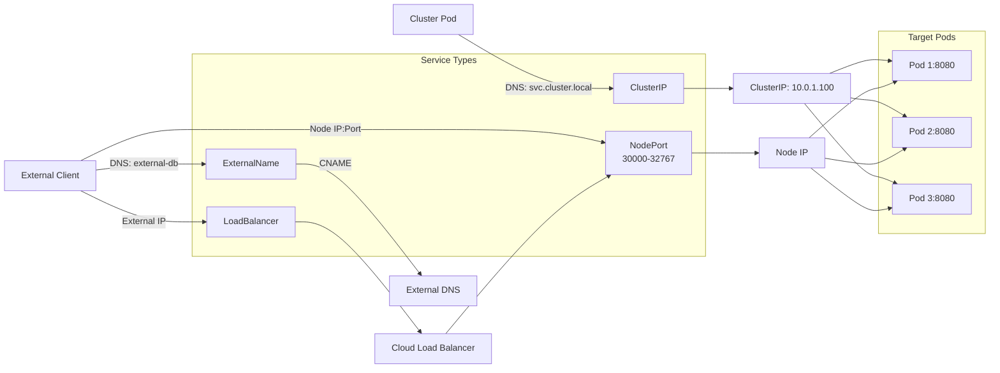
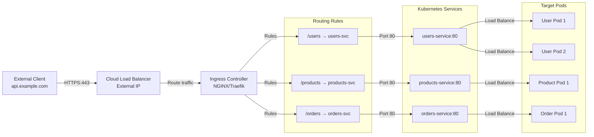

Kubernetes networking is fundamental to building scalable, resilient applications. This guide covers the complete networking stack—from the container networking interface to advanced service meshes.

## Kubernetes Networking Model

Kubernetes operates with a unique networking model that differs significantly from traditional infrastructure:

### Core Principles

1. **Every Pod Gets Its Own IP**: Each pod receives a unique IP address, even if multiple containers run within it. All containers in a pod share the same network namespace and communicate via localhost.

2. **Pods Communicate Without NAT**: Pods can communicate directly with each other across nodes without network address translation. There's no overlay or tunneling required at the application layer.

3. **Flat Network Assumption**: Kubernetes assumes a flat network where all pods are reachable from all other pods. This is the foundation of the networking model.

### Container Network Interface (CNI) Plugins

The actual networking implementation is delegated to CNI plugins, which handle IP allocation, routing, and connectivity.

| Plugin | Best For | Key Features |
|--------|----------|--------------|
| **Calico** | Enterprise, policy-focused | BGP routing, NetworkPolicy support, performance |
| **Flannel** | Simplicity, small clusters | Lightweight, VXLAN/host-gw modes, easy setup |
| **Cilium** | eBPF features, advanced use cases | eBPF-based, service mesh, observability |
| **Weave** | Encrypted networking | Auto-discovery, encrypted overlay, easy deployment |
| **Kube-router** | BGP peering, simplicity | BGP routing, policy enforcement, integrated |

### Network Architecture Diagram

```
┌─────────────────────────────────────────────────────────┐
│                     Kubernetes Cluster                   │
├─────────────────────────────────────────────────────────┤
│                                                           │
│  ┌──────────────────┐          ┌──────────────────┐    │
│  │   Node 1         │          │   Node 2         │    │
│  │                  │          │                  │    │
│  │ ┌──────────────┐ │          │ ┌──────────────┐ │    │
│  │ │ Pod A        │ │          │ │ Pod C        │ │    │
│  │ │ IP: 10.0.1.2 │ │          │ │ IP: 10.0.2.3 │ │    │
│  │ └──────────────┘ │          │ └──────────────┘ │    │
│  │                  │          │                  │    │
│  │ ┌──────────────┐ │          │ ┌──────────────┐ │    │
│  │ │ Pod B        │ │          │ │ Pod D        │ │    │
│  │ │ IP: 10.0.1.3 │ │          │ │ IP: 10.0.2.4 │ │    │
│  │ └──────────────┘ │          │ └──────────────┘ │    │
│  │                  │          │                  │    │
│  │  CNI Network     │          │  CNI Network     │    │
│  │  10.0.1.0/24    │          │  10.0.2.0/24    │    │
│  └──────────────────┘          └──────────────────┘    │
│           │                              │               │
│           └──────────────────┬───────────┘               │
│                              │                          │
│                    Cluster Network (10.0.0.0/8)        │
│                                                          │
└─────────────────────────────────────────────────────────┘
```

---

## Services Deep Dive

Services are Kubernetes abstractions that provide stable networking endpoints for pods, which are ephemeral and frequently replaced.

### ClusterIP (Default)

**Purpose**: Internal service discovery within the cluster.

**Characteristics**:
- Only accessible from within the cluster
- Gets a stable virtual IP from the ClusterIP range
- DNS name resolves to ClusterIP
- Default service type

**YAML Example**:

```yaml
apiVersion: v1
kind: Service
metadata:
  name: api-service
  namespace: production
spec:
  type: ClusterIP
  selector:
    app: api
  ports:
  - name: http
    port: 8080           # Port exposed on ClusterIP
    targetPort: 8080     # Port on the pod
    protocol: TCP
```

**Use Cases**:
- Backend services that only other pods need to access
- Microservice-to-microservice communication
- Internal databases and caches

**Access Pattern**:
```bash
# From within the cluster
curl http://api-service:8080
curl http://api-service.production.svc.cluster.local:8080
```

### Service Types Diagram



---

### NodePort

**Purpose**: Expose services outside the cluster via node IPs.

**Characteristics**:
- Allocates a port on every node (default range: 30000-32767)
- Routes traffic from `<NodeIP>:<NodePort>` to the service
- ClusterIP is still created
- Allows external traffic

**YAML Example**:

```yaml
apiVersion: v1
kind: Service
metadata:
  name: web-service
spec:
  type: NodePort
  selector:
    app: web
  ports:
  - port: 80
    targetPort: 8080
    nodePort: 30080        # Explicitly specify port (optional)
```

**Use Cases**:
- Exposing services in development/testing environments
- Accessing services when LoadBalancer is not available
- Running Kubernetes on bare metal

**Access Pattern**:
```bash
# From outside the cluster
curl http://<any-node-ip>:30080
```

**Diagram**:
```
External Client
        │
        ▼
   <NodeIP>:30080 (on any node)
        │
        ├─ Node 1 → Service → Pods on Node 1
        ├─ Node 2 → Service → Pods on Node 2
        └─ Node 3 → Service → Pods on Node 3
```

---

### LoadBalancer

**Purpose**: Expose services using cloud provider load balancers.

**Characteristics**:
- Provisions an external load balancer (AWS ELB, Azure LB, GCP LB)
- Gets an external IP (in cloud environments)
- Combines ClusterIP and NodePort functionality
- Cloud-provider specific

**YAML Example**:

```yaml
apiVersion: v1
kind: Service
metadata:
  name: app-lb
spec:
  type: LoadBalancer
  selector:
    app: frontend
  ports:
  - port: 443
    targetPort: 8443
    protocol: TCP
  loadBalancerSourceRanges:
  - 203.0.113.0/24          # Restrict source IPs (optional)
```

**Use Cases**:
- Production exposures with DNS integration
- SSL/TLS termination at the load balancer
- Geographic load distribution
- High-availability external access

**Access Pattern**:
```bash
# Get the external IP
kubectl get svc app-lb

# Access via external IP
curl https://<external-ip>
```

---

### ExternalName

**Purpose**: Create a CNAME alias to an external service.

**Characteristics**:
- No selector or proxy involved
- Simply resolves to a CNAME
- No ClusterIP created
- Lightweight

**YAML Example**:

```yaml
apiVersion: v1
kind: Service
metadata:
  name: external-db
spec:
  type: ExternalName
  externalName: db.example.com
  ports:
  - port: 5432
```

**Use Cases**:
- Integrating external databases
- Wrapping third-party APIs
- Future migration planning
- Avoiding hardcoded external addresses in code

**Access Pattern**:
```bash
# Inside the cluster, pods resolve the CNAME
curl postgres://external-db:5432
```

---

### Headless Services

**Purpose**: Direct pod-to-pod communication without load balancing.

**Characteristics**:
- No ClusterIP (set to `None`)
- DNS returns individual pod IPs
- Useful for stateful applications
- Enables DNS-based discovery of specific pods

**YAML Example**:

```yaml
apiVersion: v1
kind: Service
metadata:
  name: mysql-headless
spec:
  clusterIP: None           # Makes it headless
  selector:
    app: mysql
  ports:
  - port: 3306
---
apiVersion: apps/v1
kind: StatefulSet
metadata:
  name: mysql
spec:
  serviceName: mysql-headless  # Link StatefulSet to headless service
  replicas: 3
  selector:
    matchLabels:
      app: mysql
  template:
    metadata:
      labels:
        app: mysql
    spec:
      containers:
      - name: mysql
        image: mysql:8.0
        ports:
        - containerPort: 3306
```

**DNS Resolution**:
```bash
# Service DNS returns all pod IPs
mysql-headless.default.svc.cluster.local  → 10.0.1.1, 10.0.1.2, 10.0.1.3

# Pod-specific DNS (for StatefulSets)
mysql-0.mysql-headless.default.svc.cluster.local  → 10.0.1.1
mysql-1.mysql-headless.default.svc.cluster.local  → 10.0.1.2
mysql-2.mysql-headless.default.svc.cluster.local  → 10.0.1.3
```

**Use Cases**:
- Database clusters (MySQL, MongoDB, Cassandra)
- Distributed caches (Redis Cluster)
- Any application requiring direct pod discovery

---

## Service Discovery

### DNS-Based Discovery

Kubernetes runs CoreDNS to provide DNS resolution for services.

**Service DNS Format**:
```
<service-name>.<namespace>.svc.cluster.local
```

**Examples**:
```bash
# In the same namespace
kubectl run -it --rm test --image=alpine -- nslookup api-service

# Across namespaces
kubectl run -it --rm test --image=alpine -- nslookup api-service.production.svc.cluster.local

# Service with custom port name
curl http://api-service.production.svc.cluster.local:8080
```

### Environment Variables

Kubernetes automatically injects service information as environment variables.

**Pattern**:
```
<SERVICE_NAME>_SERVICE_HOST=<clusterIP>
<SERVICE_NAME>_SERVICE_PORT=<port>
```

**Example**:
```bash
# For service "api-service" in port "8080"
API_SERVICE_SERVICE_HOST=10.0.0.100
API_SERVICE_SERVICE_PORT=8080
```

**Limitations**:
- Requires services to exist before pods
- Only works within the same namespace
- Less flexible than DNS

**Best Practice**: Use DNS-based discovery; environment variables are legacy.

---

## Ingress

Ingress provides HTTP/HTTPS routing to services, enabling advanced traffic management.

### Ingress Routing Diagram



### Ingress Controllers

| Controller | Best For | Features |
|------------|----------|----------|
| **NGINX** | General-purpose | Reverse proxy, path-based routing, SSL, popular |
| **Traefik** | Cloud-native | Auto-reload, dynamic config, modern |
| **AWS ALB** | AWS environments | Native AWS integration, high performance |
| **Google Cloud LB** | GCP | Managed service, auto-scaling |
| **HAProxy** | High-performance | Reverse proxy, load balancing, custom rules |

### Installing NGINX Ingress Controller

```bash
# Using Helm
helm repo add ingress-nginx https://kubernetes.github.io/ingress-nginx
helm install nginx-ingress ingress-nginx/ingress-nginx \
  --namespace ingress-nginx \
  --create-namespace
```

### Path-Based Routing

Route traffic based on URL paths.

**YAML Example**:

```yaml
apiVersion: networking.k8s.io/v1
kind: Ingress
metadata:
  name: app-routing
  annotations:
    nginx.ingress.kubernetes.io/rewrite-target: /
spec:
  ingressClassName: nginx
  rules:
  - host: api.example.com
    http:
      paths:
      - path: /users
        pathType: Prefix
        backend:
          service:
            name: users-service
            port:
              number: 8080
      - path: /products
        pathType: Prefix
        backend:
          service:
            name: products-service
            port:
              number: 8081
      - path: /
        pathType: Prefix
        backend:
          service:
            name: frontend-service
            port:
              number: 80
```

**Traffic Flow**:
```
api.example.com/users     → users-service:8080
api.example.com/products  → products-service:8081
api.example.com/          → frontend-service:80
```

### Host-Based Routing

Route traffic based on domain names.

**YAML Example**:

```yaml
apiVersion: networking.k8s.io/v1
kind: Ingress
metadata:
  name: virtual-hosts
spec:
  ingressClassName: nginx
  rules:
  - host: api.example.com
    http:
      paths:
      - path: /
        pathType: Prefix
        backend:
          service:
            name: api-service
            port:
              number: 8080
  - host: www.example.com
    http:
      paths:
      - path: /
        pathType: Prefix
        backend:
          service:
            name: frontend-service
            port:
              number: 80
  - host: admin.example.com
    http:
      paths:
      - path: /
        pathType: Prefix
        backend:
          service:
            name: admin-service
            port:
              number: 3000
```

### TLS Termination

Secure ingress with HTTPS/TLS.

**Create a TLS Secret**:

```bash
kubectl create secret tls tls-secret \
  --cert=path/to/cert.crt \
  --key=path/to/key.key
```

**YAML Example**:

```yaml
apiVersion: networking.k8s.io/v1
kind: Ingress
metadata:
  name: secure-ingress
  annotations:
    cert-manager.io/cluster-issuer: letsencrypt-prod  # Auto-cert with cert-manager
spec:
  ingressClassName: nginx
  tls:
  - hosts:
    - api.example.com
    secretName: tls-secret
  rules:
  - host: api.example.com
    http:
      paths:
      - path: /
        pathType: Prefix
        backend:
          service:
            name: api-service
            port:
              number: 8080
```

### Complex Ingress with Annotations

```yaml
apiVersion: networking.k8s.io/v1
kind: Ingress
metadata:
  name: advanced-ingress
  annotations:
    # Rate limiting
    nginx.ingress.kubernetes.io/limit-rps: "10"
    # CORS
    nginx.ingress.kubernetes.io/enable-cors: "true"
    nginx.ingress.kubernetes.io/cors-allow-origin: "*"
    # Authentication
    nginx.ingress.kubernetes.io/auth-type: basic
    nginx.ingress.kubernetes.io/auth-secret: basic-auth
spec:
  ingressClassName: nginx
  rules:
  - host: api.example.com
    http:
      paths:
      - path: /
        pathType: Prefix
        backend:
          service:
            name: api-service
            port:
              number: 8080
```

---

## Network Policies

Network Policies enforce traffic rules at the network level, implementing zero-trust principles.

### Default Allow-All

By default, Kubernetes allows all traffic between pods (permissive).

```
Every pod can communicate with every other pod
```

### Creating a Deny-All Policy

Block all ingress traffic by default.

**YAML Example**:

```yaml
apiVersion: networking.k8s.io/v1
kind: NetworkPolicy
metadata:
  name: deny-all
  namespace: production
spec:
  podSelector: {}          # Applies to all pods in the namespace
  policyTypes:
  - Ingress
  # No 'ingress' rules means all traffic is denied
```

This policy denies all incoming traffic to all pods in the `production` namespace.

### Allowing Specific Traffic

Allow traffic only from specific sources.

**YAML Example**:

```yaml
apiVersion: networking.k8s.io/v1
kind: NetworkPolicy
metadata:
  name: allow-from-nginx
spec:
  podSelector:
    matchLabels:
      app: backend
  policyTypes:
  - Ingress
  ingress:
  - from:
    - podSelector:
        matchLabels:
          app: nginx-ingress    # Only nginx pods can access
    ports:
    - protocol: TCP
      port: 8080
```

**Explanation**:
- Targets: Pods with label `app: backend`
- Allows: Ingress from pods with label `app: nginx-ingress`
- Port: Only on TCP port 8080

### Namespace-Based Policies

Allow traffic from pods in specific namespaces.

**YAML Example**:

```yaml
apiVersion: networking.k8s.io/v1
kind: NetworkPolicy
metadata:
  name: allow-from-frontend
  namespace: backend
spec:
  podSelector:
    matchLabels:
      tier: backend
  policyTypes:
  - Ingress
  ingress:
  - from:
    - namespaceSelector:
        matchLabels:
          name: frontend        # Only pods from frontend namespace
    ports:
    - protocol: TCP
      port: 8080
```

### Egress Policies

Control outgoing traffic from pods.

**YAML Example**:

```yaml
apiVersion: networking.k8s.io/v1
kind: NetworkPolicy
metadata:
  name: allow-dns-and-external
spec:
  podSelector:
    matchLabels:
      app: api
  policyTypes:
  - Egress
  egress:
  # Allow DNS queries (UDP port 53)
  - to:
    - namespaceSelector: {}    # Any namespace
    ports:
    - protocol: UDP
      port: 53
  # Allow outbound HTTPS
  - to:
    - ipBlock:
        cidr: 0.0.0.0/0
    ports:
    - protocol: TCP
      port: 443
  # Deny all other egress traffic
```

### Complete Zero-Trust Policy Example

```yaml
---
# Deny all traffic by default
apiVersion: networking.k8s.io/v1
kind: NetworkPolicy
metadata:
  name: default-deny
spec:
  podSelector: {}
  policyTypes:
  - Ingress
  - Egress

---
# Allow frontend to receive traffic from ingress controller
apiVersion: networking.k8s.io/v1
kind: NetworkPolicy
metadata:
  name: allow-ingress-to-frontend
spec:
  podSelector:
    matchLabels:
      app: frontend
  policyTypes:
  - Ingress
  ingress:
  - from:
    - namespaceSelector:
        matchLabels:
          name: ingress-nginx
    ports:
    - protocol: TCP
      port: 80

---
# Allow frontend to communicate with backend
apiVersion: networking.k8s.io/v1
kind: NetworkPolicy
metadata:
  name: allow-frontend-to-backend
spec:
  podSelector:
    matchLabels:
      app: backend
  policyTypes:
  - Ingress
  ingress:
  - from:
    - podSelector:
        matchLabels:
          app: frontend
    ports:
    - protocol: TCP
      port: 8080

---
# Allow backend to communicate with database
apiVersion: networking.k8s.io/v1
kind: NetworkPolicy
metadata:
  name: allow-backend-to-database
spec:
  podSelector:
    matchLabels:
      app: postgres
  policyTypes:
  - Ingress
  ingress:
  - from:
    - podSelector:
        matchLabels:
          app: backend
    ports:
    - protocol: TCP
      port: 5432

---
# Allow DNS for all pods
apiVersion: networking.k8s.io/v1
kind: NetworkPolicy
metadata:
  name: allow-dns
spec:
  podSelector: {}
  policyTypes:
  - Egress
  egress:
  - to:
    - namespaceSelector: {}
    ports:
    - protocol: UDP
      port: 53
```

---

## DNS in Kubernetes

### CoreDNS

Kubernetes uses CoreDNS as the cluster DNS server. CoreDNS is deployed in the `kube-system` namespace and handles all service name resolution.

**Check CoreDNS Status**:

```bash
kubectl get pods -n kube-system -l k8s-app=kube-dns
kubectl get svc -n kube-system kube-dns
```

### Service DNS Format

Services are resolvable using the fully qualified domain name (FQDN):

```
<service-name>.<namespace>.svc.cluster.local
```

**Examples**:

```bash
# Service in the same namespace (short form)
mysql

# Service in the same namespace (long form)
mysql.default.svc.cluster.local

# Service in different namespace
mysql.database.svc.cluster.local

# Service with custom port
_tcp._mysql._service.dns.local  # SRV records for advanced routing
```

### Pod DNS

Pods also have resolvable DNS names:

```
<pod-ip-hyphenated>.<namespace>.pod.cluster.local
```

**Example**:
```
10-0-1-5.default.pod.cluster.local  → 10.0.1.5
```

### Headless Service DNS

Headless services return all pod IPs.

```yaml
apiVersion: v1
kind: Service
metadata:
  name: redis
spec:
  clusterIP: None
  selector:
    app: redis
  ports:
  - port: 6379
```

**DNS Resolution**:
```bash
# Returns all pod IPs
redis.default.svc.cluster.local  → 10.0.1.1, 10.0.1.2, 10.0.1.3

# For StatefulSet pods
redis-0.redis.default.svc.cluster.local  → 10.0.1.1
redis-1.redis.default.svc.cluster.local  → 10.0.1.2
redis-2.redis.default.svc.cluster.local  → 10.0.1.3
```

### Testing DNS Resolution

```bash
# Run a DNS lookup test pod
kubectl run -it --rm debug --image=alpine -- sh

# Inside the pod
nslookup api-service
nslookup api-service.production.svc.cluster.local
dig api-service

# Check CoreDNS logs
kubectl logs -n kube-system -l k8s-app=kube-dns
```

---

## Service Mesh

A service mesh provides a dedicated infrastructure layer for managing service-to-service communication, offering advanced networking features.

### What Is a Service Mesh?

A service mesh:
- Injects sidecar proxies into application pods
- Manages traffic between services
- Provides observability, security, and reliability
- Abstracts networking complexity from applications

**Architecture**:
```
┌─────────────────────────┐
│      Control Plane      │
│  (Istio Pilot, Linkerd) │
└─────────────────────────┘
           │
    ┌──────┴──────┐
    ▼             ▼
┌────────┐   ┌────────┐
│ Pod A  │   │ Pod B  │
│ │      │   │ │      │
│ Envoy  │◄──│ Envoy  │
│ proxy  │   │ proxy  │
└────────┘   └────────┘
```

### Istio Basics

Istio is a popular service mesh providing traffic management, security, and observability.

**Installation**:

```bash
# Download Istio
curl -L https://istio.io/downloadIstio | sh

# Install Istio
istioctl install --set profile=demo -y

# Enable automatic sidecar injection
kubectl label namespace default istio-injection=enabled
```

**VirtualService Example** (Advanced traffic routing):

```yaml
apiVersion: networking.istio.io/v1beta1
kind: VirtualService
metadata:
  name: api-vs
spec:
  hosts:
  - api
  http:
  # Route 80% to v1, 20% to v2 (canary deployment)
  - match:
    - uri:
        prefix: /
    route:
    - destination:
        host: api
        subset: v1
      weight: 80
    - destination:
        host: api
        subset: v2
      weight: 20
---
apiVersion: networking.istio.io/v1beta1
kind: DestinationRule
metadata:
  name: api-dr
spec:
  host: api
  trafficPolicy:
    connectionPool:
      tcp:
        maxConnections: 100
      http:
        http1MaxPendingRequests: 50
  subsets:
  - name: v1
    labels:
      version: v1
  - name: v2
    labels:
      version: v2
```

### Linkerd Basics

Linkerd is a lightweight, Kubernetes-native service mesh.

**Installation**:

```bash
# Add Linkerd Helm repo
helm repo add linkerd https://helm.linkerd.io

# Install Linkerd
helm install linkerd2 linkerd/linkerd2 \
  --namespace linkerd --create-namespace

# Enable automatic sidecar injection
kubectl annotate ns default linkerd.io/inject=enabled
```

**Traffic Policy Example**:

```yaml
apiVersion: policy.linkerd.io/v1beta1
kind: TrafficPolicy
metadata:
  namespace: default
spec:
  targetRef:
    group: core
    kind: Namespace
    name: default
  retries:
    maxRetries: 3
    backoff: exponential
  timeouts:
    request: 10s
```

### Mutual TLS (mTLS)

Service mesh provides automatic mTLS between services.

**Istio PeerAuthentication** (Enable mTLS):

```yaml
apiVersion: security.istio.io/v1beta1
kind: PeerAuthentication
metadata:
  name: default
spec:
  mtls:
    mode: STRICT  # Enforce mTLS on all traffic
```

### Observability

Service meshes provide automatic observability without code changes.

**Istio Observability Stack**:
- **Prometheus**: Metrics collection
- **Grafana**: Metrics visualization
- **Jaeger**: Distributed tracing
- **Kiali**: Service mesh visualization

```bash
# Access Kiali dashboard
kubectl port-forward -n istio-system svc/kiali 20000:20000
# Visit http://localhost:20000
```

---

## Load Balancing

### kube-proxy Modes

`kube-proxy` is a network proxy running on every node, implementing service abstraction.

#### IPTables Mode (Default)

- Uses Linux iptables rules
- Per-service rule chain
- Scales linearly with service count
- Slower rule lookup for high volume

**YAML to check mode**:

```bash
kubectl get pod -n kube-system kube-proxy-* -o yaml | grep mode
```

#### IPVS Mode

- Uses Linux IPVS (IP Virtual Server)
- Single connection hash table
- Better performance at scale
- Supports advanced load balancing algorithms

**Enable IPVS Mode**:

```bash
# Edit kube-proxy ConfigMap
kubectl edit cm -n kube-system kube-proxy

# Change mode
mode: "ipvs"
ipvs:
  scheduler: "rr"  # round-robin
```

**Supported IPVS Schedulers**:
- `rr` - Round Robin
- `lc` - Least Connection
- `dh` - Destination Hashing
- `sh` - Source Hashing
- `nq` - Never Queue

### Session Affinity

Ensure traffic from a client goes to the same pod.

**YAML Example**:

```yaml
apiVersion: v1
kind: Service
metadata:
  name: stateful-app
spec:
  type: ClusterIP
  selector:
    app: stateful
  sessionAffinity: ClientIP       # Enable session affinity
  sessionAffinityConfig:
    clientIPConfig:
      timeoutSeconds: 3600        # 1 hour timeout
  ports:
  - port: 8080
    targetPort: 8080
```

**Use Cases**:
- HTTP sessions without shared storage
- WebSocket connections
- Stateful applications requiring connection persistence

---

## Troubleshooting Networking

### Common Issues and Solutions

| Issue | Diagnosis | Solution |
|-------|-----------|----------|
| Pod can't reach service | DNS resolution fails | Check CoreDNS, verify service exists |
| External traffic doesn't reach service | Ingress/LoadBalancer misconfigured | Verify service type, check endpoints |
| High latency | Suboptimal routing, network policies | Check network policies, optimize pod placement |
| Connection refused | Service not running or listening | Check pod status, verify port configuration |

### Debugging Commands

**Check Service Endpoints**:

```bash
# Verify service has endpoints
kubectl get endpoints api-service
kubectl describe svc api-service

# Expected output shows pod IPs
NAME          ENDPOINTS                AGE
api-service   10.0.1.5:8080,10.0.1.6:8080
```

**Test DNS Resolution**:

```bash
# Create a debug pod
kubectl run -it --rm debug --image=alpine -- sh

# Inside the pod
nslookup api-service
dig api-service
getent hosts api-service

# Check DNS for specific namespace
nslookup api-service.production.svc.cluster.local
```

**Test Connectivity**:

```bash
# Test HTTP connectivity
kubectl run -it --rm test --image=alpine -- sh

# Inside pod
curl http://api-service:8080
curl http://api-service:8080/health

# Test TCP connectivity
nc -zv api-service 8080
```

**Check Network Policies**:

```bash
# List all network policies
kubectl get networkpolicy -A

# Describe a specific policy
kubectl describe networkpolicy allow-from-nginx

# Check which policies apply to a pod
kubectl get networkpolicy -l app=backend
```

**Capture Network Traffic**:

```bash
# Execute tcpdump in a pod
kubectl exec -it <pod-name> -- sh

# Inside pod
tcpdump -i eth0 -n 'tcp port 8080'

# Or from the node
kubectl debug node/<node-name> -it --image=ubuntu
tcpdump -i eth0 -n 'tcp port 8080'
```

**Check Logs**:

```bash
# kube-proxy logs
kubectl logs -n kube-system -l component=kube-proxy

# CoreDNS logs
kubectl logs -n kube-system -l k8s-app=kube-dns

# Kubelet logs on the node
journalctl -u kubelet -f
```

**Network Debugging Pod**:

```yaml
apiVersion: v1
kind: Pod
metadata:
  name: network-debug
spec:
  containers:
  - name: netutils
    image: nicolaka/netshoot  # Swiss army knife for networking
    command: ["/bin/bash"]
    stdin: true
    tty: true
```

```bash
kubectl apply -f network-debug.yaml
kubectl exec -it network-debug -- bash
# Now you have: curl, wget, nslookup, dig, tcpdump, iptables, etc.
```

---

## Exercises

### Exercise 1: Create a ClusterIP Service and Test DNS Resolution

**Objective**: Create a service, expose a deployment, and verify DNS-based discovery.

**Steps**:

1. Create a deployment:

```bash
kubectl create deployment web --image=nginx:latest --replicas=3
kubectl expose deployment web --port=80 --target-port=80 --type=ClusterIP --name=web-service
```

2. Verify the service:

```bash
kubectl get svc web-service
kubectl get endpoints web-service
```

3. Test DNS resolution:

```bash
# Create a debug pod
kubectl run -it --rm debug --image=alpine -- sh

# Inside the pod, test DNS
nslookup web-service
dig web-service

# Test connectivity
curl http://web-service
```

4. Test service accessibility from different namespaces:

```bash
# Create a new namespace
kubectl create namespace testing

# Create a pod in the new namespace
kubectl run -it --rm debug -n testing --image=alpine -- sh

# Inside the pod, access the service from different namespace
nslookup web-service.default.svc.cluster.local
curl http://web-service.default.svc.cluster.local
```

**Expected Output**:
- Service has a ClusterIP
- DNS resolves to the ClusterIP
- Requests are load-balanced across all 3 pods
- Pods in other namespaces can access it via FQDN

---

### Exercise 2: Set Up an Ingress with Path-Based Routing

**Objective**: Configure an Ingress controller with multiple backend services.

**Prerequisites**:
- NGINX Ingress Controller installed
- Multiple services running

**Steps**:

1. Create three services with different deployments:

```bash
# API service
kubectl create deployment api --image=httpbin:latest --replicas=2
kubectl expose deployment api --port=80 --target-port=80 --name=api-service

# Users service
kubectl create deployment users --image=kennethreitz/httpbin --replicas=2
kubectl expose deployment users --port=80 --target-port=80 --name=users-service

# Products service
kubectl create deployment products --image=kennethreitz/httpbin --replicas=2
kubectl expose deployment products --port=80 --target-port=80 --name=products-service
```

2. Create an Ingress resource:

```yaml
apiVersion: networking.k8s.io/v1
kind: Ingress
metadata:
  name: multi-service-ingress
  annotations:
    nginx.ingress.kubernetes.io/rewrite-target: /
spec:
  ingressClassName: nginx
  rules:
  - host: example.local
    http:
      paths:
      - path: /api
        pathType: Prefix
        backend:
          service:
            name: api-service
            port:
              number: 80
      - path: /users
        pathType: Prefix
        backend:
          service:
            name: users-service
            port:
              number: 80
      - path: /products
        pathType: Prefix
        backend:
          service:
            name: products-service
            port:
              number: 80
```

3. Apply the Ingress:

```bash
kubectl apply -f ingress.yaml
kubectl get ingress
kubectl describe ingress multi-service-ingress
```

4. Test the Ingress (if using minikube or localhost):

```bash
# Get the Ingress IP/hostname
kubectl get ingress multi-service-ingress

# Add to /etc/hosts (or use port-forward)
# <ingress-ip> example.local

# Test paths
curl http://example.local/api
curl http://example.local/users
curl http://example.local/products
```

**Expected Output**:
- Each path routes to the correct backend service
- Different instances serve requests in a round-robin fashion
- All pods are accessible through the single Ingress endpoint

---

### Exercise 3: Implement a NetworkPolicy to Restrict Traffic

**Objective**: Create a zero-trust network environment with explicit allow rules.

**Scenario**: A frontend app should only accept traffic from an ingress controller, and should only communicate with the backend app. The backend should only accept traffic from the frontend and communicate with the database.

**Steps**:

1. Create deployments for the three tiers:

```bash
# Frontend
kubectl create deployment frontend --image=nginx:latest
kubectl expose deployment frontend --port=80 --target-port=80 --name=frontend-service

# Backend
kubectl create deployment backend --image=kennethreitz/httpbin
kubectl expose deployment backend --port=8080 --target-port=80 --name=backend-service

# Database (simulated)
kubectl create deployment database --image=postgres:latest
kubectl expose deployment database --port=5432 --target-port=5432 --name=database-service
```

2. Label the deployments:

```bash
# Label pods for network policies
kubectl patch deployment frontend -p '{"spec":{"template":{"metadata":{"labels":{"tier":"frontend"}}}}}'
kubectl patch deployment backend -p '{"spec":{"template":{"metadata":{"labels":{"tier":"backend"}}}}}'
kubectl patch deployment database -p '{"spec":{"template":{"metadata":{"labels":{"tier":"database"}}}}}'
```

3. Create a namespace for ingress and label it:

```bash
kubectl create namespace ingress-nginx
kubectl label namespace ingress-nginx ingress-system=true
```

4. Create comprehensive network policies:

```yaml
---
# 1. Deny all traffic by default
apiVersion: networking.k8s.io/v1
kind: NetworkPolicy
metadata:
  name: default-deny-all
spec:
  podSelector: {}
  policyTypes:
  - Ingress
  - Egress

---
# 2. Allow frontend to receive traffic from ingress controller
apiVersion: networking.k8s.io/v1
kind: NetworkPolicy
metadata:
  name: allow-ingress-to-frontend
spec:
  podSelector:
    matchLabels:
      tier: frontend
  policyTypes:
  - Ingress
  ingress:
  - from:
    - namespaceSelector:
        matchLabels:
          ingress-system: "true"
    ports:
    - protocol: TCP
      port: 80

---
# 3. Allow frontend to egress to backend
apiVersion: networking.k8s.io/v1
kind: NetworkPolicy
metadata:
  name: allow-frontend-to-backend
spec:
  podSelector:
    matchLabels:
      tier: frontend
  policyTypes:
  - Egress
  egress:
  - to:
    - podSelector:
        matchLabels:
          tier: backend
    ports:
    - protocol: TCP
      port: 8080
  # Allow DNS
  - to:
    - namespaceSelector: {}
    ports:
    - protocol: UDP
      port: 53

---
# 4. Allow backend to receive traffic from frontend
apiVersion: networking.k8s.io/v1
kind: NetworkPolicy
metadata:
  name: allow-frontend-to-backend-ingress
spec:
  podSelector:
    matchLabels:
      tier: backend
  policyTypes:
  - Ingress
  ingress:
  - from:
    - podSelector:
        matchLabels:
          tier: frontend
    ports:
    - protocol: TCP
      port: 8080

---
# 5. Allow backend to egress to database
apiVersion: networking.k8s.io/v1
kind: NetworkPolicy
metadata:
  name: allow-backend-to-database
spec:
  podSelector:
    matchLabels:
      tier: backend
  policyTypes:
  - Egress
  egress:
  - to:
    - podSelector:
        matchLabels:
          tier: database
    ports:
    - protocol: TCP
      port: 5432
  # Allow DNS
  - to:
    - namespaceSelector: {}
    ports:
    - protocol: UDP
      port: 53

---
# 6. Allow database to receive traffic from backend
apiVersion: networking.k8s.io/v1
kind: NetworkPolicy
metadata:
  name: allow-backend-to-database-ingress
spec:
  podSelector:
    matchLabels:
      tier: database
  policyTypes:
  - Ingress
  ingress:
  - from:
    - podSelector:
        matchLabels:
          tier: backend
    ports:
    - protocol: TCP
      port: 5432
```

5. Apply the network policies:

```bash
kubectl apply -f network-policies.yaml
kubectl get networkpolicy
```

6. Test the policies:

```bash
# Frontend should be reachable from ingress controller
kubectl run -it --rm -n ingress-nginx test --image=alpine -- \
  curl http://frontend-service.default:80

# Frontend should NOT reach database directly
kubectl exec -it <frontend-pod> -- curl http://database-service:5432
# This should timeout/fail

# Backend should reach database
kubectl exec -it <backend-pod> -- curl http://database-service:5432
# This should connect (though the response won't be valid HTTP)

# Test that traffic between services is blocked
kubectl run -it --rm test --image=alpine -- \
  curl http://backend-service:8080
# This should timeout (no ingress from default namespace)
```

**Expected Results**:
- Frontend receives traffic only from ingress namespace
- Frontend can communicate with backend
- Backend can communicate with database
- Unauthorized traffic is blocked
- DNS queries work (port 53)

---

## Key Takeaways

1. **Kubernetes networking** provides a flat network where every pod has a unique IP and can communicate with every other pod by default.

2. **Services** abstract away pod ephemeralness and provide stable endpoints with multiple types for different use cases.

3. **DNS-based service discovery** is the recommended approach; CoreDNS resolves service names automatically.

4. **Ingress** enables HTTP/HTTPS routing with advanced features like path/host-based routing and TLS termination.

5. **Network Policies** implement zero-trust networking by explicitly defining allowed traffic paths.

6. **Service Mesh** (Istio, Linkerd) adds advanced traffic management, observability, and security without modifying application code.

7. **Effective troubleshooting** requires understanding service endpoints, DNS resolution, network policies, and logs.

## Resources

- [Kubernetes Networking Documentation](https://kubernetes.io/docs/concepts/services-networking/)
- [Service Discovery in Kubernetes](https://kubernetes.io/docs/concepts/services-networking/service/#discovering-services)
- [Ingress Controllers](https://kubernetes.io/docs/concepts/services-networking/ingress-controllers/)
- [Network Policies](https://kubernetes.io/docs/concepts/services-networking/network-policies/)
- [Istio Documentation](https://istio.io/latest/docs/)
- [Linkerd Documentation](https://linkerd.io/2/overview/)
