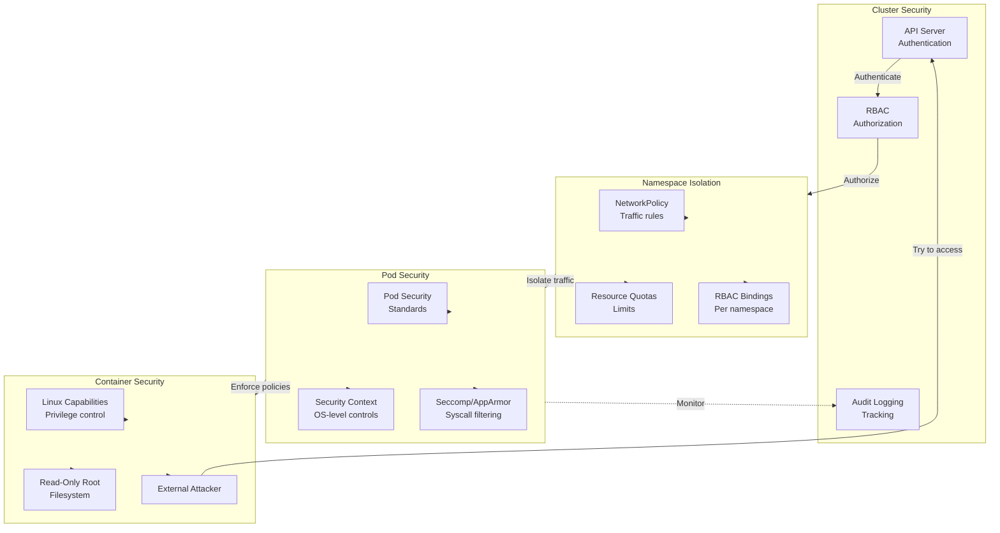

# Kubernetes Security & Hardening

Securing Kubernetes clusters is critical for protecting containerized applications. This guide covers the NSA/CISA Kubernetes Hardening principles and industry best practices for building secure, resilient clusters.

## Threat Model

Understanding the attack surface is the first step in securing Kubernetes. The NSA/CISA hardening guide identifies three primary sources of compromise:

### 1. Supply Chain Compromise

**Risk**: Malicious code injected into container images or dependencies before they reach your cluster.

**Examples**:
- Compromised base images or package repositories
- Malicious dependencies in application libraries
- Unsigned or unverified container images

**Mitigation**:
- Use minimal base images (distroless, Alpine)
- Scan all images for vulnerabilities
- Enforce image signing and verification
- Use private registries with access controls
- Pin specific image versions (avoid `latest` tag)

### 2. Malicious Actors

**Risk**: External attackers exploiting exposed APIs, unpatched vulnerabilities, or misconfigured resources.

**Examples**:
- Exposed Kubernetes API server
- Unauthenticated access to endpoints
- Unpatched cluster or container runtime vulnerabilities
- Insecure network policies allowing lateral movement

**Mitigation**:
- Restrict API server access with firewalls and authentication
- Apply security patches and updates immediately
- Implement network policies for egress/ingress control
- Use mTLS for service-to-service communication
- Monitor and audit all API requests

### 3. Insider Threats

**Risk**: Compromised user credentials or excessive permissions granted to accounts.

**Examples**:
- Stolen service account tokens
- Overly permissive RBAC policies
- Shared credentials among teams
- Lack of audit logging for privilege escalation

**Mitigation**:
- Implement strict RBAC with least privilege
- Use managed identities and federated authentication
- Rotate secrets and tokens regularly
- Enable comprehensive audit logging
- Monitor for unusual privilege escalation patterns

### Kubernetes Attack Surface

```
External Attack Surface:
  ├─ Exposed Kubernetes API server
  ├─ Ingress controllers
  ├─ LoadBalancer services
  └─ Kubelet API

Internal Attack Surface:
  ├─ Inter-pod communication (cluster network)
  ├─ Secrets and ConfigMaps
  ├─ RBAC permission gaps
  └─ Container runtimes
```

---

## Kubernetes Security Layers

Kubernetes employs a defense-in-depth approach with multiple security boundaries:

### Security Layers Diagram



---

## Pod Security

Pods are the smallest deployable units in Kubernetes. Securing them is fundamental to cluster security.

### Security Contexts

Security contexts define operating system-level security attributes for containers and pods.

#### Pod-Level Security Context

```yaml
apiVersion: v1
kind: Pod
metadata:
  name: secure-pod
spec:
  securityContext:
    runAsNonRoot: true
    runAsUser: 1000
    runAsGroup: 3000
    fsGroup: 2000
    seccompProfile:
      type: RuntimeDefault
  containers:
  - name: app
    image: myapp:latest
    securityContext:
      allowPrivilegeEscalation: false
      readOnlyRootFilesystem: true
      runAsNonRoot: true
      capabilities:
        drop:
        - ALL
        add:
        - NET_BIND_SERVICE
    volumeMounts:
    - name: tmp
      mountPath: /tmp
  volumes:
  - name: tmp
    emptyDir: {}
```

**Key Security Context Fields**:

| Field | Purpose | Recommended |
|:------|:--------|:------------|
| `runAsNonRoot` | Force container to run as non-root | `true` |
| `runAsUser` | Specify user ID (e.g., 1000) | Set explicitly |
| `allowPrivilegeEscalation` | Prevent escalation to higher privileges | `false` |
| `readOnlyRootFilesystem` | Mount root as read-only | `true` |
| `capabilities.drop` | Drop Linux capabilities | `ALL` then add only needed |
| `seccompProfile` | Restrict syscalls | `RuntimeDefault` or custom |
| `fsGroup` | Set filesystem group ID | Set for shared volumes |

### Pod Security Standards (PSS)

Pod Security Standards replaced Pod Security Policies (deprecated in 1.25, removed in 1.29). They define three levels:

#### 1. **Privileged**
Unrestricted policy, used for system-critical pods only.

```yaml
apiVersion: v1
kind: Pod
metadata:
  name: privileged-pod
spec:
  securityContext:
    privileged: true
  containers:
  - name: privileged-app
    image: privileged-app:latest
```

#### 2. **Baseline**
Minimal restrictions, prevents known privilege escalations.

```yaml
apiVersion: v1
kind: Pod
metadata:
  name: baseline-pod
spec:
  securityContext:
    runAsNonRoot: true
  containers:
  - name: app
    image: myapp:latest
    securityContext:
      allowPrivilegeEscalation: false
```

#### 3. **Restricted** (Recommended for most workloads)
Hardened policies enforcing security best practices.

```yaml
apiVersion: v1
kind: Pod
metadata:
  name: restricted-pod
spec:
  securityContext:
    runAsNonRoot: true
    runAsUser: 65534  # nobody user
    fsGroup: 65534
    seccompProfile:
      type: RuntimeDefault
  containers:
  - name: app
    image: myapp:latest
    securityContext:
      allowPrivilegeEscalation: false
      readOnlyRootFilesystem: true
      runAsNonRoot: true
      capabilities:
        drop:
        - ALL
    resources:
      limits:
        cpu: 100m
        memory: 128Mi
      requests:
        cpu: 100m
        memory: 128Mi
```

### Pod Security Admission

Pod Security Admission enforces PSS at namespace and cluster levels.

#### Enable PSS via Labels

```yaml
apiVersion: v1
kind: Namespace
metadata:
  name: secure-apps
  labels:
    # Enforce Restricted policy
    pod-security.kubernetes.io/enforce: restricted
    pod-security.kubernetes.io/enforce-version: latest

    # Audit policy violations
    pod-security.kubernetes.io/audit: restricted
    pod-security.kubernetes.io/audit-version: latest

    # Warn on violations
    pod-security.kubernetes.io/warn: restricted
    pod-security.kubernetes.io/warn-version: latest
```

```bash
# Apply the namespace
kubectl apply -f secure-namespace.yaml

# Try deploying a non-compliant pod
kubectl apply -f nginx-pod.yaml -n secure-apps
# Error: violates PodSecurity "restricted:latest"
```

### seccomp Profiles

Seccomp (secure computing) restricts syscalls a container can make.

#### Default seccomp (RuntimeDefault)

```yaml
apiVersion: v1
kind: Pod
metadata:
  name: seccomp-pod
spec:
  securityContext:
    seccompProfile:
      type: RuntimeDefault
  containers:
  - name: app
    image: myapp:latest
```

#### Custom seccomp Profile

```yaml
apiVersion: v1
kind: Pod
metadata:
  name: custom-seccomp-pod
spec:
  securityContext:
    seccompProfile:
      type: Localhost
      localhostProfile: my-profile.json
  containers:
  - name: app
    image: myapp:latest
```

**Custom profile** (`my-profile.json`):
```json
{
  "defaultAction": "SCMP_ACT_ERRNO",
  "defaultErrnoRet": 1,
  "archMap": [
    {
      "architecture": "SCMP_ARCH_X86_64",
      "subArchitectures": ["SCMP_ARCH_X86", "SCMP_ARCH_X32"]
    }
  ],
  "syscalls": [
    {
      "names": ["read", "write", "open", "close", "stat"],
      "action": "SCMP_ACT_ALLOW"
    }
  ]
}
```

### AppArmor & SELinux

Linux kernel security modules enforce mandatory access control.

#### AppArmor

```yaml
apiVersion: v1
kind: Pod
metadata:
  name: apparmor-pod
  annotations:
    container.apparmor.security.beta.kubernetes.io/app: localhost/my-profile
spec:
  containers:
  - name: app
    image: myapp:latest
```

**Load AppArmor profile**:
```bash
# On each node with the pod
sudo apparmor_parser -r /path/to/my-profile
```

#### SELinux

```yaml
apiVersion: v1
kind: Pod
metadata:
  name: selinux-pod
spec:
  securityContext:
    seLinuxOptions:
      level: "s0:c123,c456"
      type: "spc_t"
  containers:
  - name: app
    image: myapp:latest
```

---

## RBAC (Role-Based Access Control)

RBAC controls who can perform what actions on which resources in Kubernetes.

### RBAC Components

| Component | Scope | Purpose |
|:----------|:------|:--------|
| **Role** | Namespace | Define permissions within a namespace |
| **ClusterRole** | Cluster-wide | Define cluster-wide permissions |
| **RoleBinding** | Namespace | Bind Role to user/group/service account |
| **ClusterRoleBinding** | Cluster-wide | Bind ClusterRole to user/group/service account |

### Role Example

```yaml
apiVersion: rbac.authorization.k8s.io/v1
kind: Role
metadata:
  name: pod-reader
  namespace: default
rules:
# API group (core API uses "")
- apiGroups: [""]
  # Resource type
  resources: ["pods"]
  # Specific operations
  verbs: ["get", "list"]

# Additional rule for logs
- apiGroups: [""]
  resources: ["pods/log"]
  verbs: ["get"]
```

### RoleBinding Example

```yaml
apiVersion: rbac.authorization.k8s.io/v1
kind: RoleBinding
metadata:
  name: read-pods
  namespace: default
subjects:
# Service account
- kind: ServiceAccount
  name: my-app
  namespace: default
# User
- kind: User
  name: alice@example.com
# Group
- kind: Group
  name: developers
roleRef:
  kind: Role
  name: pod-reader
  apiGroup: rbac.authorization.k8s.io
```

### ClusterRole with Least Privilege

```yaml
apiVersion: rbac.authorization.k8s.io/v1
kind: ClusterRole
metadata:
  name: deployment-scaler
rules:
# Read deployments
- apiGroups: ["apps"]
  resources: ["deployments"]
  verbs: ["get", "list"]

# Scale deployments
- apiGroups: ["apps"]
  resources: ["deployments/scale"]
  verbs: ["get", "patch", "update"]

# Get metrics
- apiGroups: ["metrics.k8s.io"]
  resources: ["pods"]
  verbs: ["get", "list"]
```

### ClusterRoleBinding

```yaml
apiVersion: rbac.authorization.k8s.io/v1
kind: ClusterRoleBinding
metadata:
  name: scaling-team
subjects:
- kind: Group
  name: scaling-admins
  apiGroup: rbac.authorization.k8s.io
roleRef:
  kind: ClusterRole
  name: deployment-scaler
  apiGroup: rbac.authorization.k8s.io
```

### Service Accounts

Service accounts are Kubernetes users for pods.

```yaml
apiVersion: v1
kind: ServiceAccount
metadata:
  name: app-deployer
  namespace: default
---
apiVersion: rbac.authorization.k8s.io/v1
kind: Role
metadata:
  name: deployer
  namespace: default
rules:
- apiGroups: ["apps"]
  resources: ["deployments"]
  verbs: ["create", "get", "list", "update", "patch"]
- apiGroups: [""]
  resources: ["services"]
  verbs: ["get", "list", "create"]
---
apiVersion: rbac.authorization.k8s.io/v1
kind: RoleBinding
metadata:
  name: deploy-role-binding
  namespace: default
subjects:
- kind: ServiceAccount
  name: app-deployer
  namespace: default
roleRef:
  kind: Role
  name: deployer
  apiGroup: rbac.authorization.k8s.io
---
apiVersion: v1
kind: Pod
metadata:
  name: deployer-app
  namespace: default
spec:
  serviceAccountName: app-deployer
  containers:
  - name: deployer
    image: deployer:latest
```

### Check Effective Permissions

```bash
# List available permissions
kubectl api-resources

# Check what a service account can do
kubectl auth can-i create deployments --as=system:serviceaccount:default:app-deployer

# List all role bindings
kubectl get rolebindings,clusterrolebindings -A

# View a role's permissions
kubectl describe role pod-reader
```

---

## Network Policies

Network policies control traffic between pods and external services.

### Default Deny Policy

Start with denying all traffic, then explicitly allow what's needed.

```yaml
apiVersion: networking.k8s.io/v1
kind: NetworkPolicy
metadata:
  name: default-deny-all
  namespace: default
spec:
  podSelector: {}
  policyTypes:
  - Ingress
  - Egress
```

### Allow Ingress from Specific Namespace

```yaml
apiVersion: networking.k8s.io/v1
kind: NetworkPolicy
metadata:
  name: allow-from-frontend
  namespace: backend
spec:
  podSelector:
    matchLabels:
      app: api
  policyTypes:
  - Ingress
  ingress:
  - from:
    - namespaceSelector:
        matchLabels:
          name: frontend
    ports:
    - protocol: TCP
      port: 8080
```

### Namespace Isolation

```yaml
---
# Create frontend namespace
apiVersion: v1
kind: Namespace
metadata:
  name: frontend
  labels:
    name: frontend
---
# Create backend namespace
apiVersion: v1
kind: Namespace
metadata:
  name: backend
  labels:
    name: backend
---
# Allow frontend to backend communication
apiVersion: networking.k8s.io/v1
kind: NetworkPolicy
metadata:
  name: allow-frontend-to-backend
  namespace: backend
spec:
  podSelector:
    matchLabels:
      tier: backend
  policyTypes:
  - Ingress
  ingress:
  - from:
    - namespaceSelector:
        matchLabels:
          name: frontend
    - podSelector:
        matchLabels:
          app: frontend
    ports:
    - protocol: TCP
      port: 8080
---
# Deny all ingress in backend by default
apiVersion: networking.k8s.io/v1
kind: NetworkPolicy
metadata:
  name: default-deny-ingress
  namespace: backend
spec:
  podSelector: {}
  policyTypes:
  - Ingress
```

### Egress Control

Restrict outbound traffic to specific destinations.

```yaml
apiVersion: networking.k8s.io/v1
kind: NetworkPolicy
metadata:
  name: allow-egress-to-api
  namespace: default
spec:
  podSelector:
    matchLabels:
      app: frontend
  policyTypes:
  - Egress
  egress:
  # Allow DNS
  - to:
    - podSelector:
        matchLabels:
          k8s-app: kube-dns
    ports:
    - protocol: UDP
      port: 53
  # Allow external API calls
  - to:
    - namespaceSelector:
        matchLabels:
          name: backend
    ports:
    - protocol: TCP
      port: 443
```

### Test Network Policies

```bash
# Create test pods
kubectl run -it --rm test-pod --image=busybox --restart=Never -- sh

# Try to reach another pod
wget http://api-pod:8080

# Check policy logs
kubectl logs -l app=network-policy-logger -f
```

---

## Image Security

Container images are a critical attack vector. Securing the supply chain is essential.

### Minimal Base Images

**Problem**: Large base images (Ubuntu, CentOS) contain unnecessary packages and increase attack surface.

**Solutions**:

#### Distroless Images

```dockerfile
# Multi-stage build with distroless
FROM golang:1.21 as builder
WORKDIR /app
COPY . .
RUN CGO_ENABLED=0 go build -o app .

# Distroless base (no shell, package manager)
FROM gcr.io/distroless/base-debian12
COPY --from=builder /app/app /
USER nonroot
ENTRYPOINT ["/app"]
```

#### Scratch Image

```dockerfile
FROM golang:1.21 as builder
WORKDIR /app
COPY . .
RUN CGO_ENABLED=0 GOOS=linux go build -a -installsuffix cgo -o app .

# Minimal scratch image
FROM scratch
COPY --from=builder /app/app /
ENTRYPOINT ["/app"]
```

#### Alpine Linux

```dockerfile
FROM alpine:3.19
RUN apk add --no-cache ca-certificates
COPY app /app
ENTRYPOINT ["/app"]
```

### Image Scanning with Trivy

Trivy scans images for known vulnerabilities.

```bash
# Install Trivy
curl -sfL https://raw.githubusercontent.com/aquasecurity/trivy/main/contrib/install.sh | sh -s -- -b /usr/local/bin

# Scan local image
trivy image myapp:latest

# Scan with severity filter
trivy image --severity HIGH,CRITICAL myapp:latest

# Generate SBOM (Software Bill of Materials)
trivy image --format cyclonedx myapp:latest > sbom.json

# Scan Kubernetes manifests
trivy config k8s-manifests/
```

**Trivy Output Example**:
```
myapp:latest (alpine 3.19)
========================
Total: 5 (CRITICAL: 2, HIGH: 3, MEDIUM: 0, LOW: 0)

CRITICAL
  openssl CVE-2023-5678
  glibc CVE-2023-1234
```

### Image Signing with Cosign

Sign and verify container images.

```bash
# Install Cosign
wget https://github.com/sigstore/cosign/releases/latest/download/cosign-linux-amd64
chmod +x cosign-linux-amd64

# Generate key pair
./cosign-linux-amd64 generate-key-pair

# Sign image
./cosign-linux-amd64 sign --key cosign.key ghcr.io/myorg/myapp:v1.0

# Verify signature
./cosign-linux-amd64 verify --key cosign.pub ghcr.io/myorg/myapp:v1.0

# Verify in Kubernetes
kubectl create secret generic cosign-pub --from-file=cosign.pub
```

### Private Registries

```bash
# Create imagePullSecret
kubectl create secret docker-registry regcred \
  --docker-server=ghcr.io \
  --docker-username=myuser \
  --docker-password=$GITHUB_TOKEN

# Use in pod
kubectl apply -f - <<EOF
apiVersion: v1
kind: Pod
metadata:
  name: private-app
spec:
  imagePullSecrets:
  - name: regcred
  containers:
  - name: app
    image: ghcr.io/myorg/private-app:latest
EOF
```

### Image Pinning

Always pin specific versions, never use `latest`.

```yaml
apiVersion: apps/v1
kind: Deployment
metadata:
  name: myapp
spec:
  template:
    spec:
      containers:
      # Good: Pinned version with digest
      - name: app
        image: myapp@sha256:abc123def456...

      # Also acceptable: Pinned semantic version
      # image: myapp:v1.2.3

      # Bad: Floating tag
      # image: myapp:latest
```

---

## Secrets Management

Kubernetes Secrets are convenient but have important limitations.

### Kubernetes Secrets (Base64 Encoding)

**Important**: Base64 is NOT encryption. Use only for non-sensitive configuration or with encryption at rest.

```yaml
apiVersion: v1
kind: Secret
metadata:
  name: app-secrets
type: Opaque
data:
  username: dXNlcm5hbWU=  # base64 encoded "username"
  password: cGFzc3dvcmQ=  # base64 encoded "password"
---
apiVersion: v1
kind: Pod
metadata:
  name: app-with-secrets
spec:
  containers:
  - name: app
    image: myapp:latest
    env:
    # Load secret into environment variable
    - name: DB_PASSWORD
      valueFrom:
        secretKeyRef:
          name: app-secrets
          key: password
    volumeMounts:
    - name: secrets
      mountPath: /etc/secrets
      readOnly: true
  volumes:
  - name: secrets
    secret:
      secretName: app-secrets
```

**Enable encryption at rest**:
```yaml
# In kube-apiserver manifest
- --encryption-provider-config=/etc/kubernetes/encryption-config.yaml
```

`/etc/kubernetes/encryption-config.yaml`:
```yaml
apiVersion: apiserver.config.k8s.io/v1
kind: EncryptionConfiguration
resources:
  - resources:
    - secrets
    providers:
    - aescbc:
        keys:
        - name: key1
          secret: <BASE64_ENCODED_32_BYTE_KEY>
    - identity: {}
```

### HashiCorp Vault

External secret management with encryption and rotation.

```bash
# Install Vault
curl https://apt.releases.hashicorp.com/gpg | sudo apt-key add -
sudo apt-add-repository "deb [arch=amd64] https://apt.releases.hashicorp.com $(lsb_release -cs) main"
sudo apt-get update && sudo apt-get install vault

# Start Vault
vault server -dev

# Create secret
vault kv put secret/app/db-credentials username=admin password=secret123

# Read secret
vault kv get secret/app/db-credentials
```

**Kubernetes integration with Vault Agent**:
```yaml
apiVersion: v1
kind: Pod
metadata:
  name: app-with-vault
  annotations:
    vault.hashicorp.com/agent-inject: "true"
    vault.hashicorp.com/role: "myapp"
    vault.hashicorp.com/agent-inject-secret-db: "secret/data/app/db-credentials"
    vault.hashicorp.com/agent-inject-template-db: |
      {{ with secret "secret/data/app/db-credentials" -}}
      export DB_USERNAME="{{ .Data.data.username }}"
      export DB_PASSWORD="{{ .Data.data.password }}"
      {{- end }}
spec:
  containers:
  - name: app
    image: myapp:latest
```

### AWS Secrets Manager

```bash
# Store secret
aws secretsmanager create-secret \
  --name app/db-password \
  --secret-string '{"username":"admin","password":"secret123"}'

# Retrieve secret
aws secretsmanager get-secret-value \
  --secret-id app/db-password
```

**Access from pod**:
```yaml
apiVersion: v1
kind: ServiceAccount
metadata:
  name: app-sa
  annotations:
    eks.amazonaws.com/role-arn: arn:aws:iam::ACCOUNT:role/app-role
---
apiVersion: v1
kind: Pod
metadata:
  name: app
spec:
  serviceAccountName: app-sa
  containers:
  - name: app
    image: myapp:latest
    env:
    - name: AWS_ROLE_ARN
      value: arn:aws:iam::ACCOUNT:role/app-role
    - name: AWS_WEB_IDENTITY_TOKEN_FILE
      value: /var/run/secrets/eks.amazonaws.com/serviceaccount/token
```

### Sealed Secrets

Encrypt secrets so they can be safely committed to Git.

```bash
# Install sealed-secrets controller
kubectl apply -f https://github.com/bitnami-labs/sealed-secrets/releases/download/v0.24.0/controller.yaml

# Create secret and seal it
echo -n "mysecret" | kubectl create secret generic my-secret \
  --dry-run=client \
  --from-file=password=/dev/stdin \
  -o yaml | kubeseal -o yaml > sealed-secret.yaml

# Apply sealed secret
kubectl apply -f sealed-secret.yaml

# Controller automatically decrypts it
kubectl get secret my-secret
```

---

## Audit Logging

Comprehensive audit logging tracks who did what in your cluster.

### Enable Audit Logging

```yaml
# In kube-apiserver manifest
- --audit-policy-file=/etc/kubernetes/audit-policy.yaml
- --audit-log-path=/var/log/kubernetes/audit.log
- --audit-log-maxage=30
- --audit-log-maxbackup=10
- --audit-log-maxsize=100
```

### Audit Policy

```yaml
apiVersion: audit.k8s.io/v1
kind: Policy
rules:
# Log all requests at RequestResponse level
- level: RequestResponse
  omitStages:
  - RequestReceived

# Log pod exec at RequestResponse
- level: RequestResponse
  verbs: ["create"]
  resources:
  - group: ""
    resources: ["pods/exec", "pods/attach"]

# Log secret access
- level: Metadata
  resources:
  - group: ""
    resources: ["secrets"]

# Log all other requests at Metadata level
- level: Metadata

# Fallback
- level: Metadata
```

### Audit Log Levels

| Level | Logs | Use Case |
|:------|:-----|:---------|
| **Metadata** | Request metadata only | Default, lowest overhead |
| **RequestResponse** | Request and response bodies | Sensitive operations |
| **Request** | Request and metadata | Debugging |
| **None** | Don't log | Specific resources to skip |

### Monitor Audit Logs

```bash
# Tail audit logs
tail -f /var/log/kubernetes/audit.log | jq '.'

# Find secret access
grep -i "secrets" /var/log/kubernetes/audit.log | jq '.user.username, .verb, .objectRef.name'

# Find failed authentications
grep '"status":"Unauthorized"' /var/log/kubernetes/audit.log
```

---

## Cluster Hardening

### Secure etcd

etcd stores all cluster data. Protect it carefully.

```bash
# Enable TLS for etcd
sudo /opt/etcd-v3.x.x-linux-amd64/etcd \
  --cert-file=/etc/etcd/etcd-server.crt \
  --key-file=/etc/etcd/etcd-server.key \
  --client-auto-tls=false \
  --peer-auto-tls=false

# Encrypt etcd data at rest
# (See encryption-config.yaml in Secrets section)

# Restrict etcd access
sudo ufw allow from 10.0.0.0/24 to any port 2379
sudo ufw allow from 10.0.0.0/24 to any port 2380
```

### Disable Anonymous Authentication

```yaml
# In kube-apiserver manifest
- --anonymous-auth=false
```

### Enable TLS Everywhere

```yaml
# In kubelet config
tlsCipherSuites:
- TLS_ECDHE_RSA_WITH_AES_128_GCM_SHA256
- TLS_ECDHE_RSA_WITH_AES_256_GCM_SHA384
```

### Restrict API Server Access

```bash
# Whitelist IPs
kubectl create networkpolicy restrict-apiserver \
  --namespace=default \
  --pod-selector= \
  --allow-traffic=from-namespaces=kube-system

# Or use firewall rules
sudo ufw allow from 10.0.0.0/24 to any port 6443
sudo ufw deny from any to any port 6443
```

### CIS Kubernetes Benchmark

The CIS Kubernetes Benchmark provides configuration best practices.

```bash
# Install kube-bench
curl -L https://github.com/aquasecurity/kube-bench/releases/latest/download/kube-bench_linux_amd64.tar.gz | tar -xz

# Run benchmark
./kube-bench run --targets master,node,policies

# Check API server security
./kube-bench check 1.1.1 1.1.2 1.1.3
```

**Common CIS findings**:

```yaml
# 1.2.1: Ensure API server doesn't expose kubelet
- --kubelet-https=true
- --kubelet-certificate-authority=/etc/kubernetes/pki/ca.crt

# 1.3.6: Ensure API server audit logging is enabled
- --audit-log-path=/var/log/kubernetes/audit/audit.log
- --audit-policy-file=/etc/kubernetes/audit-policy.yaml

# 2.1: Ensure kubelet starts kubelet with allow-privileged-containers=false
allowPrivilegedContainers: false

# 4.1.1: Ensure default namespace does not exist (check with kubectl)
kubectl get namespace default
```

---

## Runtime Security

Detect and respond to suspicious behavior in running containers.

### Falco

Falco is the de facto Kubernetes threat detection engine.

```bash
# Install Falco on all nodes
curl https://falco.org/repo/falcoproj-3672BA8F.asc | apt-key add -
echo "deb https://download.falco.org/packages/deb stable main" | sudo tee /etc/apt/sources.list.d/falcosecurity.list
sudo apt-get update
sudo apt-get install -y falco

# Run Falco
sudo systemctl start falco
sudo journalctl -u falco -f

# Deploy to Kubernetes
helm repo add falcosecurity https://falcosecurity.github.io/charts
helm install falco falcosecurity/falco --values values.yaml
```

### Falco Rules

Detect suspicious system calls and activities.

```yaml
- rule: Suspicious Process Execution
  desc: Detect unexpected process spawning
  condition: >
    spawned_process and container and
    proc.name in (bash, sh, cat) and
    not proc.pname in (docker, supervisord)
  output: >
    Suspicious process started
    (user=%user.name command=%proc.cmdline container_id=%container.id)
  priority: WARNING

- rule: Write to System Directories
  desc: Detect writes to /etc, /boot, /sys
  condition: >
    open_write and container and
    (fd.name glob "/etc/*" or
     fd.name glob "/boot/*" or
     fd.name glob "/sys/*")
  output: >
    File write in system directory
    (user=%user.name file=%fd.name container=%container.id)
  priority: CRITICAL
```

### eBPF-based Detection

Capture syscalls with minimal overhead.

```bash
# Install Cilium for runtime security
helm repo add cilium https://helm.cilium.io
helm install cilium cilium/cilium \
  --namespace kube-system \
  --set ebpf.enabled=true

# View detected activities
kubectl logs -n kube-system -l k8s-app=cilium -f
```

---

## Privilege Escalation Prevention

### Common Attack Vectors

**1. Container Escape via Container Runtime**
```yaml
# Prevent this with
securityContext:
  privileged: false
  allowPrivilegeEscalation: false
```

**2. Privilege Escalation via SETUID Binaries**
```dockerfile
FROM alpine:3.19
# Remove SETUID binaries
RUN find / -perm -4000 -type f -delete

COPY app /
ENTRYPOINT ["/app"]
```

**3. Host Path Mount Abuse**
```yaml
# Don't allow hostPath mounts
# Or restrict to specific paths with read-only
volumes:
- name: host-data
  hostPath:
    path: /var/log
    type: DirectoryOrCreate
volumeMounts:
- name: host-data
  mountPath: /logs
  readOnly: true
```

### Detect Privilege Escalation Attempts

```bash
# Monitor for privilege escalation via Falco
falco -o rule.enabled="Privilege Escalation Detection"

# Check for suspicious sudo usage
grep sudo /var/log/auth.log

# Monitor capability additions
kubectl get events -A | grep "added capability"
```

---

## Security Checklist

Use this checklist to audit your Kubernetes security posture:

### Cluster Configuration

- [ ] API server anonymous authentication disabled (`--anonymous-auth=false`)
- [ ] API server access restricted via RBAC
- [ ] TLS enabled for all components
- [ ] etcd encrypted at rest (via `--encryption-provider-config`)
- [ ] Audit logging enabled with appropriate policy
- [ ] CIS Kubernetes Benchmark passed (kube-bench)
- [ ] Network policies enforce default-deny
- [ ] Pod Security Standards enforced via PSA
- [ ] Kubelet `--protect-kernel-defaults=true`
- [ ] Node authorizer enabled

### Image Security

- [ ] Only pull from trusted registries
- [ ] Images scanned for vulnerabilities (Trivy, Grype)
- [ ] Images signed and signatures verified (Cosign)
- [ ] Image pull secrets configured
- [ ] Specific image versions pinned (no `latest` tag)
- [ ] Minimal base images used (distroless, Alpine)
- [ ] Scan frequency: every image before production

### Pod Security

- [ ] Security contexts defined (runAsNonRoot, readOnlyRootFilesystem)
- [ ] Privilege escalation disabled (`allowPrivilegeEscalation: false`)
- [ ] Root filesystem read-only where possible
- [ ] Linux capabilities dropped (drop: ALL)
- [ ] seccomp profiles applied
- [ ] AppArmor or SELinux enforced
- [ ] Resource limits defined (CPU, memory)
- [ ] Service accounts with minimal permissions

### RBAC

- [ ] Service accounts created per workload
- [ ] Roles follow principle of least privilege
- [ ] Cluster admin roles rarely assigned
- [ ] Regular RBAC audit (`kubectl get rolebindings -A`)
- [ ] Deprecated rbac.authorization.k8s.io/v1 ClusterAdminBinding reviewed
- [ ] Default service account disabled in namespaces

### Secrets Management

- [ ] Sensitive data NOT in ConfigMaps
- [ ] Secrets encrypted at rest
- [ ] External secret management (Vault) used for sensitive data
- [ ] Secret rotation automated
- [ ] Access to secrets via RBAC restricted
- [ ] Secrets never logged or displayed
- [ ] imagePullSecrets configured for private registries

### Network Security

- [ ] Network policies enforce namespace isolation
- [ ] Default deny ingress and egress policies
- [ ] Only required traffic explicitly allowed
- [ ] DNS access controlled
- [ ] Egress to external services restricted
- [ ] CNI network plugin supports NetworkPolicy

### Monitoring & Logging

- [ ] Audit logging enabled and monitored
- [ ] Runtime security tool active (Falco)
- [ ] Logs centralized and immutable
- [ ] Alerts configured for security events
- [ ] Regular security assessments scheduled
- [ ] Vulnerability scanning automated
- [ ] Container image registry scanning enabled

---

## Exercises

### Exercise 1: Create RBAC Roles with Least Privilege

**Objective**: Create a service account with minimal permissions to deploy and scale applications.

**Steps**:

1. Create a namespace:
```bash
kubectl create namespace app-dev
```

2. Create a service account:
```yaml
apiVersion: v1
kind: ServiceAccount
metadata:
  name: app-deployer
  namespace: app-dev
```

3. Create a Role with limited permissions:
```yaml
apiVersion: rbac.authorization.k8s.io/v1
kind: Role
metadata:
  name: deployer
  namespace: app-dev
rules:
# Can view deployments
- apiGroups: ["apps"]
  resources: ["deployments"]
  verbs: ["get", "list", "watch"]
# Can scale deployments
- apiGroups: ["apps"]
  resources: ["deployments/scale"]
  verbs: ["get", "patch", "update"]
# Can view services
- apiGroups: [""]
  resources: ["services"]
  verbs: ["get", "list"]
# Cannot delete anything
```

4. Bind the role:
```yaml
apiVersion: rbac.authorization.k8s.io/v1
kind: RoleBinding
metadata:
  name: deployer-role-binding
  namespace: app-dev
subjects:
- kind: ServiceAccount
  name: app-deployer
  namespace: app-dev
roleRef:
  kind: Role
  name: deployer
  apiGroup: rbac.authorization.k8s.io
```

5. Test permissions:
```bash
# Get service account token
TOKEN=$(kubectl get secret -n app-dev \
  $(kubectl get secret -n app-dev | grep app-deployer | awk '{print $1}') \
  -o jsonpath='{.data.token}' | base64 --decode)

# Test what the account can do
kubectl auth can-i list deployments --as=system:serviceaccount:app-dev:app-deployer
kubectl auth can-i delete deployments --as=system:serviceaccount:app-dev:app-deployer

# Expected: yes for list, no for delete
```

**Challenge**: Modify the role to also allow creating and updating deployments, but NOT deleting them.

---

### Exercise 2: Implement Pod Security Context

**Objective**: Create a hardened pod with security context, read-only filesystem, and non-root user.

```yaml
apiVersion: v1
kind: Namespace
metadata:
  name: secure-apps
  labels:
    pod-security.kubernetes.io/enforce: restricted

---
apiVersion: v1
kind: Pod
metadata:
  name: secure-app
  namespace: secure-apps
spec:
  securityContext:
    runAsNonRoot: true
    runAsUser: 1000
    runAsGroup: 3000
    fsGroup: 2000
    seccompProfile:
      type: RuntimeDefault

  containers:
  - name: app
    image: alpine:3.19
    command: ["sleep"]
    args: ["3600"]

    securityContext:
      allowPrivilegeEscalation: false
      readOnlyRootFilesystem: true
      runAsNonRoot: true
      capabilities:
        drop:
        - ALL
        add:
        - NET_BIND_SERVICE  # Only if needed

    # Volume for writable directories
    volumeMounts:
    - name: tmp
      mountPath: /tmp
    - name: cache
      mountPath: /app/cache
    - name: logs
      mountPath: /var/log

  volumes:
  - name: tmp
    emptyDir: {}
  - name: cache
    emptyDir: {}
  - name: logs
    emptyDir: {}
```

**Verify the pod**:
```bash
kubectl apply -f secure-pod.yaml

# Check security context is applied
kubectl get pod secure-app -o jsonpath='{.spec.securityContext}'

# Try to write to root (should fail)
kubectl exec secure-app -- touch /test.txt
# Error: Read-only file system

# Write to /tmp (should succeed)
kubectl exec secure-app -- touch /tmp/test.txt
# Success

# Check running user
kubectl exec secure-app -- id
# uid=1000 gid=3000
```

---

### Exercise 3: Scan Images with Trivy

**Objective**: Scan container images for vulnerabilities and generate reports.

```bash
# Step 1: Install Trivy
wget https://github.com/aquasecurity/trivy/releases/latest/download/trivy_0.48.0_Linux-64bit.tar.gz
tar xzf trivy_0.48.0_Linux-64bit.tar.gz
sudo mv trivy /usr/local/bin/

# Step 2: Create a vulnerable image
cat > Dockerfile <<'EOF'
FROM ubuntu:20.04
RUN apt-get update && apt-get install -y \
  openssh-server=1:7.4p1-10 \
  curl=7.58.0-2ubuntu3.8
RUN useradd -m user
COPY app /app
ENTRYPOINT ["/app"]
EOF

# Build it
docker build -t vulnerable-app:v1 .

# Step 3: Scan with Trivy
trivy image vulnerable-app:v1

# Step 4: Scan with severity filter
trivy image --severity HIGH,CRITICAL vulnerable-app:v1

# Step 5: Generate SBOM
trivy image --format cyclonedx --output sbom.json vulnerable-app:v1

# Step 6: Compare with minimal image
cat > Dockerfile.secure <<'EOF'
FROM alpine:3.19
RUN addgroup -g 1000 user && adduser -D -u 1000 -G user user
COPY --chown=user:user app /app
USER user
ENTRYPOINT ["/app"]
EOF

docker build -f Dockerfile.secure -t secure-app:v1 .
trivy image secure-app:v1

# Step 7: Scan in CI/CD pipeline
trivy image --exit-code 1 --severity HIGH,CRITICAL \
  --format json \
  --output /tmp/scan-results.json \
  myapp:latest
```

**Expected Results**:
- Ubuntu image: ~50-100 vulnerabilities
- Alpine image: ~0-5 vulnerabilities
- Distroless: ~0 vulnerabilities

---

## Resources

### Official Documentation

| Resource | Link |
|:---------|:-----|
| Kubernetes Security | [kubernetes.io/docs/concepts/security/](https://kubernetes.io/docs/concepts/security/) |
| NSA/CISA Kubernetes Hardening Guide | [media.defense.gov/.../Kubernetes_Hardening_Guidance.pdf](https://media.defense.gov/) |
| Pod Security Standards | [kubernetes.io/docs/concepts/security/pod-security-standards/](https://kubernetes.io/docs/concepts/security/pod-security-standards/) |
| RBAC Documentation | [kubernetes.io/docs/reference/access-authn-authz/rbac/](https://kubernetes.io/docs/reference/access-authn-authz/rbac/) |
| Network Policies | [kubernetes.io/docs/concepts/services-networking/network-policies/](https://kubernetes.io/docs/concepts/services-networking/network-policies/) |

### Security Tools

| Tool | Purpose | Link |
|:-----|:--------|:-----|
| Trivy | Image vulnerability scanning | [aquasecurity.github.io/trivy/](https://aquasecurity.github.io/trivy/) |
| Cosign | Image signing and verification | [docs.sigstore.dev/cosign/](https://docs.sigstore.dev/cosign/) |
| Falco | Runtime threat detection | [falco.org](https://falco.org) |
| Kubescape | Security testing per NSA guidance | [kubescape.io](https://kubescape.io) |
| kube-bench | CIS Kubernetes Benchmark | [github.com/aquasecurity/kube-bench](https://github.com/aquasecurity/kube-bench) |
| OPA Gatekeeper | Policy-as-code enforcement | [open-policy-agent.org/docs/latest/gatekeeper/](https://open-policy-agent.org/docs/latest/gatekeeper/) |
| Vault | Secrets management | [vaultproject.io](https://www.vaultproject.io) |
| Sealed Secrets | Encrypted secrets | [github.com/bitnami-labs/sealed-secrets](https://github.com/bitnami-labs/sealed-secrets) |

---

## Quick Reference

### kubectl Commands for Security

```bash
# RBAC
kubectl get roles,rolebindings -A
kubectl describe role pod-reader
kubectl auth can-i create pods --as=user@example.com

# Pod Security
kubectl get pods -o jsonpath='{.items[*].spec.securityContext}'
kubectl get psp  # (deprecated in 1.25)

# Audit Logs
kubectl logs -n kube-system kube-apiserver-master | grep audit

# Network Policies
kubectl get networkpolicies -A
kubectl describe networkpolicy default-deny-all

# Secrets
kubectl get secrets -A
kubectl create secret generic mysecret --from-literal=key=value
```

---

**Last Updated**: March 2026
**Version**: 1.0
