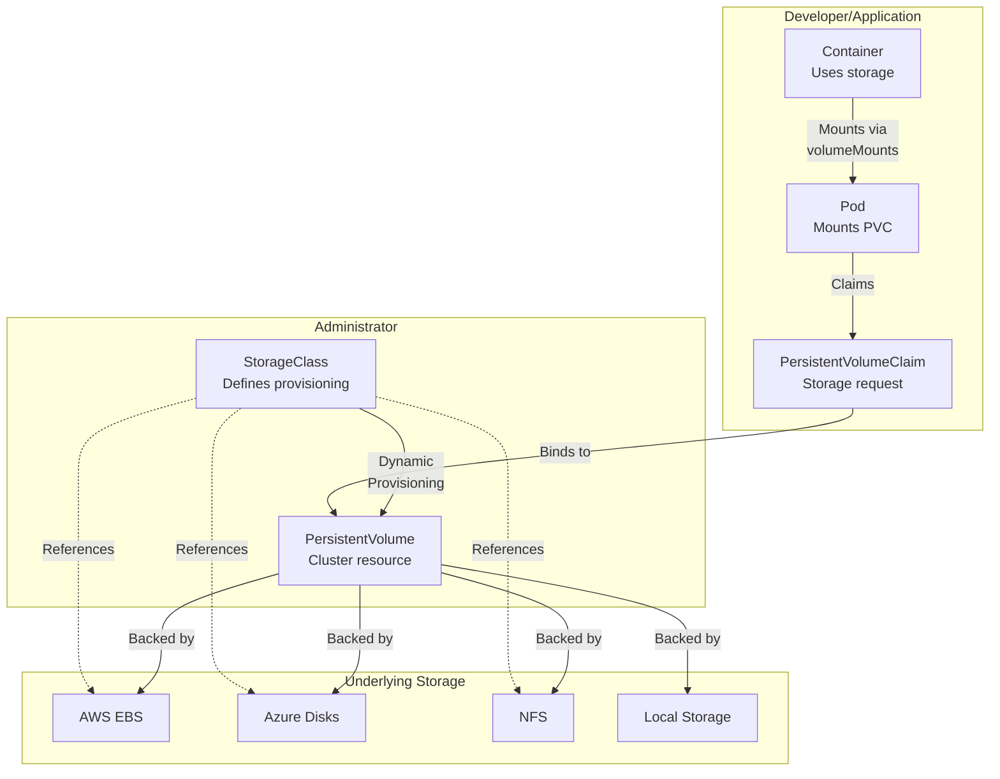

# Kubernetes Storage: Volumes, Persistence, and StatefulSets

Kubernetes storage is fundamental to running production workloads. This guide covers volumes, persistent storage, dynamic provisioning, and best practices for managing data in containerized environments.

## Why Storage Matters in Kubernetes

### The Ephemeral Container Problem

By default, containers in Kubernetes are ephemeral. When a container crashes or a pod is deleted:
- All data written to the container's writable layer is lost
- Logs disappear
- Database files vanish
- Configuration changes are forgotten

This design is intentional—containers should be stateless and replaceable. But real applications need to persist data.

### Stateless vs Stateful Applications

**Stateless applications** (web servers, APIs, microservices):
- Can run on any node
- Easy to scale horizontally
- Simple to upgrade and restart
- Examples: Nginx, Node.js APIs, Python web apps

**Stateful applications** (databases, caches, message queues):
- Require persistent storage
- Need stable network identities
- Harder to scale horizontally
- Examples: PostgreSQL, MongoDB, Redis, Elasticsearch

### Data Persistence Requirements

Kubernetes addresses these needs through multiple storage abstractions:
1. **Volumes** - temporary or persistent storage for pods
2. **PersistentVolumes (PV)** - cluster-level storage resources
3. **PersistentVolumeClaims (PVC)** - requests for storage
4. **StorageClasses** - dynamic provisioning of storage
5. **StatefulSets** - stable, ordered pod identities with persistent storage

### Storage Architecture Diagram



---

## Volume Types

Volumes are storage abstractions that live for the lifetime of a pod. When a pod is deleted, most volumes are also deleted (except some persistent types).

### 1. emptyDir

An `emptyDir` volume is created when a pod is created and exists only while the pod is running. It starts empty and is useful for temporary storage.

**Use cases:**
- Temporary scratch space for applications
- Sharing data between containers in a pod
- Cache directories

**Lifecycle:** Created with pod, deleted with pod

```yaml
apiVersion: v1
kind: Pod
metadata:
  name: empty-dir-example
spec:
  containers:
  - name: writer
    image: busybox:latest
    command: ["sh", "-c"]
    args:
      - |
        while true; do
          echo "Data written at $(date)" >> /data/log.txt
          sleep 5
        done
    volumeMounts:
    - name: temp-storage
      mountPath: /data

  - name: reader
    image: busybox:latest
    command: ["sh", "-c"]
    args:
      - |
        while true; do
          tail -f /data/log.txt
          sleep 10
        done
    volumeMounts:
    - name: temp-storage
      mountPath: /data

  volumes:
  - name: temp-storage
    emptyDir: {}
```

**Features:**
- `sizeLimit`: Optional, restricts the size of emptyDir storage
- `medium`: Default is node's disk; set to `Memory` for tmpfs (RAM-backed)

```yaml
volumes:
- name: temp-storage
  emptyDir:
    sizeLimit: 1Gi
    medium: Memory  # Uses RAM instead of disk
```

---

### 2. hostPath

A `hostPath` volume mounts a file or directory from the host node's filesystem into the pod.

**Use cases:**
- Accessing node-level information (logs, system files)
- Development and testing
- Privileged operations

**Security risks:**
- Bypasses pod isolation
- Can access sensitive host files
- Makes pods node-dependent
- **Avoid in production unless absolutely necessary**

```yaml
apiVersion: v1
kind: Pod
metadata:
  name: hostpath-example
spec:
  containers:
  - name: main
    image: ubuntu:latest
    command: ["sh", "-c"]
    args:
      - |
        cat /host-logs/syslog
        sleep 3600
    volumeMounts:
    - name: host-logs
      mountPath: /host-logs
      readOnly: true

  volumes:
  - name: host-logs
    hostPath:
      path: /var/log
      type: Directory
```

**hostPath types:**
- `""` - Default, no checking
- `DirectoryOrCreate` - Directory, create if missing
- `Directory` - Directory must exist
- `FileOrCreate` - File, create if missing
- `File` - File must exist
- `Socket` - UNIX socket must exist
- `CharDevice` - Character device must exist
- `BlockDevice` - Block device must exist

---

### 3. configMap and secret Volumes

Mount ConfigMaps and Secrets as files in containers, allowing applications to read configuration without environment variables.

```yaml
apiVersion: v1
kind: ConfigMap
metadata:
  name: app-config
data:
  app.properties: |
    server.port=8080
    database.host=localhost
    debug=true
  nginx.conf: |
    worker_processes auto;
    events { worker_connections 1024; }
    http { server { listen 80; } }

---
apiVersion: v1
kind: Secret
metadata:
  name: db-credentials
type: Opaque
data:
  username: YWRtaW4=  # base64: admin
  password: cGFzc3dvcmQ=  # base64: password

---
apiVersion: v1
kind: Pod
metadata:
  name: config-volume-example
spec:
  containers:
  - name: app
    image: ubuntu:latest
    command: ["sh", "-c"]
    args:
      - |
        echo "=== ConfigMap Files ==="
        cat /etc/config/app.properties
        echo ""
        echo "=== Secret Files ==="
        cat /etc/secrets/username
        echo ""
        cat /etc/secrets/password
        sleep 3600

    volumeMounts:
    - name: config-volume
      mountPath: /etc/config
      readOnly: true

    - name: secret-volume
      mountPath: /etc/secrets
      readOnly: true

  volumes:
  - name: config-volume
    configMap:
      name: app-config
      defaultMode: 0644
      items:
      - key: app.properties
        path: app.properties

  - name: secret-volume
    secret:
      secretName: db-credentials
      defaultMode: 0400  # Read-only for owner
```

**Key features:**
- `defaultMode`: File permissions (e.g., 0644)
- `items`: Select specific keys and rename them
- `readOnly`: Makes mounted files read-only

---

### 4. projected Volume

Combines multiple volume sources (ConfigMaps, Secrets, downwardAPI) into a single mount point.

```yaml
apiVersion: v1
kind: Pod
metadata:
  name: projected-volume-example
  labels:
    app: myapp
    version: v1.0
spec:
  containers:
  - name: app
    image: ubuntu:latest
    command: ["sh", "-c"]
    args:
      - |
        echo "=== All Data ==="
        ls -la /data/
        sleep 3600

    volumeMounts:
    - name: all-data
      mountPath: /data
      readOnly: true

  volumes:
  - name: all-data
    projected:
      sources:
      - configMap:
          name: app-config
      - secret:
          name: db-credentials
      - downwardAPI:
          items:
          - path: metadata/pod-name
            fieldRef:
              fieldPath: metadata.name
          - path: metadata/namespace
            fieldRef:
              fieldPath: metadata.namespace
```

---

### 5. downwardAPI Volume

Exposes pod and container metadata as files, allowing applications to discover information about themselves.

```yaml
apiVersion: v1
kind: Pod
metadata:
  name: downward-api-example
  labels:
    app: myapp
    tier: backend
  annotations:
    version: "1.0"
    author: "devops-team"
spec:
  containers:
  - name: app
    image: ubuntu:latest
    command: ["sh", "-c"]
    args:
      - |
        echo "Pod Name: $(cat /metadata/pod-name)"
        echo "Pod Namespace: $(cat /metadata/namespace)"
        echo "Pod IP: $(cat /metadata/pod-ip)"
        echo "Node Name: $(cat /metadata/node-name)"
        echo "Labels: $(cat /metadata/labels)"
        echo "Annotations: $(cat /metadata/annotations)"
        echo "CPU Request: $(cat /metadata/cpu-request)"
        echo "Memory Request: $(cat /metadata/memory-request)"
        sleep 3600

    resources:
      requests:
        cpu: "100m"
        memory: "128Mi"
      limits:
        cpu: "500m"
        memory: "512Mi"

    volumeMounts:
    - name: downward-api
      mountPath: /metadata
      readOnly: true

  volumes:
  - name: downward-api
    downwardAPI:
      items:
      - path: pod-name
        fieldRef:
          fieldPath: metadata.name
      - path: namespace
        fieldRef:
          fieldPath: metadata.namespace
      - path: pod-ip
        fieldRef:
          fieldPath: status.podIP
      - path: node-name
        fieldRef:
          fieldPath: spec.nodeName
      - path: labels
        fieldRef:
          fieldPath: metadata.labels
      - path: annotations
        fieldRef:
          fieldPath: metadata.annotations
      - path: cpu-request
        resourceFieldRef:
          containerName: app
          resource: requests.cpu
          divisor: 1m
      - path: memory-request
        resourceFieldRef:
          containerName: app
          resource: requests.memory
          divisor: 1Mi
```

**Available metadata:**
- `metadata.name` - Pod name
- `metadata.namespace` - Namespace
- `metadata.labels` - Labels as key=value
- `metadata.annotations` - Annotations as key=value
- `metadata.uid` - Pod UID
- `status.podIP` - Pod's IP address
- `spec.nodeName` - Node where pod runs
- Resource requests/limits via `resourceFieldRef`

---

## PersistentVolumes and PersistentVolumeClaims

PersistentVolumes (PV) and PersistentVolumeClaims (PVC) provide a higher-level abstraction for storage that persists beyond pod lifetimes.

### The Storage Lifecycle

```
1. Provisioning
   ├─ Static: Admin creates PVs manually
   └─ Dynamic: StorageClass automatically creates PVs

2. Binding
   └─ PVC matches with PV (or provisioned)

3. Using
   └─ Pod mounts the PVC

4. Reclaiming
   └─ PV cleanup when PVC is deleted
```

### Access Modes

Define how the volume can be accessed:

| Mode | Description | Use Case |
|------|-------------|----------|
| `ReadWriteOnce` (RWO) | Single node, read+write | Single pod databases |
| `ReadOnlyMany` (ROMany) | Multiple nodes, read-only | Config distribution |
| `ReadWriteMany` (RWMany) | Multiple nodes, read+write | Shared filesystems |
| `ReadWriteOncePod` (RWOP) | Single pod, read+write | Exclusive access |

```yaml
accessModes:
  - ReadWriteOnce    # Single node can write
  - ReadOnlyMany     # Multiple nodes can read
  - ReadWriteMany    # Multiple nodes can write
```

**Note:** Supported modes depend on the storage backend:
- AWS EBS: RWO only
- NFS: RWO, ROMany, RWMany
- Azure Disk: RWO only
- GCE PD: RWO, ROMany

### Reclaim Policies

Define what happens when a PVC is deleted:

| Policy | Behavior | Use Case |
|--------|----------|----------|
| `Retain` | Manual cleanup required | Critical data |
| `Delete` | PV auto-deleted | Development |
| `Recycle` | Data wiped, PV reused | Legacy (deprecated) |

### Creating PersistentVolumes (Static Provisioning)

```yaml
apiVersion: v1
kind: PersistentVolume
metadata:
  name: my-pv
spec:
  capacity:
    storage: 10Gi

  accessModes:
    - ReadWriteOnce

  persistentVolumeReclaimPolicy: Retain

  # Local storage example
  local:
    path: /mnt/data
  nodeAffinity:
    required:
      nodeSelectorTerms:
      - matchExpressions:
        - key: kubernetes.io/hostname
          operator: In
          values:
          - worker-node-1

---
# NFS example
apiVersion: v1
kind: PersistentVolume
metadata:
  name: nfs-pv
spec:
  capacity:
    storage: 50Gi

  accessModes:
    - ReadWriteMany

  nfs:
    server: 192.168.1.100
    path: "/exports/data"
    readOnly: false

  persistentVolumeReclaimPolicy: Retain

---
# AWS EBS example
apiVersion: v1
kind: PersistentVolume
metadata:
  name: ebs-pv
spec:
  capacity:
    storage: 20Gi

  accessModes:
    - ReadWriteOnce

  awsElasticBlockStore:
    volumeID: vol-0123456789abcdef0
    fsType: ext4

  persistentVolumeReclaimPolicy: Delete
```

### Creating PersistentVolumeClaims

```yaml
apiVersion: v1
kind: PersistentVolumeClaim
metadata:
  name: my-pvc
spec:
  accessModes:
    - ReadWriteOnce

  storageClassName: ""  # Leave empty for static PV

  resources:
    requests:
      storage: 10Gi

  selector:
    matchLabels:
      type: fast-storage

---
# Pod using the PVC
apiVersion: v1
kind: Pod
metadata:
  name: pvc-consumer
spec:
  containers:
  - name: app
    image: ubuntu:latest
    command: ["sh", "-c"]
    args:
      - |
        echo "Writing to persistent storage..."
        echo "Data persists across pod restarts" > /data/message.txt
        cat /data/message.txt
        sleep 3600

    volumeMounts:
    - name: persistent-data
      mountPath: /data

  volumes:
  - name: persistent-data
    persistentVolumeClaim:
      claimName: my-pvc
```

### PV and PVC Lifecycle Example

```yaml
# Step 1: Create a PV
apiVersion: v1
kind: PersistentVolume
metadata:
  name: demo-pv
spec:
  capacity:
    storage: 5Gi
  accessModes:
    - ReadWriteOnce
  persistentVolumeReclaimPolicy: Retain
  local:
    path: /tmp/demo-pv
  nodeAffinity:
    required:
      nodeSelectorTerms:
      - matchExpressions:
        - key: kubernetes.io/hostname
          operator: In
          values:
          - minikube  # Adjust for your node

---
# Step 2: Create a PVC
apiVersion: v1
kind: PersistentVolumeClaim
metadata:
  name: demo-pvc
spec:
  accessModes:
    - ReadWriteOnce
  storageClassName: ""
  resources:
    requests:
      storage: 5Gi

---
# Step 3: Use PVC in a pod
apiVersion: v1
kind: Pod
metadata:
  name: demo-pod
spec:
  containers:
  - name: writer
    image: ubuntu:latest
    command: ["/bin/bash"]
    args:
      - -c
      - |
        echo "Pod: $(hostname)" > /data/pod-info.txt
        echo "Timestamp: $(date)" >> /data/pod-info.txt
        echo "Data written, sleeping..."
        sleep 3600
    volumeMounts:
    - name: persistent-data
      mountPath: /data

  volumes:
  - name: persistent-data
    persistentVolumeClaim:
      claimName: demo-pvc
```

---

## StorageClasses: Dynamic Provisioning

StorageClasses enable dynamic provisioning—automatically creating PersistentVolumes when PersistentVolumeClaims are created.

### Why StorageClasses?

**Without StorageClass** (static provisioning):
- Admin must pre-create PVs
- Doesn't scale well
- Difficult to manage different storage tiers

**With StorageClass** (dynamic provisioning):
- PVs created on-demand
- Scales automatically
- Support different storage tiers (fast SSD, slow HDD)
- Cloud-native and efficient

### Creating a StorageClass

```yaml
apiVersion: storage.k8s.io/v1
kind: StorageClass
metadata:
  name: fast-ssd
provisioner: kubernetes.io/aws-ebs
parameters:
  type: gp3        # General Purpose SSD
  iops: "3000"     # IOPS
  throughput: "125" # MB/s
  fstype: ext4
allowVolumeExpansion: true
reclaimPolicy: Delete
volumeBindingMode: WaitForFirstConsumer

---
# Another example: NFS provisioner
apiVersion: storage.k8s.io/v1
kind: StorageClass
metadata:
  name: nfs-storage
provisioner: nfs.io/nfs
allowVolumeExpansion: true
parameters:
  server: 192.168.1.100
  path: "/exports"
  # Additional NFS parameters
  mountOptions: "nolock,vers=4"

---
# Set as default StorageClass
apiVersion: storage.k8s.io/v1
kind: StorageClass
metadata:
  name: standard
  annotations:
    storageclass.kubernetes.io/is-default-class: "true"
provisioner: kubernetes.io/aws-ebs
parameters:
  type: gp2
reclaimPolicy: Delete
```

### Using StorageClass with PVC

```yaml
apiVersion: v1
kind: PersistentVolumeClaim
metadata:
  name: dynamic-pvc
spec:
  accessModes:
    - ReadWriteOnce

  storageClassName: fast-ssd  # Reference the StorageClass

  resources:
    requests:
      storage: 20Gi

---
# Pod using dynamically provisioned storage
apiVersion: v1
kind: Pod
metadata:
  name: dynamic-storage-pod
spec:
  containers:
  - name: app
    image: ubuntu:latest
    command: ["sh", "-c"]
    args:
      - |
        df -h /data
        echo "Writing data to dynamically provisioned storage..."
        dd if=/dev/zero of=/data/test.bin bs=1M count=100
        sleep 3600

    volumeMounts:
    - name: data
      mountPath: /data

  volumes:
  - name: data
    persistentVolumeClaim:
      claimName: dynamic-pvc
```

### VolumeBindingMode

Controls when PVC binding and dynamic provisioning occurs:

**Immediate** (default):
- PV provisioned when PVC created
- May result in unavailable PVs if no matching node

**WaitForFirstConsumer**:
- PV provisioned when pod is scheduled
- Ensures PV is available on the pod's node
- Better for node affinity requirements

```yaml
apiVersion: storage.k8s.io/v1
kind: StorageClass
metadata:
  name: local-storage
provisioner: kubernetes.io/local
volumeBindingMode: WaitForFirstConsumer
allowVolumeExpansion: true

---
apiVersion: storage.k8s.io/v1
kind: StorageClass
metadata:
  name: cloud-storage
provisioner: kubernetes.io/aws-ebs
volumeBindingMode: Immediate
```

---

## StatefulSets with Storage

StatefulSets are designed for stateful applications that require:
- Stable, predictable pod names
- Stable network identity
- Ordered deployment and scaling
- Persistent storage per pod

### VolumeClaimTemplates

VolumeClaimTemplates automatically create a PVC for each pod in a StatefulSet.

```yaml
apiVersion: apps/v1
kind: StatefulSet
metadata:
  name: mysql
spec:
  serviceName: mysql  # Headless service for stable network identity
  replicas: 3

  selector:
    matchLabels:
      app: mysql

  template:
    metadata:
      labels:
        app: mysql

    spec:
      containers:
      - name: mysql
        image: mysql:8.0

        ports:
        - name: mysql
          containerPort: 3306

        env:
        - name: MYSQL_ROOT_PASSWORD
          valueFrom:
            secretKeyRef:
              name: mysql-password
              key: password

        volumeMounts:
        - name: data
          mountPath: /var/lib/mysql

        - name: config
          mountPath: /etc/mysql/conf.d

        livenessProbe:
          exec:
            command:
            - mysqladmin
            - ping
            - -u
            - root
            - -p$(MYSQL_ROOT_PASSWORD)
          initialDelaySeconds: 30
          periodSeconds: 10

        readinessProbe:
          exec:
            command:
            - mysql
            - -u
            - root
            - -p$(MYSQL_ROOT_PASSWORD)
            - -e
            - "SELECT 1"
          initialDelaySeconds: 10
          periodSeconds: 5

      # ConfigMap volume for MySQL configuration
      volumes:
      - name: config
        configMap:
          name: mysql-config

  # VolumeClaimTemplates create PVCs automatically
  volumeClaimTemplates:
  - metadata:
      name: data
    spec:
      accessModes:
        - ReadWriteOnce

      storageClassName: fast-ssd

      resources:
        requests:
          storage: 10Gi

---
# Headless Service for StatefulSet
apiVersion: v1
kind: Service
metadata:
  name: mysql
spec:
  clusterIP: None  # Headless service
  selector:
    app: mysql
  ports:
  - port: 3306
    targetPort: 3306
    name: mysql

---
# ConfigMap for MySQL configuration
apiVersion: v1
kind: ConfigMap
metadata:
  name: mysql-config
data:
  my.cnf: |
    [mysqld]
    character-set-server=utf8mb4
    collation-server=utf8mb4_unicode_ci
    max_connections=1000
    innodb_buffer_pool_size=1G

---
# Secret for MySQL root password
apiVersion: v1
kind: Secret
metadata:
  name: mysql-password
type: Opaque
stringData:
  password: rootpassword123
```

### Pod Naming and Storage in StatefulSets

StatefulSet pods are named predictably:
- Pod 0: `mysql-0` with PVC `data-mysql-0`
- Pod 1: `mysql-1` with PVC `data-mysql-1`
- Pod 2: `mysql-2` with PVC `data-mysql-2`

Each pod gets a stable hostname via the headless service:
- `mysql-0.mysql.default.svc.cluster.local`
- `mysql-1.mysql.default.svc.cluster.local`
- `mysql-2.mysql.default.svc.cluster.local`

This allows:
- Predictable discovery
- Master-replica replication
- Data affinity

---

## Container Storage Interface (CSI)

The Container Storage Interface is a standardized API for exposing storage systems to Kubernetes.

### Why CSI Matters

**Before CSI:**
- Storage vendors had to write Kubernetes-specific code
- New storage type = changes to Kubernetes core
- Difficult to maintain

**After CSI:**
- Vendors implement standard CSI API
- CSI drivers run as containers/sidecars
- Kubernetes core remains stable
- Flexible, pluggable architecture

### CSI Components

```
┌─────────────────────────────────────┐
│     Kubernetes Cluster              │
│                                     │
│  ┌─────────────────────────────┐   │
│  │   CSI Driver (DaemonSet)    │   │
│  │  - Provisioner              │   │
│  │  - Node plugin              │   │
│  │  - Snapshotter              │   │
│  └─────────────────────────────┘   │
│              ↓                      │
│  ┌─────────────────────────────┐   │
│  │  Storage Backend             │   │
│  │  (AWS EBS, NFS, etc.)        │   │
│  └─────────────────────────────┘   │
└─────────────────────────────────────┘
```

### Installing a CSI Driver

Example: AWS EBS CSI Driver

```bash
# Add the AWS EBS CSI driver repository
helm repo add aws-ebs-csi-driver https://kubernetes-sigs.github.io/aws-ebs-csi-driver
helm repo update

# Install the driver
helm install aws-ebs-csi-driver aws-ebs-csi-driver/aws-ebs-csi-driver \
  -n kube-system \
  --set controller.serviceAccount.create=true
```

### Using CSI Driver with StorageClass

```yaml
apiVersion: storage.k8s.io/v1
kind: StorageClass
metadata:
  name: ebs-csi-sc
provisioner: ebs.csi.aws.com
allowVolumeExpansion: true
parameters:
  type: gp3
  iops: "3000"
  throughput: "125"
  encrypted: "true"
  kms_key_id: arn:aws:kms:us-east-1:123456789012:key/12345678-1234-1234-1234-123456789012
reclaimPolicy: Delete

---
apiVersion: v1
kind: PersistentVolumeClaim
metadata:
  name: ebs-csi-pvc
spec:
  accessModes:
    - ReadWriteOnce
  storageClassName: ebs-csi-sc
  resources:
    requests:
      storage: 25Gi
```

### Volume Snapshots

CSI enables volume snapshots for backup and cloning:

```yaml
# Create a VolumeSnapshotClass
apiVersion: snapshot.storage.k8s.io/v1
kind: VolumeSnapshotClass
metadata:
  name: csi-snapshot-class
driver: ebs.csi.aws.com
deletionPolicy: Delete

---
# Create a snapshot of an existing PVC
apiVersion: snapshot.storage.k8s.io/v1
kind: VolumeSnapshot
metadata:
  name: mysql-snapshot
spec:
  volumeSnapshotClassName: csi-snapshot-class
  source:
    persistentVolumeClaimName: mysql-pvc

---
# Restore from snapshot
apiVersion: v1
kind: PersistentVolumeClaim
metadata:
  name: mysql-pvc-restored
spec:
  dataSource:
    name: mysql-snapshot
    kind: VolumeSnapshot
    apiGroup: snapshot.storage.k8s.io
  accessModes:
    - ReadWriteOnce
  storageClassName: ebs-csi-sc
  resources:
    requests:
      storage: 25Gi
```

---

## Backup and Recovery

### Velero: Cluster Backup Solution

Velero is the industry-standard tool for backing up and restoring Kubernetes clusters, including persistent data.

### Installing Velero

```bash
# Install the Velero CLI
wget https://github.com/vmware-tanzu/velero/releases/download/v1.12.0/velero-v1.12.0-linux-amd64.tar.gz
tar -xzf velero-v1.12.0-linux-amd64.tar.gz
sudo mv velero-v1.12.0-linux-amd64/velero /usr/local/bin/

# Install Velero in the cluster (AWS example)
velero install \
  --provider aws \
  --bucket velero-backup-bucket \
  --secret-file ./credentials-velero \
  --use-volume-snapshots=true \
  --snapshot-location-config snapshotLocation=us-east-1
```

### Creating Backups

```bash
# Backup entire cluster
velero backup create full-cluster-backup

# Backup specific namespace
velero backup create app-backup --include-namespaces app-namespace

# Backup with volume snapshots
velero backup create app-backup-with-volumes \
  --include-namespaces app-namespace \
  --volume-snapshot-locations aws

# View backups
velero backup get
velero backup describe full-cluster-backup
velero backup logs full-cluster-backup
```

### Restoring from Backups

```bash
# List available backups
velero backup get

# Restore entire cluster
velero restore create --from-backup full-cluster-backup

# Restore specific namespace
velero restore create \
  --from-backup full-cluster-backup \
  --include-namespaces app-namespace

# Monitor restore progress
velero restore describe <restore-name>
velero restore logs <restore-name>
```

### Scheduled Backups

```bash
# Daily backup
velero schedule create daily-backup \
  --schedule="0 2 * * *" \
  --include-namespaces '*' \
  --ttl 720h

# List schedules
velero schedule get
```

### Velero Backup Resource

```yaml
apiVersion: velero.io/v1
kind: Backup
metadata:
  name: daily-backup-202603
  namespace: velero
spec:
  # What to include
  includedNamespaces:
  - app-namespace
  - database

  # What to exclude
  excludedNamespaces:
  - kube-system
  - kube-public

  # Storage location
  storageLocation: aws-s3

  # Volume snapshot location
  volumeSnapshotLocation: aws

  # How long to keep the backup
  ttl: 720h

  # Include PVCs in the backup
  includedResources:
  - '*'
  - volumesnapshotcontents
  - volumesnapshots
```

### Volume Snapshot Strategies

```yaml
# Strategy 1: Regular snapshots
apiVersion: batch/v1
kind: CronJob
metadata:
  name: daily-snapshots
spec:
  schedule: "0 3 * * *"  # 3 AM daily
  jobTemplate:
    spec:
      template:
        spec:
          serviceAccountName: snapshot-creator
          containers:
          - name: snapshotter
            image: bitnami/kubectl:latest
            command:
            - /bin/sh
            - -c
            - |
              kubectl create -f - <<EOF
              apiVersion: snapshot.storage.k8s.io/v1
              kind: VolumeSnapshot
              metadata:
                name: pvc-snapshot-$(date +%Y%m%d-%H%M%S)
              spec:
                volumeSnapshotClassName: csi-snapshot-class
                source:
                  persistentVolumeClaimName: production-pvc
              EOF
          restartPolicy: OnFailure

---
# Strategy 2: Multiple retention snapshots
apiVersion: snapshot.storage.k8s.io/v1
kind: VolumeSnapshot
metadata:
  name: pvc-snapshot-hourly
spec:
  volumeSnapshotClassName: csi-snapshot-class
  source:
    persistentVolumeClaimName: production-pvc
---
apiVersion: snapshot.storage.k8s.io/v1
kind: VolumeSnapshot
metadata:
  name: pvc-snapshot-daily
spec:
  volumeSnapshotClassName: csi-snapshot-class
  source:
    persistentVolumeClaimName: production-pvc
---
apiVersion: snapshot.storage.k8s.io/v1
kind: VolumeSnapshot
metadata:
  name: pvc-snapshot-weekly
spec:
  volumeSnapshotClassName: csi-snapshot-class
  source:
    persistentVolumeClaimName: production-pvc
```

### Disaster Recovery Planning

```
1. **Backup Strategy:**
   - Frequency: Every 6-24 hours (based on RPO)
   - Retention: 30 days minimum
   - Locations: Multiple regions/accounts
   - Testing: Weekly restore tests

2. **Recovery Objectives:**
   - RTO (Recovery Time Objective): < 1 hour
   - RPO (Recovery Point Objective): < 6 hours
   - Tested regularly (monthly)

3. **Documentation:**
   - Backup procedures
   - Restore procedures
   - Contact information
   - Runbooks for common failures

4. **Automation:**
   - Automated snapshots
   - Automated backup verification
   - Automated restore tests
   - Alerts for backup failures
```

---

## Storage Best Practices

### 1. Choose the Right Access Mode

```yaml
# For single-node databases
accessModes:
  - ReadWriteOnce

# For shared configuration
accessModes:
  - ReadOnlyMany

# For multi-writer systems (NFS, GlusterFS)
accessModes:
  - ReadWriteMany
```

### 2. Use StorageClasses for Dynamic Provisioning

```yaml
# ✅ Good: Dynamic provisioning
apiVersion: v1
kind: PersistentVolumeClaim
metadata:
  name: app-pvc
spec:
  storageClassName: fast-ssd  # Auto-provisions PV
  accessModes:
    - ReadWriteOnce
  resources:
    requests:
      storage: 10Gi

---
# ❌ Avoid: Static provisioning (doesn't scale)
apiVersion: v1
kind: PersistentVolume
metadata:
  name: manual-pv
spec:
  capacity:
    storage: 10Gi
  local:
    path: /mnt/data
```

### 3. Set Resource Limits on PVCs

```yaml
apiVersion: v1
kind: PersistentVolumeClaim
metadata:
  name: limited-pvc
spec:
  storageClassName: standard
  accessModes:
    - ReadWriteOnce

  # Limits help prevent unexpected growth
  resources:
    requests:
      storage: 10Gi
    limits:
      storage: 50Gi  # Alert or prevent if exceeded
```

### 4. Monitor Storage Usage

```bash
# Check PVC usage
kubectl get pvc -A

# Detailed PVC info
kubectl describe pvc <pvc-name> -n <namespace>

# Kubernetes Events (check for capacity issues)
kubectl get events -n <namespace> --sort-by='.lastTimestamp'

# Pod disk usage (if metrics-server is installed)
kubectl top pod <pod-name> -n <namespace>
```

Example monitoring alert:

```yaml
apiVersion: v1
kind: ConfigMap
metadata:
  name: prometheus-rules
data:
  storage.yml: |
    groups:
    - name: storage
      rules:
      - alert: PVCAlmostFull
        expr: |
          (kubelet_volume_stats_used_bytes / kubelet_volume_stats_capacity_bytes) > 0.80
        for: 5m
        annotations:
          summary: "PVC {{ $labels.persistentvolumeclaim }} is 80% full"
```

### 5. Plan for Data Migration

```bash
# Copy data between PVCs
kubectl cp <namespace>/<pod-name>:/data/source \
          <namespace>/<pod-name>:/data/destination

# Using rsync
kubectl exec -it <pod-name> -n <namespace> -- \
  rsync -av /source/ /destination/

# Snapshot and restore
kubectl apply -f - <<EOF
apiVersion: snapshot.storage.k8s.io/v1
kind: VolumeSnapshot
metadata:
  name: migration-snapshot
spec:
  volumeSnapshotClassName: csi-snapshot-class
  source:
    persistentVolumeClaimName: old-pvc
EOF

# Restore to new PVC
kubectl apply -f - <<EOF
apiVersion: v1
kind: PersistentVolumeClaim
metadata:
  name: new-pvc
spec:
  dataSource:
    name: migration-snapshot
    kind: VolumeSnapshot
    apiGroup: snapshot.storage.k8s.io
  storageClassName: standard
  accessModes:
    - ReadWriteOnce
  resources:
    requests:
      storage: 20Gi
EOF
```

### 6. Security Best Practices

```yaml
# Encrypt at rest
apiVersion: storage.k8s.io/v1
kind: StorageClass
metadata:
  name: encrypted-storage
provisioner: ebs.csi.aws.com
parameters:
  encrypted: "true"
  kms_key_id: arn:aws:kms:us-east-1:123456789012:key/...

---
# Limit access via RBAC
apiVersion: rbac.authorization.k8s.io/v1
kind: Role
metadata:
  name: pvc-reader
  namespace: app
rules:
- apiGroups: [""]
  resources: ["persistentvolumeclaims"]
  verbs: ["get", "list"]
- apiGroups: [""]
  resources: ["pods"]
  verbs: ["get", "list"]

---
apiVersion: rbac.authorization.k8s.io/v1
kind: RoleBinding
metadata:
  name: pvc-reader-binding
  namespace: app
subjects:
- kind: ServiceAccount
  name: app-sa
  namespace: app
roleRef:
  kind: Role
  name: pvc-reader
  apiGroup: rbac.authorization.k8s.io

---
# Immutable ConfigMaps for sensitive config
apiVersion: v1
kind: ConfigMap
metadata:
  name: immutable-config
immutable: true
data:
  api-key: "secret-key-123"
```

---

## Exercises

### Exercise 1: Create PV, PVC, and Verify Data Persistence

**Objective:** Create a PersistentVolume and PersistentVolumeClaim, write data in a pod, delete the pod, and verify data persists.

```bash
# Step 1: Create a directory on your node
mkdir -p /tmp/pv-demo
echo "Important data" > /tmp/pv-demo/data.txt

# Step 2: Create PV and PVC
kubectl apply -f - <<'EOF'
apiVersion: v1
kind: PersistentVolume
metadata:
  name: demo-pv
spec:
  capacity:
    storage: 1Gi
  accessModes:
    - ReadWriteOnce
  persistentVolumeReclaimPolicy: Retain
  local:
    path: /tmp/pv-demo
  nodeAffinity:
    required:
      nodeSelectorTerms:
      - matchExpressions:
        - key: kubernetes.io/hostname
          operator: In
          values:
          - minikube  # Adjust for your setup

---
apiVersion: v1
kind: PersistentVolumeClaim
metadata:
  name: demo-pvc
spec:
  accessModes:
    - ReadWriteOnce
  storageClassName: ""
  resources:
    requests:
      storage: 1Gi
EOF

# Step 3: Verify binding
kubectl get pv
kubectl get pvc

# Step 4: Create a pod that writes to the PVC
kubectl apply -f - <<'EOF'
apiVersion: v1
kind: Pod
metadata:
  name: writer-pod
spec:
  containers:
  - name: writer
    image: ubuntu:latest
    command: ["/bin/bash"]
    args:
      - -c
      - |
        echo "Pod $(hostname) - Time: $(date)" >> /data/log.txt
        cat /data/log.txt
        sleep 60
    volumeMounts:
    - name: data
      mountPath: /data
  volumes:
  - name: data
    persistentVolumeClaim:
      claimName: demo-pvc
EOF

# Step 5: Wait for pod to complete, then delete it
sleep 60
kubectl delete pod writer-pod

# Step 6: Create a new pod and verify data persists
kubectl apply -f - <<'EOF'
apiVersion: v1
kind: Pod
metadata:
  name: reader-pod
spec:
  containers:
  - name: reader
    image: ubuntu:latest
    command: ["/bin/bash"]
    args:
      - -c
      - |
        echo "Reading persisted data..."
        cat /data/log.txt
        sleep 30
    volumeMounts:
    - name: data
      mountPath: /data
  volumes:
  - name: data
    persistentVolumeClaim:
      claimName: demo-pvc
EOF

# Step 7: Check logs to confirm data persisted
kubectl logs reader-pod

# Cleanup
kubectl delete pod reader-pod
kubectl delete pvc demo-pvc
kubectl delete pv demo-pv
```

### Exercise 2: Set Up Dynamic Provisioning with StorageClass

**Objective:** Create a StorageClass and use it to dynamically provision PVCs.

```bash
# Step 1: Create a StorageClass
kubectl apply -f - <<'EOF'
apiVersion: storage.k8s.io/v1
kind: StorageClass
metadata:
  name: dynamic-storage
provisioner: kubernetes.io/no-provisioner  # For testing
allowVolumeExpansion: true
reclaimPolicy: Delete

---
# For cloud environments, use the appropriate provisioner:
# AWS: kubernetes.io/aws-ebs
# Azure: kubernetes.io/azure-disk
# GCP: kubernetes.io/gce-pd
# NFS: external-nfs-provisioner
EOF

# Step 2: Create a PVC without specifying a PV
kubectl apply -f - <<'EOF'
apiVersion: v1
kind: PersistentVolumeClaim
metadata:
  name: dynamic-pvc
spec:
  storageClassName: dynamic-storage
  accessModes:
    - ReadWriteOnce
  resources:
    requests:
      storage: 1Gi
EOF

# Step 3: Verify PVC and PV are created
kubectl get pvc
kubectl get pv

# Step 4: Use the PVC in a pod
kubectl apply -f - <<'EOF'
apiVersion: v1
kind: Pod
metadata:
  name: dynamic-pod
spec:
  containers:
  - name: app
    image: ubuntu:latest
    command: ["/bin/bash"]
    args:
      - -c
      - |
        df -h /data
        echo "Dynamic storage works!" > /data/message.txt
        cat /data/message.txt
        sleep 3600
    volumeMounts:
    - name: storage
      mountPath: /data
  volumes:
  - name: storage
    persistentVolumeClaim:
      claimName: dynamic-pvc
EOF

# Step 5: Verify pod is running with the PVC
kubectl get pod dynamic-pod
kubectl describe pod dynamic-pod

# Cleanup
kubectl delete pod dynamic-pod
kubectl delete pvc dynamic-pvc
```

### Exercise 3: Deploy a StatefulSet with VolumeClaimTemplates

**Objective:** Deploy a StatefulSet (e.g., Redis) with persistent storage and verify each pod gets its own volume.

```bash
# Step 1: Create a headless service (required for StatefulSet)
kubectl apply -f - <<'EOF'
apiVersion: v1
kind: Service
metadata:
  name: redis
spec:
  clusterIP: None
  selector:
    app: redis
  ports:
  - port: 6379
    name: redis

---
# Step 2: Create a StorageClass (if not available)
apiVersion: storage.k8s.io/v1
kind: StorageClass
metadata:
  name: stateful-storage
provisioner: kubernetes.io/no-provisioner
reclaimPolicy: Delete

---
# Step 3: Create StatefulSet
apiVersion: apps/v1
kind: StatefulSet
metadata:
  name: redis-cluster
spec:
  serviceName: redis
  replicas: 3
  selector:
    matchLabels:
      app: redis

  template:
    metadata:
      labels:
        app: redis

    spec:
      containers:
      - name: redis
        image: redis:7-alpine
        ports:
        - containerPort: 6379
          name: redis

        command:
        - redis-server
        - --appendonly
        - "yes"
        - --appendfsync
        - "everysec"

        volumeMounts:
        - name: data
          mountPath: /data

        livenessProbe:
          exec:
            command:
            - redis-cli
            - ping
          initialDelaySeconds: 15
          periodSeconds: 10

  # VolumeClaimTemplates create PVC per pod
  volumeClaimTemplates:
  - metadata:
      name: data
    spec:
      accessModes:
        - ReadWriteOnce
      storageClassName: stateful-storage
      resources:
        requests:
          storage: 1Gi
EOF

# Step 4: Wait for StatefulSet to be ready
kubectl rollout status statefulset/redis-cluster

# Step 5: Verify pods and PVCs
kubectl get statefulset
kubectl get pods -l app=redis
kubectl get pvc

# Step 6: Connect to a pod and write data
kubectl exec -it redis-cluster-0 -- redis-cli SET key1 "Hello from redis-cluster-0"
kubectl exec -it redis-cluster-1 -- redis-cli SET key2 "Hello from redis-cluster-1"
kubectl exec -it redis-cluster-2 -- redis-cli SET key3 "Hello from redis-cluster-2"

# Step 7: Delete a pod and verify data persists
kubectl delete pod redis-cluster-0
# Wait for pod to restart
kubectl get pods -l app=redis -w

# Step 8: Verify data in restarted pod
kubectl exec -it redis-cluster-0 -- redis-cli GET key1

# Step 9: Delete and recreate StatefulSet
kubectl delete statefulset redis-cluster
# Create it again
kubectl apply -f - <<'EOF'
apiVersion: apps/v1
kind: StatefulSet
metadata:
  name: redis-cluster
spec:
  serviceName: redis
  replicas: 3
  selector:
    matchLabels:
      app: redis

  template:
    metadata:
      labels:
        app: redis
    spec:
      containers:
      - name: redis
        image: redis:7-alpine
        ports:
        - containerPort: 6379
          name: redis
        command:
        - redis-server
        - --appendonly
        - "yes"
        volumeMounts:
        - name: data
          mountPath: /data

  volumeClaimTemplates:
  - metadata:
      name: data
    spec:
      accessModes:
        - ReadWriteOnce
      storageClassName: stateful-storage
      resources:
        requests:
          storage: 1Gi
EOF

# Step 10: Data persists across StatefulSet recreation
kubectl exec -it redis-cluster-0 -- redis-cli GET key1

# Cleanup
kubectl delete statefulset redis-cluster
kubectl delete pvc -l app=redis
kubectl delete svc redis
```

---

## Summary

| Concept | Use Case | Lifetime |
|---------|----------|----------|
| **emptyDir** | Temp storage, multi-container sharing | Pod lifetime |
| **hostPath** | Node-level access, debugging | Pod lifetime |
| **configMap/secret** | Config as files | Pod lifetime |
| **downwardAPI** | Pod metadata discovery | Pod lifetime |
| **PersistentVolume** | Cluster-level storage resource | Until deleted |
| **PersistentVolumeClaim** | Storage request | Until deleted |
| **StorageClass** | Dynamic provisioning rules | Until deleted |
| **StatefulSet** | Stateful apps with stable identity | Controlled by user |
| **CSI Driver** | External storage system integration | Cluster lifetime |
| **Velero** | Full cluster backup/restore | Snapshots |

Kubernetes storage is essential for production workloads. Master these concepts to build resilient, scalable applications that handle data correctly.
