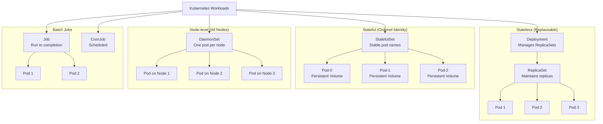

# Kubernetes Workloads & Scheduling

Learn to master Kubernetes workload management, from Deployments and StatefulSets to advanced scheduling, auto-scaling, and health checks. This guide covers everything needed to deploy, manage, and optimize workloads in production Kubernetes clusters.

## Table of Contents

1. [Deployments](#deployments)
2. [StatefulSets](#statefulsets)
3. [DaemonSets](#daemonsets)
4. [Jobs and CronJobs](#jobs-and-cronjobs)
5. [Scheduling](#scheduling)
6. [Auto-Scaling](#auto-scaling)
7. [Resource Management](#resource-management)
8. [Health Checks](#health-checks)
9. [Exercises](#exercises)

---

## Workload Types Overview

Kubernetes offers multiple workload types for different application patterns:

### Workload Types Diagram



---

## Deployments

Deployments are the primary way to run stateless applications in Kubernetes. They manage Pods and ReplicaSets with automatic rollouts, rollbacks, and scaling capabilities.

### Creating Deployments

A Deployment declaratively describes the desired state of your application. Here's a complete example with all common fields:

```yaml
apiVersion: apps/v1
kind: Deployment
metadata:
  name: nginx-app
  namespace: default
  labels:
    app: nginx
    version: v1
spec:
  # Number of desired Pod replicas
  replicas: 3

  # Strategy for rolling out new versions
  strategy:
    type: RollingUpdate
    rollingUpdate:
      # Maximum number of Pods that can be created above the desired replicas
      maxSurge: 1
      # Maximum number of Pods that can be unavailable during the update
      maxUnavailable: 0

  # Selector to match Pods managed by this Deployment
  selector:
    matchLabels:
      app: nginx

  # Revision history limit
  revisionHistoryLimit: 10

  # Progressive deadline seconds for the Deployment
  progressDeadlineSeconds: 300

  # Pod template specification
  template:
    metadata:
      labels:
        app: nginx
        version: v1
    spec:
      # Pod restart policy
      restartPolicy: Always

      containers:
      - name: nginx
        image: nginx:1.21
        imagePullPolicy: IfNotPresent
        ports:
        - name: http
          containerPort: 80
          protocol: TCP

        # Resource requests (guaranteed resources)
        resources:
          requests:
            cpu: 100m
            memory: 128Mi
          # Resource limits (maximum resources)
          limits:
            cpu: 500m
            memory: 512Mi

        # Liveness probe (is the container alive?)
        livenessProbe:
          httpGet:
            path: /
            port: 80
          initialDelaySeconds: 10
          periodSeconds: 10
          timeoutSeconds: 5
          failureThreshold: 3

        # Readiness probe (is the container ready to accept traffic?)
        readinessProbe:
          httpGet:
            path: /
            port: 80
          initialDelaySeconds: 5
          periodSeconds: 5
          timeoutSeconds: 3
          failureThreshold: 2

        # Volume mounts
        volumeMounts:
        - name: config
          mountPath: /etc/nginx/conf.d
          readOnly: true

      # Pod-level volumes
      volumes:
      - name: config
        configMap:
          name: nginx-config
```

### Field Explanations

| Field | Purpose |
|-------|---------|
| `replicas` | Desired number of Pod copies |
| `maxSurge` | How many extra Pods allowed during update |
| `maxUnavailable` | How many Pods can be down during update |
| `revisionHistoryLimit` | Keep this many old ReplicaSets for rollbacks |
| `progressDeadlineSeconds` | Timeout for Deployment to make progress |
| `imagePullPolicy` | `Always`, `IfNotPresent`, or `Never` |

### Deployment Strategies

#### RollingUpdate (Default)

Gradually replace old Pods with new ones:

```yaml
strategy:
  type: RollingUpdate
  rollingUpdate:
    maxSurge: 1        # Create 1 extra Pod during update
    maxUnavailable: 0  # Never kill Pods, always have replicas available
```

**Use case**: Zero-downtime deployments where gradual rollout is acceptable.

#### Recreate

Delete all Pods, then create new ones:

```yaml
strategy:
  type: Recreate
```

**Use case**: Applications that cannot run multiple versions simultaneously (rare).

### Rolling Updates

Trigger a rolling update by changing the image:

```bash
# Method 1: Set image directly
kubectl set image deployment/nginx-app nginx=nginx:1.22 \
  --record=true

# Method 2: Edit the Deployment
kubectl edit deployment nginx-app

# Method 3: Apply updated YAML
kubectl apply -f deployment.yaml

# Monitor the rollout
kubectl rollout status deployment/nginx-app

# Watch progress in real-time
kubectl rollout status deployment/nginx-app --watch
```

### Rollbacks

Kubernetes keeps a revision history of Deployments. Rollback to a previous version:

```bash
# View rollout history
kubectl rollout history deployment/nginx-app

# View details of a specific revision
kubectl rollout history deployment/nginx-app --revision=2

# Rollback to the previous revision
kubectl rollout undo deployment/nginx-app

# Rollback to a specific revision
kubectl rollout undo deployment/nginx-app --to-revision=2

# Pause rollout (useful for canary deployments)
kubectl rollout pause deployment/nginx-app

# Resume rollout
kubectl rollout resume deployment/nginx-app
```

### Manual Scaling

Scale Deployments up or down:

```bash
# Scale to 5 replicas
kubectl scale deployment nginx-app --replicas=5

# Scale down to 2
kubectl scale deployment nginx-app --replicas=2
```

### Blue/Green Deployment Pattern

Run two complete environments and switch traffic:

```yaml
# Blue deployment (v1)
---
apiVersion: apps/v1
kind: Deployment
metadata:
  name: app-blue
spec:
  replicas: 3
  selector:
    matchLabels:
      app: myapp
      version: blue
  template:
    metadata:
      labels:
        app: myapp
        version: blue
    spec:
      containers:
      - name: app
        image: myapp:1.0

---
# Green deployment (v2)
apiVersion: apps/v1
kind: Deployment
metadata:
  name: app-green
spec:
  replicas: 3
  selector:
    matchLabels:
      app: myapp
      version: green
  template:
    metadata:
      labels:
        app: myapp
        version: green
    spec:
      containers:
      - name: app
        image: myapp:2.0

---
# Service routes to blue initially
apiVersion: v1
kind: Service
metadata:
  name: app-service
spec:
  selector:
    app: myapp
    version: blue  # Points to blue
  ports:
  - port: 80
    targetPort: 8080
```

To switch to green:

```bash
# Test green deployment
kubectl get pods -l version=green

# Switch traffic
kubectl patch service app-service -p '{"spec":{"selector":{"version":"green"}}}'

# If issues, switch back
kubectl patch service app-service -p '{"spec":{"selector":{"version":"blue"}}}'
```

### Canary Deployment Pattern

Gradually shift traffic to a new version:

```yaml
# Canary deployment (v2) with fewer replicas
---
apiVersion: apps/v1
kind: Deployment
metadata:
  name: app-canary
spec:
  replicas: 1  # Start with 1 replica
  selector:
    matchLabels:
      app: myapp
      version: canary
  template:
    metadata:
      labels:
        app: myapp
        version: canary
    spec:
      containers:
      - name: app
        image: myapp:2.0

---
# Main deployment (v1)
apiVersion: apps/v1
kind: Deployment
metadata:
  name: app-stable
spec:
  replicas: 9  # More replicas
  selector:
    matchLabels:
      app: myapp
      version: stable
  template:
    metadata:
      labels:
        app: myapp
        version: stable
    spec:
      containers:
      - name: app
        image: myapp:1.0

---
# Service sends traffic to both (10% to canary, 90% to stable)
apiVersion: v1
kind: Service
metadata:
  name: app-service
spec:
  selector:
    app: myapp  # Routes to both stable AND canary
  ports:
  - port: 80
    targetPort: 8080
```

Monitor metrics, then gradually increase canary replicas:

```bash
kubectl scale deployment app-canary --replicas=3
kubectl scale deployment app-stable --replicas=7
# Continue until fully rolled out, then delete app-stable
```

---

## StatefulSets

StatefulSets manage stateful applications that require stable, persistent identity. Use them for databases, message queues, and other workloads requiring ordered deployment and stable hostnames.

### Key Characteristics

- **Stable network identity**: Pod names are predictable (e.g., `mysql-0`, `mysql-1`)
- **Ordered deployment**: Pods are created/deleted in order (0 → 1 → 2...)
- **Persistent storage**: VolumeClaimTemplates create separate PVCs per Pod
- **Headless Service**: Required to provide stable DNS names

### When to Use StatefulSets

- **Databases**: MySQL, PostgreSQL, MongoDB (with replicas)
- **Message queues**: Kafka, RabbitMQ
- **Distributed systems**: ZooKeeper, etcd
- **Any app requiring stable identity and persistent storage**

### Headless Services

StatefulSets require a Headless Service (clusterIP: None) for stable DNS:

```yaml
apiVersion: v1
kind: Service
metadata:
  name: mysql
spec:
  clusterIP: None  # Headless Service
  selector:
    app: mysql
  ports:
  - port: 3306
    targetPort: 3306
```

DNS names resolve to individual Pods:
- `mysql-0.mysql.default.svc.cluster.local` → Pod mysql-0
- `mysql-1.mysql.default.svc.cluster.local` → Pod mysql-1

### StatefulSet Example: MySQL Replica

```yaml
---
# Headless Service
apiVersion: v1
kind: Service
metadata:
  name: mysql
  namespace: default
spec:
  clusterIP: None
  selector:
    app: mysql
  ports:
  - port: 3306
    name: mysql

---
# ConfigMap for MySQL replication config
apiVersion: v1
kind: ConfigMap
metadata:
  name: mysql-config
data:
  primary.cnf: |
    [mysqld]
    log_bin
    server-id=1
  replica.cnf: |
    [mysqld]
    server-id=2

---
# StatefulSet
apiVersion: apps/v1
kind: StatefulSet
metadata:
  name: mysql
spec:
  serviceName: mysql  # Headless Service name
  replicas: 2
  selector:
    matchLabels:
      app: mysql

  template:
    metadata:
      labels:
        app: mysql
    spec:
      containers:
      - name: mysql
        image: mysql:8.0
        env:
        - name: MYSQL_ROOT_PASSWORD
          valueFrom:
            secretKeyRef:
              name: mysql-secret
              key: password

        ports:
        - containerPort: 3306
          name: mysql

        # Volume mounts
        volumeMounts:
        - name: mysql-data
          mountPath: /var/lib/mysql
        - name: mysql-config
          mountPath: /etc/mysql/conf.d

        # Readiness probe
        readinessProbe:
          exec:
            command:
            - sh
            - -c
            - mysql -uroot -p$MYSQL_ROOT_PASSWORD -e "SELECT 1"
          initialDelaySeconds: 20
          periodSeconds: 10

        resources:
          requests:
            cpu: 250m
            memory: 512Mi
          limits:
            cpu: 1000m
            memory: 2Gi

  # Persistent volume claims for each Pod
  volumeClaimTemplates:
  - metadata:
      name: mysql-data
    spec:
      accessModes: [ "ReadWriteOnce" ]
      storageClassName: standard
      resources:
        requests:
          storage: 10Gi
```

Deploy MySQL and verify:

```bash
# Create secret for password
kubectl create secret generic mysql-secret \
  --from-literal=password=secretpass

# Apply StatefulSet
kubectl apply -f mysql-statefulset.yaml

# Check Pods are created in order
kubectl get pods -l app=mysql

# Verify PVCs
kubectl get pvc

# Connect to primary (mysql-0)
kubectl exec -it mysql-0 -- mysql -uroot -psecretpass

# Connect to replica (mysql-1)
kubectl exec -it mysql-1 -- mysql -uroot -psecretpass
```

### StatefulSet Example: Redis Cluster

```yaml
apiVersion: apps/v1
kind: StatefulSet
metadata:
  name: redis
spec:
  serviceName: redis
  replicas: 3
  selector:
    matchLabels:
      app: redis

  template:
    metadata:
      labels:
        app: redis
    spec:
      containers:
      - name: redis
        image: redis:7.0
        command:
        - redis-server
        - --cluster-enabled
        - "yes"
        - --cluster-config-file
        - /data/nodes.conf
        - --cluster-node-timeout
        - "5000"

        ports:
        - containerPort: 6379
          name: client
        - containerPort: 16379
          name: gossip

        volumeMounts:
        - name: redis-data
          mountPath: /data

        resources:
          requests:
            cpu: 100m
            memory: 256Mi
          limits:
            cpu: 500m
            memory: 1Gi

  volumeClaimTemplates:
  - metadata:
      name: redis-data
    spec:
      accessModes: [ "ReadWriteOnce" ]
      resources:
        requests:
          storage: 5Gi
```

---

## DaemonSets

DaemonSets ensure a Pod runs on every node (or a subset via selectors). Perfect for cluster-wide concerns like logging, monitoring, and networking.

### Use Cases

- **Log collectors**: Fluentd, Logstash, Filebeat
- **Monitoring agents**: Prometheus node-exporter, Datadog agent
- **Network plugins**: Calico, Weave, Cilium
- **Machine learning**: GPU drivers, specialized runtime initialization
- **Intrusion detection**: Falco, osquery

### DaemonSet Characteristics

- One Pod per node (by default)
- Automatically created on new nodes
- Automatically deleted when nodes are removed
- Respects node selectors, taints, and tolerations

### DaemonSet Example: Prometheus Node Exporter

```yaml
apiVersion: apps/v1
kind: DaemonSet
metadata:
  name: node-exporter
  namespace: monitoring
spec:
  selector:
    matchLabels:
      app: node-exporter

  template:
    metadata:
      labels:
        app: node-exporter
    spec:
      # Run on all nodes, including control plane (if tolerated)
      tolerations:
      - key: node-role.kubernetes.io/control-plane
        operator: Exists
        effect: NoSchedule

      hostNetwork: true  # Access host network
      hostPID: true      # Access host PID namespace

      containers:
      - name: node-exporter
        image: prom/node-exporter:latest
        args:
        - --path.procfs=/host/proc
        - --path.sysfs=/host/sys
        - --collector.filesystem.mount-points-exclude=^/(sys|proc|dev|host|etc)($$|/)

        ports:
        - name: metrics
          containerPort: 9100
          hostPort: 9100

        volumeMounts:
        - name: proc
          mountPath: /host/proc
          readOnly: true
        - name: sys
          mountPath: /host/sys
          readOnly: true

        resources:
          requests:
            cpu: 100m
            memory: 64Mi
          limits:
            cpu: 200m
            memory: 128Mi

      volumes:
      - name: proc
        hostPath:
          path: /proc
      - name: sys
        hostPath:
          path: /sys
```

Deploy and verify:

```bash
# Deploy DaemonSet
kubectl apply -f node-exporter-daemonset.yaml

# Verify one Pod per node
kubectl get pods -n monitoring -o wide

# View DaemonSet status
kubectl describe daemonset node-exporter -n monitoring
```

### DaemonSet Example: Fluentd Log Collector

```yaml
apiVersion: apps/v1
kind: DaemonSet
metadata:
  name: fluentd
  namespace: logging
spec:
  selector:
    matchLabels:
      app: fluentd

  template:
    metadata:
      labels:
        app: fluentd
    spec:
      tolerations:
      - key: node-role.kubernetes.io/control-plane
        operator: Exists
        effect: NoSchedule

      serviceAccountName: fluentd

      containers:
      - name: fluentd
        image: fluent/fluentd:v1.16

        env:
        - name: FLUENTD_UID
          value: "0"
        - name: FLUENT_ELASTICSEARCH_HOST
          value: "elasticsearch.logging.svc.cluster.local"
        - name: FLUENT_ELASTICSEARCH_PORT
          value: "9200"

        volumeMounts:
        - name: varlog
          mountPath: /var/log
          readOnly: true
        - name: varlibdockercontainers
          mountPath: /var/lib/docker/containers
          readOnly: true
        - name: config
          mountPath: /fluentd/etc/fluent.conf
          subPath: fluent.conf

        resources:
          requests:
            cpu: 100m
            memory: 128Mi
          limits:
            cpu: 500m
            memory: 512Mi

      volumes:
      - name: varlog
        hostPath:
          path: /var/log
      - name: varlibdockercontainers
        hostPath:
          path: /var/lib/docker/containers
      - name: config
        configMap:
          name: fluentd-config
```

---

## Jobs and CronJobs

Jobs run one-off tasks to completion. CronJobs schedule Jobs to run periodically.

### Jobs

A Job ensures one or more Pods successfully complete a task.

```yaml
apiVersion: batch/v1
kind: Job
metadata:
  name: data-backup
spec:
  # Number of Pods that must successfully complete
  completions: 1

  # Number of Pods to run in parallel
  parallelism: 1

  # Number of retries before marking failed
  backoffLimit: 3

  # Time limit for the Job (seconds)
  activeDeadlineSeconds: 600

  # Keep successful/failed Pods for inspection
  ttlSecondsAfterFinished: 3600

  template:
    spec:
      # Don't restart the container after completion
      restartPolicy: Never

      containers:
      - name: backup
        image: backup-tool:latest
        command:
        - /bin/sh
        - -c
        - |
          echo "Starting backup..."
          mysqldump -h mysql-primary -u root -p$DB_PASSWORD \
            --all-databases > /backup/dump.sql
          echo "Backup complete!"

        env:
        - name: DB_PASSWORD
          valueFrom:
            secretKeyRef:
              name: db-secret
              key: password

        volumeMounts:
        - name: backup-storage
          mountPath: /backup

        resources:
          requests:
            cpu: 500m
            memory: 512Mi
          limits:
            cpu: 2000m
            memory: 2Gi

      volumes:
      - name: backup-storage
        persistentVolumeClaim:
          claimName: backup-pvc
```

Job commands:

```bash
# Create Job from YAML
kubectl apply -f job.yaml

# List Jobs
kubectl get jobs

# View Job details and events
kubectl describe job data-backup

# View Pod logs
kubectl logs -l job-name=data-backup

# Delete Job and Pods
kubectl delete job data-backup

# Watch Job progress
kubectl get jobs --watch
```

### Parallel Jobs

Run multiple Pods in parallel:

```yaml
spec:
  completions: 10  # Need 10 successful completions
  parallelism: 3   # Run 3 Pods at a time
```

### CronJobs

Schedule Jobs to run periodically using cron syntax:

```yaml
apiVersion: batch/v1
kind: CronJob
metadata:
  name: database-cleanup
spec:
  # Cron schedule (minute hour day-of-month month day-of-week)
  schedule: "0 2 * * *"  # 2 AM daily

  # How many completed Jobs to keep
  successfulJobsHistoryLimit: 3

  # How many failed Jobs to keep
  failedJobsHistoryLimit: 1

  # Concurrency policy
  concurrencyPolicy: Forbid  # Don't run if previous is still active

  # Time to consider Job missed if not started
  startingDeadlineSeconds: 300

  jobTemplate:
    spec:
      template:
        spec:
          restartPolicy: Never

          containers:
          - name: cleanup
            image: database-tools:latest
            command:
            - /bin/sh
            - -c
            - |
              echo "Running database cleanup..."
              mysql -h mysql-primary -u root -p$DB_PASSWORD \
                -e "DELETE FROM logs WHERE created_at < DATE_SUB(NOW(), INTERVAL 30 DAY);"
              echo "Cleanup complete!"

            env:
            - name: DB_PASSWORD
              valueFrom:
                secretKeyRef:
                  name: db-secret
                  key: password

            resources:
              requests:
                cpu: 250m
                memory: 256Mi
              limits:
                cpu: 1000m
                memory: 1Gi
```

### Cron Schedule Format

```
minute (0-59)
|  hour (0-23)
|  |  day-of-month (1-31)
|  |  |  month (1-12)
|  |  |  |  day-of-week (0-6, 0=Sunday)
|  |  |  |  |
*  *  *  *  *

Examples:
"0 0 * * *"      # Midnight daily
"0 */6 * * *"    # Every 6 hours
"*/5 * * * *"    # Every 5 minutes
"0 9-17 * * 1-5" # 9 AM-5 PM, weekdays only
"0 0 1 * *"      # First day of month at midnight
```

CronJob commands:

```bash
# List CronJobs
kubectl get cronjobs

# View next scheduled run
kubectl describe cronjob database-cleanup

# Manually trigger a CronJob
kubectl create job --from=cronjob/database-cleanup manual-cleanup

# Check completed Jobs
kubectl get jobs
```

---

## Scheduling

Kubernetes offers powerful mechanisms to control which nodes Pods run on, ensuring optimal resource utilization and application requirements.

### Node Selectors

The simplest way to constrain Pods to specific nodes:

```yaml
spec:
  nodeSelector:
    disktype: ssd      # Only run on nodes with this label
    gpu: "true"        # Requires GPU nodes
```

First, label nodes:

```bash
# Label a node
kubectl label nodes node-1 disktype=ssd
kubectl label nodes node-2 gpu=true

# Verify labels
kubectl get nodes --show-labels
```

Then schedule to them:

```yaml
apiVersion: v1
kind: Pod
metadata:
  name: nginx
spec:
  nodeSelector:
    disktype: ssd
  containers:
  - name: nginx
    image: nginx:latest
```

### Node Affinity

More expressive scheduling with `required` (must match) and `preferred` (best effort) rules:

```yaml
spec:
  affinity:
    nodeAffinity:
      # Must match to be scheduled
      requiredDuringSchedulingIgnoredDuringExecution:
        nodeSelectorTerms:
        - matchExpressions:
          - key: kubernetes.io/os
            operator: In
            values:
            - linux
          - key: node-type
            operator: In
            values:
            - compute
            - gpu

      # Prefer these nodes (soft constraint)
      preferredDuringSchedulingIgnoredDuringExecution:
      - weight: 100
        preference:
          matchExpressions:
          - key: zone
            operator: In
            values:
            - us-west-2a
      - weight: 50
        preference:
          matchExpressions:
          - key: disktype
            operator: In
            values:
            - ssd
```

Operators for `matchExpressions`:
- `In`: Value in the supplied list
- `NotIn`: Value not in the supplied list
- `Exists`: Key exists (values ignored)
- `DoesNotExist`: Key doesn't exist
- `Gt`: Value greater than (numeric)
- `Lt`: Value less than (numeric)

### Pod Affinity and Anti-Affinity

Schedule Pods relative to other Pods:

```yaml
spec:
  affinity:
    # Pod affinity: co-locate with other Pods
    podAffinity:
      requiredDuringSchedulingIgnoredDuringExecution:
      - labelSelector:
          matchExpressions:
          - key: app
            operator: In
            values:
            - database
        # Co-locate in same topology (usually same node)
        topologyKey: kubernetes.io/hostname

    # Pod anti-affinity: spread across nodes
    podAntiAffinity:
      preferredDuringSchedulingIgnoredDuringExecution:
      - weight: 100
        podAffinityTerm:
          labelSelector:
            matchExpressions:
            - key: app
              operator: In
              values:
              - cache
          topologyKey: kubernetes.io/hostname
```

**Use cases**:
- **Pod affinity**: App and database on same node for performance
- **Pod anti-affinity**: Replicas on different nodes for high availability

### Taints and Tolerations

Taints prevent Pods from being scheduled on nodes; tolerations allow Pods to tolerate taints.

**Taints**: Applied to nodes to repel Pods
```bash
# Add a taint
kubectl taint nodes node-1 key=value:effect

# Effects: NoSchedule, NoExecute, PreferNoSchedule
# NoSchedule: Don't schedule new Pods
# NoExecute: Evict existing Pods
# PreferNoSchedule: Try not to schedule
```

**Example: GPU nodes**

```bash
# Taint GPU nodes
kubectl taint nodes gpu-node-1 gpu=true:NoSchedule
```

**Tolerations**: Allow Pods to ignore taints

```yaml
spec:
  tolerations:
  - key: gpu
    operator: Equal
    value: "true"
    effect: NoSchedule

  containers:
  - name: gpu-app
    image: cuda-app:latest
```

**Example: Control plane nodes**

```bash
# Control plane nodes have this taint by default
kubectl taint nodes control-plane node-role.kubernetes.io/control-plane=:NoSchedule
```

To allow Pods on control plane:

```yaml
tolerations:
- key: node-role.kubernetes.io/control-plane
  operator: Exists
  effect: NoSchedule
```

### Priority and Preemption

Assign priority to Pods; high-priority Pods can evict low-priority ones:

```yaml
# Define PriorityClass
apiVersion: scheduling.k8s.io/v1
kind: PriorityClass
metadata:
  name: high-priority
value: 1000
globalDefault: false
description: "High priority for critical workloads"

---
apiVersion: scheduling.k8s.io/v1
kind: PriorityClass
metadata:
  name: low-priority
value: 100
globalDefault: false
description: "Low priority for batch jobs"

---
# Use in Pod/Deployment
spec:
  priorityClassName: high-priority
```

### Resource Requests and Limits

Declare resource needs and constraints:

```yaml
resources:
  # Guaranteed resources (reserved on node)
  requests:
    cpu: 250m         # 0.25 CPU cores
    memory: 512Mi     # 512 megabytes

  # Hard limits (Pod killed if exceeded)
  limits:
    cpu: 1000m        # 1 CPU core
    memory: 1Gi       # 1 gigabyte
```

**CPU units**:
- `1000m` = 1 CPU core
- `100m` = 0.1 CPU cores
- `0.5` = 500m

**Memory units**:
- `Ki`, `Mi`, `Gi` (powers of 1024)
- `K`, `M`, `G` (powers of 1000)

Scheduling decisions use `requests`; limits prevent resource hogging.

---

## Auto-Scaling

Automatically scale workloads based on demand, cost, and events.

### Horizontal Pod Autoscaler (HPA)

Scale the number of Pod replicas based on metrics:

```yaml
apiVersion: autoscaling/v2
kind: HorizontalPodAutoscaler
metadata:
  name: app-hpa
spec:
  scaleTargetRef:
    apiVersion: apps/v1
    kind: Deployment
    name: nginx-app

  minReplicas: 2
  maxReplicas: 10

  # Scaling policies
  behavior:
    scaleUp:
      stabilizationWindowSeconds: 60
      policies:
      - type: Percent
        value: 100      # Double the replicas
        periodSeconds: 60
      - type: Pods
        value: 4        # Or add 4 Pods
        periodSeconds: 60
      selectPolicy: Max  # Choose whichever scales more

    scaleDown:
      stabilizationWindowSeconds: 300
      policies:
      - type: Percent
        value: 50       # Reduce by 50%
        periodSeconds: 120

  metrics:
  # CPU utilization target
  - type: Resource
    resource:
      name: cpu
      target:
        type: Utilization
        averageUtilization: 70  # Scale up when >70%

  # Memory utilization target
  - type: Resource
    resource:
      name: memory
      target:
        type: Utilization
        averageUtilization: 80  # Scale up when >80%
```

Deploy HPA:

```bash
# Apply HPA
kubectl apply -f hpa.yaml

# View HPA status
kubectl get hpa
kubectl describe hpa app-hpa

# Watch scaling in action
kubectl get hpa --watch

# Monitor Pod scaling
kubectl get pods --watch
```

### HPA with Custom Metrics

Scale based on custom application metrics (requires metrics server and Prometheus):

```yaml
apiVersion: autoscaling/v2
kind: HorizontalPodAutoscaler
metadata:
  name: app-custom-hpa
spec:
  scaleTargetRef:
    apiVersion: apps/v1
    kind: Deployment
    name: app

  minReplicas: 2
  maxReplicas: 20

  metrics:
  # Custom metric from Prometheus
  - type: Pods
    pods:
      metric:
        name: http_requests_per_second
      target:
        type: AverageValue
        averageValue: "1000"

  # External metric (e.g., queue length)
  - type: External
    external:
      metric:
        name: kafka_consumer_lag
        selector:
          matchLabels:
            topic: events
      target:
        type: AverageValue
        averageValue: "30"
```

### Vertical Pod Autoscaler (VPA)

Automatically adjust resource requests/limits based on actual usage:

```yaml
apiVersion: autoscaling.k8s.io/v1
kind: VerticalPodAutoscaler
metadata:
  name: app-vpa
spec:
  targetRef:
    apiVersion: apps/v1
    kind: Deployment
    name: nginx-app

  updatePolicy:
    # Modes: Auto (restart if needed), Recreate, Initial, Off
    updateMode: Auto

  resourcePolicy:
    containerPolicies:
    - containerName: nginx
      minAllowed:
        cpu: 100m
        memory: 128Mi
      maxAllowed:
        cpu: 2000m
        memory: 4Gi
      controlledResources:
      - cpu
      - memory
```

**VPA modes**:
- `Off`: Provide recommendations only
- `Initial`: Set on Pod creation only
- `Recreate`: Update by restarting Pods
- `Auto`: Update with minimal disruption

### Cluster Autoscaler

Automatically add/remove nodes based on Pod scheduling needs:

```bash
# Install Cluster Autoscaler (example for AWS)
kubectl apply -f https://raw.githubusercontent.com/kubernetes/autoscaler/master/cluster-autoscaler/cloudprovider/aws/examples/cluster-autoscaler-autodiscover.yaml

# View logs
kubectl logs -n kube-system deployment/cluster-autoscaler | tail -20
```

### KEDA (Kubernetes Event Driven Autoscaling)

Scale based on external events and metrics:

```yaml
apiVersion: keda.sh/v1alpha1
kind: ScaledObject
metadata:
  name: kafka-scaler
spec:
  scaleTargetRef:
    name: consumer-app
  minReplicaCount: 1
  maxReplicaCount: 100

  triggers:
  - type: kafka
    metadata:
      brokers: kafka-broker-1:9092,kafka-broker-2:9092
      topic: events
      consumerGroup: my-consumer-group
      lagThreshold: "100"  # Scale when lag > 100
      offsetResetPolicy: latest
```

---

## Resource Management

Control how much CPU and memory Pods can use, and how resources are shared.

### Resource Requests and Limits

We covered requests/limits in scheduling, but let's explore QoS classes:

```yaml
# Guaranteed QoS (requests = limits)
spec:
  containers:
  - name: app
    resources:
      requests:
        cpu: 500m
        memory: 512Mi
      limits:
        cpu: 500m      # Same as requests
        memory: 512Mi  # Same as requests

---
# Burstable QoS (requests < limits)
spec:
  containers:
  - name: app
    resources:
      requests:
        cpu: 250m
        memory: 256Mi
      limits:
        cpu: 1000m     # More than requests
        memory: 1Gi

---
# BestEffort QoS (no requests/limits)
spec:
  containers:
  - name: app
    # No resource declarations
```

**QoS Classes**:
- **Guaranteed**: No eviction (has highest priority)
- **Burstable**: Evicted if node memory/CPU is scarce
- **BestEffort**: Evicted first (lowest priority)

### LimitRanges

Enforce min/max resources per Pod or container:

```yaml
apiVersion: v1
kind: LimitRange
metadata:
  name: resource-limits
  namespace: default
spec:
  limits:
  # Per container
  - type: Container
    min:
      cpu: 50m
      memory: 64Mi
    max:
      cpu: 2000m
      memory: 2Gi
    default:
      cpu: 500m       # Default limit if not specified
      memory: 512Mi
    defaultRequest:
      cpu: 100m       # Default request if not specified
      memory: 128Mi

  # Per Pod
  - type: Pod
    min:
      cpu: 100m
      memory: 128Mi
    max:
      cpu: 4000m
      memory: 4Gi
```

### ResourceQuotas

Limit total resource consumption per namespace:

```yaml
apiVersion: v1
kind: ResourceQuota
metadata:
  name: quota-team-a
  namespace: team-a
spec:
  hard:
    requests.cpu: "10"           # Total CPU requests
    requests.memory: "20Gi"      # Total memory requests
    limits.cpu: "20"             # Total CPU limits
    limits.memory: "40Gi"        # Total memory limits
    pods: "100"                  # Max Pods in namespace
    services.loadbalancers: "2"  # Max LoadBalancer services
    persistentvolumeclaims: "5"  # Max PVCs

  scopeSelector:
    matchExpressions:
    - operator: In
      scopeName: PriorityClass
      values: ["high-priority"]  # Only applies to high-priority Pods
```

Check quota usage:

```bash
kubectl describe resourcequota -n team-a
kubectl get resourcequota -n team-a
```

---

## Health Checks

Kubernetes uses probes to monitor Pod health and make scheduling decisions.

### Liveness Probes

Determines if a container is alive. If failing, Kubernetes restarts it:

```yaml
spec:
  containers:
  - name: app

    # HTTP liveness probe
    livenessProbe:
      httpGet:
        path: /health
        port: 8080
        scheme: HTTP
      initialDelaySeconds: 30    # Wait 30s before first check
      periodSeconds: 10          # Check every 10 seconds
      timeoutSeconds: 5          # Timeout after 5 seconds
      successThreshold: 1        # 1 success = healthy
      failureThreshold: 3        # 3 failures = restart

    # TCP liveness probe
    livenessProbe:
      tcpSocket:
        port: 5432
      initialDelaySeconds: 20
      periodSeconds: 10
      failureThreshold: 3

    # Exec liveness probe
    livenessProbe:
      exec:
        command:
        - /bin/sh
        - -c
        - redis-cli ping | grep PONG
      initialDelaySeconds: 10
      periodSeconds: 5
      failureThreshold: 2
```

### Readiness Probes

Determines if a Pod is ready to accept traffic. Failing readiness removes the Pod from the Service:

```yaml
readinessProbe:
  httpGet:
    path: /ready
    port: 8080
  initialDelaySeconds: 5
  periodSeconds: 5
  timeoutSeconds: 3
  failureThreshold: 2
```

**Liveness vs Readiness**:
- **Liveness**: "Is the container alive?" → Restart if failing
- **Readiness**: "Is it ready for traffic?" → Remove from Service if failing

### Startup Probes

Disables liveness/readiness checks until the app starts (useful for slow-starting apps):

```yaml
startupProbe:
  httpGet:
    path: /startup
    port: 8080
  failureThreshold: 30        # Allow 30 * 5s = 150s to start
  periodSeconds: 5
```

Once startup probe succeeds, liveness/readiness begin.

### Complete Health Check Example

```yaml
apiVersion: apps/v1
kind: Deployment
metadata:
  name: app
spec:
  replicas: 3
  selector:
    matchLabels:
      app: app

  template:
    metadata:
      labels:
        app: app
    spec:
      containers:
      - name: app
        image: myapp:latest
        ports:
        - containerPort: 8080

        # Startup probe: wait for app to initialize
        startupProbe:
          httpGet:
            path: /startup
            port: 8080
          initialDelaySeconds: 0
          periodSeconds: 10
          failureThreshold: 30

        # Liveness probe: restart if hanging
        livenessProbe:
          httpGet:
            path: /health
            port: 8080
          initialDelaySeconds: 30
          periodSeconds: 10
          timeoutSeconds: 5
          failureThreshold: 3

        # Readiness probe: remove from traffic if not ready
        readinessProbe:
          httpGet:
            path: /ready
            port: 8080
          initialDelaySeconds: 5
          periodSeconds: 5
          timeoutSeconds: 3
          failureThreshold: 2

        resources:
          requests:
            cpu: 250m
            memory: 256Mi
          limits:
            cpu: 1000m
            memory: 1Gi
```

Monitor health checks:

```bash
# View Pod events (includes probe failures)
kubectl describe pod app-xyz

# View logs
kubectl logs app-xyz

# Check if Pod is ready
kubectl get pods -o wide

# Watch probe failures
kubectl get events -n default --sort-by='.lastTimestamp'
```

---

## Exercises

Master Kubernetes workloads with these hands-on exercises.

### Exercise 1: Deploy Stateless App with Rolling Updates and Rollback

**Objective**: Deploy an app, perform a rolling update, then rollback to the previous version.

**Steps**:

1. Create a Deployment with 3 replicas:

```bash
cat > app-deployment.yaml <<EOF
apiVersion: apps/v1
kind: Deployment
metadata:
  name: echo-app
spec:
  replicas: 3
  strategy:
    type: RollingUpdate
    rollingUpdate:
      maxSurge: 1
      maxUnavailable: 0
  selector:
    matchLabels:
      app: echo
  template:
    metadata:
      labels:
        app: echo
    spec:
      containers:
      - name: echo
        image: hashicorp/http-echo:0.2.3
        args:
        - "-text=Version 1.0"
        ports:
        - containerPort: 5678
        livenessProbe:
          httpGet:
            path: /
            port: 5678
          initialDelaySeconds: 5
          periodSeconds: 10
        readinessProbe:
          httpGet:
            path: /
            port: 5678
          initialDelaySeconds: 2
          periodSeconds: 5
        resources:
          requests:
            cpu: 100m
            memory: 64Mi
          limits:
            cpu: 200m
            memory: 128Mi
EOF

kubectl apply -f app-deployment.yaml
```

2. Verify rollout:

```bash
kubectl get pods -l app=echo
kubectl get deployment echo-app
```

3. Update to version 2.0:

```bash
kubectl set image deployment/echo-app \
  echo=hashicorp/http-echo:0.2.3 \
  --record=true

# Wait for new version arg
kubectl patch deployment echo-app -p '{"spec":{"template":{"spec":{"containers":[{"name":"echo","args":["-text=Version 2.0"]}]}}}}'

# Monitor rollout
kubectl rollout status deployment/echo-app
```

4. Check rollout history:

```bash
kubectl rollout history deployment/echo-app
```

5. Rollback to previous version:

```bash
kubectl rollout undo deployment/echo-app
kubectl rollout status deployment/echo-app
```

6. Verify Pods are running the original version:

```bash
kubectl get pods -l app=echo
```

---

### Exercise 2: Create a CronJob That Runs Every 5 Minutes

**Objective**: Create a CronJob that executes a task every 5 minutes and verify execution.

**Steps**:

1. Create the CronJob:

```bash
cat > backup-cronjob.yaml <<EOF
apiVersion: batch/v1
kind: CronJob
metadata:
  name: log-timestamp
spec:
  schedule: "*/5 * * * *"  # Every 5 minutes
  concurrencyPolicy: Forbid
  successfulJobsHistoryLimit: 3
  failedJobsHistoryLimit: 1
  jobTemplate:
    spec:
      template:
        spec:
          restartPolicy: Never
          containers:
          - name: timestamp
            image: busybox:latest
            command:
            - /bin/sh
            - -c
            - echo "Timestamp: $(date)" > /tmp/log.txt && cat /tmp/log.txt
          resources:
            requests:
              cpu: 100m
              memory: 64Mi
            limits:
              cpu: 200m
              memory: 128Mi
EOF

kubectl apply -f backup-cronjob.yaml
```

2. Verify the CronJob is created:

```bash
kubectl get cronjobs
kubectl describe cronjob log-timestamp
```

3. Wait for a Job to be created (within 5 minutes):

```bash
# Watch for Jobs
kubectl get jobs --watch

# Once a Job is created, check its status
kubectl get jobs -l cronjob-name=log-timestamp
```

4. View Job logs:

```bash
# Get the first completed Job
kubectl logs -l cronjob-name=log-timestamp --tail=10

# Or get logs from a specific Pod
kubectl get pods -l cronjob-name=log-timestamp
kubectl logs <pod-name>
```

5. After 10+ minutes, verify multiple Jobs:

```bash
kubectl get jobs -l cronjob-name=log-timestamp
```

6. Suspend the CronJob:

```bash
kubectl patch cronjob log-timestamp -p '{"spec":{"suspend":true}}'

# Verify it's suspended
kubectl get cronjobs
```

7. Resume:

```bash
kubectl patch cronjob log-timestamp -p '{"spec":{"suspend":false}}'
```

---

### Exercise 3: Set Up HPA for CPU-Based Auto-Scaling

**Objective**: Create a Deployment with HPA that scales based on CPU utilization.

**Steps**:

1. Ensure metrics-server is installed:

```bash
# Check if metrics-server is running
kubectl get deployment metrics-server -n kube-system

# If not, install it
kubectl apply -f https://github.com/kubernetes-sigs/metrics-server/releases/latest/download/components.yaml
```

2. Create a Deployment with CPU requests:

```bash
cat > cpu-app-deployment.yaml <<EOF
apiVersion: apps/v1
kind: Deployment
metadata:
  name: load-test-app
spec:
  replicas: 2
  selector:
    matchLabels:
      app: load-test
  template:
    metadata:
      labels:
        app: load-test
    spec:
      containers:
      - name: app
        image: polinux/stress
        command:
        - stress
        args:
        - "--cpu=1"     # Stress 1 CPU
        - "--verbose"
        resources:
          requests:
            cpu: 100m    # Request 100m CPU
            memory: 64Mi
          limits:
            cpu: 500m
            memory: 256Mi
EOF

kubectl apply -f cpu-app-deployment.yaml
```

3. Wait for metrics to be available (30-60 seconds):

```bash
# Check metrics
kubectl top pods -l app=load-test
kubectl top nodes
```

4. Create HPA:

```bash
cat > hpa.yaml <<EOF
apiVersion: autoscaling/v2
kind: HorizontalPodAutoscaler
metadata:
  name: load-test-hpa
spec:
  scaleTargetRef:
    apiVersion: apps/v1
    kind: Deployment
    name: load-test-app
  minReplicas: 2
  maxReplicas: 10
  metrics:
  - type: Resource
    resource:
      name: cpu
      target:
        type: Utilization
        averageUtilization: 50  # Scale when CPU > 50%
EOF

kubectl apply -f hpa.yaml
```

5. Monitor HPA status:

```bash
# Check HPA
kubectl get hpa -w

# View detailed status
kubectl describe hpa load-test-hpa
```

6. Watch Pods scale up (within 1-2 minutes):

```bash
kubectl get pods -l app=load-test --watch
```

7. View current metrics:

```bash
kubectl top pods -l app=load-test
```

8. Stop the load:

```bash
kubectl set env deployment/load-test-app STRESS_CPU=0
```

9. Watch Pods scale down (after ~5 minutes of low usage):

```bash
kubectl get pods -l app=load-test --watch
```

10. Verify HPA returned to minReplicas:

```bash
kubectl get hpa
```

---

## Summary

You've mastered Kubernetes workloads and scheduling:

- **Deployments**: Stateless apps with rolling updates, rollbacks, and scaling
- **StatefulSets**: Stateful apps with stable identity and persistent storage
- **DaemonSets**: Cluster-wide workloads like logging and monitoring
- **Jobs/CronJobs**: One-off tasks and scheduled jobs
- **Scheduling**: Node selectors, affinity, taints, tolerations, and priority
- **Auto-Scaling**: HPA, VPA, Cluster Autoscaler, and KEDA
- **Resource Management**: Requests, limits, QoS classes, and quotas
- **Health Checks**: Liveness, readiness, and startup probes

These concepts form the foundation for production Kubernetes deployments. Practice the exercises, then explore advanced patterns like GitOps, service meshes, and advanced observability.

## Resources

- [Kubernetes Workload Documentation](https://kubernetes.io/docs/concepts/workloads/)
- [Deployments Guide](https://kubernetes.io/docs/concepts/workloads/controllers/deployment/)
- [StatefulSets Documentation](https://kubernetes.io/docs/concepts/workloads/controllers/statefulset/)
- [Jobs Documentation](https://kubernetes.io/docs/concepts/workloads/controllers/job/)
- [Horizontal Pod Autoscaler Guide](https://kubernetes.io/docs/tasks/run-application/horizontal-pod-autoscale/)
- [Pod Scheduling Documentation](https://kubernetes.io/docs/concepts/scheduling-eviction/assign-pod-node/)
- [Resource Management Docs](https://kubernetes.io/docs/concepts/configuration/manage-resources-containers/)
