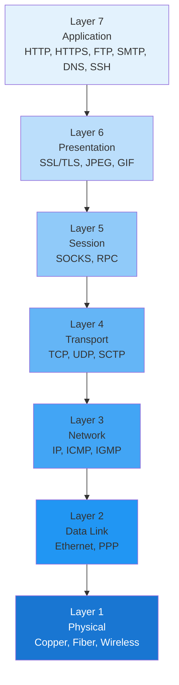
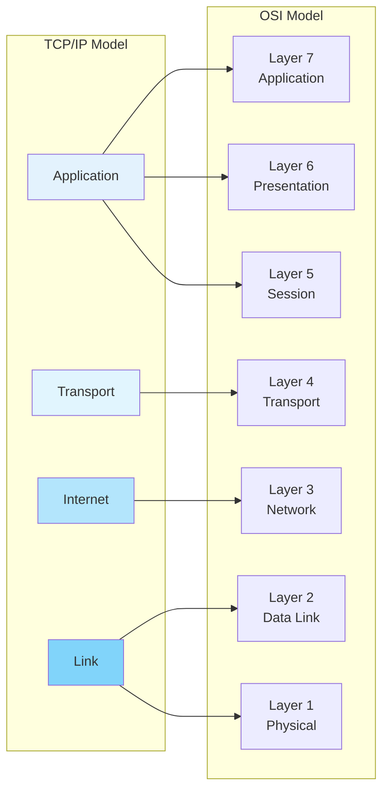
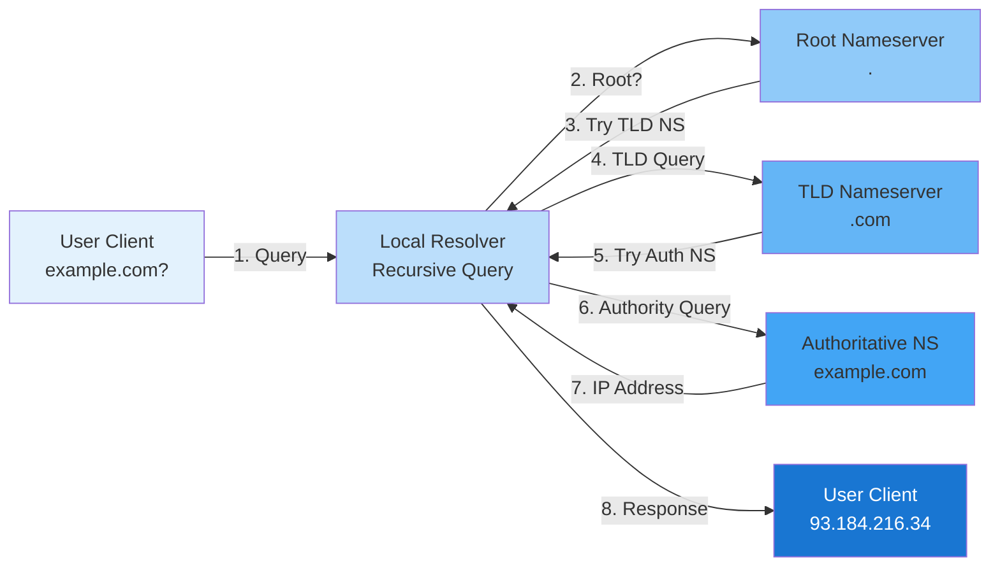

# Network Fundamentals

Master the core concepts that underpin modern networking: the OSI and TCP/IP models, IP addressing schemes, and the protocols that power the Internet.

## OSI Model (7 Layers)

The Open Systems Interconnection (OSI) model is a conceptual framework with seven abstraction layers.

### OSI Model Diagram



| Layer | Name | Function | Protocols/Examples |
|:------|:-----|:---------|:-------------------|
| 7 | Application | User services and applications | HTTP, HTTPS, FTP, SMTP, DNS, SSH, Telnet |
| 6 | Presentation | Data encryption, compression, formatting | SSL/TLS, JPEG, GIF |
| 5 | Session | Dialog control, session management | SOCKS, RPC |
| 4 | Transport | Reliable data transfer, flow control | TCP, UDP, SCTP |
| 3 | Network | Routing, logical addressing | IP, ICMP, IGMP |
| 2 | Data Link | MAC addressing, frame formatting, error detection | Ethernet, PPP, Frame Relay |
| 1 | Physical | Electrical signals, physical media | Copper, fiber, wireless |

## TCP/IP Model (5 Layers)

The TCP/IP model is simpler and more practical than the OSI model.

### TCP/IP and OSI Mapping



### Application Layer
- **Defines** — TCP/IP application protocols and how host programs interface with transport services
- **Protocols** — HTTP, HTTPS, FTP, SMTP, DNS, SSH, Telnet, POP3, IMAP
- **Responsibility** — User applications and services

### Transport Layer
- **Provides** — Communication session management between nodes
- **Defines** — Service level and connection states
- **Protocols** — TCP, UDP, RTP, SCTP
- **Responsibility** — End-to-end delivery, error handling

### Internet Layer
- **Packages** — Data into IP datagrams with source/destination addresses
- **Performs** — Routing of IP datagrams
- **Protocols** — IP (IPv4/IPv6), ICMP, ARP, RARP, IGMP
- **Responsibility** — Logical addressing and routing

### Network Access/Link Layer
- **Specifies** — Physical data transmission through networks
- **Handles** — Electronic signaling by hardware devices
- **Protocols** — Ethernet, Frame Relay, PPP, Wi-Fi (802.11)
- **Responsibility** — Physical and data link operations

## IP Addressing

### IPv4 Addressing

**Format and Structure**
- Uses 32-bit binary addresses
- Expressed as four decimal numbers separated by dots (e.g., `192.168.1.1`)
- Each section is called an octet (8 bits)
- Range: `0.0.0.0` to `255.255.255.255`

**IPv4 Address Classes (Classful)**

| Class | Range | Default Mask | Use |
|:------|:------|:-------------|:----|
| A | `1.0.0.0` to `126.255.255.255` | `/8` (255.0.0.0) | Large networks |
| B | `128.0.0.0` to `191.255.255.255` | `/16` (255.255.0.0) | Medium networks |
| C | `192.0.0.0` to `223.255.255.255` | `/24` (255.255.255.0) | Small networks |
| D | `224.0.0.0` to `239.255.255.255` | N/A | Multicast |
| E | `240.0.0.0` to `255.255.255.255` | N/A | Reserved |

**Special IPv4 Addresses**

| Address | Purpose |
|:--------|:--------|
| `0.0.0.0` | Default network, "this network" |
| `255.255.255.255` | Network broadcast |
| `127.0.0.1` | Loopback address (localhost) |
| `169.254.0.1` to `169.254.255.254` | Automatic Private IP Addressing (APIPA) |
| `10.0.0.0/8` | Private network (RFC 1918) |
| `172.16.0.0/12` | Private network (RFC 1918) |
| `192.168.0.0/16` | Private network (RFC 1918) |

### IPv6 Addressing

**Format and Structure**
- Uses 128-bit binary addresses
- Expressed as eight groups of hexadecimal numbers separated by colons (e.g., `2001:0db8:85a3:0000:0000:8a2e:0370:7334`)
- Groups of consecutive zeros can be replaced with `::` (only once per address)
- Example: `2001:db8::8a2e:370:7334`

**IPv6 Benefits**
- Vastly larger address space (2^128 vs 2^32)
- Simplified header format
- Built-in quality of service (QoS) support
- IPsec security included
- No need for NAT

## Subnetting and CIDR

### CIDR Notation

Classless Inter-Domain Routing (CIDR) notation specifies the network prefix length:

- `192.168.1.0/24` means 24 bits for the network, 8 bits for hosts
- Slash notation replaces traditional subnet masks
- Allows for more efficient IP allocation

### Subnet Mask Examples

| CIDR | Subnet Mask | Usable Hosts | Uses |
|:-----|:------------|:-------------|:-----|
| /24 | 255.255.255.0 | 254 | Small networks, home labs |
| /23 | 255.255.254.0 | 510 | Medium networks |
| /22 | 255.255.252.0 | 1,022 | Departmental networks |
| /21 | 255.255.248.0 | 2,046 | Large departments |
| /20 | 255.255.240.0 | 4,094 | Campus networks |

### Subnetting Exercise

**Problem:** You have a network `192.168.1.0/24` and need to create 4 subnets.

**Solution:**
- Original: `/24` (256 addresses)
- Required: 4 subnets = 2^2 subnets
- New mask: `/26` (256/4 = 64 addresses per subnet)
- Subnets:
  - `192.168.1.0/26` (hosts: .1 to .62)
  - `192.168.1.64/26` (hosts: .65 to .126)
  - `192.168.1.128/26` (hosts: .129 to .190)
  - `192.168.1.192/26` (hosts: .193 to .254)

## DNS (Domain Name System)

### How DNS Works

1. **User Application** — initiates a DNS query
2. **Local Resolver** — contacts recursive resolver
3. **Root Nameserver** — directs to TLD nameserver
4. **TLD Nameserver** — directs to authoritative nameserver
5. **Authoritative Nameserver** — returns IP address
6. **Response Path** — IP is returned to user

### DNS Resolution Flow Diagram



### DNS Record Types

| Record Type | Purpose | Example |
|:------------|:--------|:--------|
| A | IPv4 address | `example.com A 93.184.216.34` |
| AAAA | IPv6 address | `example.com AAAA 2606:2800:220:1:248:1893:25c8:1946` |
| CNAME | Alias | `www.example.com CNAME example.com` |
| MX | Mail exchange | `example.com MX 10 mail.example.com` |
| NS | Nameserver | `example.com NS ns1.example.com` |
| SOA | Start of authority | Contains zone info |
| TXT | Text record | SPF, DKIM, domain verification |
| SRV | Service record | `_service._proto.name.com` |

### DNS Commands

```bash
# Query DNS server
nslookup example.com

# Dig query (detailed)
dig example.com

# Check specific record type
dig example.com MX

# Reverse DNS lookup
dig -x 93.184.216.34

# Query specific nameserver
dig @8.8.8.8 example.com
```

## DHCP (Dynamic Host Configuration Protocol)

### How DHCP Works (DORA Process)

1. **Discover** — Client broadcasts DHCP DISCOVER message
2. **Offer** — DHCP server responds with IP offer
3. **Request** — Client requests the offered IP
4. **Acknowledge** — Server acknowledges, assigns IP for lease duration

### DHCP Lease

- **Lease Duration** — Typically 1 day to 1 week
- **Renewal** — Client attempts to renew at 50% of lease time
- **Rebind** — Client accepts any offer at 87.5% of lease time
- **Expire** — If no renewal, IP is reclaimed

### DHCP Configuration Example

```bash
# View DHCP-assigned IP (Linux)
dhclient -v

# Release and renew lease
dhclient -r && dhclient

# View DHCP configuration
cat /var/lib/dhcp/dhclient.leases
```

## ARP (Address Resolution Protocol)

### Purpose

Maps IP addresses (Layer 3) to MAC addresses (Layer 2) on local networks.

### ARP Process

1. Host needs to communicate with IP address on same subnet
2. Host broadcasts ARP Request: "Who has IP X?"
3. Host with IP X responds: "I have IP X, my MAC is Y"
4. Requester caches MAC-to-IP mapping
5. Frames are sent using discovered MAC address

### ARP Commands

```bash
# Display ARP table
arp -a

# Add static ARP entry
arp -s 192.168.1.50 aa:bb:cc:dd:ee:ff

# Delete ARP entry
arp -d 192.168.1.50

# Watch ARP activity
arp -a | grep -i "192.168"
```

### ARP Spoofing

**Risk:** Attacker responds to ARP requests with their own MAC address, redirecting traffic.

**Mitigation:**
- Use static ARP entries for critical servers
- Implement ARP inspection on switches
- Monitor for suspicious ARP activity

## MAC Addresses

### Format

- 48-bit address expressed in hexadecimal
- Format: `AA:BB:CC:DD:EE:FF` or `AA-BB-CC-DD-EE-FF`
- First 24 bits: Organizationally Unique Identifier (OUI)
- Last 24 bits: Device-specific address

### Special MAC Addresses

| MAC | Purpose |
|:----|:--------|
| `FF:FF:FF:FF:FF:FF` | Broadcast on local segment |
| `01:00:5E:00:00:00/24` | Multicast range |
| `00:00:00:00:00:00` | Null address |

## Ports and Port Numbers

### Port Ranges

| Range | Type | Usage |
|:------|:-----|:------|
| 0-1023 | Well-known | System/reserved services |
| 1024-49151 | Registered | Registered for specific services |
| 49152-65535 | Dynamic/Private | Temporary/client ports |

### Common Ports

| Port | Protocol | Service |
|:-----|:---------|:--------|
| 21 | TCP | FTP (File Transfer) |
| 22 | TCP | SSH (Secure Shell) |
| 25 | TCP | SMTP (Email) |
| 53 | TCP/UDP | DNS |
| 80 | TCP | HTTP (Web) |
| 110 | TCP | POP3 (Email) |
| 143 | TCP | IMAP (Email) |
| 443 | TCP | HTTPS (Secure Web) |
| 3306 | TCP | MySQL Database |
| 5432 | TCP | PostgreSQL Database |
| 6379 | TCP | Redis Cache |
| 8080 | TCP | HTTP Alternate |

## Core Transport Protocols

### TCP (Transmission Control Protocol)

**Characteristics**
- Connection-oriented (3-way handshake)
- Reliable delivery with acknowledgments
- Ordered delivery guaranteed
- Flow control and congestion control
- Slower but more reliable than UDP

**3-Way Handshake**
1. **SYN** — Client sends synchronization packet
2. **SYN-ACK** — Server acknowledges and sends own SYN
3. **ACK** — Client acknowledges server's SYN

**Connection Termination (4-Way Handshake)**
1. Client sends FIN
2. Server acknowledges with ACK
3. Server sends FIN
4. Client acknowledges with ACK

### UDP (User Datagram Protocol)

**Characteristics**
- Connectionless (no handshake)
- Unreliable delivery (no acknowledgments)
- Lower overhead, faster
- No ordering guarantee
- Used when speed matters more than reliability

**Applications**
- DNS queries
- Video/audio streaming
- Online gaming
- VoIP

### ICMP (Internet Control Message Protocol)

**Purpose** — Error reporting and diagnostic functions

**Common ICMP Types**

| Type | Name | Purpose |
|:-----|:-----|:--------|
| 0 | Echo Reply | Response to ping |
| 3 | Destination Unreachable | Network/host/port unreachable |
| 8 | Echo Request | Ping request |
| 11 | Time Exceeded | TTL expired |
| 13 | Timestamp | Measure round-trip time |

**Commands**
```bash
# Ping (ICMP Echo Request)
ping -c 4 example.com

# Traceroute (sends ICMP with increasing TTL)
traceroute example.com

# Show ICMP statistics
netstat -s | grep ICMP
```

## Exercises

### Exercise 1: IP Address Calculation

**Q:** Given `10.1.2.0/25`, what are the network and broadcast addresses?

**A:**
- Network: `10.1.2.0`
- Broadcast: `10.1.2.127` (25 bits = 128 addresses)
- Usable hosts: `.1` to `.126` (126 hosts)

### Exercise 2: Subnet Mask Conversion

**Q:** Convert subnet mask `255.255.240.0` to CIDR notation.

**A:**
- Count binary 1s: `11111111.11111111.11110000.00000000`
- CIDR: `/20`

### Exercise 3: DNS Resolution

**Q:** What steps occur when you type `example.com` in your browser?

**A:**
1. Browser checks its cache
2. Browser sends recursive query to resolver
3. Resolver queries root nameserver
4. Root directs to `.com` TLD nameserver
5. TLD directs to example.com authoritative nameserver
6. Authoritative server returns IP `93.184.216.34`
7. Browser establishes TCP connection to that IP

### Exercise 4: ICMP and Connectivity

**Q:** Why does `ping 192.168.1.1` fail even though ARP discovers the MAC address?

**A:** Possible reasons:
- ICMP is blocked by firewall rule
- Host is configured to not respond to ICMP
- Routing issue (host unreachable)
- Wrong IP address

## Summary

Network fundamentals provide the foundation for understanding all higher-level networking concepts. Master:
- How data moves through the OSI/TCP/IP layers
- IP addressing and subnetting for efficient network design
- DNS and DHCP for automatic configuration
- ARP, MAC addresses, and local network discovery
- Ports and protocols for application communication
- TCP, UDP, and ICMP for different reliability needs
