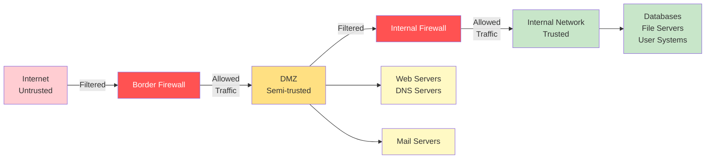
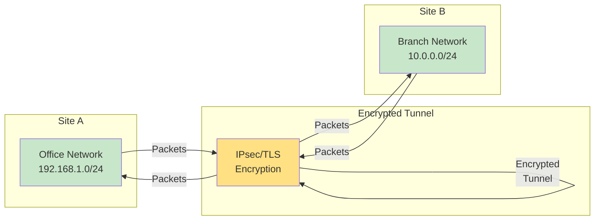

# Network Security

Secure networks against attacks through firewalls, encryption, authentication, and defense strategies.

## Network Security Principles

### CIA Triad

| Principle | Definition | Example |
|:----------|:-----------|:--------|
| **Confidentiality** | Only authorized users see data | Encryption of sensitive data |
| **Integrity** | Data not modified in transit | HMAC verification |
| **Availability** | Systems accessible when needed | Redundancy, DDoS protection |

### Defense in Depth

Layer multiple security controls:
- Firewalls at network perimeter
- IPsec/VPN for data in transit
- 802.1X for access control
- ACLs for traffic filtering
- Intrusion detection/prevention
- Network segmentation
- Encryption and authentication

## Firewalls

### Firewall Architecture Diagram



### Types of Firewalls

**Stateless (Packet-Filtering) Firewall**
- Examines individual packets
- Fast but less intelligent
- Cannot determine session state
- Example: ACL-based filtering

**Stateful Firewall**
- Tracks connection states
- Maintains session table
- Allows return traffic for established connections
- More secure, moderate performance impact

**Application-Level (Proxy) Firewall**
- Inspects application layer data
- Deep packet inspection (DPI)
- Can block specific commands or URLs
- Highest security, higher overhead

**Next-Generation Firewall (NGFW)**
- Combines stateful + application layer inspection
- Intrusion prevention (IPS)
- SSL/TLS inspection
- Threat intelligence integration
- Examples: Palo Alto, Fortinet, Check Point

### Firewall Rules Best Practices

```bash
# Deny by default, allow by exception
access-list 101 deny ip any any

# Allow specific traffic
access-list 101 permit tcp any 10.0.0.0 0.0.0.255 eq 22
access-list 101 permit tcp any 10.0.0.0 0.0.0.255 eq 80
access-list 101 permit tcp any 10.0.0.0 0.0.0.255 eq 443

# Apply to interface
interface GigabitEthernet0/1
access-group 101 in
```

### Firewall Configuration (Cisco ASA)

```bash
# Enable firewall
firewall enable

# Create access list
access-list ALLOW_IN extended permit tcp any any eq https
access-list ALLOW_IN extended permit tcp any any eq http

# Apply to interface
access-group ALLOW_IN in interface outside

# Configure object groups
object-group network INTERNAL_NETS
description Internal Networks
network-object 10.0.0.0 255.0.0.0
network-object 172.16.0.0 255.240.0.0

# Use in rules
access-list INSIDE_OUT extended permit tcp object-group INTERNAL_NETS any eq 443
```

## Access Control Lists (ACLs)

### Standard ACL

Filters on source IP only.

```bash
# Create standard ACL
access-list 1 deny 10.1.1.0 0.0.0.255
access-list 1 permit any

# Apply to interface or line
interface FastEthernet0/0
ip access-group 1 in

# Apply to VTY lines (SSH/Telnet)
line vty 0 4
access-class 1 in
```

### Extended ACL

Filters on source IP, destination IP, protocol, and ports.

```bash
# Format: access-list number action protocol source destination
access-list 100 permit tcp 10.0.0.0 0.0.0.255 any eq 22
access-list 100 permit tcp 10.0.0.0 0.0.0.255 any eq 80
access-list 100 permit tcp 10.0.0.0 0.0.0.255 any eq 443
access-list 100 deny ip any any

# Apply to interface
interface GigabitEthernet0/1
ip access-group 100 in
```

### Named ACL

More readable and easier to maintain.

```bash
# Create named ACL
ip access-list extended ALLOW_HTTP_HTTPS
10 permit tcp any any eq 80
20 permit tcp any any eq 443
30 deny ip any any

# Apply to interface
interface GigabitEthernet0/1
ip access-group ALLOW_HTTP_HTTPS in
```

## IPsec (IP Security)

### Purpose

Provides encryption, authentication, and integrity for IP traffic.

### IPsec Components

**Authentication Header (AH)**
- Authenticates source and ensures integrity
- Does NOT encrypt
- Overhead: ~20-24 bytes

**Encapsulating Security Payload (ESP)**
- Provides encryption, authentication, and integrity
- More commonly used
- Overhead: ~20+ bytes

### IPsec Modes

**Transport Mode**
- Only payload encrypted/authenticated
- Used for host-to-host communication
- Preserves original header

**Tunnel Mode**
- Entire packet encrypted/authenticated
- New outer header added
- Used for VPN connections
- Better for gateway-to-gateway

### IPsec Configuration (Cisco)

```bash
# Phase 1: ISAKMP (Internet Key Exchange)
crypto isakmp policy 1
authentication pre-share
encryption aes 256
hash sha256
group 14

# Phase 2: IPsec Transform Set
crypto ipsec transform-set TS esp-aes 256 esp-sha256-hmac

# Configure crypto map
crypto map CMAP 1 ipsec-isakmp
match address 101
set peer 203.0.113.1
set pfs group14
set transform-set TS
set security-association lifetime seconds 3600

# Apply to interface
interface Serial0/0
crypto map CMAP

# Define interesting traffic
access-list 101 permit ip 10.0.0.0 0.0.0.255 192.168.0.0 0.0.0.255
```

## VPN (Virtual Private Network)

### VPN Tunnel Diagram



### VPN Types

**Site-to-Site VPN**
- Connects entire networks
- Gateway-to-gateway encryption
- Persistent tunnels
- Use case: Branch office connectivity

**Remote Access VPN**
- Connects individual users to network
- User device acts as VPN client
- On-demand or persistent
- Use case: Telecommuting, mobile users

### VPN Protocols

**IPsec**
- Industry standard
- Transport or Tunnel mode
- Strong encryption options

**SSL/TLS VPN**
- Uses HTTPS (port 443)
- Browser-based access
- Works through firewalls/proxies
- Example: Cisco AnyConnect, Palo Alto GlobalProtect

**WireGuard**
- Modern, lightweight protocol
- ~4000 lines of code (vs IPsec 400,000+)
- Excellent performance
- Growing adoption

**OpenVPN**
- Open-source, free
- SSL/TLS based
- Flexible, widely supported
- Good for point-to-point connections

## 802.1X (Port-Based Network Access Control)

### Purpose

Control network access based on user identity and device posture.

### 802.1X Components

**Supplicant (Client)**
- User device requesting network access
- Provides credentials

**Authenticator (Switch)**
- Controls access to network
- Passes credentials to authentication server
- Blocks/allows traffic based on server response

**Authentication Server (RADIUS/TACACS+)**
- Validates credentials
- Determines access policy
- Provides role-based access

### 802.1X Flow

1. Supplicant connects to switch
2. Switch blocks all traffic except EAPOL (EAP over LAN)
3. Supplicant sends credentials via EAP
4. Switch forwards to RADIUS server
5. RADIUS authenticates and responds
6. Switch opens port if authenticated
7. Port allows full network access

### 802.1X Configuration (Cisco Switch)

```bash
# Enable AAA
aaa new-model
aaa authentication dot1x default group radius
aaa authorization network default group radius

# Configure RADIUS server
radius server RADIUS1
address ipv4 10.0.0.1 auth-port 1812 acct-port 1813
key CiscoSecret123

# Enable 802.1X on interface
interface FastEthernet0/1
authentication port-control auto
dot1x pae authenticator
```

## Zone-Based Firewall (ZBF)

### Purpose

Define security zones and create policies between them instead of per-interface ACLs.

### Zone Concepts

**Zone** — Group of interfaces with similar security requirements

**Policy** — Rules for traffic flowing between zones

**Self Zone** — Traffic to/from router itself (not between interfaces)

### Zone-Based Firewall Configuration

```bash
# Define zones
security-zone OUTSIDE
security-zone INSIDE

# Assign interfaces to zones
interface GigabitEthernet0/1
zone-member security OUTSIDE

interface FastEthernet0/0
zone-member security INSIDE

# Define policy map
policy-map type inspect IN2OUT
class type inspect HTTP
inspect http
class class-default
pass

# Create zone pair and apply policy
zone-pair security INSIDE2OUTSIDE source INSIDE destination OUTSIDE
service-policy type inspect IN2OUT
```

## Wireless Security

### Wi-Fi Security Standards

**WEP (Wired Equivalent Privacy)**
- Deprecated, easily cracked
- Uses 40-bit or 104-bit RC4 encryption
- **Do not use**

**WPA (Wi-Fi Protected Access)**
- Improved WEP
- Uses TKIP (Temporal Key Integrity Protocol)
- Still considered weak
- **Avoid for sensitive data**

**WPA2 (802.11i)**
- Current standard
- Uses AES-CCMP encryption
- HMAC-based authentication
- **Recommended for enterprise**

**WPA3 (802.11ax)**
- Latest standard
- 192-bit encryption
- Protection against brute-force attacks
- Individualized Data Encryption (IDM)
- **Best choice for new deployments**

### Authentication Methods

**Open Authentication**
- No password
- Anyone can connect
- Use for guest networks with restrictions

**Pre-Shared Key (PSK)**
- Everyone shares same password
- Weak for large networks
- Fine for small office/home

**Enterprise (802.1X)**
- Per-user credentials
- RADIUS backend
- Ideal for corporate networks

### Wireless Configuration (Cisco AP)

```bash
# Configure SSID and authentication
dot11 ssid CORP
authentication open
authentication key-mgmt wpa2
wpa-psk ascii 0 SuperSecurePassword123!

# Configure access point
interface Dot11Radio0
ssid CORP
encryption mode cbc
encryption key 1234567890abcdef1234567890abcdef

# Enable WPA2-Enterprise with RADIUS
authentication open
authentication key-mgmt wpa2
radius-server host 10.0.0.5 auth-port 1812 key SharedSecret123
```

## Network Attacks and Defense

### Common Network Attacks

**Packet Sniffing**
- Attacker captures unencrypted traffic
- Reads credentials, sensitive data
- **Defense:** Encryption (HTTPS, SSH, VPN)

**Man-in-the-Middle (MITM)**
- Attacker intercepts and modifies traffic
- Impersonates both sender and receiver
- **Defense:** Certificate validation, strong encryption

**DDoS (Distributed Denial of Service)**
- Flood target with traffic from multiple sources
- Overwhelms bandwidth or processing
- **Defense:** Rate limiting, traffic scrubbing, cloud DDoS mitigation

**ARP Spoofing**
- Attacker sends fake ARP replies
- Redirects traffic to attacker's MAC address
- **Defense:** Static ARP entries, DHCP snooping, ARP inspection

**IP Spoofing**
- Attacker forges source IP address
- Disguises attack origin
- **Defense:** Ingress/egress filtering, access lists

**Port Scanning**
- Attacker maps open ports
- Identifies vulnerable services
- **Defense:** Close unnecessary ports, IDS/IPS detection

**Ping of Death**
- Oversized ICMP echo request
- Crashes vulnerable systems
- **Defense:** Deprecated; modern systems immune

**SYN Flood**
- Attacker sends many SYN packets
- Exhaust connection table
- **Defense:** SYN cookies, connection limits

**DNS Spoofing (DNS Cache Poisoning)**
- Attacker injects false DNS records
- Redirects to malicious sites
- **Defense:** DNSSEC, DNS validation

**Wireless Attacks**

| Attack | Description | Defense |
|:-------|:-----------|:--------|
| Eavesdropping | Capture unencrypted Wi-Fi traffic | Use WPA2/WPA3 encryption |
| Evil Twin | Fake AP with legitimate SSID | Use certificate validation, strong encryption |
| War-driving | Scan for unprotected networks | Enable encryption, hide SSID (weak) |
| Brute Force | Crack WPA/WPA2 password | Use long, random passwords |
| WPS Attack | Crack Wi-Fi Protected Setup | Disable WPS |

## Defense Strategies

### Network Segmentation

```
+--------+
| Public |
| Zone   |
+---+----+
    | DMZ
    |
    | Firewall
    |
+---+--------+
| Private    |
| Zone       |
+--------+---+
    |
+---+-------+
| Sensitive |
| Data Zone |
+-----------+
```

### Defense Layers

1. **Perimeter Defense**
   - Border firewalls
   - Intrusion detection/prevention
   - DDoS mitigation

2. **Network Defense**
   - Internal firewalls
   - Network segmentation
   - Access control lists

3. **Host Defense**
   - Personal firewalls
   - Host-based intrusion detection
   - Antivirus/malware protection

4. **Application Defense**
   - Input validation
   - Secure coding
   - Web application firewall (WAF)

### Monitoring and Detection

```bash
# Monitor firewall traffic
show access-lists

# View denied connections
show ip access-lists DENY_LOG | include deny

# Monitor RADIUS authentication
debug radius authentication

# View port security violations
show port-security violation
```

## Exercises

### Exercise 1: ACL Design

**Q:** Create an ACL allowing only SSH and HTTPS to an internal network `10.0.0.0/8` from external networks.

**A:**
```bash
ip access-list extended SECURE_ACCESS
10 permit tcp any 10.0.0.0 0.0.0.255 eq 22
20 permit tcp any 10.0.0.0 0.0.0.255 eq 443
30 deny ip any any
```

### Exercise 2: VPN Configuration

**Q:** Identify the security phases needed to establish an IPsec site-to-site VPN.

**A:**
1. **Phase 1:** ISAKMP authentication (DH key exchange)
2. **Phase 2:** IPsec transform set negotiation
3. **Data Transfer:** Encrypted tunnel established

### Exercise 3: Threat Mitigation

**Q:** Your network is experiencing a SYN flood attack on port 80. How would you defend?

**A:**
1. Enable SYN cookies on gateway router
2. Configure rate limiting on port 80
3. Implement connection limits
4. Consider cloud-based DDoS mitigation
5. Filter suspicious traffic at upstream ISP
6. Update WAF rules to drop SYN floods

## Summary

Network security requires:
- **Firewalls** for traffic filtering
- **IPsec/VPN** for encrypted communication
- **802.1X** for access control
- **ACLs** for fine-grained filtering
- **Segmentation** to limit breach scope
- **Monitoring** to detect threats
- **Defense in depth** with multiple layers
