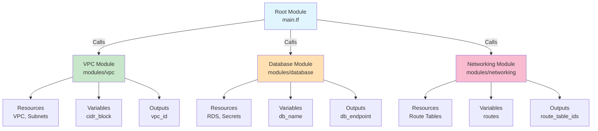

# Terraform Advanced Topics

## Modules

Modules are reusable, self-contained packages of Terraform configuration.

### Module Architecture Diagram



### Module Structure

```
my-module/
  main.tf           # Resource definitions
  variables.tf      # Input variables
  outputs.tf        # Output values
  README.md         # Documentation
```

### Creating a Module

**variables.tf**:

```hcl
variable "vpc_cidr" {
  description = "VPC CIDR block"
  type        = string
}

variable "environment" {
  description = "Environment name"
  type        = string
}

variable "availability_zones" {
  description = "AZs for subnets"
  type        = list(string)
}
```

**main.tf**:

```hcl
resource "aws_vpc" "this" {
  cidr_block           = var.vpc_cidr
  enable_dns_hostnames = true

  tags = {
    Name        = "${var.environment}-vpc"
    Environment = var.environment
  }
}

resource "aws_subnet" "public" {
  count                   = length(var.availability_zones)
  vpc_id                  = aws_vpc.this.id
  cidr_block              = cidrsubnet(var.vpc_cidr, 2, count.index)
  availability_zone       = var.availability_zones[count.index]
  map_public_ip_on_launch = true

  tags = {
    Name = "${var.environment}-public-subnet-${count.index + 1}"
  }
}
```

**outputs.tf**:

```hcl
output "vpc_id" {
  description = "VPC ID"
  value       = aws_vpc.this.id
}

output "subnet_ids" {
  description = "Public subnet IDs"
  value       = aws_subnet.public[*].id
}

output "vpc_cidr" {
  description = "VPC CIDR block"
  value       = aws_vpc.this.cidr_block
}
```

### Using Modules

```hcl
module "vpc" {
  source = "./modules/vpc"

  vpc_cidr           = "10.0.0.0/16"
  environment        = "production"
  availability_zones = ["us-east-1a", "us-east-1b", "us-east-1c"]
}

resource "aws_security_group" "app" {
  vpc_id = module.vpc.vpc_id

  ingress {
    from_port   = 8080
    to_port     = 8080
    protocol    = "tcp"
    cidr_blocks = ["10.0.0.0/16"]
  }
}
```

### Terraform Registry Modules

Use pre-built modules from Terraform Registry:

```hcl
module "rds" {
  source  = "terraform-aws-modules/rds/aws"
  version = "~> 5.0"

  identifier     = "mydb"
  engine         = "postgres"
  engine_version = "15"
  instance_class = "db.t4g.micro"

  db_name  = "myapp"
  username = "admin"
  port     = 5432

  allocated_storage = 100

  skip_final_snapshot       = true
  skip_final_snapshot_name  = "final-snapshot"
}
```

## Workspaces

Workspaces allow managing multiple environments (dev, staging, prod) with separate state.

```bash
# Create workspace
terraform workspace new staging

# List workspaces
terraform workspace list
#   default
# * staging

# Select workspace
terraform workspace select production

# Delete workspace
terraform workspace delete staging

# Current workspace
terraform workspace show
```

**Using workspaces in configuration:**

```hcl
variable "instance_count" {
  type = map(number)
  default = {
    default     = 1
    staging     = 2
    production  = 5
  }
}

locals {
  instance_count = var.instance_count[terraform.workspace]
  environment    = terraform.workspace
}

resource "aws_instance" "app" {
  count         = local.instance_count
  instance_type = "t2.micro"

  tags = {
    Environment = local.environment
  }
}
```

## Remote State and Backends

Local state files are risky for teams. Remote backends centralize state management.

### Terraform CI/CD Pipeline Diagram

```mermaid
graph LR
    A["Developer<br/>Commits Code"] --> B["GitHub PR<br/>Created"]
    B --> C["terraform plan"]
    C --> D["Show Plan<br/>in PR"]
    D --> E["Code Review<br/>Approval"]
    E --> F["Merge to<br/>Main"]
    F --> G["terraform apply"]
    G --> H["Infrastructure<br/>Updated"]

    D -->|"Security Gate"| C
    E -->|"Manual Gate"| F

    style A fill:#e3f2fd
    style B fill:#e1f5ff
    style C fill:#b3e5fc
    style D fill:#81d4fa
    style E fill:#4fc3f7
    style F fill:#29b6f6
    style G fill:#1a8cba
    style H fill:#0d47a1
```



### S3 Backend Configuration

```hcl
terraform {
  backend "s3" {
    bucket         = "my-terraform-state"
    key            = "prod/terraform.tfstate"
    region         = "us-east-1"
    encrypt        = true
    dynamodb_table = "terraform-locks"
  }
}
```

**Setup script:**

```bash
#!/bin/bash

# Create S3 bucket
aws s3 mb s3://my-terraform-state-2026 \
  --region us-east-1

# Enable versioning
aws s3api put-bucket-versioning \
  --bucket my-terraform-state-2026 \
  --versioning-configuration Status=Enabled

# Enable encryption
aws s3api put-bucket-encryption \
  --bucket my-terraform-state-2026 \
  --server-side-encryption-configuration '{
    "Rules": [{
      "ApplyServerSideEncryptionByDefault": {
        "SSEAlgorithm": "AES256"
      }
    }]
  }'

# Block public access
aws s3api put-public-access-block \
  --bucket my-terraform-state-2026 \
  --public-access-block-configuration \
  "BlockPublicAcls=true,IgnorePublicAcls=true,BlockPublicPolicy=true,RestrictPublicBuckets=true"

# Create DynamoDB table for locking
aws dynamodb create-table \
  --table-name terraform-locks \
  --attribute-definitions AttributeName=LockID,AttributeType=S \
  --key-schema AttributeName=LockID,KeyType=HASH \
  --billing-mode PAY_PER_REQUEST
```

### State Locking

DynamoDB prevents concurrent modifications:

```hcl
terraform {
  backend "s3" {
    bucket         = "my-terraform-state"
    key            = "terraform.tfstate"
    region         = "us-east-1"
    encrypt        = true
    dynamodb_table = "terraform-locks"  # Enables locking
  }
}
```

During apply, Terraform creates a lock entry in DynamoDB.

## Terraform Import

Import existing resources into Terraform state.

```bash
# Import an existing EC2 instance
terraform import aws_instance.imported i-1234567890abcdef0

# Import with resource address
terraform import aws_security_group.web sg-12345678

# Import into module
terraform import module.vpc.aws_vpc.this vpc-12345678
```

**After import**, create the resource block in configuration:

```hcl
resource "aws_instance" "imported" {
  # Configuration will be populated by import
  # You may need to fill in missing attributes
}
```

## Provisioners

Provisioners run scripts or commands on resources (use sparingly).

### Local Execution

```hcl
resource "null_resource" "backup" {
  provisioner "local-exec" {
    command = "aws s3 cp backup.tar.gz s3://my-bucket/"
  }
}
```

### Remote Execution

```hcl
resource "aws_instance" "web" {
  ami           = "ami-0c55b159cbfafe1f0"
  instance_type = "t2.micro"
  key_name      = aws_key_pair.deployer.key_name

  provisioner "remote-exec" {
    inline = [
      "sudo apt-get update",
      "sudo apt-get install -y nginx",
      "sudo systemctl start nginx"
    ]

    connection {
      type        = "ssh"
      user        = "ec2-user"
      private_key = file("~/.ssh/id_rsa")
      host        = self.public_ip
    }
  }
}
```

**Best Practices:**
- Prefer user_data, cloud-init, or configuration management
- Provisioners are last resort (indicates design issues)
- Use `on_failure = continue` to ignore failures

## Dynamic Blocks

Generate multiple blocks dynamically:

```hcl
resource "aws_security_group" "web" {
  name = "dynamic-sg"

  dynamic "ingress" {
    for_each = [
      { port = 80, protocol = "tcp" },
      { port = 443, protocol = "tcp" },
      { port = 22, protocol = "tcp" }
    ]

    content {
      from_port   = ingress.value.port
      to_port     = ingress.value.port
      protocol    = ingress.value.protocol
      cidr_blocks = ["0.0.0.0/0"]
    }
  }
}
```

**With variables:**

```hcl
variable "ingress_rules" {
  type = list(object({
    port     = number
    protocol = string
  }))
  default = [
    { port = 80, protocol = "tcp" },
    { port = 443, protocol = "tcp" }
  ]
}

resource "aws_security_group" "web" {
  dynamic "ingress" {
    for_each = var.ingress_rules

    content {
      from_port   = ingress.value.port
      to_port     = ingress.value.port
      protocol    = ingress.value.protocol
      cidr_blocks = ["0.0.0.0/0"]
    }
  }
}
```

## for_each vs count

Both create multiple resources but with different tradeoffs.

### count (Index-based)

```hcl
variable "instance_count" {
  type    = number
  default = 3
}

resource "aws_instance" "server" {
  count         = var.instance_count
  instance_type = "t2.micro"

  tags = {
    Name = "server-${count.index + 1}"
  }
}

output "instance_ids" {
  value = aws_instance.server[*].id
}
```

**Problem**: Changing count value shifts indices, causing resource replacement.

### for_each (Key-based)

```hcl
variable "instances" {
  type = map(object({
    instance_type = string
    az            = string
  }))
  default = {
    web = {
      instance_type = "t2.micro"
      az            = "us-east-1a"
    }
    app = {
      instance_type = "t2.small"
      az            = "us-east-1b"
    }
  }
}

resource "aws_instance" "server" {
  for_each      = var.instances
  instance_type = each.value.instance_type
  availability_zone = each.value.az

  tags = {
    Name = each.key
  }
}

output "instance_ids" {
  value = {for k, v in aws_instance.server : k => v.id}
}
```

**Advantages:**
- Keys remain stable when variables change
- Safer refactoring
- Clearer output references

## Locals

Local values are convenience definitions for repeated expressions.

```hcl
locals {
  common_tags = {
    Environment = var.environment
    Project     = "CloudCaptain"
    ManagedBy   = "Terraform"
  }

  instance_count = var.environment == "production" ? 5 : 1

  name_prefix = "${var.environment}-${var.region}"
}

resource "aws_instance" "web" {
  count = local.instance_count

  tags = merge(local.common_tags, {
    Name = "${local.name_prefix}-web-${count.index + 1}"
  })
}
```

## Conditional Expressions

```hcl
resource "aws_instance" "web" {
  instance_type = var.environment == "production" ? "t3.large" : "t2.micro"

  root_block_device {
    volume_size = var.enable_large_disk ? 100 : 20
  }
}

locals {
  create_rds = var.deploy_database ? 1 : 0
}

resource "aws_db_instance" "main" {
  count = local.create_rds
  # ...
}
```

## Lifecycle Rules

Control resource lifecycle behavior:

```hcl
resource "aws_instance" "web" {
  ami           = "ami-0c55b159cbfafe1f0"
  instance_type = "t2.micro"

  lifecycle {
    # Prevent accidental destruction
    prevent_destroy = true

    # Create replacement before destroying
    create_before_destroy = true

    # Ignore changes to tags
    ignore_changes = [tags]

    # Ignore all computed attributes
    ignore_changes = all

    # Custom replacement trigger
    replace_triggered_by = [aws_ami.ubuntu.id]
  }
}
```

## Terraform Cloud/Enterprise

Terraform Cloud is a SaaS platform for team collaboration.

```hcl
terraform {
  cloud {
    organization = "my-org"

    workspaces {
      name = "production"
    }
  }
}
```

**Features:**
- Remote state management
- VCS integration (GitHub, GitLab)
- Run triggers and approvals
- Team management and RBAC
- Cost estimation

## Terragrunt

Terragrunt reduces Terraform boilerplate for multi-environment setups.

**terragrunt.hcl** (root):

```hcl
remote_state {
  backend = "s3"
  config = {
    bucket         = "my-terraform-state"
    key            = "${get_env("TG_ENVIRONMENT")}/terraform.tfstate"
    region         = "us-east-1"
    encrypt        = true
    dynamodb_table = "terraform-locks"
  }
}
```

**dev/terragrunt.hcl**:

```hcl
include "root" {
  path = find_in_parent_folders()
}

inputs = {
  environment = "dev"
  instance_count = 1
}
```

**Apply across all environments:**

```bash
cd infrastructure
terragrunt run-all plan
terragrunt run-all apply
```

## Exercises

### Exercise 1: Create and Use a VPC Module
Create a reusable VPC module with variables for CIDR block, AZs, and subnet count. Use it in a root module with two workspaces (dev and prod) with different configurations.

**Hint**: Structure with modules/vpc and separate tfvars per workspace.

### Exercise 2: S3 Backend Setup
Create S3 bucket and DynamoDB table for remote state. Migrate your existing configuration to use S3 backend with encryption and locking enabled.

**Hint**: Use backend configuration block and verify state migration with `terraform show`.

### Exercise 3: Dynamic Security Groups
Create a security group using dynamic blocks that accepts ingress rules from a variable (list of objects with port, protocol, CIDR). Test with 3 different rule sets.

**Hint**: Use for_each or dynamic ingress blocks.

### Exercise 4: for_each Resource Deployment
Create a map variable defining multiple EC2 instances with different types and AZs. Deploy using for_each and output a map of instance names to IDs.

**Hint**: Use for_each and merge() in outputs.

### Exercise 5: Registry Module Integration
Use terraform-aws-modules/vpc/aws from the registry to deploy a full VPC with public and private subnets. Add an RDS instance in the private subnet using locals for configuration.

**Hint**: Reference registry module and use output values for subnet IDs.

---

**Next Steps:**
- Master individual commands with the [Cheat Sheet](./cheatsheet.md)
- Prepare for certification with [Exam Prep](./exam-prep.md)
- Review common [Interview Questions](./interview-questions.md)
