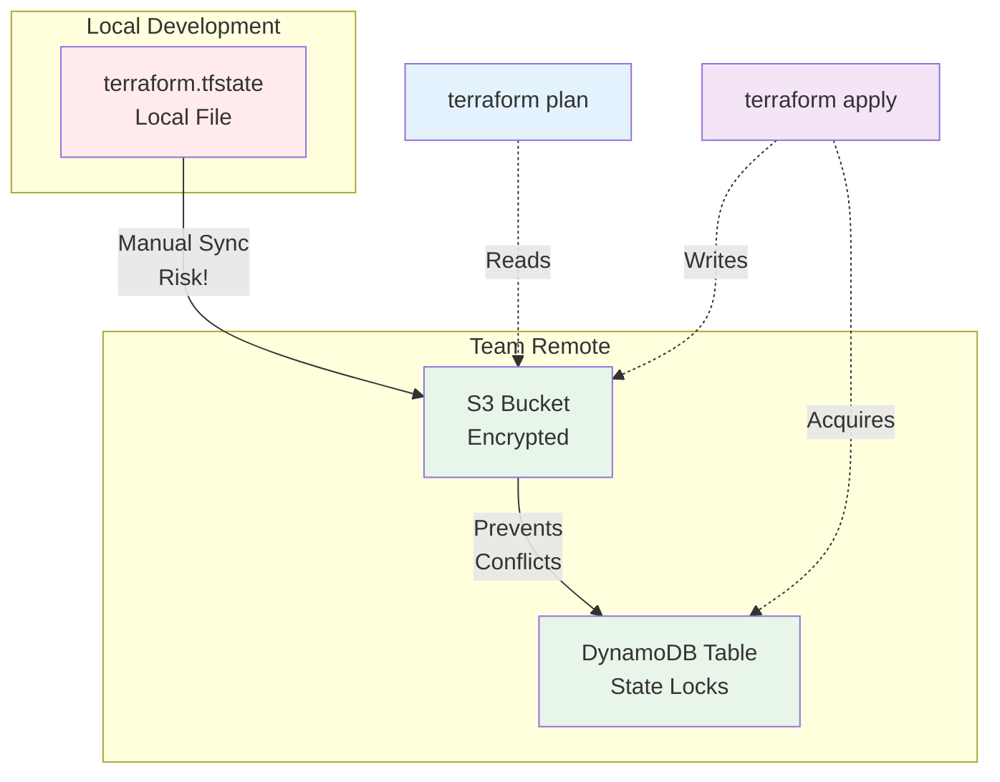
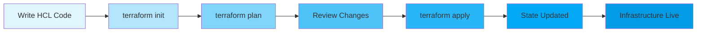

# Terraform Fundamentals

## What is Terraform?

Terraform is an open-source Infrastructure as Code (IaC) tool developed by HashiCorp. It allows you to define, provision, and manage cloud infrastructure using declarative configuration files written in HCL (HashiCorp Configuration Language).

**Key Features:**
- **Declarative syntax**: Describe desired state, not implementation steps
- **Multi-cloud support**: AWS, Azure, GCP, and 1000+ providers
- **State management**: Tracks resource state locally or remotely
- **Idempotent**: Safe to run multiple times
- **Version control friendly**: Configuration as code

## Infrastructure as Code (IaC) Concepts

IaC treats infrastructure management like software development:

- **Reproducibility**: Create identical environments consistently
- **Version control**: Track infrastructure changes in Git
- **Code review**: Peer review infrastructure changes via PRs
- **Automation**: Reduce manual operations and human error
- **Scalability**: Manage hundreds of resources with code

**IaC Categories:**
- **Declarative** (Terraform, CloudFormation): Describe desired state
- **Imperative** (Ansible, Chef): Define step-by-step actions

## HCL Basics

HCL is human-readable and designed for infrastructure automation.

### Basic Syntax

```hcl
# Comments start with #

# Block syntax: block_type "label" "name" { content }
resource "aws_instance" "web" {
  ami           = "ami-0c55b159cbfafe1f0"
  instance_type = "t2.micro"
}

# String literals
variable "region" {
  type    = string
  default = "us-east-1"
}

# Lists
variable "availability_zones" {
  type    = list(string)
  default = ["us-east-1a", "us-east-1b"]
}

# Maps
variable "tags" {
  type = map(string)
  default = {
    Environment = "production"
    Team        = "platform"
  }
}

# Numbers (integers and floats)
variable "instance_count" {
  type    = number
  default = 3
}

# Booleans
variable "enable_monitoring" {
  type    = bool
  default = true
}
```

### String Interpolation

```hcl
resource "aws_instance" "web" {
  tags = {
    Name = "server-${var.environment}"
  }
}

# String templates
user_data = <<-EOF
              #!/bin/bash
              echo "Hello ${var.name}"
              EOF
```

## Providers

Providers are plugins that enable Terraform to interact with cloud platforms and APIs.

```hcl
terraform {
  required_version = ">= 1.0"
  required_providers {
    aws = {
      source  = "hashicorp/aws"
      version = "~> 5.0"
    }
  }
}

provider "aws" {
  region = "us-east-1"

  default_tags {
    tags = {
      Project = "CloudCaptain"
      Managed = "Terraform"
    }
  }
}
```

**Provider Configuration:**
- Authentication (keys, tokens, assume roles)
- Region/location defaults
- Default tags and settings
- Multiple provider instances with aliases

```hcl
provider "aws" {
  alias  = "us-west"
  region = "us-west-2"
}

resource "aws_s3_bucket" "west" {
  provider = aws.us-west
  bucket   = "my-bucket-west"
}
```

## Resources and Data Sources

### Resources

Resources are infrastructure objects you want to create and manage.

```hcl
resource "aws_instance" "example" {
  ami           = "ami-0c55b159cbfafe1f0"
  instance_type = "t2.micro"

  tags = {
    Name = "MyInstance"
  }
}

# Reference another resource
resource "aws_security_group" "web" {
  vpc_id = aws_instance.example.vpc_id

  ingress {
    from_port   = 80
    to_port     = 80
    protocol    = "tcp"
    cidr_blocks = ["0.0.0.0/0"]
  }
}
```

### Data Sources

Data sources query existing infrastructure (read-only).

```hcl
# Get latest Ubuntu AMI
data "aws_ami" "ubuntu" {
  most_recent = true
  owners      = ["099720109477"] # Canonical

  filter {
    name   = "name"
    values = ["ubuntu/images/hvm-ssd/ubuntu-jammy-22.04-amd64-server-*"]
  }
}

resource "aws_instance" "web" {
  ami           = data.aws_ami.ubuntu.id
  instance_type = "t2.micro"
}
```

## Variables

Variables allow parameterization and reusability.

```hcl
variable "instance_type" {
  description = "EC2 instance type"
  type        = string
  default     = "t2.micro"
  sensitive   = false
}

variable "environment" {
  description = "Deployment environment"
  type        = string
  validation {
    condition     = contains(["dev", "staging", "prod"], var.environment)
    error_message = "Environment must be dev, staging, or prod."
  }
}

variable "instance_count" {
  description = "Number of instances"
  type        = number
  default     = 1
}

variable "tags" {
  description = "Resource tags"
  type        = map(string)
  default = {
    Project = "CloudCaptain"
  }
}
```

**Setting Variables:**

```bash
# Via CLI
terraform apply -var="instance_type=t3.small"

# Via file
terraform apply -var-file="prod.tfvars"

# Environment variables (TF_VAR_ prefix)
export TF_VAR_instance_type="t3.small"
```

## Outputs

Outputs expose computed or resource values.

```hcl
resource "aws_instance" "web" {
  ami           = "ami-0c55b159cbfafe1f0"
  instance_type = "t2.micro"
}

output "instance_id" {
  description = "EC2 instance ID"
  value       = aws_instance.web.id
}

output "instance_public_ip" {
  description = "Public IP address"
  value       = aws_instance.web.public_ip
}

output "all_instances" {
  description = "All instance details"
  value       = aws_instance.web
  sensitive   = true # Don't display in terminal
}
```

Outputs are printed after `terraform apply` and accessible via state.

## State Files

The state file tracks your deployed resources.

### State Management Diagram



```hcl
# terraform.tfstate (JSON format)
{
  "version": 4,
  "terraform_version": "1.5.0",
  "resources": [
    {
      "type": "aws_instance",
      "name": "web",
      "instances": [
        {
          "attributes": {
            "id": "i-0123456789abcdef0",
            "instance_type": "t2.micro",
            "public_ip": "203.0.113.42"
          }
        }
      ]
    }
  ]
}
```

**State Best Practices:**
- **Never commit to Git**: Add `terraform.tfstate*` to `.gitignore`
- **Use remote state**: Store in S3, Terraform Cloud, or backends
- **Enable locking**: Prevent concurrent modifications
- **Backup regularly**: Enable versioning on backend storage
- **Restrict access**: Limit who can read state (contains secrets)

## Terraform Workflow

### Complete Workflow Diagram



### 1. Write (terraform init)

Initialize your working directory:

```bash
terraform init
```

This creates `.terraform/` directory, downloads providers, and initializes backends.

### 2. Plan (terraform plan)

Preview changes before applying:

```bash
terraform plan -out=tfplan
```

Output shows:
- `+` resources to create
- `~` resources to modify
- `-` resources to destroy

```
Terraform will perform the following actions:

  # aws_instance.web will be created
  + resource "aws_instance" "web" {
      + ami           = "ami-0c55b159cbfafe1f0"
      + instance_type = "t2.micro"
      + id            = (known after apply)
    }

Plan: 1 to add, 0 to change, 0 to destroy.
```

### 3. Apply (terraform apply)

Create/update resources:

```bash
terraform apply tfplan
```

Or review inline:

```bash
terraform apply  # Shows plan, prompts for confirmation
```

### 4. Destroy (terraform destroy)

Remove all resources:

```bash
terraform destroy

# Destroy specific resource
terraform destroy -target="aws_instance.web"
```

## Terraform vs Alternatives

### Terraform vs CloudFormation

| Feature | Terraform | CloudFormation |
|---------|-----------|---|
| **Multi-cloud** | Yes (AWS, Azure, GCP, others) | AWS only |
| **Syntax** | HCL (readable) | JSON/YAML (verbose) |
| **State** | Explicit state file | Implicit (AWS managed) |
| **Community** | Large ecosystem | AWS-focused |
| **Learning curve** | Moderate | Steeper |

**When to choose:**
- **Terraform**: Multi-cloud, better UX, open-source
- **CloudFormation**: AWS-native only, full AWS API coverage

### Terraform vs Pulumi

| Feature | Terraform | Pulumi |
|---------|-----------|---|
| **Language** | HCL (domain-specific) | Python, Go, TypeScript, etc. |
| **State** | File-based | File or Pulumi Service |
| **Flexibility** | Limited to HCL | Full programming language |
| **Learning curve** | Moderate | Easier for programmers |
| **Maturity** | Mature (2014) | Newer (2018) |

**When to choose:**
- **Terraform**: Standard IaC, HCL comfort
- **Pulumi**: Complex logic, language flexibility

## Practical Example: AWS VPC and EC2

```hcl
terraform {
  required_providers {
    aws = {
      source  = "hashicorp/aws"
      version = "~> 5.0"
    }
  }
}

provider "aws" {
  region = "us-east-1"
}

# VPC
resource "aws_vpc" "main" {
  cidr_block           = "10.0.0.0/16"
  enable_dns_hostnames = true

  tags = {
    Name = "main-vpc"
  }
}

# Subnet
resource "aws_subnet" "public" {
  vpc_id                  = aws_vpc.main.id
  cidr_block              = "10.0.1.0/24"
  availability_zone       = "us-east-1a"
  map_public_ip_on_launch = true

  tags = {
    Name = "public-subnet"
  }
}

# Security Group
resource "aws_security_group" "web" {
  name   = "web-sg"
  vpc_id = aws_vpc.main.id

  ingress {
    from_port   = 80
    to_port     = 80
    protocol    = "tcp"
    cidr_blocks = ["0.0.0.0/0"]
  }

  egress {
    from_port   = 0
    to_port     = 0
    protocol    = "-1"
    cidr_blocks = ["0.0.0.0/0"]
  }

  tags = {
    Name = "web-sg"
  }
}

# Get latest Ubuntu AMI
data "aws_ami" "ubuntu" {
  most_recent = true
  owners      = ["099720109477"]

  filter {
    name   = "name"
    values = ["ubuntu/images/hvm-ssd/ubuntu-jammy-22.04-amd64-server-*"]
  }
}

# EC2 Instance
resource "aws_instance" "web" {
  ami                    = data.aws_ami.ubuntu.id
  instance_type          = "t2.micro"
  subnet_id              = aws_subnet.public.id
  vpc_security_group_ids = [aws_security_group.web.id]

  tags = {
    Name = "web-server"
  }
}

# Outputs
output "instance_public_ip" {
  description = "Public IP of web server"
  value       = aws_instance.web.public_ip
}

output "vpc_id" {
  description = "VPC ID"
  value       = aws_vpc.main.id
}
```

## Exercises

### Exercise 1: Basic EC2 Deployment
Create a `main.tf` that deploys a single t2.micro EC2 instance in us-east-1 with a Name tag. Use `terraform init`, `plan`, and `apply`. Verify the instance exists in AWS Console. Clean up with `terraform destroy`.

**Hint**: Use the `aws_instance` resource and `aws_ami` data source.

### Exercise 2: Variables and Configuration
Modify your configuration to use variables for `instance_type`, `region`, and `environment`. Create a `terraform.tfvars` file setting these values. Apply changes and verify outputs display correctly.

**Hint**: Add variable blocks and define outputs for instance_id and public_ip.

### Exercise 3: Multi-Resource Deployment
Create VPC, subnet, security group, and EC2 instance. Security group should allow SSH (22) and HTTP (80) inbound. Use variable for CIDR blocks.

**Hint**: Use `aws_vpc`, `aws_subnet`, `aws_security_group`, and `aws_instance` resources.

### Exercise 4: State Management
Initialize a local S3 backend in your AWS account for state storage. Migrate your existing state. Verify state is in S3 and `.terraform/terraform.tfstate` no longer exists locally.

**Hint**: Use backend configuration in terraform block.

### Exercise 5: Data Sources and Outputs
Fetch the latest Amazon Linux 2 AMI using `aws_ami` data source. Create two EC2 instances (web and app tier) in different subnets. Output instance IDs and private IPs.

**Hint**: Use `for_each` or separate resource blocks for multiple instances.

---

**Next Steps:**
- Explore [Advanced Topics](./advanced.md) for modules and workspaces
- Reference the [Cheat Sheet](./cheatsheet.md) for command reference
- Prepare for certification with [Exam Prep](./exam-prep.md)
